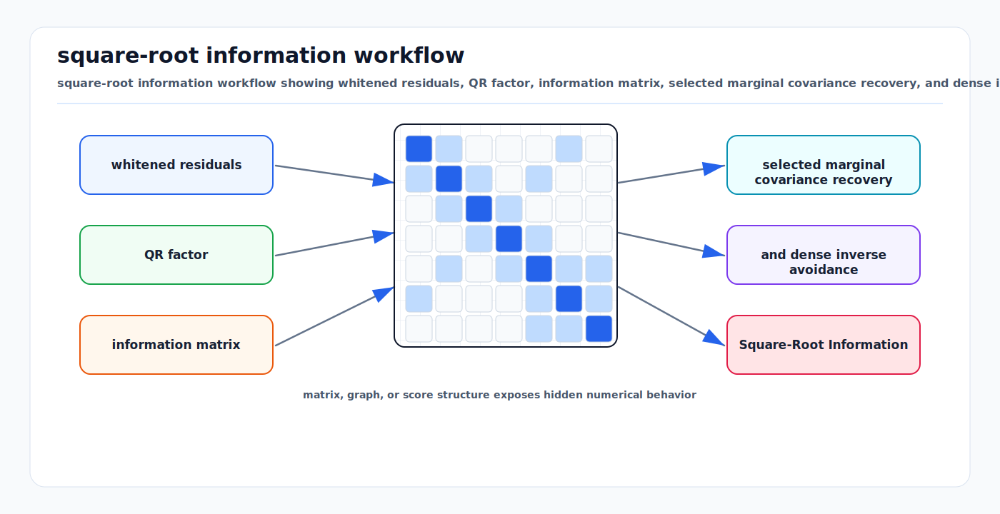

# Square-Root Information and Covariance Recovery

<!-- kb-visual:start -->


*Visual: square-root information workflow showing whitened residuals, QR factor, information matrix, selected marginal covariance recovery, and dense inverse avoidance.*
<!-- kb-visual:end -->

## Related docs

- [Cholesky, LDLT, and Normal Equations](cholesky-ldlt-normal-equations.md)
- [QR, SVD, and Rank-Revealing Solvers](qr-svd-rank-revealing-solvers.md)
- [Eigenvalues, Hessian Conditioning, and Observability](eigenvalues-hessian-conditioning-observability.md)
- [Sparse Matrices, Fill-In, and Ordering](sparse-matrices-fill-in-ordering.md)
- [Schur Complement, Marginalization, and PCG](schur-complement-marginalization-pcg.md)
- [Sparse Estimation Backend Crosswalk](sparse-estimation-backend-crosswalk.md)
- [Nonlinear Solver Diagnostics Crosswalk](../optimization/nonlinear-solver-diagnostics-crosswalk.md)
- [GTSAM Factor Graph Optimization](../state-estimation/gtsam-factor-graphs.md)

## Why it matters for AV, perception, SLAM, and mapping

State estimation is probabilistic, but production systems often move between three representations:

- Covariance `Sigma`: useful for sensor noise models and uncertainty reporting.
- Information `Lambda = Sigma^-1`: useful for combining independent Gaussian factors.
- Square-root information `R` where `Lambda = R^T R`: useful for stable least-squares and sparse smoothing.

Square-root forms are central in SLAM because they preserve sparsity and improve numerical behavior. Square Root SAM showed how full SLAM can be formulated using sparse matrix square roots, connecting factor graphs, QR/Cholesky factorization, and smoothing.

For AV stacks, square-root information appears in:

- Whitened residuals in Ceres, GTSAM, and custom optimizers.
- Prior factors generated by marginalization.
- Covariance queries for localization health monitoring.
- Map uncertainty and calibration uncertainty reporting.
- Square-root filters and smoothers that avoid explicitly maintaining dense covariance.

The hard part is covariance recovery. The matrix you factor for solving is usually sparse, but the covariance is generally dense. Computing all of it can be much more expensive than solving for the MAP estimate.

## Core math and algorithm steps

### Gaussian forms

Covariance form:

```text
p(delta) proportional exp(-0.5 (delta - mu)^T Sigma^-1 (delta - mu))
```

Information form:

```text
Lambda = Sigma^-1
eta = Lambda mu
```

Square-root information form:

```text
Lambda = R^T R
||R delta - d||^2
```

For a whitened least-squares problem:

```text
min_delta ||J delta - b||^2
```

the information matrix is:

```text
Lambda = J^T J
```

If QR gives:

```text
J = Q R
```

then:

```text
J^T J = R^T R
```

So `R` is a square-root information matrix.

### From covariance to square-root information

Given measurement covariance `Sigma`, compute a square root:

```text
Sigma = L L^T
```

Whiten residuals:

```text
f = L^-1 e
J_f = L^-1 J_e
```

Then the factor contributes:

```text
J_f^T J_f = J_e^T Sigma^-1 J_e
```

Never invert `Sigma` explicitly for small dense sensor covariances unless you have a reason. Use triangular solves with the covariance square root or directly build a square-root information factor.

### Recovering covariance from a square root

If:

```text
Lambda = R^T R
```

then:

```text
Sigma = Lambda^-1 = R^-1 R^-T
```

To compute selected covariance columns, solve:

```text
R^T y = e_i
R z = y
```

Then `z` is column `i` of `Sigma`. For a block covariance query, solve only for the needed basis columns. This is why libraries ask for covariance blocks rather than computing the full dense covariance by default.

### Marginal covariance vs joint covariance

The full covariance over all active variables is:

```text
Sigma = Lambda^-1
```

The marginal covariance for variable block `x_i` is the diagonal block:

```text
Sigma_ii
```

Do not confuse this with the inverse of the diagonal information block:

```text
Sigma_ii != Lambda_ii^-1
```

except in special cases with no correlations. Correlations are the normal case in SLAM.

### Conditional covariance

If the information matrix is partitioned:

```text
Lambda = [A B
          B^T C]
```

then the conditional information of `x` given `y` is `A`, while the marginal information of `x` after eliminating `y` is the Schur complement:

```text
Lambda_x_marginal = A - B C^-1 B^T
```

This distinction matters when interpreting priors and covariance blocks after marginalization.

## Implementation notes

### Use square-root factors internally

For custom factors, store or compute residuals in whitened form:

```text
whitened_residual = sqrt_information * raw_residual
whitened_jacobian = sqrt_information * raw_jacobian
```

This makes the factor contribution consistent with solvers that expect least-squares residuals. It also avoids repeated explicit covariance inversions.

### Covariance recovery strategy

Use this decision rule:

- Need pose uncertainty for a dashboard: query only the latest pose marginal covariance.
- Need calibration uncertainty: query selected calibration blocks and correlations with key states.
- Need full covariance for a small calibration batch: dense QR/SVD is acceptable.
- Need full covariance for a large map: reconsider the requirement; full covariance is dense and expensive.
- Need uncertainty in a gauge-free problem: fix the gauge or compute a pseudoinverse with explicit nullspace handling.

### Sparse inverse subset

Sparse Cholesky factors can support selected inverse entries more efficiently than full inversion, especially for entries related to the factor sparsity pattern. This is the idea behind covariance block recovery in SLAM libraries. Still, the requested covariance pattern drives cost.

### Square-root priors from marginalization

When marginalizing old variables, a solver often produces a dense prior over remaining separator variables. To store it as a least-squares factor:

1. Partition the linearized system into marginalized variables `m` and kept variables `k`.
2. Compute the Schur complement information over `k`.
3. Factor that information:

```text
Lambda_prior = R_prior^T R_prior
```

4. Store `R_prior` and the corresponding right-hand side at the linearization point.

The prior is only locally valid around the linearization point. Reusing it far away can create inconsistency.

### Reporting covariance in manifold coordinates

For poses, covariance is expressed in the tangent space at the estimate, not as a covariance over raw matrix entries or quaternion components. Always document the convention:

- Right or left perturbation.
- Coordinate order, such as rotation first or translation first.
- Frame in which perturbations live.
- Units.

GTSAM explicitly notes that covariance matrices are in relative coordinates because optimization is performed through local increments.

## Concept cards

### Square-root information

- What it means here: A factor representation whose transpose times itself equals an information matrix.
- Math object: `Lambda = R^T R` or whitened residual model `||R delta - d||^2`.
- Effect on the solve: It preserves least-squares structure, supports stable factorization, and avoids explicit covariance inversion.
- What it solves: It gives solvers a numerically practical way to combine Gaussian factors and priors.
- What it does not solve: It does not guarantee the information is full rank or globally valid after nonlinear relinearization.
- Minimal example: A measurement covariance `Sigma = L L^T` whitens residuals with triangular solves by `L`.
- Failure symptoms: Cost mismatch, wrong residual scale, covariance too small, or factor orientation bug.
- Diagnostic artifact: `R`, `R^T R` reconstruction check, whitened residual norm, and covariance-weighted raw residual comparison.
- Normal vs abnormal artifact: `R^T R` matching the intended information is normal; using `R R^T` by mistake is abnormal.
- First debugging move: On a small dense case, compare raw covariance weighting with square-root weighting at the same perturbation.
- Do not confuse with: Covariance square root, where `Sigma = L L^T` rather than `Lambda = R^T R`.
- Read next: [Cholesky, LDLT, and Normal Equations](cholesky-ldlt-normal-equations.md).

### Marginal covariance

- What it means here: The uncertainty block for a subset of variables after accounting for correlations with all other active variables.
- Math object: The selected diagonal or off-diagonal block of `Sigma = Lambda^-1`.
- Effect on the solve: It supports health monitoring, gating, calibration uncertainty, and integrity checks after estimation.
- What it solves: It answers "how uncertain is this variable block in the joint posterior coordinates?"
- What it does not solve: It does not describe uncertainty conditioned on holding neighboring variables fixed.
- Minimal example: Query the latest pose's `6 x 6` tangent covariance block from a sparse factor.
- Failure symptoms: Inverting only `Lambda_ii`, ignoring gauge freedom, reporting covariance in the wrong tangent convention, or computing full dense covariance online.
- Diagnostic artifact: Requested covariance blocks, factor backsolve trace, rank/gauge status, tangent-coordinate convention, and selected inverse entries.
- Normal vs abnormal artifact: Marginal covariance larger than inverse diagonal information is normal when variables are correlated; smaller or unit-inconsistent blocks are abnormal.
- First debugging move: Query one block through the library covariance API and compare it to dense inversion on a tiny representative system.
- Do not confuse with: Conditional covariance or inverse diagonal information; marginal covariance accounts for correlations, conditional covariance holds other variables fixed, and inverse diagonal information ignores off-diagonal coupling.
- Read next: [Eigenvalues, Hessian Conditioning, and Observability](eigenvalues-hessian-conditioning-observability.md).

### Conditional covariance

- What it means here: The uncertainty of one variable block when another block is treated as known.
- Math object: For information partition `Lambda = [A B; B^T C]`, the conditional information of `x` given `y` is `A`, so conditional covariance is `A^-1` when valid.
- Effect on the solve: It can look much smaller than marginal covariance because correlations with held-fixed variables are not released.
- What it solves: It describes local uncertainty under a stated conditioning assumption.
- What it does not solve: It does not report the standalone posterior uncertainty of the variable in the full joint problem.
- Minimal example: A landmark is precise if the camera poses are fixed, but much less precise after camera-pose uncertainty is marginalized in.
- Failure symptoms: Health metrics look overconfident, covariance changes drastically when conditioning variables are released, or documentation omits what was held fixed.
- Diagnostic artifact: Partitioned information blocks, conditioned variable list, fixed variable list, and comparison to marginal covariance.
- Normal vs abnormal artifact: Conditional covariance smaller than marginal covariance is normal; reporting it as marginal uncertainty is abnormal.
- First debugging move: Write down which variables are held fixed and compute both conditional and marginal covariance on the same small system.
- Do not confuse with: Marginal covariance or inverse diagonal information; conditional covariance depends on an explicit fixed-variable assumption.
- Read next: [Schur Complement, Marginalization, and PCG](schur-complement-marginalization-pcg.md).

### Covariance recovery

- What it means here: Extracting selected covariance entries or blocks from an information or square-root factor after solving.
- Math object: Solves with `R^T` and `R` to obtain selected columns of `Sigma = (R^T R)^-1`.
- Effect on the solve: It can be much more expensive than the MAP solve and can expose hidden rank or gauge problems.
- What it solves: It provides uncertainty blocks needed for diagnostics, gating, and reporting without necessarily forming a full dense inverse.
- What it does not solve: It does not make covariance finite in rank-deficient coordinates.
- Minimal example: Solve `R^T y = e_i`, then `R z = y` to recover covariance column `i`.
- Failure symptoms: Query time spikes, memory explodes, rank-deficient warning, covariance block unavailable, or full inverse accidentally computed online.
- Diagnostic artifact: Requested block list, solve count, rank threshold, gauge handling, backsolve residuals, memory use, and elapsed covariance-query time.
- Normal vs abnormal artifact: Selected block recovery with bounded solve count is normal; broad full-map covariance recovery in an online loop is abnormal.
- First debugging move: Reduce the query to one block and verify it against dense inversion on a small gauge-fixed problem.
- Do not confuse with: Marginal covariance versus conditional covariance versus inverse diagonal information; covariance recovery is the algorithm that retrieves whichever covariance quantity was requested.
- Read next: [Sparse Estimation Backend Crosswalk](sparse-estimation-backend-crosswalk.md).

## Failure modes and diagnostics

### Inverting diagonal information blocks

Symptom: reported covariance is too small and ignores correlations.

Fix: compute marginal covariance through factor solves or a library marginal query, not by inverting each diagonal block independently.

### Rank-deficient covariance queries

If the Jacobian is rank deficient, the covariance in unconstrained coordinates is not finite. Ceres documentation notes that sparse QR covariance cannot handle rank-deficient Jacobians, while dense SVD can compute a pseudoinverse-based result for smaller problems.

Diagnostics:

- Inspect singular values.
- Identify gauge freedoms.
- Add explicit priors or gauge constraints.
- Use pseudoinverse only when its nullspace semantics are acceptable.

### Square-root factor has wrong orientation

Confusing `R` and `R^T` can silently produce wrong whitening. Check:

```text
Lambda should equal R^T R
cost should equal ||R delta - d||^2
```

Add a small dense unit test that compares raw covariance weighting with square-root weighting.

### Dense covariance accidentally computed online

A full covariance matrix over thousands of poses can consume huge memory and time. Online AV systems should query selected marginals and health metrics rather than the full inverse.

### Stale marginalization prior

Symptoms:

- Solver becomes overconfident after loop closure.
- Fixed-lag smoother drifts or jumps near window boundary.
- Prior residual dominates new measurements.

Diagnostics:

- Track prior residual magnitude.
- Monitor condition number of the prior.
- Compare against a longer-window batch solve.
- Re-marginalize if architecture allows.

## Sources

- Dellaert and Kaess, "Square Root SAM: Simultaneous Localization and Mapping via Square Root Information Smoothing": https://www.cc.gatech.edu/~dellaert/pubs/Dellaert06ijrr.pdf
- Borg Lab page for Square Root SAM: https://www.borg.cc.gatech.edu/papers/dellaert06ijrr.html
- GTSAM tutorial, "Factor Graphs and GTSAM": https://gtsam.org/tutorials/intro.html
- Ceres Solver, "Covariance Estimation": https://ceres-solver.readthedocs.io/latest/nnls_covariance.html
- SuiteSparseQR user guide: https://github.com/DrTimothyAldenDavis/SuiteSparse/blob/dev/SPQR/Doc/spqr_user_guide.pdf
- Eigen, `LLT` class reference: https://eigen.tuxfamily.org/dox/classEigen_1_1LLT.html
- Eigen, `JacobiSVD` class reference: https://eigen.tuxfamily.org/dox/classEigen_1_1JacobiSVD.html
