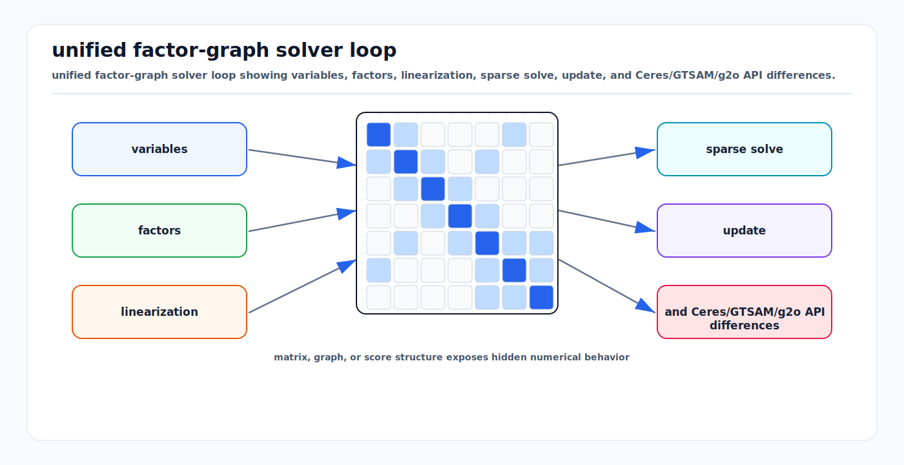

# Factor Graph Solver Patterns: Ceres, GTSAM, and g2o

<!-- kb-visual:start -->


*Visual: unified factor-graph solver loop showing variables, factors, linearization, sparse solve, update, and Ceres/GTSAM/g2o API differences.*
<!-- kb-visual:end -->

## Related docs

- [Nonlinear Least Squares from First Principles](./nonlinear-least-squares-first-principles.md)
- [Gauss-Newton, Levenberg-Marquardt, and Dogleg](./gauss-newton-levenberg-marquardt-dogleg.md)
- [Trust Region and Line Search Globalization](./trust-region-line-search-globalization.md)
- [Jacobians, Autodiff, and Manifold Linearization](./jacobians-autodiff-manifold-linearization.md)
- [GTSAM Factor Graphs](../state-estimation/gtsam-factor-graphs.md)
- [Factor Graph SLAM with iSAM2 and GTSAM](../../30-autonomy-stack/localization-mapping/slam-methods/factor-graph-isam2-gtsam.md)
- [Robust Losses and M-Estimators](../probability-statistics/robust-losses-m-estimators-huber-cauchy-tukey-geman-mcclure.md)

## Why it matters for AV, perception, SLAM, and mapping

Ceres, GTSAM, and g2o all solve sparse nonlinear least-squares problems, but they encourage different architecture. Choosing the wrong pattern can make an AV backend harder to extend, harder to debug, or too slow for real-time operation.

- Ceres is a flexible residual-block optimizer with strong automatic differentiation, robust losses, manifolds, bounds, and many linear solver options. It is widely used for calibration, bundle adjustment, pose graph examples, and general NLS.
- GTSAM is a factor-graph and smoothing library built around probabilistic robotics, manifold values, noise models, variable elimination, Bayes trees, and incremental iSAM2.
- g2o is a graph optimization framework designed around vertices, edges, sparse block systems, and efficient batch optimization for SLAM and bundle adjustment.

The first-principles problem is the same: build residuals, whiten them, linearize them, solve a sparse linearized system, retract the update, and iterate. The engineering differences are in how variables, factors, derivatives, noise, sparsity, and incremental updates are represented.

## Core math and solver steps

A factor graph represents a posterior as local factors:

```text
p(X | Z) proportional_to product_i phi_i(X_i)
```

For Gaussian measurement factors, maximizing the posterior is equivalent to minimizing:

```text
sum_i 0.5 * ||h_i(X_i) - z_i||^2_Sigma_i
```

After whitening:

```text
sum_i 0.5 * ||L_i * (h_i(X_i) - z_i)||^2
```

Each factor contributes:

- residual vector `r_i`
- Jacobian blocks for connected variables
- noise model or square-root information
- optional robust loss or outlier model

Linearization builds a sparse system:

```text
H Delta = -g
H = J^T J
g = J^T r
```

The block sparsity of `H` mirrors graph connectivity. The g2o paper explicitly notes that the Hessian block structure is the adjacency structure of the graph and exploits sparse solvers such as CHOLMOD, CSparse, and PCG.

## Ceres solver pattern

### Mental model

Ceres models a problem as parameter blocks and residual blocks:

```text
Problem
  parameter blocks: double arrays, optionally with Manifold
  residual blocks: CostFunction + optional LossFunction + parameter block pointers
```

A `CostFunction` computes residuals and Jacobian matrices. Ceres supports analytic, numeric, and automatic differentiation, and can mix them. A `LossFunction` robustifies the squared norm of a residual block.

### Typical Ceres flow

1. Allocate parameter blocks for poses, landmarks, intrinsics, extrinsics, or biases.
2. Add a `Manifold` for rotations, quaternions, poses, or other constrained blocks.
3. Create residual functors or analytic cost functions.
4. Add residual blocks with optional robust losses.
5. Set constants or bounds as needed.
6. Configure minimizer type, trust-region strategy, linear solver, ordering, and tolerances.
7. Call `Solve`.
8. Inspect `Solver::Summary`, residual statistics, and covariance if needed.

### Best fit

- Camera calibration and multi-sensor calibration.
- Bundle adjustment and structure-from-motion style problems.
- Offline map alignment and batch refinement.
- Problems needing bounds on parameters.
- Heterogeneous residuals where autodiff accelerates development.

### Watchouts

- Noise whitening is typically implemented in the residual block, so consistency is the user's responsibility.
- Raw pointer parameter blocks make ownership and layout conventions important.
- Manifold layout matters, especially Eigen quaternion storage.
- Incremental SLAM is not the main architectural abstraction; Ceres is primarily a batch optimizer.

## GTSAM solver pattern

### Mental model

GTSAM represents estimation as:

```text
NonlinearFactorGraph: factor structure and objective
Values: typed variable assignments keyed by Key
NoiseModel: uncertainty and whitening
Optimizer or ISAM2: batch or incremental inference
```

GTSAM's abstractions are explicitly probabilistic. A `NoiseModelFactor` represents a measurement likelihood with a Gaussian noise model. `Values` stores manifold-aware variables such as `Pose2`, `Pose3`, velocities, biases, points, or custom types. Linearization produces a `GaussianFactorGraph`.

GTSAM's concepts define `retract` and `localCoordinates` for manifold types; Lie groups add operations such as `Expmap`, `Logmap`, `compose`, `between`, and Jacobian-aware versions.

### Typical GTSAM batch flow

1. Create a `NonlinearFactorGraph`.
2. Add priors, between factors, projection factors, IMU factors, GPS factors, and custom factors.
3. Insert initial estimates into `Values`.
4. Choose Gauss-Newton, LM, or dogleg optimizer.
5. Optimize and inspect graph error, marginal covariance, and per-factor errors.

### Typical GTSAM incremental flow

1. Maintain an `ISAM2` instance.
2. Add new factors and initial values per keyframe or sensor update.
3. Call `isam.update(new_factors, new_values)`.
4. Query `calculateEstimate`.
5. Relinearize and reorder affected parts according to iSAM2 policy.

iSAM2 uses the Bayes tree to update only affected portions of the factorization, with incremental reordering and fluid relinearization. This is why it is a natural fit for online SLAM and mapping.

### Best fit

- Online SLAM and smoothing.
- Visual-inertial or LiDAR-inertial factor graphs.
- Systems requiring marginal covariances or incremental updates.
- Robotics codebases that benefit from typed variables and probabilistic factors.
- Custom sensor fusion where the graph is the system architecture.

### Watchouts

- Requires understanding of keys, `Values`, factor ownership, and manifold traits.
- Custom factors need correct `evaluateError` and Jacobians.
- Incremental behavior depends on relinearization thresholds, ordering, and factor management.
- Fixed-lag smoothing and marginalization priors require careful consistency handling.

## g2o solver pattern

### Mental model

g2o models graph optimization with vertices and edges:

```text
Vertex: state variable or parameter block
Edge: measurement constraint connecting one or more vertices
Optimizer: graph, algorithm, block solver, linear solver
```

The g2o paper presents it as a general C++ framework for graph-based nonlinear least-squares problems, including SLAM and bundle adjustment. It emphasizes sparse graph connectivity, special block structures, linear solver choices, and extensibility through new vertex and edge types.

### Typical g2o flow

1. Choose vertex types for poses, landmarks, calibration, or scale variables.
2. Choose edge types for odometry, projection, loop closure, or custom constraints.
3. Set measurements, information matrices, and robust kernels.
4. Fix gauge variables such as the first pose.
5. Select optimization algorithm, block solver, and sparse linear solver.
6. Initialize optimization and run a batch solve.
7. Inspect chi-square values, active edges, and final estimates.

### Best fit

- Batch pose graph optimization.
- Bundle adjustment in SLAM systems with existing g2o integration.
- ORB-SLAM-style graph backends.
- Projects that want direct control over vertex and edge classes.
- Research prototypes comparing graph optimization structures.

### Watchouts

- Documentation is thinner than Ceres and GTSAM; examples and papers often guide usage.
- Automatic differentiation is not the central workflow; analytic Jacobians are common.
- Incremental smoothing is not the primary pattern.
- Robust kernels and information matrices must be set carefully per edge.

## Comparative patterns

| Concern | Ceres | GTSAM | g2o |
|---|---|---|---|
| Primary abstraction | Residual blocks | Factor graphs and values | Vertices and edges |
| Strongest default use | General NLS and BA | Robotics smoothing and SLAM | Graph SLAM and BA |
| Derivatives | Analytic, numeric, autodiff mix | Analytic/custom factors, expressions, traits | Mostly analytic/custom edge Jacobians |
| Manifolds | `Manifold` per parameter block | Core traits/retract/local model | Vertex update operations |
| Noise model | Often whiten inside residual | Explicit `NoiseModel` | Edge information matrix |
| Robustification | `LossFunction` | Robust noise models and robust optimizers | Robust kernels |
| Incremental SLAM | Not central | iSAM2 is central | Not central |
| Linear solvers | Dense, sparse, Schur, iterative | Elimination, sparse factorization, Bayes tree | Sparse block solvers, CHOLMOD/CSparse/PCG |
| Best AV role | Calibration, BA, batch refinement | Multi-sensor backend and online smoothing | Batch graph backend in SLAM stacks |

## Implementation notes

- Start from the factor semantics, not the library API. Define variables, residuals, covariances, and gauge freedoms first.
- Make whitening explicit in design documents. In Ceres, residual code may multiply by square-root information. In GTSAM, noise models handle whitening. In g2o, information matrices weight edges.
- Use the library's native manifold mechanism. Do not hand-normalize quaternions after an ambient update unless the solver explicitly expects that pattern.
- Keep residual diagnostics library-neutral: per-factor cost, raw residual, whitened residual, robust weight, and connected variable keys.
- Use a minimal synthetic graph to test every custom factor or edge before connecting real sensor data.
- Match the linear solver to structure: Schur for BA, sparse Cholesky for well-conditioned pose graphs, iterative PCG for very large systems where approximate solves are acceptable.
- Anchor gauge freedoms deliberately. Fixing arbitrary variables can hide bugs; document why each prior or fixed vertex exists.
- Separate front-end association confidence from backend covariance. A false loop closure with a tiny covariance is a backend failure regardless of optimizer choice.

## Failure modes and diagnostics

- **Ceres residual scale mismatch:** Solver summary shows one residual family dominating. Print raw and whitened residual norms by block type.
- **GTSAM key or type mismatch:** Factors connect to missing keys or wrong value types. Validate graph contents and initial `Values` before optimization.
- **g2o gauge singularity:** Sparse solve fails or estimates drift globally. Fix a gauge vertex or add a proper prior.
- **Wrong information matrix convention:** Covariance is used where information is expected, or square-root information is confused with information. Check dimensions and chi-square values.
- **Bad ordering or fill-in:** Runtime and memory explode. Inspect ordering strategy and block structure.
- **Incremental stale linearization:** iSAM2 estimate lags after large loop closure. Tune relinearization thresholds or force broader relinearization when large corrections arrive.
- **Robust loss hides systemic errors:** Cost becomes stable but map remains biased. Inspect raw residuals and rejected/downweighted factors.
- **Library migration bugs:** Ceres, GTSAM, and g2o differ in residual sign conventions, quaternion layout, local update conventions, and noise placement. Port one factor at a time with numerical checks.

## Sources

- Ceres Solver, "Modeling Non-linear Least Squares": https://ceres-solver.readthedocs.io/latest/nnls_modeling.html
- Ceres Solver, "Solving Non-linear Least Squares": https://ceres-solver.readthedocs.io/latest/nnls_solving.html
- Ceres Solver, "On Derivatives": https://ceres-solver.readthedocs.io/latest/derivatives.html
- Ceres Solver, "Why Ceres?": https://ceres-solver.readthedocs.io/latest/features.html
- GTSAM, "Factor Graphs and GTSAM: A Hands-on Introduction": https://gtsam.org/tutorials/intro.html
- GTSAM, "GTSAM Concepts": https://gtsam.org/notes/gtsam-concepts/
- GTSAM docs, nonlinear module: https://borglab.github.io/gtsam/nonlinear
- Kaess et al., "iSAM2: Incremental Smoothing and Mapping Using the Bayes Tree": https://dellaert.github.io/files/Kaess12ijrr.pdf
- Kuemmerle et al., "g2o: A General Framework for Graph Optimization": https://ais.informatik.uni-freiburg.de/publications/papers/kuemmerle11icra.pdf
- RainerKuemmerle/g2o GitHub repository: https://github.com/RainerKuemmerle/g2o
- Triggs, McLauchlan, Hartley, and Fitzgibbon, "Bundle Adjustment - A Modern Synthesis": https://www.cs.jhu.edu/~misha/ReadingSeminar/Papers/Triggs00.pdf
