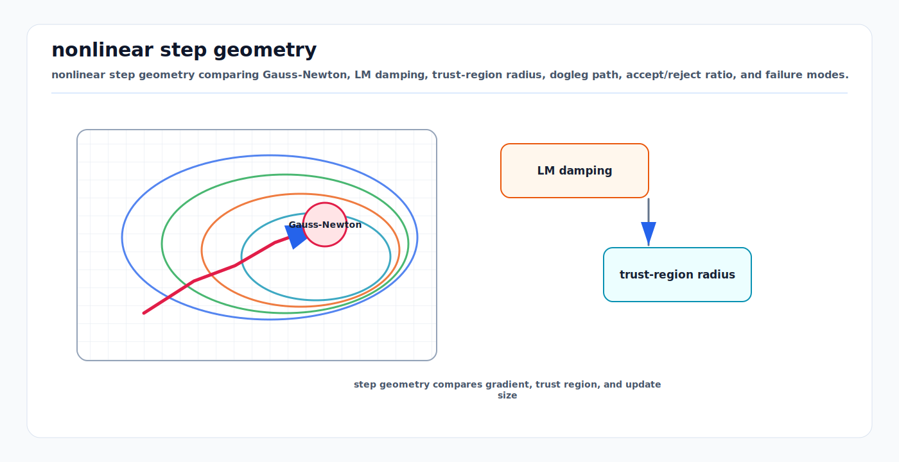

# Gauss-Newton, Levenberg-Marquardt, and Dogleg

<!-- kb-visual:start -->


*Visual: nonlinear step geometry comparing Gauss-Newton, LM damping, trust-region radius, dogleg path, accept/reject ratio, and failure modes.*
<!-- kb-visual:end -->

## Related docs

- [Nonlinear Least Squares from First Principles](./nonlinear-least-squares-first-principles.md)
- [Trust Region and Line Search Globalization](./trust-region-line-search-globalization.md)
- [Jacobians, Autodiff, and Manifold Linearization](./jacobians-autodiff-manifold-linearization.md)
- [Factor Graph Solver Patterns: Ceres, GTSAM, and g2o](./factor-graph-solver-patterns-ceres-gtsam-g2o.md)
- [Bundle Adjustment SLAM](../../30-autonomy-stack/localization-mapping/slam-methods/bundle-adjustment-slam.md)

## Why it matters for AV, perception, SLAM, and mapping

AV backends repeatedly solve the same local question: "Given the residuals and Jacobians at the current state, what update should I apply?" Gauss-Newton, Levenberg-Marquardt, and dogleg are the standard answers for nonlinear least-squares problems in SLAM, calibration, bundle adjustment, scan matching, pose graph optimization, and map alignment.

Gauss-Newton is fast when the current estimate is already good and residuals are close to linear. Levenberg-Marquardt is more forgiving because it damps the step. Dogleg is a trust-region method that blends a cautious gradient step with the full Gauss-Newton step. Production systems often start with a robust method such as LM or dogleg and behave more like Gauss-Newton near convergence.

## Core math and algorithm steps

For whitened residuals `F(x)`, linearize at `x`:

```text
F(x + Delta) ~= F + J * Delta
```

The local quadratic model is:

```text
m(Delta) = 0.5 * ||F + J Delta||^2
         = 0.5 * F^T F + g^T Delta + 0.5 * Delta^T H Delta
```

where:

```text
g = J^T F
H = J^T J
```

All three methods differ mainly in how they choose or constrain `Delta`.

## Gauss-Newton

Gauss-Newton minimizes the local linear least-squares model directly:

```text
Delta_gn = argmin_Delta 0.5 * ||F + J Delta||^2
```

The normal equations are:

```text
H * Delta_gn = -g
```

Algorithm:

1. Evaluate residuals `F` and Jacobian `J`.
2. Form or implicitly represent `H = J^T J` and `g = J^T F`.
3. Solve `H Delta = -g`.
4. Update `x <- x boxplus Delta`.
5. Stop when gradient, step, or cost reduction is small.

Why it works: the exact Hessian of `0.5 * ||F||^2` is:

```text
sum_i grad f_i grad f_i^T + sum_i f_i * Hessian(f_i)
```

Gauss-Newton keeps the first term `J^T J` and drops the residual-weighted second-derivative terms. This is accurate when residuals are small near the solution or when the model is close to linear.

Strengths:

- Efficient for least-squares problems.
- Natural fit for sparse factor graphs.
- Fast local convergence when initialized well.
- No extra damping parameter to tune.

Weaknesses:

- Can diverge when initialized far from the solution.
- Can fail when `J` is rank deficient or nearly rank deficient.
- Sensitive to unmodeled outliers unless residuals are robustified.

## Levenberg-Marquardt

Levenberg-Marquardt modifies the linear system with damping:

```text
(H + lambda * D) * Delta_lm = -g
```

Common choices for `D` include `I` or `diag(H)`. Ceres describes LM as a trust-region strategy that regularizes the step with a diagonal matrix. Nocedal and Wright describe LM as using the Gauss-Newton Hessian approximation with a trust-region strategy, which helps when the Jacobian is rank deficient or nearly so.

Behavior:

- Small `lambda`: behaves like Gauss-Newton.
- Large `lambda`: behaves more like a scaled gradient descent step.

Typical trust-region update:

```text
predicted = m(0) - m(Delta)
actual    = cost(x) - cost(x boxplus Delta)
rho       = actual / predicted
```

Then:

- If `rho` is good, accept the step and decrease `lambda`.
- If `rho` is poor or negative, reject the step and increase `lambda`.

Algorithm:

1. Evaluate `F`, `J`, `H`, and `g`.
2. Choose an initial damping `lambda`.
3. Solve `(H + lambda D) Delta = -g`.
4. Evaluate trial cost at `x boxplus Delta`.
5. Compare actual and predicted reduction.
6. Accept or reject the trial state.
7. Adjust `lambda` and repeat.

Strengths:

- More robust than pure Gauss-Newton for poor initialization.
- Handles rank deficiency better through damping.
- Widely available in Ceres, GTSAM, and g2o-style solvers.

Weaknesses:

- Damping policy matters.
- Too much damping causes slow gradient-descent-like progress.
- Too little damping can still take unstable steps.
- The same bad residual modeling that breaks Gauss-Newton can break LM.

## Dogleg

Dogleg is a trust-region method that chooses a step inside:

```text
||Delta|| <= radius
```

It uses two candidate directions:

```text
Delta_sd = steepest descent / Cauchy step
Delta_gn = Gauss-Newton step
```

The classic dogleg path is:

```text
0 -> Delta_sd -> Delta_gn
```

The selected step is:

- `Delta_gn` if it is inside the trust region.
- A scaled steepest descent step if the Cauchy point is outside.
- A point along the segment from `Delta_sd` to `Delta_gn` if the full Gauss-Newton step is outside but the Cauchy point is inside.

Algorithm:

1. Evaluate residuals and Jacobians.
2. Compute the Gauss-Newton step.
3. Compute the steepest descent or Cauchy step.
4. Select the point on the dogleg path that fits the current trust-region radius.
5. Evaluate actual versus predicted reduction.
6. Accept or reject the step and update the radius.

Strengths:

- Often cheaper than solving multiple damped LM systems.
- Gives a clear trust-region interpretation.
- Works well when the Gauss-Newton step is high quality near the solution.

Weaknesses:

- Usually assumes a direct solve for the Gauss-Newton step.
- Less flexible than LM in some sparse or highly rank-deficient systems.
- Trust-region radius policy still matters.

## Choosing among them

Use Gauss-Newton when:

- Initialization is reliable.
- Residual models are smooth and well scaled.
- The graph is well constrained.
- You need predictable low-latency iterations.

Use Levenberg-Marquardt when:

- Initialization can be poor.
- Loop closures or calibration parameters create difficult transients.
- Rank deficiency is likely.
- You want a robust default for batch optimization.

Use dogleg when:

- You want trust-region robustness without repeated LM damping solves.
- The problem has a stable Gauss-Newton direction.
- Direct sparse factorization is available.

## Implementation notes

- Always compute the gain ratio using the same residual scaling used by the optimizer.
- Never tune `lambda`, trust-region radius, or robust loss thresholds before residual whitening is correct.
- Use manifold `boxplus` updates for rotations and poses. Adding directly to quaternion coefficients creates invalid states.
- Keep a fixed ordering policy for reproducible linear solver behavior; use fill-reducing orderings for large sparse graphs.
- In bundle adjustment, exploit the camera-landmark block structure with Schur complement solvers.
- In sliding-window VIO, watch marginalization priors. Bad priors can make any method look unstable.
- Log accepted and rejected step counts. Many rejected steps indicate poor initialization, bad scaling, wrong Jacobians, or a trust-region policy mismatch.

## Failure modes and diagnostics

- **Gauss-Newton cost increases:** Add globalization, reduce step size, switch to LM, or improve initialization.
- **LM stuck with huge damping:** Check residual scale, outliers, incorrect Jacobians, and whether the trial steps are outside the model validity region.
- **Dogleg repeatedly takes tiny Cauchy steps:** The Gauss-Newton direction is not trusted. Inspect conditioning, rank, and covariance scaling.
- **Linear solver failure:** Check gauge freedom, duplicate variables, disconnected graph components, and near-zero covariance values.
- **False convergence:** Step norm is small because damping is huge, not because the optimum is reached. Inspect gradient norm and residual distribution.
- **Oscillation:** Robust loss thresholds, poor measurement covariances, or inconsistent loop closures can make successive accepted steps fight each other.
- **Manifold update bug:** Cost may change discontinuously near angle wrapping or quaternion normalization. Test residuals across small perturbations.

## Sources

- Ceres Solver, "Solving Non-linear Least Squares": https://ceres-solver.readthedocs.io/latest/nnls_solving.html
- Ceres Solver, "Why Ceres?": https://ceres-solver.readthedocs.io/latest/features.html
- GTSAM docs, nonlinear optimizers: https://borglab.github.io/gtsam/nonlinear
- GTSAM Doxygen, `NonlinearOptimizer`: https://gtsam.org/doxygen/a05103.html
- Nocedal and Wright, "Numerical Optimization": https://convexoptimization.com/TOOLS/nocedal.pdf
- Kuemmerle et al., "g2o: A General Framework for Graph Optimization": https://ais.informatik.uni-freiburg.de/publications/papers/kuemmerle11icra.pdf
