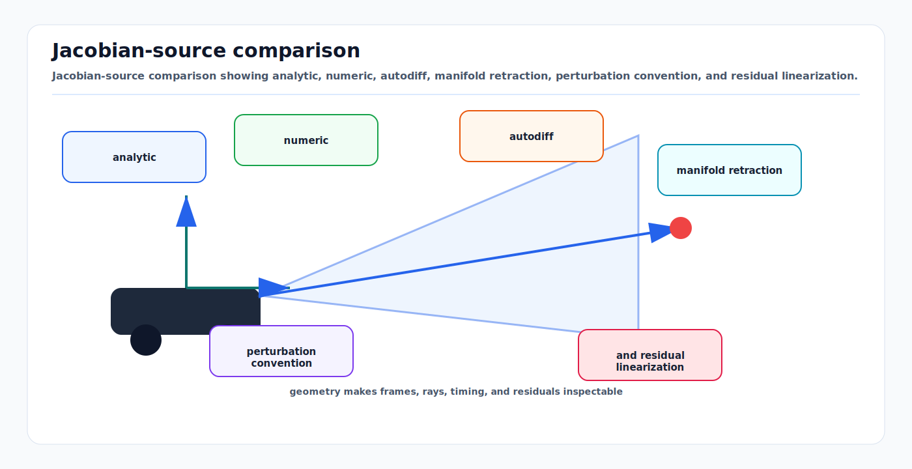

# Jacobians, Autodiff, and Manifold Linearization

<!-- kb-visual:start -->


*Visual: Jacobian-source comparison showing analytic, numeric, autodiff, manifold retraction, perturbation convention, and residual linearization.*
<!-- kb-visual:end -->

## Related docs

- [Nonlinear Least Squares from First Principles](./nonlinear-least-squares-first-principles.md)
- [Gauss-Newton, Levenberg-Marquardt, and Dogleg](./gauss-newton-levenberg-marquardt-dogleg.md)
- [Trust Region and Line Search Globalization](./trust-region-line-search-globalization.md)
- [Factor Graph Solver Patterns: Ceres, GTSAM, and g2o](./factor-graph-solver-patterns-ceres-gtsam-g2o.md)
- [Nonlinear Solver Diagnostics Crosswalk](./nonlinear-solver-diagnostics-crosswalk.md)
- [Objective and Residual Design Audit](./objective-residual-design-and-audit.md)
- [Coordinate Frames, Projections, and SE(3)](../geometry-3d/coordinate-frames-projections-se3.md)

## Why it matters for AV, perception, SLAM, and mapping

The Jacobian is the interface between sensor physics and optimization. It tells the solver how residuals change when poses, landmarks, calibration parameters, velocities, biases, or time offsets are perturbed. A residual can look numerically plausible while its Jacobian is wrong; the optimizer will then take bad steps, reject good steps, or converge to biased results.

Autonomous systems are especially exposed because their variables often live on manifolds. Rotations are not 3 independent unconstrained matrix rows, quaternions have 4 coefficients but 3 degrees of freedom, and poses compose on SE(3). Linearization must happen in local tangent coordinates, then be retracted back to the manifold.

## Core math and algorithm steps

For a residual function:

```text
r: R^n -> R^m
```

the Jacobian is:

```text
J = dr / dx
J_ij = d r_i / d x_j
```

Linearization gives:

```text
r(x + Delta) ~= r(x) + J(x) * Delta
```

In a factor graph, each factor contributes only the Jacobian blocks for the variables it touches. The global Jacobian is sparse because most variables do not appear in most residuals.

## Analytic Jacobians

Analytic Jacobians are derived by hand or symbolic tools and implemented directly.

Strengths:

- Fast at runtime.
- Can exploit structure and avoid unnecessary computation.
- Good for small, high-frequency residuals such as IMU, wheel odometry, point-to-plane ICP, and projection factors.

Weaknesses:

- Error prone.
- Hard to maintain when residual definitions change.
- Requires careful convention management for frames, left/right perturbations, and storage layouts.

Use analytic Jacobians when the residual is performance-critical, mathematically stable, and covered by tests against finite differences or automatic differentiation.

## Numeric differentiation

Numeric differentiation approximates derivatives with finite differences:

```text
forward:  dr/dx_j ~= (r(x + h e_j) - r(x)) / h
central:  dr/dx_j ~= (r(x + h e_j) - r(x - h e_j)) / (2h)
```

Ceres recommends numeric differentiation only when analytic or automatic differentiation is not practical, often when wrapping an external black-box function. It recommends at least central differences and suggests Ridders' method when runtime is less important or step-size choice is difficult.

Strengths:

- Easy to apply to black-box residuals.
- Useful for testing analytic Jacobians.

Weaknesses:

- Sensitive to step size.
- Expensive for large parameter blocks.
- Can break around discontinuities, normalization, branch cuts, angle wrapping, nearest-neighbor assignment, and robust losses.
- Less reliable on manifolds unless perturbations use the correct local parameterization.

## Automatic differentiation

Automatic differentiation evaluates exact derivatives of the implemented computation up to floating-point arithmetic. Ceres supports automatic derivatives using C++ templates and operator overloading, and its derivative guide recommends automatic differentiation as the default high-level choice.

Strengths:

- Reduces hand-derivation errors.
- Tracks implementation changes naturally.
- Often fast enough for many SLAM, BA, and calibration factors.
- Works well for smooth templated residual code.

Weaknesses:

- Requires templated cost functions in Ceres-style APIs.
- Can be difficult across external libraries that only accept `double`.
- Template compile errors can be noisy.
- Branches and nonsmooth operations still create nonsmooth residuals.
- Does not remove the need for correct manifold parameterization.

## Manifold linearization

For a manifold variable `X`, the update is not ordinary addition. Use:

```text
X_new = retract_X(Delta)
```

or, in Ceres notation:

```text
X_new = X boxplus Delta
```

The inverse local operation maps two manifold points into a tangent vector:

```text
Delta = local(X, Y)
```

GTSAM defines manifold support around `retract` and `localCoordinates`. For Lie groups such as SO(3) and SE(3), these are often related to `Expmap` and `Logmap`, although implementations may use optimized local charts.

### Quaternion example

A unit quaternion uses 4 stored scalars but represents a 3-DOF rotation. Directly adding a 4-vector update violates the unit norm constraint and introduces an extra invalid degree of freedom. A manifold update applies a 3-vector tangent perturbation and maps it back to a normalized quaternion.

Ceres provides `QuaternionManifold` for quaternions in `w, x, y, z` order and `EigenQuaternionManifold` for Eigen's memory layout. The layout difference matters because Ceres operates on raw double pointers.

### Pose example

For a relative pose factor:

```text
r_ij = Log( Z_ij^-1 * (X_i^-1 * X_j) )
```

The residual is a tangent vector. Jacobian columns should describe how that tangent residual changes under tangent perturbations to `X_i` and `X_j`. Left-versus-right perturbation conventions change the Jacobian.

## Implementation notes

- Pick and document one perturbation convention: left update, right update, body frame, or world frame. Mixing conventions is a high-cost bug.
- Write residual tests that compare analytic Jacobians to autodiff or central finite differences at random states.
- Test near nonzero rotations, not only at identity. Many sign and adjoint bugs vanish at identity.
- Keep quaternion storage layout explicit at API boundaries.
- Avoid discontinuities inside residuals. Data association, nearest-neighbor lookup, and robust gating should usually happen outside the differentiable residual evaluation.
- If a residual includes angle wrapping, test near the wrap boundary.
- For numeric differentiation on manifolds, perturb in tangent coordinates through the manifold `Plus` or retraction operation.
- For high-rate factors, profile both residual evaluation and Jacobian evaluation. In many AV systems, Jacobian computation dominates backend CPU.
- In Ceres, use automatic differentiation for normal smooth residuals, analytic derivatives for hot paths, and numeric differentiation as a last resort.
- In GTSAM, custom factors implement `evaluateError` and optionally return Jacobians; use traits-backed manifold operations for custom variable types.

## Failure modes and diagnostics

- **Analytic Jacobian sign error:** Cost may reduce slowly or move variables in the wrong direction. Compare with finite differences on tiny synthetic factors.
- **Frame convention error:** Translation residuals look correct in one orientation and fail after rotation. Test at multiple headings and roll/pitch angles.
- **Quaternion layout bug:** Optimizer diverges or produces rotations that appear transposed or mirrored. Check `w,x,y,z` versus `x,y,z,w`.
- **Ambient update instead of tangent update:** Quaternion norm drifts or covariance has an extra rotation degree of freedom. Use manifold parameter blocks.
- **Numeric differentiation noise:** Jacobian changes with step size. Use central differences, Ridders' method, or rewrite for autodiff.
- **Autodiff through nonsmooth logic:** The derivative corresponds to one branch but the residual jumps across branches. Move association and gating outside the cost function.
- **Singularity in parameterization:** Euler angles near gimbal lock create unstable Jacobians. Prefer SO(3) local coordinates.
- **Unscaled columns:** Parameters with different units create poorly conditioned systems. Normalize parameterization or scale residuals and priors.

## Concept Cards

All Jacobian checks on manifold variables must perturb through the same `Plus`, `boxplus`, or `retract` operation used by the solver. The derivative being checked must state whether it is for the raw residual or the whitened residual.

### Jacobian consistency

- What it means here: The derivative supplied to the solver matches the implemented residual, residual scaling, state ordering, and local-coordinate convention.
- Math object: `J = d r / d delta` or `J = d e / d delta` for tangent perturbation `delta`.
- Effect on the solve: Determines step direction, predicted reduction, and whether the local model is trustworthy.
- What it solves: Confirms that the linearized residual change matches the actual residual code near the committed state.
- What it does not solve: It does not prove the residual is physically correct or well weighted.
- Minimal example: Compare an analytic pose-factor Jacobian against a central finite difference through the solver's retraction.
- Failure symptoms: Cost increases after apparently good steps, accepted steps oscillate, or finite-difference columns show sign and scale errors.
- Diagnostic artifact: Jacobian comparison report for raw and whitened residuals.
- Normal vs abnormal artifact: Normal columns agree within tolerance using the same perturbation convention; abnormal columns differ by sign, frame, scale, block order, or whitening.
- First debugging move: Check one residual block on a synthetic state with printed residuals, perturbations, and Jacobian columns.
- Do not confuse with: Residual correctness, covariance scale, or rank deficiency.
- Read next: [Nonlinear Solver Diagnostics Crosswalk](./nonlinear-solver-diagnostics-crosswalk.md).

### Local coordinates

- What it means here: The minimal tangent coordinates used to represent small changes to a constrained variable.
- Math object: `delta = local(X, Y)` with `Y = retract_X(delta)`.
- Effect on the solve: Defines the dimension, units, and convention of Jacobian columns for rotations, poses, and other manifolds.
- What it solves: Avoids differentiating with respect to invalid ambient coordinates.
- What it does not solve: It does not choose left-versus-right update conventions or fix frame mistakes automatically.
- Minimal example: A unit quaternion stores four scalars but uses a three-vector local rotation perturbation.
- Failure symptoms: Extra rotation degree of freedom, quaternion norm drift, or Jacobian checks that pass in ambient space but fail in solver space.
- Diagnostic artifact: Local-coordinate finite-difference report showing stored dimension versus tangent dimension.
- Normal vs abnormal artifact: Normal artifacts perturb the minimal tangent vector and preserve the manifold constraint; abnormal artifacts add directly to storage coefficients.
- First debugging move: Print the manifold's local dimension, storage dimension, and exact `Plus` or `retract` call used in optimization.
- Do not confuse with: Coordinate frame, parameter block memory layout, or residual frame convention.
- Read next: [Objective and Residual Design Audit](./objective-residual-design-and-audit.md).

### Manifold update

- What it means here: Applying a tangent perturbation to a constrained state through the solver's valid state-update operation.
- Math object: `X_next = X boxplus delta`, `X_next = retract_X(delta)`, or a Lie-group update such as `X Exp(delta)`.
- Effect on the solve: Keeps rotations, poses, and normalized variables on their valid manifold during trial and accepted updates.
- What it solves: Prevents invalid updates such as directly adding to quaternion coefficients.
- What it does not solve: It does not make a wrong residual frame, wrong perturbation side, or bad initialization correct.
- Minimal example: Update an SE(3) pose with a six-vector twist and then re-evaluate the residual.
- Failure symptoms: Normalization jumps, angle-wrap discontinuities, left/right perturbation mismatch, or inconsistent covariance dimensions.
- Diagnostic artifact: Trial-state update trace showing committed state, tangent step, retracted state, and residual after update.
- Normal vs abnormal artifact: Normal traces stay on the manifold and match the solver's convention; abnormal traces normalize after an invalid ambient update or use a different convention in tests.
- First debugging move: Trace the actual update path from linear solve output to trial-state construction.
- Do not confuse with: Linearization itself, local-coordinate inverse, or gauge anchoring.
- Read next: [Nonlinear Solver Diagnostics Crosswalk](./nonlinear-solver-diagnostics-crosswalk.md).

### Tangent finite-difference check

- What it means here: A numerical derivative check that perturbs each tangent coordinate through the same manifold update used by the solver.
- Math object: `J[:,j] ~= (r(X boxplus h e_j) - r(X boxplus -h e_j)) / (2h)` or the same formula for whitened residual `e`.
- Effect on the solve: Validates analytic or autodiff Jacobian columns in the coordinates the optimizer actually solves for.
- What it solves: Finds sign, frame, ordering, whitening, and left/right perturbation errors in Jacobian blocks.
- What it does not solve: It does not handle nonsmooth residual logic, data association jumps, or badly chosen finite-difference step sizes automatically.
- Minimal example: Perturb yaw by `+h` and `-h` through `retract`, then compare the reprojection-residual difference to the yaw Jacobian column.
- Failure symptoms: Agreement changes with step size, only identity-pose tests pass, or raw residual checks pass while whitened residual checks fail.
- Diagnostic artifact: Tangent finite-difference table with column error, perturbation convention, residual type, and step size.
- Normal vs abnormal artifact: Normal error is small and stable over a reasonable step range; abnormal error is convention-dependent, scale-dependent, or discontinuous.
- First debugging move: Disable robust losses and discontinuous association, then compare raw residual derivatives before checking whitened residual derivatives.
- Do not confuse with: Ambient finite differences or automatic differentiation.
- Read next: [Objective and Residual Design Audit](./objective-residual-design-and-audit.md).

## Sources

- Ceres Solver, "On Derivatives": https://ceres-solver.readthedocs.io/latest/derivatives.html
- Ceres Solver, "Numeric derivatives": https://ceres-solver.org/numerical_derivatives.html
- Ceres Solver, "Modeling FAQs": https://ceres-solver.readthedocs.io/latest/modeling_faqs.html
- Ceres Solver, "Modeling Non-linear Least Squares": https://ceres-solver.readthedocs.io/latest/nnls_modeling.html
- Ceres Solver, "Non-linear Least Squares Tutorial" pose graph manifold examples: https://ceres-solver.readthedocs.io/latest/nnls_tutorial.html
- GTSAM, "GTSAM Concepts": https://gtsam.org/notes/gtsam-concepts/
- GTSAM docs, "Creating a Manifold Class": https://borglab.github.io/gtsam/manifold
- GTSAM docs, `BetweenFactor`: https://borglab.github.io/gtsam/betweenfactor/
