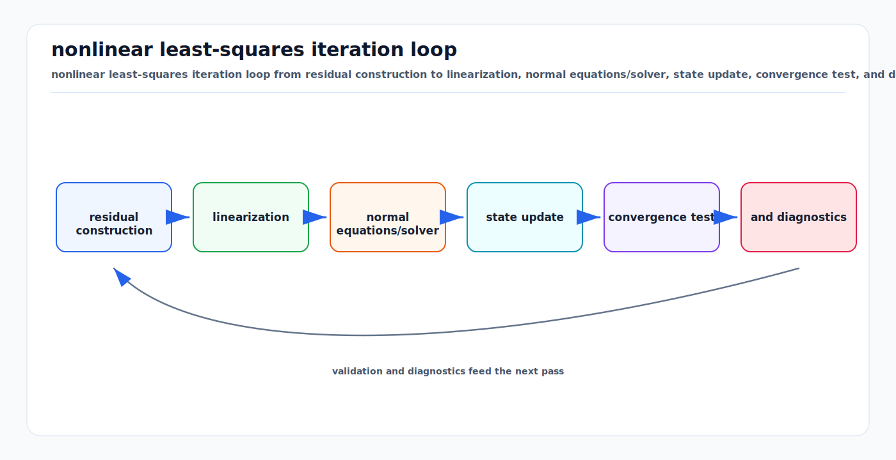

# Nonlinear Least Squares from First Principles

<!-- kb-visual:start -->


*Visual: nonlinear least-squares iteration loop from residual construction to linearization, normal equations/solver, state update, convergence test, and diagnostics.*
<!-- kb-visual:end -->

## Related docs

- [Gauss-Newton, Levenberg-Marquardt, and Dogleg](./gauss-newton-levenberg-marquardt-dogleg.md)
- [Trust Region and Line Search Globalization](./trust-region-line-search-globalization.md)
- [Jacobians, Autodiff, and Manifold Linearization](./jacobians-autodiff-manifold-linearization.md)
- [Factor Graph Solver Patterns: Ceres, GTSAM, and g2o](./factor-graph-solver-patterns-ceres-gtsam-g2o.md)
- [Nonlinear Solver Diagnostics Crosswalk](./nonlinear-solver-diagnostics-crosswalk.md)
- [Objective and Residual Design Audit](./objective-residual-design-and-audit.md)
- [Solver Selection and Convergence Diagnosis](./solver-selection-and-convergence-diagnosis.md)
- [GTSAM Factor Graphs](../state-estimation/gtsam-factor-graphs.md)
- [Robust Losses and M-Estimators](../probability-statistics/robust-losses-m-estimators-huber-cauchy-tukey-geman-mcclure.md)

## Why it matters for AV, perception, SLAM, and mapping

Most AV estimation backends are nonlinear least-squares systems in disguise. Visual reprojection errors, LiDAR ICP residuals, radar Doppler residuals, IMU preintegration residuals, wheel odometry constraints, RTK/GNSS priors, camera-LiDAR calibration errors, and loop closures all become residual functions over unknown states. The optimizer adjusts poses, velocities, biases, extrinsics, landmarks, time offsets, or map anchors until the residuals are small in statistically meaningful units.

The key practical idea is not "minimize pixels" or "minimize meters" directly. It is "minimize whitened residuals." A 1-pixel reprojection error, a 5-cm LiDAR point-to-plane error, a 0.02-rad yaw error, and a 0.5-m GNSS error should not contribute equally unless their noise models say they should. Whitening converts residuals into normalized units so the solver can combine heterogeneous sensors.

For SLAM and mapping, nonlinear least squares also explains why graph sparsity matters. Each measurement touches only a few variables: an odometry factor touches two poses, a reprojection factor touches one camera and one landmark, and an IMU factor touches neighboring pose-velocity-bias states. The Jacobian is sparse, so the normal equations or square-root system can be solved much faster than dense algebra would suggest.

## Core math and algorithm steps

Let the state be `x` and the stacked residual vector be:

```text
F(x) = [r_1(x); r_2(x); ...; r_m(x)]
```

The unconstrained nonlinear least-squares problem is:

```text
min_x 0.5 * ||F(x)||^2
```

Ceres writes the same basic objective as a sum of residual blocks, optionally robustified:

```text
min_x 0.5 * sum_i rho_i(||f_i(x_i1, ..., x_ik)||^2)
```

where each residual block depends on a small subset of parameter blocks. Without robust loss functions and bounds, this reduces to ordinary nonlinear least squares.

### Residuals from measurements

A measurement model predicts `h_i(x_i)` for measurement `z_i`. A residual is usually:

```text
r_i(x_i) = h_i(x_i) - z_i
```

For pose and rotation measurements, subtraction must be replaced by a local coordinate operation:

```text
r_ij(X_i, X_j) = Log( Z_ij^-1 * (X_i^-1 * X_j) )
```

That residual lives in a tangent vector space, not in the ambient quaternion or matrix representation.

### Whitening and Mahalanobis distance

If the measurement covariance is `Sigma_i`, the statistically weighted residual cost is:

```text
||r_i||^2_Sigma = r_i^T * Sigma_i^-1 * r_i
```

Let `L_i` be a square-root information matrix such that:

```text
L_i^T * L_i = Sigma_i^-1
```

The whitened residual is:

```text
e_i(x_i) = L_i * r_i(x_i)
```

Then:

```text
||e_i||^2 = r_i^T * Sigma_i^-1 * r_i
```

Ceres pose-graph examples do this explicitly by premultiplying pose residuals by the inverse square root of covariance. GTSAM noise models do the same conceptually: the factor error returned by `error()` is the whitened error, and diagonal noise divides each residual dimension by its sigma.

### Linearization

At an iterate `x`, approximate the residual near `x`:

```text
F(x + Delta x) ~= F(x) + J(x) * Delta x
```

where `J` is the Jacobian:

```text
J_ij = d f_i / d x_j
```

The local linear least-squares subproblem is:

```text
min_Delta 0.5 * ||J * Delta + F||^2
```

The first-order optimality condition gives the normal equations:

```text
J^T * J * Delta = -J^T * F
```

Equivalently, with `H = J^T * J` and `g = J^T * F`:

```text
H * Delta = -g
```

If the residuals have already been whitened, `J` is the whitened Jacobian and `H` is the approximate information matrix. If not, the weighted form is:

```text
H = J^T * W * J
g = J^T * W * r
W = Sigma^-1
```

### Normal equations versus square-root systems

Normal equations are compact and expose the graph information matrix, but forming `J^T J` squares the condition number. Square-root methods solve the linearized least-squares problem using QR or Cholesky on a square-root information form, often improving numerical behavior. In large SLAM systems, sparse Cholesky, sparse QR, Schur complement, or preconditioned conjugate gradients are chosen according to graph structure and latency budget.

## Algorithm steps

1. Choose state variables: poses, velocities, biases, landmarks, calibration parameters, map anchors, or time offsets.
2. Define residuals from sensor models and priors.
3. Attach a covariance or information model to each residual.
4. Whiten residuals and Jacobians using the square-root information.
5. Evaluate residuals and Jacobians at the current estimate.
6. Linearize: `F(x + Delta) ~= F(x) + J Delta`.
7. Solve the local least-squares system for `Delta`.
8. Apply `Delta` to the state, using a manifold retraction when variables are not Euclidean.
9. Accept, damp, shrink, or line-search the step using a globalization strategy.
10. Repeat until cost reduction, gradient norm, step norm, or iteration budget reaches the stopping rule.

## Implementation notes

- Store residuals in physical units first, then whiten in a single obvious place. Mixing already-whitened and raw residuals is a common source of bad tuning.
- Use the square-root information matrix `L`, not covariance `Sigma`, in the residual code path. Solvers usually want normalized residuals and normalized Jacobians.
- Keep units explicit. Pixels, radians, meters, seconds, and meters per second cannot share a noise scale without normalization.
- Robust losses are not a replacement for covariances. First normalize by expected inlier noise; then apply a robust loss to reduce the influence of outliers.
- Use priors to fix gauge freedom. Pure relative pose graphs have unobservable global translation and yaw, monocular visual systems have scale ambiguity, and bundle adjustment can have similarity gauge freedom.
- Prefer sparse block storage when each factor touches a few parameter blocks. AV graphs are usually sparse by construction.
- Use Schur complement for classic bundle adjustment, where many landmark variables connect to camera variables.
- Log the initial cost, final cost, gradient norm, accepted step sizes, linear solver iterations, and rank or conditioning warnings. Solver summaries are often the fastest way to debug a backend.

## Failure modes and diagnostics

- **Wrong residual sign:** The cost may still decrease but optimized states move in the opposite direction for some factors. Check residuals against finite differences and small synthetic problems.
- **Unwhitened or double-whitened residuals:** One sensor dominates or disappears. Inspect normalized residual histograms; inlier residual components should often be order 1 after whitening.
- **Bad covariance scale:** GNSS, loop closure, or ICP factors pull the trajectory unrealistically. Compare per-factor chi-square contributions and innovation statistics.
- **Gauge freedom:** The linear system is singular or covariance estimates explode. Add a minimal prior, anchor a frame, or explicitly handle the nullspace.
- **Rank-deficient geometry:** Pure rotation, low parallax, planar landmarks, or repeated structures make some directions unobservable. Watch small eigenvalues, Cholesky failures, and slow drift in weak directions.
- **Outliers:** A few false matches or loop closures dominate the objective. Use front-end gating, switchable constraints, graduated robustification, or robust loss functions.
- **Poor initialization:** Linearization is only local. Use odometry, PnP, ICP, inertial propagation, or map priors to initialize near the correct basin.
- **Numerical conditioning:** Large unit disparities or poorly scaled parameters cause unstable steps. Normalize state parameterizations and use solver scaling options where available.

## Concept Cards

### Residual

- What it means here: A vector error produced by comparing a predicted measurement, prior, or constraint against its target.
- Math object: `r_i(x) = h_i(x) - z_i`, or a tangent-space log error for pose constraints.
- Effect on the solve: Defines the components that are squared, weighted, linearized, and driven toward zero.
- What it solves: Encodes the physical mismatch the optimizer is supposed to reduce.
- What it does not solve: It does not set statistical scale, reject outliers, or prove the solved artifact is valid.
- Minimal example: Predicted camera pixel minus observed feature pixel.
- Failure symptoms: Synthetic truth has nonzero error, a sign perturbation moves the state the wrong way, or cost falls while the artifact worsens.
- Diagnostic artifact: Raw residual equation, raw residual trace, and zero-residual synthetic case.
- Normal vs abnormal artifact: Normal residuals are near zero at constructed truth; abnormal residuals show bias, wrong sign, wrong frame, or wrong units.
- First debugging move: Rebuild the residual from the measurement equation before changing solver settings.
- Do not confuse with: Objective value, whitened residual, robust loss, or measurement covariance.
- Read next: [Objective and Residual Design Audit](./objective-residual-design-and-audit.md).

### Whitened residual

- What it means here: A raw residual expressed in normalized noise units by applying square-root information.
- Math object: `e_i = L_i r_i`, where `L_i^T L_i = Sigma_i^-1`.
- Effect on the solve: Sets relative influence between heterogeneous residual families such as pixels, meters, radians, and seconds.
- What it solves: Makes expected inlier errors comparable across sensors and constraints.
- What it does not solve: It does not fix a wrong covariance, remove outliers, or add observability.
- Minimal example: Divide a scalar GNSS position residual by its standard deviation.
- Failure symptoms: One sensor dominates the objective, a residual family disappears, or robust loss thresholds behave unpredictably.
- Diagnostic artifact: Raw-versus-whitened residual printout and per-family whitened residual histogram.
- Normal vs abnormal artifact: Normal inlier components are order 1 after whitening; abnormal components are systematically huge, tiny, saturated, or double-scaled.
- First debugging move: Verify the square-root information matrix is applied exactly once and before robust loss evaluation.
- Do not confuse with: Robust weight, posterior covariance, or information matrix storage.
- Read next: [Objective and Residual Design Audit](./objective-residual-design-and-audit.md).

### Linearization

- What it means here: The local first-order approximation of residual change around the current state.
- Math object: `F(x boxplus Delta) ~= F(x) + J Delta`.
- Effect on the solve: Creates the local least-squares subproblem and predicted reduction used to choose a step.
- What it solves: Turns a nonlinear residual problem into a tractable local linear problem for one iteration.
- What it does not solve: It does not make a poor initialization, discontinuous residual, or stale association globally valid.
- Minimal example: Linearizing a point-to-plane ICP residual around the current pose estimate.
- Failure symptoms: Actual reduction disagrees with predicted reduction, trial steps are repeatedly rejected, or small perturbations do not match `J Delta`.
- Diagnostic artifact: Predicted-versus-actual residual change for scaled trial steps.
- Normal vs abnormal artifact: Normal predictions match actual changes for small tangent steps; abnormal predictions fail even near the committed state.
- First debugging move: Sweep the residual along a small multiple of the proposed tangent step and compare it with `F + J Delta`.
- Do not confuse with: Global convergence, line search, or solver library choice.
- Read next: [Nonlinear Solver Diagnostics Crosswalk](./nonlinear-solver-diagnostics-crosswalk.md).

### Normal equations

- What it means here: The symmetric linear system produced by first-order optimality of the linearized least-squares subproblem.
- Math object: `J^T J Delta = -J^T F`, or `H Delta = -g`.
- Effect on the solve: Converts residual and Jacobian blocks into a step direction using the approximate Hessian and gradient.
- What it solves: Provides a compact way to compute a Gauss-Newton-style update and expose information-matrix structure.
- What it does not solve: It does not avoid conditioning loss, handle rank deficiency by itself, or validate residual modeling.
- Minimal example: Solve `H Delta = -g` for a relative pose graph after stacking whitened Jacobian blocks.
- Failure symptoms: Cholesky failure, tiny or negative pivots, unstable covariance, or steps dominated by poorly scaled columns.
- Diagnostic artifact: Linear solver summary, pivot log, condition estimate, and normal-equation residual.
- Normal vs abnormal artifact: Normal `H` is symmetric positive semidefinite with only expected gauge modes; abnormal `H` has unexpected rank loss, scale spread, or indefiniteness from bad inputs.
- First debugging move: Check whitening and gauge constraints, then compare a QR or square-root solve on a representative small problem.
- Do not confuse with: Square-root QR system, true Hessian, or posterior covariance.
- Read next: [Nonlinear Solver Diagnostics Crosswalk](./nonlinear-solver-diagnostics-crosswalk.md).

## Sources

- Ceres Solver, "Modeling Non-linear Least Squares": https://ceres-solver.readthedocs.io/latest/nnls_modeling.html
- Ceres Solver, "Solving Non-linear Least Squares": https://ceres-solver.readthedocs.io/latest/nnls_solving.html
- Ceres Solver, "Non-linear Least Squares Tutorial" pose graph examples: https://ceres-solver.readthedocs.io/latest/nnls_tutorial.html
- GTSAM, "Factor Graphs and GTSAM: A Hands-on Introduction": https://gtsam.org/tutorials/intro.html
- GTSAM docs, `BetweenFactor`: https://borglab.github.io/gtsam/betweenfactor/
- GTSAM Doxygen, `NonlinearFactorGraph`: https://gtsam.org/doxygen/a05091.html
- Triggs, McLauchlan, Hartley, and Fitzgibbon, "Bundle Adjustment - A Modern Synthesis": https://www.cs.jhu.edu/~misha/ReadingSeminar/Papers/Triggs00.pdf
- Nocedal and Wright, "Numerical Optimization": https://convexoptimization.com/TOOLS/nocedal.pdf
