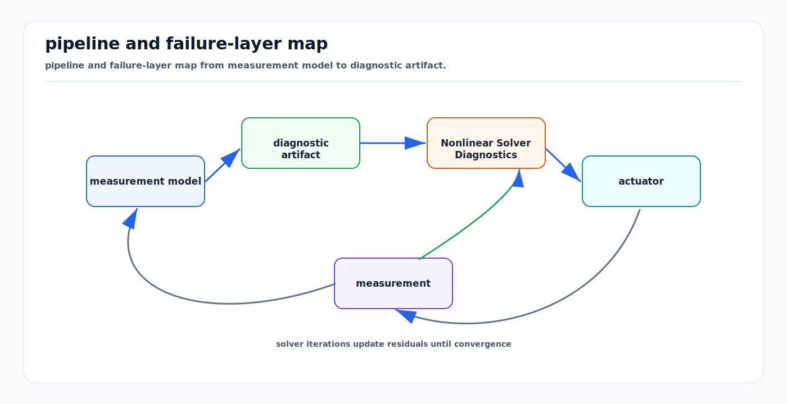

# Nonlinear Solver Diagnostics Crosswalk

<!-- kb-visual:start -->


*Visual: pipeline and failure-layer map from measurement model to diagnostic artifact.*
<!-- kb-visual:end -->

## Related docs

- [Objective and Residual Design Audit](objective-residual-design-and-audit.md)
- [Solver Selection and Convergence Diagnosis](solver-selection-and-convergence-diagnosis.md)
- [Sparse Estimation Backend Crosswalk](../numerical-linear-algebra/sparse-estimation-backend-crosswalk.md)
- [Nonlinear Least Squares from First Principles](nonlinear-least-squares-first-principles.md)
- [Jacobians, Autodiff, and Manifold Linearization](jacobians-autodiff-manifold-linearization.md)
- [Eigenvalues, Hessian Conditioning, and Observability](../numerical-linear-algebra/eigenvalues-hessian-conditioning-observability.md)

## Why this page exists

A calibration, map, or plan can fail even when the optimizer reports convergence and the final scalar cost is low. The scalar objective is only a compressed summary of residual definitions, whitening, Jacobians, linear algebra, step acceptance, gauge choices, and state-estimation interpretation. This page routes from an initial symptom to the layer that owns it, then to the diagnostic artifact that can confirm or reject the hypothesis.

Use it when the solved artifact is wrong, unsafe, unstable, or overconfident. The main discipline is to avoid jumping from "solver failed" to "change solver library." First identify whether the wrong object is a measurement model, residual family, local coordinate convention, linear backend, damping policy, prior, gauge anchor, covariance query, or downstream interpretation.

## Failure spine

| Failure Layer | What Goes Wrong | Typical Initial Symptom | Diagnostic Artifact | First Move |
|---|---|---|---|---|
| Residual wrong | The residual does not encode the intended physical measurement, frame, sign, unit, or constraint. | Cost decreases but artifact worsens. | Raw residual trace on a synthetic case, per-factor residual histogram, sign perturbation check. | Rebuild the residual from the measurement equation before tuning weights. |
| Jacobian inconsistent | The derivative does not match the residual, whitening, tangent coordinates, or manifold retraction. | Step points the wrong way, accepted updates oscillate, finite-difference checks fail. | Tangent finite-difference Jacobian check and predicted-vs-actual residual change. | Check the exact `Plus`, `boxplus`, or `retract` used by the solver. |
| Scale poor | Residual families are underweighted, overweighted, unwhitened, or double-whitened. | One sensor/residual dominates, covariance is nonsensical, weak modes look overconfident. | Whitened residual histograms, chi-square contribution by family, information block magnitudes. | Separate measurement covariance from robust loss and posterior covariance. |
| Damping brittle | Globalization changes the numerical step but cannot repair missing information or bad residuals. | Rejected LM/dogleg/trust-region/line-search steps; damping grows large and step norm tiny. | Step acceptance log, gain ratio, damping or radius trace, predicted and actual reduction. | Diagnose the local model before treating damping as a prior. |
| Outside local model | The initial state is too far from the correct basin or the local linearization is stale. | Trajectory is smooth but unsafe/wrong, map folds, planner cost looks optimal in the wrong region. | Trial-state artifacts, residual field around current state, rejected-step sequence. | Reinitialize, gate bad factors, or change the model region before changing backend. |

## Diagnostic pipeline

```text
measurement model -> residual -> whitening and scale -> Jacobian and local coordinates -> linearization -> linear solve -> trial state through retraction -> step acceptance -> committed update -> convergence, rank, and covariance diagnosis
```

The pipeline is ordered because later artifacts inherit earlier mistakes. A Cholesky failure can be a real rank problem, but it can also be caused by an impossible residual or an inconsistent Jacobian. A covariance block can be numerically recoverable and still meaningless if the gauge was not defined. A rejected trial step can be healthy globalization or evidence that the local model is invalid.

## Ownership Map

| Owner | Owns | Diagnostic Artifacts | Does Not Own |
|---|---|---|---|
| Probability/statistics | Measurement noise, covariance, information, whitening, likelihood assumptions, robust loss scale. | Whitened residual distributions, chi-square contributions, innovation consistency. | Frame conventions or manifold perturbation definitions. |
| Geometry | Frames, projections, SE(3), local coordinates, retractions, measurement geometry. | Frame audit, tangent perturbation test, reprojection or point-to-plane geometry traces. | Solver acceptance policy or sparse ordering. |
| Optimization | Objective construction, local model, nonlinear method, damping, trust-region or line-search acceptance. | Predicted reduction, actual reduction, gain ratio, accepted/rejected step log. | Physical observability interpretation. |
| Numerical linear algebra | Rank, conditioning, factorization, fill-in, Schur, PCG, covariance recovery mechanics. | Singular values, factorization warnings, fill-in estimates, residual norms, selected covariance blocks. | Whether a weak mode is safe for the product. |
| State estimation | Gauge policy, estimator consistency, physical observability, integrity interpretation, map or trajectory validity. | NEES/NIS style checks, weak-mode interpretation, protection-level or map-integrity evidence. | Low-level derivative implementation details. |

## Symptom-First Diagnostic Table

| Symptom | Likely Layer | Common Causes | First Artifact To Inspect | Disambiguating Check | Likely Next Concept Card | Canonical Derivation Link |
|---|---|---|---|---|---|---|
| Cost decreases but artifact worsens | Residual/model | Wrong sign, wrong frame, proxy objective, missing safety term. | Raw residual trace and solved artifact overlay. | Synthetic zero-residual and sign perturbation tests. | Residual | [Objective and Residual Design Audit](objective-residual-design-and-audit.md) |
| Rejected LM/dogleg/trust-region/line-search steps | Local model/globalization | Bad linearization, poor initialization, stale Jacobian, robust threshold mismatch. | Step acceptance log with predicted and actual reduction. | Compare residual decrease predicted by `J delta` with actual trial-state residual. | Step acceptance | [Solver Selection and Convergence Diagnosis](solver-selection-and-convergence-diagnosis.md) |
| Damping grows large and step norm tiny | Optimization or rank | False convergence, gauge freedom, weak mode, bad scaling. | Damping trace, gradient norm, singular values. | Remove gauge ambiguity or rescale residuals on a small case. | Rank deficiency | [Eigenvalues, Hessian Conditioning, and Observability](../numerical-linear-algebra/eigenvalues-hessian-conditioning-observability.md) |
| One sensor/residual dominates | Scale/statistics | Missing whitening, double weighting, wrong covariance units, robust loss applied before whitening. | Per-factor chi-square and whitened residual histogram. | Normalize by square-root information, then compare inlier components to expected order. | Whitened residual | [Objective and Residual Design Audit](objective-residual-design-and-audit.md) |
| Cholesky/LDLT fails | Linear algebra | Indefinite system, missing prior, rank deficiency, negative weight, corrupted Jacobian. | Factorization pivot or diagonal warning. | Try QR/SVD or add a minimal gauge anchor on a representative problem. | Rank deficiency | [Sparse Estimation Backend Crosswalk](../numerical-linear-algebra/sparse-estimation-backend-crosswalk.md) |
| Rank appears full but covariance nonsensical | Gauge/covariance | Hidden gauge fixing, bad ordering query, overconfident prior, inverse diagonal mistaken for marginal covariance. | Selected covariance block and nullspace-aligned variance. | Compare marginal covariance, conditional covariance, and gauge-dependent covariance. | Covariance recovery | [Sparse Estimation Backend Crosswalk](../numerical-linear-algebra/sparse-estimation-backend-crosswalk.md) |
| Covariance overconfident in weak mode | Scale or observability | Loop closure overweighted, bad prior, weak excitation, robust weight not reflected in covariance. | Eigenvectors of information matrix and covariance along weak mode. | Perturb along weak mode and re-evaluate physical residual change. | Covariance recovery | [Eigenvalues, Hessian Conditioning, and Observability](../numerical-linear-algebra/eigenvalues-hessian-conditioning-observability.md) |
| Runtime/memory explodes after graph growth | Sparse backend | Bad ordering, dense marginalization prior, explicit Schur too dense, covariance query too broad. | Fill-in estimate, elimination tree, memory profile. | Compare ordering and separator size before and after graph growth. | Covariance recovery | [Sparse Estimation Backend Crosswalk](../numerical-linear-algebra/sparse-estimation-backend-crosswalk.md) |
| PCG stagnates/reaches iteration limit | Iterative backend | Poor preconditioner, non-SPD operator, ill-conditioned Schur system, tolerance mismatch. | Unpreconditioned and preconditioned residual norms per iteration. | Symmetry/SPD test and direct solve on a small representative case. | Rank deficiency | [Sparse Estimation Backend Crosswalk](../numerical-linear-algebra/sparse-estimation-backend-crosswalk.md) |
| Trajectory smooth but unsafe/wrong | Objective design | Missing constraint, badly scaled planner cost, local minimum, dynamics mismatch. | Cost-term contribution and constraint violation trace. | Increase one term at a time on a scenario with known expected behavior. | Local model | [Objective and Residual Design Audit](objective-residual-design-and-audit.md) |

## Worked diagnostic examples

### Calibration: camera-LiDAR yaw or time offset gets absorbed into extrinsics

initial symptom -> the reprojection or point-to-plane cost decreases, but the extrinsic yaw moves to an implausible value and downstream fusion gets worse.

wrong object or wrong layer -> the first suspect is not LM damping. It is the residual design and local geometry: timestamp convention, frame direction, target motion, and yaw/time-offset coupling.

diagnostic artifact -> plot raw residuals by time, whitened residuals by sensor, finite-difference Jacobian columns for yaw and time offset, and the covariance or singular vector for the coupled direction.

interpretation -> if yaw and time offset columns produce nearly the same residual change, the system has a weak mode; if finite differences disagree with autodiff, the residual/Jacobian pair is inconsistent.

what to change -> fix timestamp semantics, excite motion that separates yaw from delay, add a physically justified prior, or split residual families before tuning damping.

what not to conclude -> do not conclude that a smaller final cost validates the extrinsic, and do not treat damping as a calibration prior.

read next -> [Objective and Residual Design Audit](objective-residual-design-and-audit.md), [Jacobians, Autodiff, and Manifold Linearization](jacobians-autodiff-manifold-linearization.md), and [Sparse Estimation Backend Crosswalk](../numerical-linear-algebra/sparse-estimation-backend-crosswalk.md).

### Mapping or SLAM: false loop closure with overconfident covariance warps a map

initial symptom -> the pose graph converges and covariance blocks look small, but the map bends after a loop closure.

wrong object or wrong layer -> the likely layer is factor scale and state-estimation consistency, not simply the linear solver.

diagnostic artifact -> inspect loop-closure whitened residuals, robust weights, accepted-step logs, weak-mode eigenvectors, and selected marginal covariance before and after adding the loop.

interpretation -> an overconfident loop closure can dominate odometry and create a map that is numerically consistent with the wrong measurement.

what to change -> repair front-end gating, reduce loop information to measured uncertainty, apply robust loss after whitening, and test the graph with and without the loop.

what not to conclude -> do not conclude that rank fullness or Cholesky success means the map is physically correct.

read next -> [Objective and Residual Design Audit](objective-residual-design-and-audit.md), [Solver Selection and Convergence Diagnosis](solver-selection-and-convergence-diagnosis.md), and [Eigenvalues, Hessian Conditioning, and Observability](../numerical-linear-algebra/eigenvalues-hessian-conditioning-observability.md).

### Planning or control: cost scaling makes a smooth but unsafe trajectory look optimal

initial symptom -> the trajectory is smooth, the optimizer converges, but clearance or comfort limits are violated in review.

wrong object or wrong layer -> the wrong layer is the objective design: safety residuals or constraints are scaled below smoothness terms, or penalties are active only inside the wrong local region.

diagnostic artifact -> inspect per-term cost contributions, active constraints, line-search or trust-region accepted steps, and trial-state trajectories before acceptance.

interpretation -> the solver minimized the objective it was given; the objective did not encode the product requirement at comparable scale.

what to change -> normalize residuals, introduce hard constraints where required, adjust robust or barrier thresholds, and replay a scenario with known unsafe alternatives.

what not to conclude -> do not conclude that convergence means the plan is safe.

read next -> [Objective and Residual Design Audit](objective-residual-design-and-audit.md) and [Solver Selection and Convergence Diagnosis](solver-selection-and-convergence-diagnosis.md).

## Reading paths

- Solver logs first: start with [Solver Selection and Convergence Diagnosis](solver-selection-and-convergence-diagnosis.md), then return here to map rejected steps, damping, gain ratio, and trial-state behavior to the owning layer.
- Bad output with low cost: start with [Objective and Residual Design Audit](objective-residual-design-and-audit.md), then check residual scale, missing terms, and robust loss order.
- Linear-solve or covariance failures: start with [Sparse Estimation Backend Crosswalk](../numerical-linear-algebra/sparse-estimation-backend-crosswalk.md), then inspect rank, gauge, factorization, and covariance-recovery assumptions.
- Runtime or memory explosion: follow sparse ordering, Schur, marginalization, and covariance-query diagnostics before changing the nonlinear method.
- Estimator inconsistency: use this page to separate local matrix evidence from state-estimation interpretation of observability, gauge, and integrity.

## Required disambiguations

### Residual versus objective

A residual is a vector error term. The objective is the weighted, robustified, and summed scalar function built from many residuals.

### Raw residual versus whitened residual

The raw residual stays in physical units. The whitened residual is premultiplied by square-root information so heterogeneous factors can be compared in normalized noise units.

### Measurement covariance versus robust weight

Measurement covariance states expected inlier noise. A robust weight changes the influence of a residual after evaluating its normalized error and is not a replacement for covariance.

### Damping versus prior versus gauge fix

Damping changes a numerical step inside the nonlinear method. A prior adds information to the objective. A gauge fix chooses coordinates for an otherwise unobservable symmetry.

### Rank deficiency versus poor conditioning

Rank deficiency means a direction is locally unobservable or redundant. Poor conditioning means directions are technically observable but very differently scaled or weakly constrained.

### Schur complement for solving versus marginalization prior

Schur complement for solving eliminates variables temporarily and back-substitutes them. Marginalization builds a new prior and commits a linearized summary to the graph.

### Marginal covariance versus conditional covariance

Marginal covariance accounts for uncertainty in other variables. Conditional covariance assumes other variables are fixed and is usually smaller.

## Concept cards

### Residual

- What it means here: A vector error produced by comparing a predicted measurement or constraint against its target.
- Math object: `r_i(x) = h_i(x) - z_i`, or a tangent-space log error for poses.
- Effect on the solve: Defines the direction and meaning of the local least-squares problem.
- What it solves: Encodes the physical mismatch the optimizer should reduce.
- What it does not solve: It does not choose the statistical scale or guarantee product validity.
- Minimal example: Camera reprojection prediction minus observed pixel.
- Failure symptoms: Cost decreases but artifact worsens; sign perturbation moves state the wrong way.
- Diagnostic artifact: Raw residual trace on a synthetic case.
- Normal vs abnormal artifact: Normal residual is zero at constructed truth; abnormal residual is biased at truth.
- First debugging move: Write the measurement equation and test a zero-residual case.
- Do not confuse with: Objective, robust loss, or covariance.
- Read next: [Objective and Residual Design Audit](objective-residual-design-and-audit.md).

### Whitened residual

- What it means here: A residual expressed in normalized noise units.
- Math object: `e_i = L_i r_i`, where `L_i^T L_i = Sigma_i^-1`.
- Effect on the solve: Sets relative influence between heterogeneous residual families.
- What it solves: Makes meters, pixels, radians, and seconds comparable through uncertainty.
- What it does not solve: It does not reject outliers by itself.
- Minimal example: Divide a scalar GNSS residual by its standard deviation.
- Failure symptoms: One residual family dominates or disappears.
- Diagnostic artifact: Per-family whitened residual histogram.
- Normal vs abnormal artifact: Normal inliers are order 1; abnormal values are systematically huge or tiny.
- First debugging move: Check whether whitening is missing, duplicated, or applied after robust weighting.
- Do not confuse with: Robust weight or posterior covariance.
- Read next: [Objective and Residual Design Audit](objective-residual-design-and-audit.md).

### Jacobian consistency

- What it means here: The derivative used by the solver matches the implemented residual, scale, and tangent coordinates.
- Math object: `J = d e / d delta` for the same local perturbation used by the solver.
- Effect on the solve: Controls the predicted reduction and step direction.
- What it solves: Confirms that linearized residual change predicts actual residual change locally.
- What it does not solve: It does not prove the residual is the right physical model.
- Minimal example: Finite-difference a yaw perturbation through `retract`.
- Failure symptoms: Rejected steps, oscillation, or actual reduction opposite of predicted reduction.
- Diagnostic artifact: Tangent finite-difference Jacobian check.
- Normal vs abnormal artifact: Normal columns agree within tolerance; abnormal columns have sign, scale, or coordinate errors.
- First debugging move: Compare analytic/autodiff Jacobian to finite differences on raw and whitened residuals.
- Do not confuse with: Rank deficiency.
- Read next: [Jacobians, Autodiff, and Manifold Linearization](jacobians-autodiff-manifold-linearization.md).

### Local model

- What it means here: The first-order approximation of residuals around the current state.
- Math object: `e(x retract delta) ~= e(x) + J delta`.
- Effect on the solve: Produces the trial step and predicted reduction.
- What it solves: Gives a tractable local least-squares subproblem.
- What it does not solve: It does not make a bad initialization globally valid.
- Minimal example: Linearized point-to-plane ICP around the current pose.
- Failure symptoms: Repeated rejected steps or smooth but wrong local minimum.
- Diagnostic artifact: Predicted-vs-actual residual change at trial states.
- Normal vs abnormal artifact: Normal prediction is accurate for small accepted steps; abnormal prediction fails even for small steps.
- First debugging move: Evaluate actual residual along scaled versions of the proposed step.
- Do not confuse with: Solver library choice.
- Read next: [Solver Selection and Convergence Diagnosis](solver-selection-and-convergence-diagnosis.md).

### Manifold update

- What it means here: A tangent perturbation applied through a retraction to a constrained state.
- Math object: `X_next = retract_X(delta)`, often `X Exp(delta)` for poses.
- Effect on the solve: Keeps rotations, poses, and normalized states on their valid manifold.
- What it solves: Avoids invalid ambient-coordinate updates.
- What it does not solve: It does not pick the correct perturbation convention automatically.
- Minimal example: Updating an SE(3) pose with a six-vector twist.
- Failure symptoms: Jacobian check depends on left/right perturbation or quaternion normalization.
- Diagnostic artifact: Local-coordinate finite-difference report.
- Normal vs abnormal artifact: Normal perturbations match solver convention; abnormal checks perturb a different state representation.
- First debugging move: Trace the exact `Plus`, `boxplus`, or `retract` used in optimization.
- Do not confuse with: Residual frame convention.
- Read next: [Jacobians, Autodiff, and Manifold Linearization](jacobians-autodiff-manifold-linearization.md).

### Step acceptance

- What it means here: The rule deciding whether a trial state becomes the committed state.
- Math object: Gain ratio, Armijo condition, trust-region acceptance, or line-search sufficient decrease.
- Effect on the solve: Separates a proposed local step from an accepted update.
- What it solves: Protects the committed state from bad local-model predictions.
- What it does not solve: It does not fix wrong residuals, bad scale, or missing observability.
- Minimal example: LM rejects a step because actual reduction is negative.
- Failure symptoms: Repeated rejected steps, shrinking radius, or exploding damping.
- Diagnostic artifact: Accepted/rejected step log with actual and predicted reduction.
- Normal vs abnormal artifact: Normal logs show occasional rejection; abnormal logs reject nearly every meaningful step.
- First debugging move: Compare trial-state residuals against predicted reduction.
- Do not confuse with: Convergence criterion.
- Read next: [Solver Selection and Convergence Diagnosis](solver-selection-and-convergence-diagnosis.md).

### Rank deficiency

- What it means here: A local matrix has directions that residuals do not constrain.
- Math object: Nullspace of `J` or near-zero eigenvalues of `J^T J`.
- Effect on the solve: Makes steps, covariance, or factorization unstable without gauge handling.
- What it solves: Exposes unobservable or redundant directions.
- What it does not solve: It does not decide whether the weak direction is acceptable for the system.
- Minimal example: Pose graph without a global anchor.
- Failure symptoms: Cholesky failure, huge covariance, or arbitrary global drift.
- Diagnostic artifact: Singular values, nullspace vectors, or factorization pivots.
- Normal vs abnormal artifact: Normal known gauge appears as expected; abnormal nullspace includes physical states expected to be observed.
- First debugging move: Add a minimal gauge anchor or inspect singular vectors by variable key.
- Do not confuse with: Poor conditioning.
- Read next: [Sparse Estimation Backend Crosswalk](../numerical-linear-algebra/sparse-estimation-backend-crosswalk.md).

### Covariance recovery

- What it means here: Extracting selected uncertainty blocks from an information or square-root system after solving.
- Math object: Selected blocks of `H^-1` or covariance recovered from a factorization.
- Effect on the solve: Does not change the step, but changes uncertainty interpretation and downstream gating.
- What it solves: Provides marginal uncertainty for queried variables when assumptions are valid.
- What it does not solve: It does not validate residual scale, gauge choice, or physical observability.
- Minimal example: Query a pose marginal covariance after graph optimization.
- Failure symptoms: Overconfident weak mode or memory explosion from broad covariance queries.
- Diagnostic artifact: Selected marginal covariance blocks and nullspace-aligned variances.
- Normal vs abnormal artifact: Normal covariance grows in weak directions; abnormal covariance is tiny because a gauge or conditional query hid uncertainty.
- First debugging move: State whether the query is marginal, conditional, gauge-fixed, or gauge-free.
- Do not confuse with: Measurement covariance.
- Read next: [Sparse Estimation Backend Crosswalk](../numerical-linear-algebra/sparse-estimation-backend-crosswalk.md).

## Sources

- Ceres Solver, "Modeling Non-linear Least Squares": https://ceres-solver.readthedocs.io/latest/nnls_modeling.html
- Ceres Solver, "Solving Non-linear Least Squares": https://ceres-solver.readthedocs.io/latest/nnls_solving.html
- GTSAM, "Factor Graphs and GTSAM: A Hands-on Introduction": https://gtsam.org/tutorials/intro.html
- GTSAM docs, `BetweenFactor`: https://borglab.github.io/gtsam/betweenfactor/
- Nocedal and Wright, "Numerical Optimization": https://convexoptimization.com/TOOLS/nocedal.pdf
- Triggs, McLauchlan, Hartley, and Fitzgibbon, "Bundle Adjustment - A Modern Synthesis": https://www.cs.jhu.edu/~misha/ReadingSeminar/Papers/Triggs00.pdf
