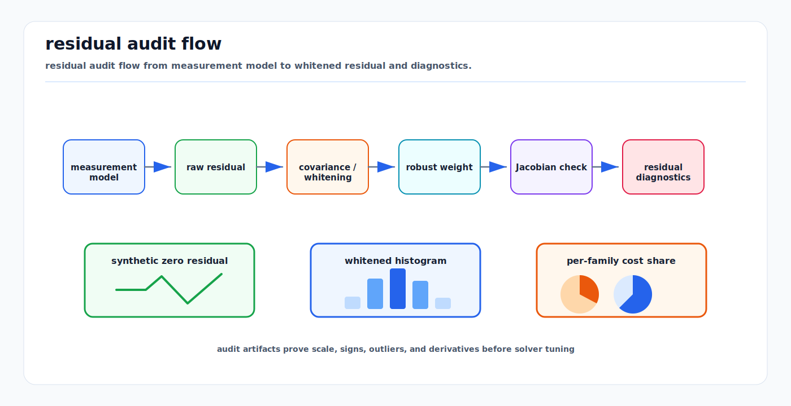

# Objective and Residual Design Audit

<!-- kb-visual:start -->


*Visual: residual audit flow from measurement model to whitened residual and diagnostics.*
<!-- kb-visual:end -->

## Related docs

- [Nonlinear Solver Diagnostics Crosswalk](nonlinear-solver-diagnostics-crosswalk.md)
- [Nonlinear Least Squares from First Principles](nonlinear-least-squares-first-principles.md)
- [Robust Losses and M-Estimators](../probability-statistics/robust-losses-m-estimators-huber-cauchy-tukey-geman-mcclure.md)
- [Gaussian Noise, Covariance, Information, Whitening, and Uncertainty Ellipses](../probability-statistics/gaussian-noise-covariance-information.md)
- [Coordinate Frames, Projections, and SE(3)](../geometry-3d/coordinate-frames-projections-se3.md)
- [GTSAM Factor Graph Optimization](../state-estimation/gtsam-factor-graphs.md)
- [GLIM](../../30-autonomy-stack/localization-mapping/slam-methods/glim.md)

## What an objective is

Objective and Residual Design Audit is the process of turning measurements, priors, constraints, and modeling assumptions into residual terms, weights, robust losses, and solver-visible diagnostics. The objective is not just a formula for the optimizer. It is the contract that says which physical errors matter, what their units are, how much uncertainty each carries, and which failures should be visible in logs.

For least squares, the usual objective is a sum of squared whitened residuals, often with robust losses:

```text
min_x 0.5 * sum_i rho_i(||L_i r_i(x)||^2)
```

The design audit asks whether each `r_i`, `L_i`, and `rho_i` has the intended meaning. A low scalar objective can hide a wrong residual sign, a frame convention bug, a missing safety term, or a residual family that overwhelms every other factor.

For GTSAM and GLIM, treat every factor class or extension callback as part of the objective contract. The code path should answer: which variables does this factor touch, what measurement likelihood does it encode, what covariance or square-root information does it use, what robust policy applies, and what diagnostic output proves it is not dominating or silently ignored.

## Residual-family audit checklist

| Audit Item | Question To Answer | Diagnostic Artifact |
|---|---|---|
| measurement prediction | What quantity does the model predict, in which frame, at which timestamp, and from which state variables? | Hand-computed prediction case and measurement trace. |
| raw residual definition | What physical quantity is predicted, what is observed, and which direction is subtracted? | Residual equation and zero-residual synthetic case. |
| frame and unit convention | Are predicted and observed quantities expressed in the same frame, timestamp, and units before whitening? | Frame trace, transform chain, and unit table by component. |
| sign convention | Does a positive perturbation move the residual in the expected direction? | Sign perturbation test. |
| perturbation convention | Does the residual use the same local-coordinate, left/right, and state ordering convention as the solver? | Perturbation convention note and local-coordinate check. |
| whitening/covariance | Does `Sigma` come from the intended noise source, and is `L` applied once with `L^T L = Sigma^-1`? | Covariance provenance, whitening matrix inspection, and raw-versus-whitened residual printout. |
| robust loss | Is the robust loss applied after residuals are normalized by expected inlier noise? | Robust weight versus whitened residual plot. |
| numeric/autodiff agreement | Do numeric, autodiff, and analytic Jacobians agree for representative residual blocks? | Jacobian comparison report. |
| synthetic zero-residual test | Can a constructed truth state produce residuals at or near zero? | Unit test or logged synthetic solve. |
| noise simulation | Does simulated inlier noise produce the expected whitened residual distribution? | Whitened residual histogram and per-factor chi-square contribution. |
| residual histograms | Which residual families are biased, heavy-tailed, or inconsistent after whitening? | Raw and whitened histogram by factor type. |
| per-family cost share | Which residual family dominates the objective, and is that dominance intended? | Cost contribution table by residual family. |
| finite-difference Jacobian spot check | Does the Jacobian match finite differences through the solver's local coordinates? | Tangent derivative report for selected columns. |
| left/right manifold update check | Does the derivative match the solver's chosen left or right manifold update? | Left/right perturbation comparison. |
| outlier handling | Are gating, robust loss, switch variables, or rejection policies explicit and tested? | Accepted/rejected outlier trace and robust weight plot. |

## Scale, covariance, information, and robust weights

Measurement covariance describes expected inlier measurement noise. The information matrix is its inverse. Square-root information is a factor `L` such that `L^T L = Sigma^-1`, and it is what usually premultiplies raw residuals and Jacobians to produce whitened quantities. Robust weights are different: they reduce the influence of large normalized residuals after the residual has been scaled by its measurement uncertainty.

Posterior covariance is uncertainty in estimated variables after combining all factors and priors. Marginal covariance accounts for uncertainty in all other variables while querying selected variables. Gauge-dependent covariance is a covariance computed after choosing a gauge or anchor; it can be useful, but it must not be mistaken for an absolute physical guarantee. Measurement covariance versus robust weight is a critical distinction: covariance says what an inlier should look like, while robust loss says how much to trust a residual after seeing its normalized error.

## Worked examples

| Residual Family | Audit Focus | Common Failure | Diagnostic Move |
|---|---|---|---|
| Camera reprojection | Pixel residual, camera intrinsics, distortion, timestamp, and SE(3) projection frame. | Low reprojection cost with wrong extrinsic because frame direction or time offset is wrong. | Synthetic target projection, sign perturbation on yaw, finite-difference Jacobian through the pose retraction. |
| LiDAR point-to-plane | Point frame, plane normal orientation, point-to-map association, meters and normal covariance. | ICP pulls pose into a local minimum while residuals look small. | Flip normal sign, inspect association stability, and plot whitened point-to-plane residuals. |
| GNSS prior | ENU/map frame, covariance ellipse, altitude treatment, antenna lever arm. | GNSS dominates SLAM or disappears because covariance units are wrong. | Compare per-factor chi-square and innovation statistics under outages. |
| Loop closure | Relative pose residual, covariance, front-end verification, robust loss threshold. | False loop closure warps map with overconfident information. | Run with and without the loop, inspect robust weights after whitening, and compare weak-mode covariance. |
| IMU preintegration | Bias state, gravity convention, integration interval, covariance propagation. | Velocity or scale drifts despite small IMU residuals. | Verify bias perturbation signs, time delta, gravity direction, and preintegrated covariance. |
| Planner cost | State cost, obstacle clearance, comfort, terminal objective, constraints. | Trajectory smooth but unsafe because safety residual is underweighted. | Plot per-term costs and active constraint violations on a scenario with known unsafe alternatives. |

## Concept cards

### Objective

- What it means here: The scalar function minimized by the solver, built from residuals, priors, weights, constraints, and robust losses.
- Math object: `0.5 * sum_i rho_i(||L_i r_i(x)||^2)`.
- Effect on the solve: Defines what "better" means for every trial state.
- What it solves: Converts model assumptions into an optimization target.
- What it does not solve: It does not guarantee the target matches product validity.
- Minimal example: Sum of reprojection, IMU, and GNSS residual costs.
- Failure symptoms: Low final cost with bad artifact.
- Diagnostic artifact: Per-term objective contribution table.
- Normal vs abnormal artifact: Normal contributions match expected noise; abnormal one family dominates without physical reason.
- First debugging move: List every residual family and its units before whitening.
- Do not confuse with: A residual vector or a solver status.
- Read next: [Nonlinear Least Squares from First Principles](nonlinear-least-squares-first-principles.md).

### Residual

- What it means here: A vector mismatch between prediction and observation or constraint target.
- Math object: `r_i(x) = h_i(x) - z_i`.
- Effect on the solve: Supplies error components that the objective squares and weights.
- What it solves: Encodes one measurement or constraint family.
- What it does not solve: It does not encode scale unless paired with covariance or information.
- Minimal example: Predicted pixel minus observed pixel.
- Failure symptoms: Synthetic truth has nonzero error; sign perturbation contradicts expectation.
- Diagnostic artifact: raw residual definition and residual trace.
- Normal vs abnormal artifact: Normal is zero at constructed truth; abnormal has bias or wrong sign.
- First debugging move: Run a synthetic zero-residual test.
- Do not confuse with: Whitened residual.
- Read next: [Nonlinear Solver Diagnostics Crosswalk](nonlinear-solver-diagnostics-crosswalk.md).

### Residual block

- What it means here: A residual function connected to a small set of parameter blocks or variables.
- Math object: `r_i(x_a, x_b, ...)` with a block Jacobian.
- Effect on the solve: Creates sparse Jacobian structure and local graph factors.
- What it solves: Keeps large problems sparse by touching only relevant variables.
- What it does not solve: It does not guarantee those variables are observable.
- Minimal example: A relative pose factor touching two poses.
- Failure symptoms: Runtime grows or sparsity changes after adding a dense block.
- Diagnostic artifact: Factor-variable incidence graph.
- Normal vs abnormal artifact: Normal block touches expected variables; abnormal block connects too broadly or misses a state.
- First debugging move: Print parameter keys and residual dimension for the block.
- Do not confuse with: A whole objective.
- Read next: [Factor-Graph Solver Patterns](factor-graph-solver-patterns-ceres-gtsam-g2o.md).

### Whitened residual

- What it means here: A raw residual premultiplied by square-root information.
- Math object: `e_i = L_i r_i`, `L_i^T L_i = Sigma_i^-1`.
- Effect on the solve: Controls relative scale and statistical meaning of residual components.
- What it solves: Makes heterogeneous inlier errors comparable.
- What it does not solve: It does not remove outliers or fix wrong covariances.
- Minimal example: Divide a scalar residual by standard deviation.
- Failure symptoms: One sensor dominates; expected whitened residual distribution is far from order 1 for inliers.
- Diagnostic artifact: Whitened residual histogram.
- Normal vs abnormal artifact: Normal inliers cluster near expected normalized scale; abnormal histograms are shifted, saturated, or heavy-tailed.
- First debugging move: Verify the whitening matrix is applied exactly once.
- Do not confuse with: Robust weight.
- Read next: [Gaussian Noise, Covariance, Information, Whitening, and Uncertainty Ellipses](../probability-statistics/gaussian-noise-covariance-information.md).

### Measurement covariance

- What it means here: The expected inlier uncertainty of a measurement in its residual units.
- Math object: `Sigma`.
- Effect on the solve: Determines information and whitening scale.
- What it solves: Encodes sensor noise or model uncertainty before seeing a particular residual value.
- What it does not solve: It does not downweight outliers adaptively.
- Minimal example: `diag([sigma_px^2, sigma_px^2])` for pixel noise.
- Failure symptoms: Overconfident factors pull the solution unrealistically.
- Diagnostic artifact: Covariance provenance and chi-square contribution.
- Normal vs abnormal artifact: Normal covariance matches empirical innovations; abnormal covariance is a hidden tuning knob.
- First debugging move: Trace covariance source and units.
- Do not confuse with: Posterior covariance.
- Read next: [Gaussian Noise, Covariance, Information, Whitening, and Uncertainty Ellipses](../probability-statistics/gaussian-noise-covariance-information.md).

### Information matrix

- What it means here: The inverse covariance used to weight residuals.
- Math object: `Omega = Sigma^-1`.
- Effect on the solve: Larger information makes a residual family more influential.
- What it solves: Converts uncertainty into least-squares weighting.
- What it does not solve: It does not certify a measurement is true.
- Minimal example: Inverse GNSS covariance ellipse.
- Failure symptoms: Weak measurement dominates or strong measurement disappears.
- Diagnostic artifact: Information block magnitudes and whitening check.
- Normal vs abnormal artifact: Normal information is SPD and unit-consistent; abnormal is singular, indefinite, or scaled arbitrarily.
- First debugging move: Confirm `Omega` equals `L^T L`.
- Do not confuse with: Square-root information.
- Read next: [Sparse Estimation Backend Crosswalk](../numerical-linear-algebra/sparse-estimation-backend-crosswalk.md).

### Robust weight

- What it means here: A residual-dependent influence reduction from a robust loss.
- Math object: Weight from `rho(||e||^2)` or an IRLS equivalent.
- Effect on the solve: Reduces the pull of large normalized residuals.
- What it solves: Limits outlier influence.
- What it does not solve: It does not define inlier measurement noise.
- Minimal example: Huber weight for a large reprojection error.
- Failure symptoms: Outliers still dominate or inliers are suppressed.
- Diagnostic artifact: Robust weight versus whitened residual plot.
- Normal vs abnormal artifact: Normal weights are near one for inliers; abnormal weights suppress most data or none.
- First debugging move: Check robust loss order after whitening.
- Do not confuse with: Measurement covariance versus robust weight.
- Read next: [Robust Losses and M-Estimators](../probability-statistics/robust-losses-m-estimators-huber-cauchy-tukey-geman-mcclure.md).

### Prior

- What it means here: A residual term that adds information from an external assumption or previous estimate.
- Math object: `r_prior = x localminus x0` with covariance or square-root information.
- Effect on the solve: Anchors or regularizes selected state directions.
- What it solves: Injects real modeled information or defines a gauge when justified.
- What it does not solve: It does not replace damping or hide bad measurements.
- Minimal example: Pose prior on the first node of a pose graph.
- Failure symptoms: Gauge drift without a prior or overconfident solution with a too-strong prior.
- Diagnostic artifact: Prior residual magnitude and information block.
- Normal vs abnormal artifact: Normal prior matches documented assumption; abnormal prior is an undocumented tuning patch.
- First debugging move: State what physical information the prior represents.
- Do not confuse with: LM damping.
- Read next: [Nonlinear Solver Diagnostics Crosswalk](nonlinear-solver-diagnostics-crosswalk.md).

### Gauge anchor

- What it means here: A choice that fixes an otherwise unobservable coordinate symmetry.
- Math object: Constraint or prior that removes nullspace directions.
- Effect on the solve: Makes rank and covariance queries well-defined in chosen coordinates.
- What it solves: Removes arbitrary global translation, yaw, scale, or pose gauge.
- What it does not solve: It does not add physical observability to the sensor data.
- Minimal example: Fix the first pose in a relative pose graph.
- Failure symptoms: Singular Hessian or gauge-dependent covariance interpretation.
- Diagnostic artifact: Nullspace before and after anchor.
- Normal vs abnormal artifact: Normal anchor removes expected gauge only; abnormal anchor hides a real weak mode.
- First debugging move: Identify which symmetry the anchor fixes.
- Do not confuse with: Measurement prior from an actual sensor.
- Read next: [Sparse Estimation Backend Crosswalk](../numerical-linear-algebra/sparse-estimation-backend-crosswalk.md).

## Diagnostics

- Synthetic zero-residual tests confirm that a constructed truth state produces zero or near-zero raw residuals.
- Sign perturbation tests confirm that small positive and negative state changes move residuals in the expected direction.
- Finite-difference checks compare analytic or autodiff Jacobians against tangent perturbations through the solver retraction.
- Whitened residual histograms show whether inlier residuals match the expected whitened residual distribution.
- Per-factor chi-square contribution exposes which factor families dominate the objective.
- Residual-family dominance checks compare total contribution, count, robust weight, and accepted-step influence across sensors and priors.

## Sources

- Ceres Solver, "Modeling Non-linear Least Squares": https://ceres-solver.readthedocs.io/latest/nnls_modeling.html
- Ceres Solver, "Non-linear Least Squares Tutorial": https://ceres-solver.readthedocs.io/latest/nnls_tutorial.html
- GTSAM, "Factor Graphs and GTSAM: A Hands-on Introduction": https://gtsam.org/tutorials/intro.html
- GTSAM docs, `BetweenFactor`: https://borglab.github.io/gtsam/betweenfactor/
- Barfoot, "State Estimation for Robotics": http://asrl.utias.utoronto.ca/~tdb/bib/barfoot_ser17.pdf
- Nocedal and Wright, "Numerical Optimization": https://convexoptimization.com/TOOLS/nocedal.pdf
