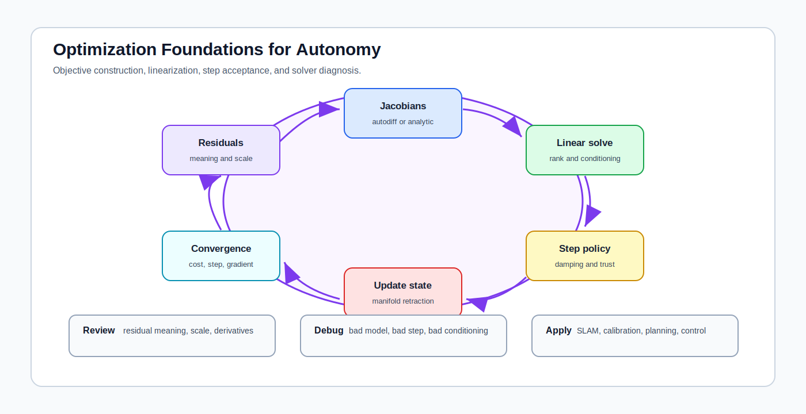

# Optimization Foundations for Autonomy

<!-- kb-visual:start -->

*Visual: section-level autonomy-role diagram showing optimization foundations, autonomy problem classes, stack interfaces, reading paths, and failure diagnosis.*
<!-- kb-visual:end -->

## Why This Foundation Exists

Optimization is the machinery that turns residuals, costs, constraints, and model assumptions into estimates, calibrations, trajectories, and learned parameters. In autonomy, it appears inside SLAM, calibration, planning, control, perception training, and offline validation.

This foundation exists because optimization failures often look like domain failures. A calibration, map, or plan can fail because the residual is wrong, the Jacobian is inconsistent, the scale is poor, the damping strategy is brittle, or the solver is operating outside its local model.

## What This Field Studies From First Principles

Optimization studies objective construction, residuals, Jacobians, linearization, manifold updates, step acceptance, damping, trust regions, line search, solver selection, and convergence diagnosis.

This section focuses on nonlinear least squares and solver patterns common in autonomy: Gauss-Newton, Levenberg-Marquardt, dogleg, Ceres, GTSAM, g2o, autodiff, analytic Jacobians, retractions, and globalization.

## Autonomy Problem Map

Optimization is a cross-cutting foundation. It supports state estimation, calibration, mapping, planning, control, perception model training, and offline parameter fitting. It consumes model structure and domain residuals, then produces updates, convergence reports, covariance approximations, and failure signals.

The autonomy risk is silent invalidity: a solver may return a number even when the objective is mis-scaled, the local linearization is invalid, or the update lives in the wrong coordinate convention.

## Core Mental Model

Optimization is a loop over a local approximation. Build residuals, linearize them, solve for a step, decide whether the step is trustworthy, update the state, and repeat until the objective, gradient, step, or trust-region logic says to stop.

The review model is: `residual meaning -> scale and whitening -> Jacobian -> linear solve -> step policy -> manifold update -> convergence test`. Most failures are easier to diagnose when each stage is named and logged separately.

## What This Foundation Lets You Review

- Do residuals represent the physical or probabilistic error the system claims to minimize?
- Are residual scales, robust losses, and weighting choices consistent across sensors, tasks, and units?
- Are Jacobians correct under the chosen perturbation convention and manifold update?
- Does damping, trust-region, or line-search logic prevent steps outside the valid local model?
- Can logs distinguish bad residuals, bad derivatives, poor conditioning, and solver configuration errors?

## Problem-Class Coverage

| Problem Class | Role Of This Foundation | Representative Applied Pages |
|---|---|---|
| Perception and scene understanding | supporting - training and geometric perception use objectives, but semantics are owned by perception and machine learning. | [Neural Motion Planning](../../30-autonomy-stack/planning/neural-motion-planning.md) - review learned cost objectives and debug loss terms that do not match closed-loop behavior. |
| Localization, SLAM, and state estimation | primary - graph optimization, calibration, bundle adjustment, and smoothing depend on residuals, Jacobians, and solver policy. | [Factor Graph iSAM2 and GTSAM](../../30-autonomy-stack/localization-mapping/slam-methods/factor-graph-isam2-gtsam.md) - debug factor residuals, relinearization, and incremental update behavior. |
| Mapping and spatial memory | supporting - differentiable mapping and map alignment use optimization, but persistent map semantics are owned by mapping. | [GraphSLAM and Pose Graph Optimization](../../30-autonomy-stack/localization-mapping/slam-methods/graphslam-pose-graph-optimization.md) - review pose-graph objectives before trusting optimized maps. |
| Prediction and world modeling | supporting - learned predictors use optimization during training, while runtime world modeling owns rollout semantics. | [Neural Motion Planning](../../30-autonomy-stack/planning/neural-motion-planning.md) - debug objective mismatch between training loss and planner review metrics. |
| Planning and decision making | supporting - trajectory search and neural planning use optimization but planning owns behavior semantics. | [Neural Motion Planning](../../30-autonomy-stack/planning/neural-motion-planning.md) - review whether optimizer output is a feasible plan or only a low-cost sample. |
| Control and actuation | supporting - MPC and iLQR depend on solver steps, but control owns closed-loop command semantics. | [Factor Graph iSAM2 and GTSAM](../../30-autonomy-stack/localization-mapping/slam-methods/factor-graph-isam2-gtsam.md) - debug shared Jacobian and damping assumptions before applying them to control solvers. |
| Safety, validation, and assurance | primary - convergence diagnostics, local-minimum evidence, residual audits, and sensitivity checks are needed for safety claims. | [GraphSLAM and Pose Graph Optimization](../../30-autonomy-stack/localization-mapping/slam-methods/graphslam-pose-graph-optimization.md) - review loop-closure acceptance and optimizer failure evidence. |
| Runtime systems and operations | supporting - runtime needs solver health and timing telemetry, not generic optimization ownership. | [Factor Graph iSAM2 and GTSAM](../../30-autonomy-stack/localization-mapping/slam-methods/factor-graph-isam2-gtsam.md) - debug production solver latency, relinearization spikes, and failure flags. |

## Reading Paths By Task

For nonlinear least-squares fundamentals, read [Nonlinear Least Squares](nonlinear-least-squares-first-principles.md), then [Gauss-Newton, Levenberg-Marquardt, and Dogleg](gauss-newton-levenberg-marquardt-dogleg.md).

For derivative debugging, read [Jacobians, Autodiff, Manifolds, and Linearization](jacobians-autodiff-manifold-linearization.md), then use the numerical linear algebra section when rank, conditioning, or factorization becomes the issue.

For solver deployment, read [Trust Region, Line Search, and Globalization](trust-region-line-search-globalization.md), then [Factor-Graph Solver Patterns](factor-graph-solver-patterns-ceres-gtsam-g2o.md).

For GLIM/GTSAM pipeline work, use the [GLIM and GTSAM Pipeline Hub](../../30-autonomy-stack/localization-mapping/slam-methods/glim-gtsam-pipeline-hub.md) after reading the nonlinear least-squares, Jacobian, and Gauss-Newton/LM/Dogleg pages. It connects optimizer concepts to concrete SLAM artifacts such as scan factors, iSAM2 updates, Hessian diagnostics, and marginalization priors.

For solver failure triage, start with [Nonlinear Solver Diagnostics Crosswalk](nonlinear-solver-diagnostics-crosswalk.md), then use [Objective and Residual Design Audit](objective-residual-design-and-audit.md) or [Solver Selection and Convergence Diagnosis](solver-selection-and-convergence-diagnosis.md).

## Dependency Map

Optimization depends on probability for residual meaning, likelihoods, robust losses, and whitening. It depends on geometry and state representation for perturbation conventions and manifolds. It depends on numerical linear algebra for sparse solves, conditioning, rank, and factorization.

It hands solver behavior back to SLAM, calibration, mapping, planning, control, and learning systems. A clean dependency map separates the domain model from the numerical method so failures can be assigned correctly.

## Interfaces, Artifacts, and Failure Modes

Core artifacts include residual definitions, Jacobian checks, cost histories, step norms, damping values, trust-region ratios, robust-loss settings, relinearization logs, convergence criteria, and solver summaries.

Diagnostic case: A calibration solve diverges because residual scales are inconsistent and the optimizer accepts steps outside the local linearization regime.

A calibration, map, or plan can fail for residual, Jacobian, scaling, damping, rank, covariance, or backend reasons; use the [Nonlinear Solver Diagnostics Crosswalk](nonlinear-solver-diagnostics-crosswalk.md) to route that failure before assigning it to the domain.

Common failure modes include unit mismatch, unwhitened residuals, wrong perturbation side, stale Jacobians, rank deficiency, local minima, over-aggressive step acceptance, poor damping, and solver summaries that hide domain-specific invalidity.

## Boundaries With Neighboring Foundations

- Owns: objective construction, residual linearization, updates, damping, trust regions, globalization, autodiff and Jacobians, and solver selection.
- Hands off to: probability for residual meaning and numerical linear algebra for matrix factorization and conditioning.
- Does not own: estimator architecture or low-level linear solves.

## Pages In This Section

- [Factor-Graph Solver Patterns](factor-graph-solver-patterns-ceres-gtsam-g2o.md)
- [Gauss-Newton, Levenberg-Marquardt, and Dogleg](gauss-newton-levenberg-marquardt-dogleg.md)
- [Jacobians, Autodiff, Manifolds, and Linearization](jacobians-autodiff-manifold-linearization.md)
- [Nonlinear Solver Diagnostics Crosswalk](nonlinear-solver-diagnostics-crosswalk.md)
- [Nonlinear Least Squares](nonlinear-least-squares-first-principles.md)
- [Objective and Residual Design Audit](objective-residual-design-and-audit.md)
- [Solver Selection and Convergence Diagnosis](solver-selection-and-convergence-diagnosis.md)
- [Trust Region, Line Search, and Globalization](trust-region-line-search-globalization.md)

## Core Sources

This overview synthesizes the section pages listed above; no additional external sources were used.
