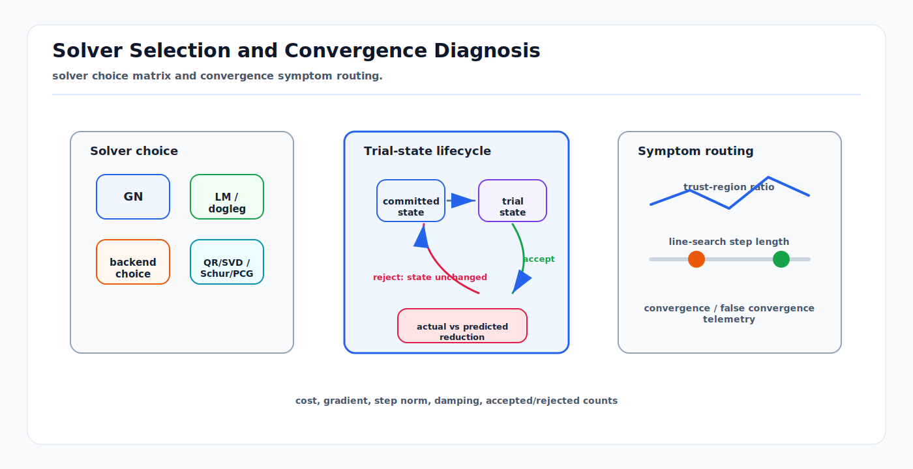

# Solver Selection and Convergence Diagnosis

<!-- kb-visual:start -->

*Visual: solver choice matrix and convergence symptom routing.*
<!-- kb-visual:end -->

## Related docs

- [Nonlinear Solver Diagnostics Crosswalk](nonlinear-solver-diagnostics-crosswalk.md)
- [Objective and Residual Design Audit](objective-residual-design-and-audit.md)
- [Sparse Estimation Backend Crosswalk](../numerical-linear-algebra/sparse-estimation-backend-crosswalk.md)
- [Gauss-Newton, Levenberg-Marquardt, and Dogleg](gauss-newton-levenberg-marquardt-dogleg.md)
- [Trust Region and Line Search Globalization](trust-region-line-search-globalization.md)
- [Factor Graph Solver Patterns: Ceres, GTSAM, and g2o](factor-graph-solver-patterns-ceres-gtsam-g2o.md)

## Trial-state lifecycle

Solver Selection and Convergence Diagnosis starts by separating the committed state from the trial state. A nonlinear iteration forms a tangent step, retracts it to a trial state, evaluates actual cost at that trial state, compares actual against predicted reduction, and only then accepts or rejects the update. Rejected steps leave the committed state unchanged while damping, trust-region radius, or line-search length changes.

This lifecycle explains why a log can show many linear solves without state progress. The solver is not necessarily unstable; it may be protecting the committed state because the local model is not predicting the true objective.

## Solver selection matrix

| Problem condition | Expected symptoms | Nonlinear method | Linear backend | Avoid when | Confirming telemetry |
|---|---|---|---|---|---|
| Good initialization, smooth residuals, well-scaled problem. | Fast cost decrease, few rejected steps. | Gauss-Newton. | Sparse Cholesky or QR. | Far from basin or rank uncertain. | Gain ratio near 1, small final gradient. |
| Moderate nonlinearity or uncertain scale. | Occasional rejected steps, need step control. | Levenberg-Marquardt damping. | Cholesky, QR, Schur, or PCG depending on structure. | Damping hides missing gauge or bad residuals. | Damping decreases after accepted steps. |
| Trust-region behavior needed with GN and steepest-descent blend. | GN step too large but gradient direction useful. | Dogleg. | SPD direct backend. | Indefinite or rank-deficient system. | Trust-region radius expands after good ratio. |
| Discontinuous residual families or association changes. | Predicted reduction unreliable. | Trust region with conservative acceptance. | QR/SVD debug backend, then production sparse backend. | Objective jumps are front-end data changes. | Actual against predicted reduction explains accepts/rejects. |
| Large-scale bundle adjustment or landmark-heavy SLAM. | Direct full solve memory too high. | LM or trust region. | Schur complement direct or iterative Schur. | Eliminated blocks are singular or dense reduced system explodes. | Fill report, Schur block stats, accepted nonlinear progress. |
| Massive sparse SPD system with acceptable approximate linear solves. | Direct factorization too slow or memory-heavy. | LM/trust region with inexact linear solve. | PCG with preconditioner. | Operator is not SPD or residual norms stagnate. | PCG residual norms drop and nonlinear cost improves. |
| Rank uncertain, covariance suspicious, or gauge policy under review. | Cholesky fails, covariance nonsensical, weak modes. | Debug with damped GN/LM. | QR or SVD on a representative reduced case. | Full production graph is too large for dense rank tools. | Singular values and nullspace match expected gauge. |
| Production library integration decision. | Same method behaves differently across APIs. | Method selected separately from solver library choice. | Backend exposed by Ceres, GTSAM, g2o, or custom stack. | Library hides telemetry needed for safety review. | Summaries expose cost, step, damping, rank, and backend stats. |

## Convergence diagnostics

Convergence criteria should be read as stopping rules, not proof of correctness:

- Cost change small: the objective no longer changes much, but the objective may still be wrong.
- Gradient norm small: the local first-order condition is nearly satisfied, but the point can be a bad local minimum.
- Step norm small: updates are tiny, but this can be false convergence if damping is huge or scaling is poor.
- Iteration limit reached: the solver stopped because of budget, not because the result is valid.
- Trust-region or line-search acceptance stable: step control is healthy, but residual design and covariance still need audit.

False convergence is especially common when damping grows large and the step norm becomes tiny. The log can look calm while the solver is stuck outside a valid local model or fighting poor scale.

## Failure modes

| Failure mode | Typical log | First interpretation | First action |
|---|---|---|---|
| Repeated rejected steps | Low or negative gain ratio, shrinking radius, shorter line-search length. | Predicted reduction is not matching actual cost. | Check Jacobians and local model by sweeping cost along the step. |
| Damping runaway | Large damping, tiny step, little cost change. | LM is suppressing unstable steps or hiding scale problems. | Inspect whitening and gradient norm before changing library. |
| False convergence | Step or cost tolerance reached with bad artifact. | Stopping rule was satisfied for the written objective. | Audit residual design and per-family cost share. |
| Backend failure | Cholesky/LDLT fails or PCG stagnates. | Rank, SPD assumption, or conditioning issue. | Switch to QR/SVD debug case and inspect nullspace. |
| Solver library choice masks method issue | Different APIs show different defaults or parameterizations. | Library defaults changed damping, loss ordering, local coordinates, or backend. | Normalize configuration and compare telemetry side by side. |

## Concept cards

### Gauss-Newton

| Field | Explanation |
|---|---|
| What it means here | A nonlinear least-squares method that solves a local linear least-squares approximation. |
| Math object | `J^T J delta = -J^T r`. |
| Effect on the solve | Takes fast steps when residuals are smooth and initialization is close. |
| What it solves | Efficient local optimization for well-behaved least-squares problems. |
| What it does not solve | It does not globalize steps or handle poor initialization robustly. |
| Minimal example | Bundle adjustment near a good visual-inertial initialization. |
| Failure symptoms | Cost increases, rejected steps under trust region, unstable large updates. |
| Diagnostic artifact | Predicted versus actual reduction and step norm. |
| Normal vs abnormal artifact | Normal actual reduction tracks prediction; abnormal prediction is optimistic. |
| First debugging move | Plot cost along the GN step. |
| Do not confuse with | Cholesky or any particular linear backend. |
| Read next | [Gauss-Newton, Levenberg-Marquardt, and Dogleg](gauss-newton-levenberg-marquardt-dogleg.md). |

### Levenberg-Marquardt damping

| Field | Explanation |
|---|---|
| What it means here | A step-control mechanism that adds damping to make the local solve more conservative. |
| Math object | Damped system such as `(J^T J + lambda D) delta = -J^T r`. |
| Effect on the solve | Moves between GN-like and gradient-descent-like behavior. |
| What it solves | Helps when GN steps are too aggressive. |
| What it does not solve | It does not create a measurement prior or fix gauge freedom. |
| Minimal example | Increasing damping after a rejected calibration step. |
| Failure symptoms | Damping grows without accepted progress, tiny step norm, false convergence. |
| Diagnostic artifact | Damping value, gain ratio, accepted/rejected count. |
| Normal vs abnormal artifact | Normal damping falls after good steps; abnormal damping stays huge. |
| First debugging move | Compare damping trend with whitened residual scale and gradient norm. |
| Do not confuse with | Prior or gauge anchor. |
| Read next | [Nonlinear Solver Diagnostics Crosswalk](nonlinear-solver-diagnostics-crosswalk.md#damping-versus-prior-versus-gauge-fix). |

### Dogleg

| Field | Explanation |
|---|---|
| What it means here | A trust-region method that blends steepest-descent and Gauss-Newton steps. |
| Math object | Piecewise path inside a trust-region radius. |
| Effect on the solve | Provides a bounded step when GN is too long but gradient direction is useful. |
| What it solves | Step control for SPD least-squares subproblems. |
| What it does not solve | It does not handle indefinite or rank-broken backends automatically. |
| Minimal example | Pose calibration step clipped inside the trust region. |
| Failure symptoms | Radius shrinks repeatedly, dogleg path always near steepest descent. |
| Diagnostic artifact | Trust-region radius and selected dogleg segment. |
| Normal vs abnormal artifact | Normal segment changes as convergence improves; abnormal stays clipped with low gain ratio. |
| First debugging move | Compare dogleg step with GN and gradient steps. |
| Do not confuse with | Generic line search. |
| Read next | [Gauss-Newton, Levenberg-Marquardt, and Dogleg](gauss-newton-levenberg-marquardt-dogleg.md). |

### Trust-region ratio

| Field | Explanation |
|---|---|
| What it means here | Ratio between actual cost decrease and predicted local-model decrease. |
| Math object | `rho = actual_reduction / predicted_reduction`. |
| Effect on the solve | Accepts or rejects trial steps and updates radius or damping. |
| What it solves | Tests local-model reliability. |
| What it does not solve | It does not identify the bad residual family by itself. |
| Minimal example | Rejecting a SLAM update when loop-closure association changes after retraction. |
| Failure symptoms | Negative ratio, repeated low ratios, radius collapse. |
| Diagnostic artifact | Actual and predicted reduction log. |
| Normal vs abnormal artifact | Normal ratio is positive and often near 1 near convergence; abnormal ratio is erratic or negative. |
| First debugging move | Re-evaluate cost at the trial state and compare to logged prediction. |
| Do not confuse with | Final convergence tolerance. |
| Read next | [Trust Region and Line Search Globalization](trust-region-line-search-globalization.md). |

### Line-search step length

| Field | Explanation |
|---|---|
| What it means here | Scalar shortening of a candidate direction to satisfy decrease conditions. |
| Math object | `x_new = x boxplus alpha delta`. |
| Effect on the solve | Keeps the direction but reduces update magnitude. |
| What it solves | Prevents full steps that increase objective. |
| What it does not solve | It does not fix a bad direction from wrong Jacobians. |
| Minimal example | Backtracking a planning cost update near a nonsmooth obstacle penalty. |
| Failure symptoms | `alpha` becomes tiny, many evaluations per iteration, little progress. |
| Diagnostic artifact | Step length, Armijo/Wolfe status, cost along direction. |
| Normal vs abnormal artifact | Normal step length recovers to larger values; abnormal remains tiny. |
| First debugging move | Plot objective along the search direction. |
| Do not confuse with | Trust-region radius. |
| Read next | [Trust Region and Line Search Globalization](trust-region-line-search-globalization.md). |

### Step acceptance

| Field | Explanation |
|---|---|
| What it means here | Commit decision for a trial state after evaluating actual cost. |
| Math object | Acceptance predicate using gain ratio or sufficient decrease. |
| Effect on the solve | Determines whether the state changes this iteration. |
| What it solves | Protects the committed estimate from bad trial steps. |
| What it does not solve | It does not certify output quality. |
| Minimal example | Rejected LM step leaves pose graph state unchanged while damping increases. |
| Failure symptoms | Many rejected steps, stable committed state, changing damping or radius. |
| Diagnostic artifact | Accepted/rejected step log and committed/trial cost. |
| Normal vs abnormal artifact | Normal rejection is occasional; abnormal rejection dominates the solve. |
| First debugging move | Verify whether logged residuals are from committed or trial states. |
| Do not confuse with | Trial-state evaluation. |
| Read next | [Nonlinear Solver Diagnostics Crosswalk](nonlinear-solver-diagnostics-crosswalk.md). |

### Convergence criterion

| Field | Explanation |
|---|---|
| What it means here | A stopping rule based on cost, gradient, step, time, or iteration count. |
| Math object | Threshold on scalar telemetry. |
| Effect on the solve | Ends optimization when progress appears small or budget is exhausted. |
| What it solves | Prevents endless iterations and defines production budgets. |
| What it does not solve | It does not prove the objective was right or the solution is safe. |
| Minimal example | Stop when relative cost decrease is below tolerance. |
| Failure symptoms | false convergence, budget stop, bad artifact with small step. |
| Diagnostic artifact | Final termination reason and all stopping metrics. |
| Normal vs abnormal artifact | Normal termination agrees across cost, gradient, and artifact checks; abnormal termination only satisfies one weak criterion. |
| First debugging move | Read the exact termination reason, not only final cost. |
| Do not confuse with | Step acceptance. |
| Read next | [Nonlinear Least Squares from First Principles](nonlinear-least-squares-first-principles.md). |

### Solver library choice

| Field | Explanation |
|---|---|
| What it means here | Choosing an implementation ecosystem such as Ceres, GTSAM, g2o, or a custom solver. |
| Math object | API contracts for residuals, local parameterizations, backend options, and telemetry. |
| Effect on the solve | Determines defaults, supported backends, update conventions, and diagnostic visibility. |
| What it solves | Provides production implementation and tested solver components. |
| What it does not solve | It does not replace method selection or objective design. |
| Minimal example | Ceres LM with local parameterization versus GTSAM factor graph optimization for the same pose graph. |
| Failure symptoms | Different results across libraries, missing telemetry, hidden loss or damping defaults. |
| Diagnostic artifact | Side-by-side config and solver summary. |
| Normal vs abnormal artifact | Normal comparison uses equivalent residuals and conventions; abnormal comparison changes multiple layers at once. |
| First debugging move | Freeze residuals and Jacobians, then compare one iteration across libraries if possible. |
| Do not confuse with | Nonlinear method choice. |
| Read next | [Factor Graph Solver Patterns: Ceres, GTSAM, and g2o](factor-graph-solver-patterns-ceres-gtsam-g2o.md). |

## Sources

- Ceres Solver, "Solving Non-linear Least Squares": https://ceres-solver.readthedocs.io/latest/nnls_solving.html
- GTSAM, "Factor Graphs and GTSAM: A Hands-on Introduction": https://gtsam.org/tutorials/intro.html
- Nocedal and Wright, "Numerical Optimization": https://convexoptimization.com/TOOLS/nocedal.pdf
- Madsen, Nielsen, and Tingleff, "Methods for Non-Linear Least Squares Problems": http://www2.imm.dtu.dk/pubdb/pubs/3215-full.html
