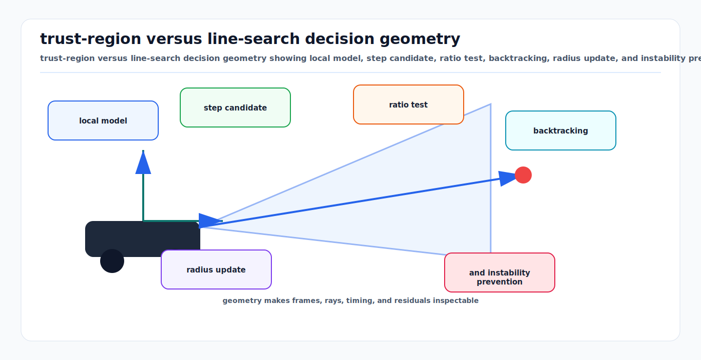

# Trust Region and Line Search Globalization

<!-- kb-visual:start -->


*Visual: trust-region versus line-search decision geometry showing local model, step candidate, ratio test, backtracking, radius update, and instability prevention.*
<!-- kb-visual:end -->

## Related docs

- [Nonlinear Least Squares from First Principles](./nonlinear-least-squares-first-principles.md)
- [Gauss-Newton, Levenberg-Marquardt, and Dogleg](./gauss-newton-levenberg-marquardt-dogleg.md)
- [Jacobians, Autodiff, and Manifold Linearization](./jacobians-autodiff-manifold-linearization.md)
- [Factor Graph Solver Patterns: Ceres, GTSAM, and g2o](./factor-graph-solver-patterns-ceres-gtsam-g2o.md)
- [Nonlinear Solver Diagnostics Crosswalk](./nonlinear-solver-diagnostics-crosswalk.md)
- [Solver Selection and Convergence Diagnosis](./solver-selection-and-convergence-diagnosis.md)
- [Factor Graph SLAM with iSAM2 and GTSAM](../../30-autonomy-stack/localization-mapping/slam-methods/factor-graph-isam2-gtsam.md)

## Why it matters for AV, perception, SLAM, and mapping

Linearization is local. AV perception and mapping systems often start from estimates that are good but not perfect: wheel odometry may drift, ICP may lock onto a nearby wall, GNSS may jump, visual matches may contain outliers, and loop closures may introduce large corrections. A raw Newton or Gauss-Newton step can increase the true nonlinear cost even if it minimizes the local quadratic model.

Globalization methods control the update so iterative optimization is more likely to converge from imperfect starts. Trust-region methods ask "how far can I trust this local model?" Line-search methods ask "given this direction, how far should I move?" Ceres explicitly presents these as the two major ways to control nonlinear least-squares step size.

## Core math and algorithm steps

At iterate `x_k`, build a local model:

```text
m_k(p) = f(x_k) + g_k^T p + 0.5 * p^T B_k p
```

For nonlinear least squares:

```text
f(x) = 0.5 * ||F(x)||^2
g_k = J_k^T F_k
B_k ~= J_k^T J_k
```

Without globalization, the update is:

```text
x_{k+1} = x_k boxplus p_k
```

where `p_k` solves the local model. Globalization modifies either the step length or the step computation.

## Trust-region methods

Trust-region methods solve:

```text
min_p m_k(p)
subject to ||p|| <= Delta_k
```

where `Delta_k` is the trust-region radius. The radius encodes how far the algorithm believes the local quadratic model is reliable.

After computing a trial step `p`, compare:

```text
actual reduction    = f(x_k) - f(x_k boxplus p)
predicted reduction = m_k(0) - m_k(p)
rho_k               = actual reduction / predicted reduction
```

Typical policy:

- If `rho_k` is high, accept the step and expand the region.
- If `rho_k` is acceptable, accept the step and keep or mildly adjust the region.
- If `rho_k` is poor, reject the step and shrink the region.

Common trust-region NLS methods:

- Levenberg-Marquardt: solves a damped system such as `(J^T J + lambda D) p = -J^T F`.
- Dogleg: combines the steepest-descent and Gauss-Newton steps within the trust region.

Ceres uses trust region as its default minimizer type and supports Levenberg-Marquardt and dogleg strategies. GTSAM provides Gauss-Newton, Levenberg-Marquardt, and Powell dogleg batch optimizers.

### Trust-region algorithm sketch

```text
given x_0 and Delta_0
repeat:
  evaluate F, J, f, g, H
  approximately solve min m_k(p) subject to ||p|| <= Delta_k
  evaluate f_trial = f(x_k boxplus p)
  rho = (f_k - f_trial) / (m_k(0) - m_k(p))
  if rho is acceptable:
    x_{k+1} = x_k boxplus p
  else:
    x_{k+1} = x_k
  update Delta_k using rho and boundary status
```

## Line-search methods

Line-search methods choose a descent direction `p_k`, then solve for a step length `alpha_k`:

```text
x_{k+1} = x_k boxplus (alpha_k * p_k)
```

The direction can be steepest descent, Newton, Gauss-Newton, nonlinear conjugate gradient, BFGS, or LBFGS. The step length is usually not solved exactly; it is chosen to satisfy sufficient decrease and sometimes curvature conditions.

Ceres documents Armijo and Wolfe line searches. It also notes that its line-search minimizer cannot handle bounds constraints, while trust-region methods can be augmented for bounded problems.

### Armijo sufficient decrease

A candidate step should reduce the objective enough relative to the directional derivative:

```text
f(x + alpha p) <= f(x) + c1 * alpha * g^T p
```

where `0 < c1 < 1`.

### Wolfe curvature condition

Strong Wolfe line search adds a gradient condition along the search direction:

```text
|d/d alpha f(x + alpha p)| <= c2 * |g^T p|
```

Ceres notes that Wolfe line search is required for the assumptions behind BFGS and LBFGS direction updates.

### Line-search algorithm sketch

```text
given x_0
repeat:
  evaluate f and gradient g
  choose descent direction p
  find alpha satisfying line-search conditions
  x_{k+1} = x_k boxplus alpha p
```

## Trust region versus line search

Nocedal and Wright frame the difference as order of decisions:

- Line search first chooses a direction, then chooses a distance along that direction.
- Trust region first chooses a maximum distance, then chooses the best step within that distance.

In AV estimation:

- Trust region is usually the default for sparse nonlinear least squares because LM and dogleg fit the residual/Jacobian structure directly.
- Line search is useful for very large problems where storing or factoring the full Jacobian is too expensive, or when a low-accuracy solution is sufficient.
- LBFGS line search can be attractive for dense learned calibration or map-alignment objectives where Hessian factorization is not practical.
- Trust region is usually easier to reason about when steps can become invalid because of local geometry, rank deficiency, or poor initialization.

## Implementation notes

- Compute predicted reduction from the same local model used to generate the step. A mismatch makes the gain ratio meaningless.
- Define the trust-region norm in tangent space for manifold variables, not in quaternion ambient coordinates.
- Use robust losses after whitening. Robustification changes the effective residual weights and therefore changes the local model.
- Do not blindly accept nonmonotonic cost changes unless the solver is configured for nonmonotonic steps and downstream consumers can tolerate them.
- For online SLAM, cap per-update work. A theoretically robust globalization strategy can still violate real-time budgets if it performs too many rejected trial evaluations.
- For loop closure, use stricter gating before insertion. Globalization should not be the only defense against a bad loop closure.
- For map updates, separate optimizer convergence from map publication. Publishing every rejected or intermediate trial state can cause downstream map flicker.

## Failure modes and diagnostics

- **Many rejected trust-region steps:** The model is not predictive. Check Jacobians, initialization, robust loss threshold, and inconsistent factors.
- **Trust region shrinks to tiny radius:** The solver is cautious because trial steps fail. Inspect outlier factors and residual discontinuities.
- **Line search cannot find sufficient decrease:** Direction may not be descent, gradient may be wrong, or objective may be nonsmooth.
- **LBFGS breakdown:** Curvature conditions may fail; use Wolfe search and inspect gradient consistency.
- **Cost decreases but trajectory worsens:** The objective is misweighted. Check covariance scales and factor units.
- **Converges to wrong basin:** Globalization improves local convergence, not global data association. Revisit front-end association, loop verification, and initialization.
- **Step valid in vector space but invalid on manifold:** Retraction, angle normalization, or quaternion layout is wrong.

## Concept Cards

The solver builds a trial state from the committed state, evaluates actual against predicted reduction, accepts or rejects the trial, and rejected steps leave the committed state unchanged. This trial-state lifecycle is the key distinction between a proposed local update and the state published or carried into the next accepted iteration.

### Trust-region ratio

- What it means here: The ratio comparing true objective decrease at a trial state with decrease predicted by the local model.
- Math object: `rho = (f(x) - f(x boxplus p)) / (m(0) - m(p))`.
- Effect on the solve: Accepts or rejects trial states and drives trust-region radius or LM damping updates.
- What it solves: Measures whether the local quadratic model is reliable for the proposed step.
- What it does not solve: It does not identify which residual, Jacobian, or association caused a bad model.
- Minimal example: Reject a loop-closure update when actual cost increases even though the model predicted decrease.
- Failure symptoms: Negative ratios, erratic ratios, repeated rejections, shrinking radius, or growing damping.
- Diagnostic artifact: Per-iteration actual reduction, predicted reduction, gain ratio, radius or damping, and accept/reject flag.
- Normal vs abnormal artifact: Normal ratios are positive and often approach 1 near convergence; abnormal ratios are negative, undefined, or inconsistent for small steps.
- First debugging move: Recompute cost at the committed and trial states using the same residual scaling used by the solver.
- Do not confuse with: Final convergence tolerance or residual chi-square.
- Read next: [Solver Selection and Convergence Diagnosis](./solver-selection-and-convergence-diagnosis.md).

### Line-search step length

- What it means here: The scalar multiplier applied to a chosen descent direction before constructing a trial state.
- Math object: `x_trial = x boxplus (alpha p)`.
- Effect on the solve: Keeps a direction but shortens the move until sufficient decrease or curvature conditions are met.
- What it solves: Prevents a full candidate step from increasing the objective.
- What it does not solve: It does not fix a non-descent direction, wrong gradient, nonsmooth residual, or bad objective design.
- Minimal example: Backtrack `alpha` after a planning-cost update crosses a sharp obstacle penalty.
- Failure symptoms: `alpha` becomes tiny, many objective evaluations occur per iteration, or progress stalls despite a nonzero gradient.
- Diagnostic artifact: Step length trace, Armijo/Wolfe status, directional derivative, and cost samples along the direction.
- Normal vs abnormal artifact: Normal step lengths recover toward larger values as the model improves; abnormal lengths remain tiny or fail sufficient decrease.
- First debugging move: Plot objective values along the search direction from the committed state.
- Do not confuse with: Trust-region radius or LM damping.
- Read next: [Solver Selection and Convergence Diagnosis](./solver-selection-and-convergence-diagnosis.md).

### Step acceptance

- What it means here: The decision that turns a trial state into the next committed state or discards it.
- Math object: Acceptance predicate from gain ratio, Armijo condition, Wolfe conditions, or solver-specific sufficient-decrease rule.
- Effect on the solve: Determines whether the optimization state changes after an evaluated trial.
- What it solves: Protects the committed estimate when the local model fails to predict the nonlinear objective.
- What it does not solve: It does not certify output quality, fix residual scale, or guarantee global optimality.
- Minimal example: LM rejects `x boxplus Delta`, leaves `x` unchanged, increases damping, and tries a more conservative step.
- Failure symptoms: Solver performs many linear solves with little state progress, published states flicker if trial states leak downstream, or accepted and rejected costs are mixed in logs.
- Diagnostic artifact: Committed-state and trial-state cost log with accept/reject status.
- Normal vs abnormal artifact: Normal logs distinguish trial and committed states with occasional rejection; abnormal logs overwrite committed state on rejection or report trial artifacts as accepted output.
- First debugging move: Verify every diagnostic plot labels whether it came from the committed state or a rejected trial state.
- Do not confuse with: Convergence criterion or linear solver success.
- Read next: [Nonlinear Solver Diagnostics Crosswalk](./nonlinear-solver-diagnostics-crosswalk.md).

### Local model validity

- What it means here: The region where the linearized or quadratic approximation predicts the true nonlinear objective well enough to guide steps.
- Math object: Agreement between `m(p)` and `f(x boxplus p)` for tangent perturbations `p`.
- Effect on the solve: Controls whether trust-region, LM, dogleg, or line-search decisions make useful progress.
- What it solves: Explains why a step that is optimal for the local model can be rejected by the nonlinear objective.
- What it does not solve: It does not repair discontinuous association, wrong residual definitions, or initialization outside the basin.
- Minimal example: A point-to-plane ICP linearization is valid for small pose changes but fails after correspondences change.
- Failure symptoms: Good predicted reduction with bad actual reduction, repeated rejected steps, or line search that can only accept tiny moves.
- Diagnostic artifact: Cost and residual sweep around the committed state along candidate directions.
- Normal vs abnormal artifact: Normal sweeps show prediction accuracy for small steps and graceful degradation; abnormal sweeps jump, flip sign, or disagree immediately.
- First debugging move: Freeze associations and robust weights, then compare actual residual change with `J p` for small scaled steps.
- Do not confuse with: Solver method choice or library choice.
- Read next: [Nonlinear Solver Diagnostics Crosswalk](./nonlinear-solver-diagnostics-crosswalk.md).

## Sources

- Ceres Solver, "Solving Non-linear Least Squares": https://ceres-solver.readthedocs.io/latest/nnls_solving.html
- Ceres Solver, solver feature overview: https://ceres-solver.readthedocs.io/latest/features.html
- GTSAM docs, nonlinear optimizer module: https://borglab.github.io/gtsam/nonlinear
- GTSAM Doxygen, `NonlinearOptimizer`: https://gtsam.org/doxygen/a05103.html
- Nocedal and Wright, "Numerical Optimization": https://convexoptimization.com/TOOLS/nocedal.pdf
- Kuemmerle et al., "g2o: A General Framework for Graph Optimization": https://ais.informatik.uni-freiburg.de/publications/papers/kuemmerle11icra.pdf
