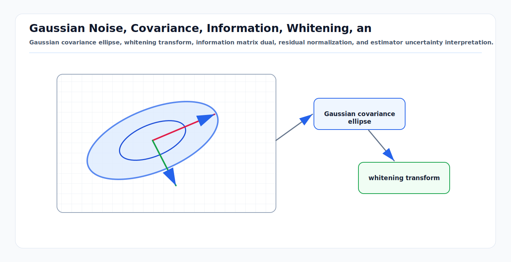

# Gaussian Noise, Covariance, Information, Whitening, and Uncertainty Ellipses

<!-- kb-visual:start -->


*Visual: Gaussian covariance ellipse, whitening transform, information matrix dual, residual normalization, and estimator uncertainty interpretation.*
<!-- kb-visual:end -->

Gaussian noise is the default local error model in AV perception, SLAM,
tracking, calibration, and mapping because it turns uncertainty into linear
algebra. The model is not "the world is Gaussian." The model is: near a current
linearization point, residual errors can often be summarized by a mean, a
covariance, and a quadratic penalty that is fast to optimize and easy to audit.

## Related docs

- [Bayesian Filtering and Error-State Kalman Filters](../state-estimation/bayesian-filtering-and-eskf.md)
- [GTSAM Factor Graph Optimization](../state-estimation/gtsam-factor-graphs.md)
- [IMU Error Models and Preintegration](../state-estimation/imu-error-models-preintegration.md)
- [Sensor Calibration and Time Synchronization](../geometry-3d/sensor-calibration-time-synchronization.md)
- [Mahalanobis and Chi-Square Gating](mahalanobis-chi-square-gating.md)
- [Likelihood, MAP, MLE, and Least Squares](likelihood-map-mle-least-squares.md)

## Why it matters for AV, perception, SLAM, and mapping

Every autonomy stack has to answer "how much should I trust this evidence?"
Covariance is the engineering contract behind that answer.

- In localization, pose covariance determines whether the planner can trust lane
  position, stop-line distance, and map-frame alignment.
- In tracking, measurement covariance controls association gates and the Kalman
  gain; bad covariance can create track swaps or delayed response.
- In calibration, covariance shows which degrees of freedom are observable and
  which are weakly constrained by the data.
- In SLAM and mapping, covariance or information weights decide which factors
  dominate the graph and which loop closures are treated as weak evidence.
- In safety monitors, uncertainty ellipses make abstract covariance visible:
  they show where the estimator says the object or ego pose could plausibly be.

GTSAM's tutorial frames factors as probabilistic constraints derived from
measurements or prior knowledge, and its examples attach diagonal Gaussian noise
models to priors, odometry, and GPS-like factors. The same idea appears across
Kalman filters, bundle adjustment, ICP, graph SLAM, and multi-object tracking:
each residual is paired with a scale and correlation model.

## First-principles math

### Scalar Gaussian noise

For a scalar measurement model

```text
z = h(x) + v,    v ~ N(0, sigma^2)
```

the likelihood of observing `z` given state `x` is

```text
p(z | x) = (1 / sqrt(2 pi sigma^2))
           exp(-0.5 * (z - h(x))^2 / sigma^2)
```

The residual is

```text
r(x) = z - h(x)
```

The negative log-likelihood, after dropping constants independent of `x`, is

```text
0.5 * r(x)^2 / sigma^2
```

This is why Gaussian noise leads to weighted least squares. Small `sigma`
creates a steep cost and a high-trust measurement. Large `sigma` creates a flat
cost and a low-trust measurement.

### Multivariate Gaussian noise

For vector residual `r in R^m`,

```text
v ~ N(0, Sigma)
```

with covariance matrix `Sigma`, the density is

```text
p(v) = 1 / sqrt((2 pi)^m det(Sigma))
       * exp(-0.5 * v^T Sigma^-1 v)
```

The key scalar is the squared Mahalanobis distance:

```text
d2 = r^T Sigma^-1 r
```

The inverse covariance

```text
Lambda = Sigma^-1
```

is the information matrix. Covariance says "how much uncertainty." Information
says "how much constraint." They are two parameterizations of the same local
Gaussian belief when `Sigma` is positive definite.

### Covariance anatomy

A covariance matrix must be symmetric positive semidefinite:

```text
Sigma = E[(x - mu)(x - mu)^T]
```

Diagonal entries are variances:

```text
Sigma_ii = Var(x_i)
```

Off-diagonal entries are covariances:

```text
Sigma_ij = E[(x_i - mu_i)(x_j - mu_j)]
```

The normalized correlation is

```text
rho_ij = Sigma_ij / (sqrt(Sigma_ii) sqrt(Sigma_jj))
```

In AV terms, an `x-y-yaw` pose covariance with `cov(y, yaw) > 0` says lateral
position and heading error tend to move together. This is common after driving
forward: a small yaw error grows into lateral error.

### Whitening

Whitening converts correlated residuals into unit-covariance residuals.

Let `R` be a square-root information matrix such that

```text
R^T R = Sigma^-1
```

Then the whitened residual is

```text
e = R r
```

and

```text
e^T e = r^T R^T R r = r^T Sigma^-1 r
```

For diagonal covariance,

```text
Sigma = diag(sigma_1^2, ..., sigma_m^2)
R = diag(1 / sigma_1, ..., 1 / sigma_m)
e_i = r_i / sigma_i
```

This is the native unit for robust losses and statistical gates: a residual of
`3` after whitening is a three-sigma event along the whitened axis. GTSAM's
noise model API exposes `whiten`, `Whiten`, square-root information, covariance,
and information constructors; its robust noise model documentation describes
robust losses as operating after Gaussian whitening.

### Information form

The Gaussian can also be written in canonical information form:

```text
p(x) proportional to exp(-0.5 x^T Lambda x + eta^T x)
```

where

```text
Lambda = Sigma^-1
eta = Lambda mu
```

Information form is useful in factor graphs because independent Gaussian
constraints add:

```text
Lambda_total = sum_i Lambda_i
eta_total = sum_i eta_i
```

In linear least squares with residuals

```text
r_i(x) = A_i x - b_i
```

and covariance `Sigma_i`, the total objective is

```text
0.5 * sum_i (A_i x - b_i)^T Sigma_i^-1 (A_i x - b_i)
```

The normal equations are

```text
H x = g
H = sum_i A_i^T Sigma_i^-1 A_i
g = sum_i A_i^T Sigma_i^-1 b_i
```

`H` is the accumulated information or Gauss-Newton Hessian approximation.

### Uncertainty ellipses

For a 2D Gaussian with mean `mu` and covariance `Sigma`, the constant-density
contour is

```text
(x - mu)^T Sigma^-1 (x - mu) = c
```

Eigen-decompose

```text
Sigma = Q diag(lambda_1, lambda_2) Q^T
```

The ellipse axes point along the eigenvectors in `Q`. The semi-axis lengths are

```text
a_i = sqrt(c * lambda_i)
```

For a probability mass `p`, choose

```text
c = chi2_ppf(p, df = 2)
```

Common 2D values:

| Probability mass | `c` | Semi-axis multiplier |
|---|---:|---:|
| 68.27 percent | 2.30 | 1.52 |
| 95.00 percent | 5.99 | 2.45 |
| 99.00 percent | 9.21 | 3.03 |

The familiar "one sigma ellipse" in 2D, using `c = 1`, contains only about 39.3
percent probability mass, not 68.3 percent. This distinction matters when plots
are used for safety arguments or gate tuning.

## Implementation notes

- Store covariances in consistent units. A pose residual that mixes meters and
  radians must use corresponding meter and radian noise scales.
- Prefer square-root forms for numerical work. Cholesky factors and QR
  factorizations avoid explicitly inverting covariance matrices.
- Check positive definiteness before using a covariance in a likelihood. A small
  diagonal jitter can be a valid regularizer; silently accepting a negative
  eigenvalue is not.
- Use local tangent coordinates for manifold states. SE(2), SE(3), SO(3), and
  quaternions should be perturbed in a local vector space, then retracted.
- Treat sensor-reported covariance as a measurement, not a fact. GNSS covariance,
  detector box covariance, and scan-matching covariance often need validation
  against innovation statistics.
- Separate aleatoric and epistemic uncertainty where possible. Random sensor
  noise belongs in covariance; model ignorance, unmodeled bias, and data
  association ambiguity often require mode switches, mixtures, or robust logic.
- Whiten before comparing residual magnitudes across channels. Pixel residuals,
  range residuals, heading residuals, and semantic landmark residuals are not
  directly comparable in raw units.
- For batch solvers, log both raw and whitened residuals. Raw residuals support
  sensor debugging; whitened residuals support statistical consistency checks.

## Failure modes and diagnostics

| Symptom | Likely cause | Diagnostic |
|---|---|---|
| Optimizer ignores a sensor | Covariance too large or wrong units | Compare whitened residual norms by factor type. |
| Optimizer is pulled into bad matches | Covariance too small or missing robust loss | Inspect high-leverage residuals and gate pass rates. |
| Gating rejects valid detections | Innovation covariance underestimated | Plot normalized innovation squared over time. |
| Covariance collapses unrealistically | Reused correlated data as independent factors | Audit factor independence and duplicate measurements. |
| Ellipse orientation looks wrong | Frame convention or covariance rotation error | Propagate covariance with `R Sigma R^T` and test simple rotations. |
| Cholesky fails | Matrix not positive definite | Check symmetry, eigenvalues, units, and regularization. |
| Filter is confident but wrong | Bias or model mismatch represented as white noise | Add bias states, inflate process noise, or use mode hypotheses. |
| Map deformation after loop closure | Loop covariance too optimistic | Replay with loop residual histograms and robust kernels. |

## Sources

- GTSAM, "Factor Graphs and GTSAM: A Hands-on Introduction": https://gtsam.org/tutorials/intro.html
- GTSAM Doxygen, `gtsam::noiseModel::Diagonal`: https://gtsam.org/doxygen/a04475.html
- GTSAM Doxygen, `gtsam::noiseModel::Base`: https://gtsam.org/doxygen/a04467.html
- Frank Dellaert and Michael Kaess, "Factor Graphs for Robot Perception": https://www.cs.cmu.edu/~kaess/pub/Dellaert17fnt.html
- NIST/SEMATECH e-Handbook of Statistical Methods, "Chi-Square Distribution": https://www.itl.nist.gov/div898/handbook/eda/section3/eda3666.htm
- Sebastian Thrun, Wolfram Burgard, and Dieter Fox, "Probabilistic Robotics," MIT Press: https://mitpress.mit.edu/9780262201629/probabilistic-robotics/
