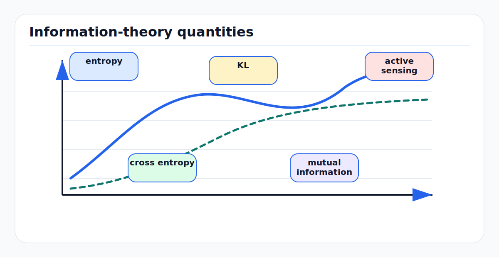

# Information Theory for Perception and Machine Learning

Information theory gives a quantitative language for uncertainty, compression,
prediction, sensing, and representation learning. For autonomy, it explains why
some measurements reduce pose uncertainty, why some features are sufficient for
planning, why calibration matters, and why lossy learned representations can be
useful or dangerous.

<!-- kb-figure:start -->


*Figure: how information measures quantify uncertainty, compression, prediction error, and sensor value.*
<!-- kb-figure:end -->

## Related docs

- [Gaussian Noise, Covariance, Information, Whitening, and Uncertainty Ellipses](gaussian-noise-covariance-information.md)
- [Likelihood, MAP, MLE, and Least Squares](likelihood-map-mle-least-squares.md)
- [Uncertainty Quantification, Calibration, and Conformal Prediction](uncertainty-quantification-calibration-conformal.md)
- [Evaluation, Calibration, and Data Leakage: First Principles](../machine-learning/evaluation-calibration-and-data-leakage-first-principles.md)
- [Contrastive Learning and InfoNCE: First Principles](../machine-learning/contrastive-learning-infonsce-first-principles.md)
- [Autoencoders, VAEs, and Latent Variable Models](../machine-learning/autoencoders-vae-and-latent-variable-models-first-principles.md)
- [World Models: First Principles](../machine-learning/world-models-first-principles.md)
- [Occupancy Bayes, Evidential, and Dynamic Grids](../mapping/occupancy-bayes-evidential-dynamic-grids.md)

## Why it matters for AV, perception, SLAM, and mapping

Autonomy systems repeatedly ask information-theoretic questions:

- How much does this LiDAR scan reduce map uncertainty?
- Is a BEV feature sufficient for planning, or did the encoder discard a small
  obstacle?
- Does a detector score behave like a probability, or only like a ranking?
- Which route, viewpoint, or maneuver would reveal the most about an occluded
  area?
- How much prediction detail is worth carrying into the planner?

Shannon's communication theory starts from uncertainty over possible messages.
Cover and Thomas develop entropy, relative entropy, mutual information, channel
capacity, and rate-distortion theory as a general mathematical toolkit. In
perception and ML, the "channel" may be a sensor, neural encoder, map update, or
latent world model.

## Core definitions

### Entropy

For a discrete random variable `X` with probabilities `p(x)`:

```text
H(X) = - sum_x p(x) log p(x)
```

If the logarithm is base 2, units are bits. Entropy is low when the outcome is
nearly known and high when many outcomes remain plausible.

For a Bernoulli occupancy cell:

```text
H(p) = -p log p - (1 - p) log(1 - p)
```

`H(p)` is highest at `p = 0.5`, where the cell is maximally uncertain, and zero
at `p = 0` or `p = 1`.

### Conditional entropy

```text
H(Y | X) = - sum_x p(x) sum_y p(y | x) log p(y | x)
```

It measures remaining uncertainty in `Y` after observing `X`. In perception,
`H(map | sensor history)` should decrease as observations make the map more
certain.

### Mutual information

```text
I(X; Y) = H(Y) - H(Y | X)
        = H(X) - H(X | Y)
        = sum_{x,y} p(x,y) log (p(x,y) / (p(x)p(y)))
```

Mutual information is expected uncertainty reduction. If `I(sensor; map)` is
large, the sensor measurement is informative about the map. If `I(feature;
label)` is large, the feature carries label-relevant information.

Conditional mutual information is:

```text
I(X; Y | Z) = H(Y | Z) - H(Y | X, Z)
```

This is useful when scoring a candidate action given what the robot already
knows.

### KL divergence

Relative entropy, or KL divergence, is:

```text
D_KL(p || q) = sum_x p(x) log (p(x) / q(x))
```

It measures the extra code length, in expectation under `p`, from using model
`q` when the true distribution is `p`. It is not symmetric.

In ML, negative log-likelihood and cross-entropy are empirical ways to push
model distributions toward data distributions.

### Cross entropy

```text
H(p, q) = - sum_x p(x) log q(x)
        = H(p) + D_KL(p || q)
```

Minimizing cross entropy over `q` is equivalent to minimizing KL divergence from
the data distribution to the model distribution, up to the fixed entropy of the
data distribution.

### Differential entropy

For a continuous variable:

```text
h(X) = - integral p(x) log p(x) dx
```

Unlike discrete entropy, differential entropy can be negative and changes under
coordinate scaling. Mutual information and KL divergence remain invariant in
the ways usually needed for modeling.

For a Gaussian `N(mu, Sigma)` in `d` dimensions:

```text
h(X) = 0.5 * log((2 pi e)^d det(Sigma))
```

This connects uncertainty volume to covariance determinant.

## First-principles math

### Information gain from a measurement

Before a measurement `z`, the map belief is `p(m)`. After the measurement:

```text
p(m | z) = p(z | m) p(m) / p(z)
```

The information gain from observing `z` is:

```text
D_KL(p(m | z) || p(m))
```

The expected information gain before knowing which `z` will arrive is:

```text
E_z[D_KL(p(m | z) || p(m))] = I(M; Z)
```

This is the basis of active SLAM, next-best-view planning, and uncertainty-aware
mapping.

### Fisher information

For likelihood `p(z | theta)`, the score is:

```text
s(theta) = grad_theta log p(z | theta)
```

The Fisher information matrix is:

```text
I(theta) = E[s(theta) s(theta)^T]
```

Under regularity conditions, it also equals:

```text
I(theta) = -E[Hessian_theta log p(z | theta)]
```

For Gaussian residual models, the Gauss-Newton Hessian approximates accumulated
information. This links measurement geometry, calibration observability, and
SLAM covariance.

### Rate-distortion

Compression is only meaningful relative to distortion. Rate-distortion theory
asks for the minimum code rate `R` needed to represent `X` with expected
distortion at most `D`:

```text
R(D) = min_{p(x_hat | x): E[d(X, X_hat)] <= D} I(X; X_hat)
```

For AV learned representations, distortion should not mean pixel MSE by
default. A small cone, reflective aircraft towbar, or lane boundary may occupy
few pixels but carry high planning value.

### Information bottleneck

The information bottleneck method seeks a representation `T` that compresses
input `X` while preserving information about target `Y`:

```text
min p(t | x): I(X; T) - beta I(T; Y)
```

Equivalently, keep target-relevant information and discard nuisance variation.
For perception, `Y` may be object labels, occupancy, future trajectories, or
planning cost. The failure mode is obvious: if the target omits rare hazards,
the bottleneck may learn to discard them.

### Channel capacity

A noisy sensor or communication link can be abstracted as a channel:

```text
p(y | x)
```

Channel capacity is:

```text
C = max_{p(x)} I(X; Y)
```

This gives a clean mental model for bandwidth, quantization, sensor noise,
compression, and lossy logging. A perception stack cannot recover information
that the sensor channel or preprocessing destroyed.

## Algorithmic patterns

| Pattern | Information-theoretic view | AV use |
|---|---|---|
| Entropy map | uncertainty per cell or object | active mapping, safety visualization |
| Information gain planner | choose action maximizing expected uncertainty reduction | next best view, occlusion handling |
| NLL training | minimize empirical code length under model | probabilistic perception and forecasting |
| Cross entropy classification | fit class probability model | object classes, semantic cells |
| Contrastive learning | maximize lower bound on mutual information or separability | sensor representation learning |
| VAE / latent model | trade reconstruction, likelihood, and latent prior | world-model state compression |
| Rate-distortion tokenizer | compress inputs under task distortion | BEV, point cloud, image tokenizers |
| Calibration metric | compare confidence to empirical frequency | risk scoring and thresholding |

## AV, perception, SLAM, mapping, and planning relevance

### Sensor selection and active perception

An active perception objective can be written:

```text
score(a) = E_{z | a}[D_KL(p(M | z, a) || p(M))]
```

The action `a` may be a viewpoint, speed profile, lane position, sensor mode, or
query policy. This objective rewards actions that are expected to make the map
or scene belief more certain.

### Feature sufficiency

A representation `r_t` is sufficient for a task if:

```text
p(y | history) = p(y | r_t)
```

For planning, `y` may be future collision, rule violation, or progress. This is
why planner-friendly BEV features can be useful: they compress history into a
state intended to preserve decision-relevant information. It is also why they
need targeted validation.

### Occupancy and entropy

Occupancy cells near `p = 0.5` have high entropy. But planning risk is not
entropy alone:

```text
risk(cell) = P(occupied) * consequence(cell)
```

A far unknown cell and a near unknown cell may have similar entropy but very
different safety implications.

### World models

World models choose what future information to predict. Pixel prediction carries
many bits unrelated to control. Occupancy, agent state, and latent predictive
features may carry fewer bits but more planning value. Rate-distortion and
information bottleneck thinking help define the trade:

```text
compress observations enough for real-time planning
preserve enough information for safe decisions
```

## Implementation notes

- Specify log base. Bits use `log2`; nats use natural log. Mixing units causes
  confusing dashboards.
- Estimate entropy and mutual information cautiously. Finite-sample estimators
  can be biased, especially for high-dimensional continuous features.
- Do not optimize generic information gain without consequence weighting. A
  planner can waste effort learning irrelevant scene details.
- Separate aleatoric sensor uncertainty from epistemic model uncertainty.
  Entropy of a softmax output is not a complete uncertainty estimate.
- Treat compression as a safety-critical design choice. Downsampling,
  quantization, tokenization, and feature pooling can erase rare small objects.
- Use NLL only when the likelihood family is meaningful. A low NLL from a
  misspecified model can still hide spatially concentrated failures.
- When scoring active mapping, account for motion cost, latency, observability,
  and collision risk, not only expected entropy reduction.

## Failure modes and diagnostics

| Symptom | Likely cause | Diagnostic |
|---|---|---|
| High-confidence wrong predictions | model is miscalibrated or missing OOD state | reliability diagrams and scenario-sliced NLL |
| Active planner stares at irrelevant regions | information objective ignores task value | weight information gain by consequence and mission |
| Latent model misses small hazards | bottleneck or distortion erased rare details | inspect reconstructions and task probes by hazard type |
| Entropy dashboard looks good but planner unsafe | entropy not tied to consequence | evaluate risk-weighted occupancy and closed-loop outcomes |
| Mutual information estimate is unstable | high-dimensional estimator bias | use lower-dimensional probes and bootstrap intervals |
| Sensor fusion double counts evidence | correlated channels treated as independent | estimate conditional information and audit shared preprocessing |
| Map updates become overconfident | likelihood too sharp or repeated data | compare predicted entropy drop to empirical error reduction |

## Sources

- Claude E. Shannon, "A Mathematical Theory of Communication": https://people.math.harvard.edu/~ctm/home/text/others/shannon/entropy/entropy.pdf
- Thomas M. Cover and Joy A. Thomas, "Elements of Information Theory," Second Edition: https://www.wiley-vch.de/en/areas-interest/computing-computer-sciences/computer-science-17cs/information-technologies-17cs3/elements-of-information-theory-978-0-471-24195-9
- Naftali Tishby, Fernando C. Pereira, and William Bialek, "The Information Bottleneck Method": https://arxiv.org/abs/physics/0004057
- Naftali Tishby and Noga Zaslavsky, "Deep Learning and the Information Bottleneck Principle": https://arxiv.org/abs/1503.02406
- David J. C. MacKay, "Information Theory, Inference, and Learning Algorithms": https://www.inference.org.uk/itila/book.html
