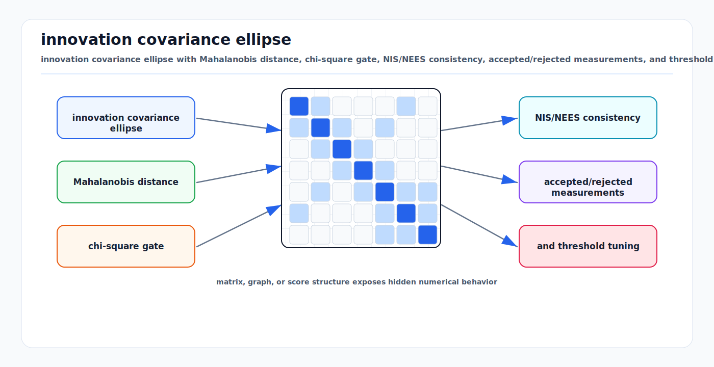

# Mahalanobis Distance, Chi-Square Gates, NIS, and NEES

<!-- kb-visual:start -->


*Visual: innovation covariance ellipse with Mahalanobis distance, chi-square gate, NIS/NEES consistency, accepted/rejected measurements, and threshold tuning.*
<!-- kb-visual:end -->

Mahalanobis distance is the distance that matters when residual dimensions have
different units, scales, and correlations. Chi-square gating turns that distance
into a statistically interpretable pass/fail test. In AV systems, this is the
foundation for rejecting unlikely sensor associations, monitoring estimator
consistency, and detecting covariance tuning errors.

## Related docs

- [Gaussian Noise, Covariance, Information, Whitening, and Uncertainty Ellipses](gaussian-noise-covariance-information.md)
- [Bayesian Filtering and Error-State Kalman Filters](../state-estimation/bayesian-filtering-and-eskf.md)
- [GTSAM Factor Graph Optimization](../state-estimation/gtsam-factor-graphs.md)
- [Robust Statistics, RANSAC, and Hypothesis Testing](robust-statistics-ransac-hypothesis-testing.md)
- [Mixture Models and Multimodal Beliefs](mixture-models-multimodal-beliefs.md)

## Why it matters for AV, perception, SLAM, and mapping

Perception and localization are full of association decisions:

- Does this radar return belong to that tracked vehicle?
- Does this landmark observation match that map landmark?
- Does this loop closure agree with the current pose graph?
- Does this GNSS fix look plausible given the inertial prediction?
- Is the estimator covariance consistent with the errors seen in simulation?

Raw Euclidean distance is not enough. A 0.5 m lateral error may be normal for a
far camera detection and catastrophic for RTK localization. A 2 degree heading
innovation may be small when stopped but large after a well-constrained turn.
Mahalanobis distance normalizes residuals by the uncertainty that should explain
them.

Stone Soup's data association tutorials use Mahalanobis measures and distance
hypothesizers to gate cluttered detections. Kalman-filter practice uses the same
quantity as normalized innovation squared (NIS). In simulation, normalized
estimation error squared (NEES) checks whether the state error is statistically
consistent with the reported covariance.

## First-principles math

### Mahalanobis distance

Let a residual be

```text
r = z - z_hat
```

with covariance

```text
S = Cov(r)
```

The squared Mahalanobis distance is

```text
d2 = r^T S^-1 r
```

The Mahalanobis distance is

```text
d = sqrt(d2)
```

If `S = sigma^2 I`, then

```text
d2 = ||r||^2 / sigma^2
```

So Mahalanobis distance is ordinary Euclidean distance measured in standard
deviation units. With correlated covariance, it also rotates and scales the
space so that residuals along uncertain directions count less than residuals
along precise directions.

### Why `d2` is chi-square distributed

Assume the residual is Gaussian:

```text
r ~ N(0, S)
```

Let `R` be a square-root information matrix:

```text
R^T R = S^-1
```

Whiten the residual:

```text
e = R r
```

Then

```text
e ~ N(0, I)
d2 = e^T e = sum_j e_j^2
```

The sum of squares of `m` independent standard normal variables follows a
chi-square distribution with `m` degrees of freedom:

```text
d2 ~ chi2(df = m)
```

This gives a gate threshold for probability mass `p`:

```text
threshold = chi2_ppf(p, df = m)
accept if d2 <= threshold
```

Typical upper-tail gates:

| Residual dimension | 95 percent | 99 percent | 99.7 percent |
|---:|---:|---:|---:|
| 1 | 3.84 | 6.63 | 8.81 |
| 2 | 5.99 | 9.21 | 11.83 |
| 3 | 7.81 | 11.34 | 14.16 |
| 4 | 9.49 | 13.28 | 16.25 |
| 6 | 12.59 | 16.81 | 20.79 |

Do not compare a squared Mahalanobis distance to a "number of sigmas" directly.
For a 2D residual, a 95 percent gate is `d2 = 5.99`, which means
`d = sqrt(5.99) = 2.45`.

### Innovation covariance and NIS

For a linear Kalman measurement model

```text
z_k = H x_k + v_k,    v_k ~ N(0, R)
```

with predicted state covariance `P_k|k-1`, the predicted measurement covariance
is

```text
S_k = H P_k|k-1 H^T + R
```

The innovation is

```text
nu_k = z_k - H x_hat_k|k-1
```

The normalized innovation squared is

```text
NIS_k = nu_k^T S_k^-1 nu_k
```

Under the filter assumptions, `NIS_k` is chi-square distributed with degrees of
freedom equal to the measurement dimension. NIS is practical because it does not
require ground-truth state; it only requires the measurement, prediction, and
innovation covariance.

### NEES

In simulation or with high-quality ground truth, define state error

```text
err_k = x_k_true - x_hat_k
```

For manifold states, `err_k` must be computed in the correct local tangent
space, not by subtracting quaternions or poses componentwise.

The normalized estimation error squared is

```text
NEES_k = err_k^T P_k^-1 err_k
```

If the estimator is consistent and `P_k` is the true error covariance, then

```text
NEES_k ~ chi2(df = n_x)
```

where `n_x` is the state error dimension. NEES tests the full state covariance;
NIS tests measurement-space consistency.

### Batch tests over time

For `N` independent samples with the same residual dimension `m`,

```text
sum_i NIS_i ~ chi2(df = N * m)
```

The average NIS is

```text
ANIS = (1 / N) sum_i NIS_i
```

Use two-sided bounds:

```text
lower = chi2_ppf(alpha / 2, df = N * m) / N
upper = chi2_ppf(1 - alpha / 2, df = N * m) / N
```

Interpretation:

- Too high: residuals are larger than covariance predicts. Noise is
  underestimated, model is wrong, or outliers are entering.
- Too low: covariance is too large, data have been selected by a gate, or
  residuals are over-smoothed/correlated.

## Implementation notes

- Compute `d2` by solving a linear system, not by explicit matrix inverse:

```text
solve S y = r
d2 = r^T y
```

- Use Cholesky when `S` is symmetric positive definite. If Cholesky fails, the
  innovation covariance is not numerically valid.
- Gate in the same residual space used by the update. If a camera factor uses
  bearing-only residuals, gate bearing residuals, not pixel boxes plus bearing.
- Use the correct degrees of freedom after constraints and dropped dimensions.
  A range-only update has `df = 1`; a 2D position update has `df = 2`.
- Log accepted and rejected NIS separately. A gate truncates the distribution, so
  NIS computed only after gating will look artificially consistent.
- For multi-sensor fusion, monitor NIS per sensor type and per operating domain:
  rain, night, high speed, urban canyon, airport apron, warehouse, and tunnel.
- For object tracking, use separate gates for proposal generation and final
  assignment when clutter is high. A loose proposal gate can preserve recall;
  later likelihood scoring can choose among candidates.
- For graph SLAM, apply chi-square gates to candidate associations before graph
  insertion, but still use robust losses inside the graph because gates are not
  perfect.

## Failure modes and diagnostics

| Symptom | Likely cause | Diagnostic |
|---|---|---|
| Many valid detections rejected | `S` too small or wrong `df` | Plot gate pass rate by range and sensor mode. |
| Too many clutter associations accepted | Gate too loose or covariance inflated | Compare accepted NIS distribution with chi-square bounds. |
| NIS high after maneuvers | Motion model missing acceleration, slip, or delay | Segment NIS by curvature, acceleration, and latency. |
| NIS high only for one sensor | Bad measurement covariance or calibration | Check raw residuals in that sensor frame. |
| NEES high but NIS normal | State covariance inconsistent but measurements fit | Inspect unobservable states, process noise, and correlations. |
| NEES low everywhere | Covariance inflated or truth mismatch | Compare RMSE to reported standard deviation. |
| NIS low after gating | Selection bias from rejecting large innovations | Evaluate pre-gate innovations in replay logs. |
| Cholesky failure in gate | Non-SPD covariance or numerical symmetry loss | Symmetrize, check eigenvalues, and trace covariance propagation. |

## Sources

- Stone Soup, "Data association - clutter tutorial": https://stonesoup.readthedocs.io/en/v1.7/auto_tutorials/05_DataAssociation-Clutter.html
- Stone Soup, "Measures" Mahalanobis distance documentation: https://stonesoup.readthedocs.io/en/v1.1/stonesoup.measures.html
- NIST/SEMATECH e-Handbook of Statistical Methods, "Chi-Square Distribution": https://www.itl.nist.gov/div898/handbook/eda/section3/eda3666.htm
- SciPy, `scipy.stats.chi2`: https://docs.scipy.org/doc/scipy/reference/generated/scipy.stats.chi2.html
- "Normalized Innovation Squared (NIS)," Kalman Filter for Professionals: https://kalman-filter.com/normalized-innovation-squared/
- "Normalized Estimation Error Squared (NEES)," Kalman Filter for Professionals: https://kalman-filter.com/normalized-estimation-error-squared/
- Bar-Shalom, Li, and Kirubarajan, "Estimation with Applications to Tracking and Navigation," Wiley reference page: https://doi.org/10.1002/0471221279
