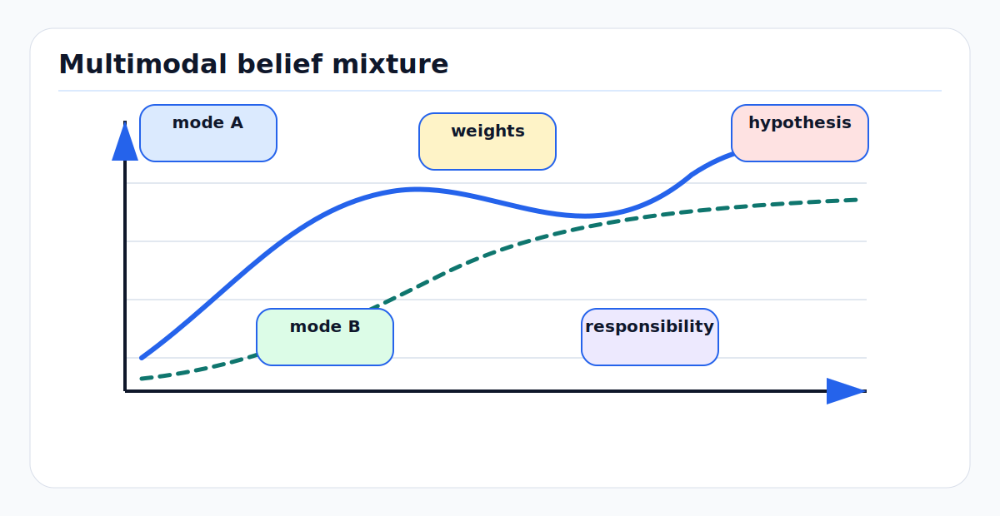

# Mixture Models and Multimodal Beliefs

A single Gaussian belief says there is one local explanation with elliptical
uncertainty. AV perception and SLAM often need more: multiple possible object
associations, multiple lanes, ambiguous localization hypotheses, unknown target
count, and detector outputs with class and pose ambiguity. Mixture models keep
several explanations alive by representing belief as a weighted sum of simpler
distributions.

<!-- kb-figure:start -->


*Figure: how mixture components preserve multiple plausible explanations instead of collapsing to one mean.*
<!-- kb-figure:end -->

## Related docs

- [Gaussian Noise, Covariance, Information, Whitening, and Uncertainty Ellipses](gaussian-noise-covariance-information.md)
- [Mahalanobis and Chi-Square Gating](mahalanobis-chi-square-gating.md)
- [Likelihood, MAP, MLE, and Least Squares](likelihood-map-mle-least-squares.md)
- [Robust Statistics, RANSAC, and Hypothesis Testing](robust-statistics-ransac-hypothesis-testing.md)
- [Bayesian Filtering and Error-State Kalman Filters](../state-estimation/bayesian-filtering-and-eskf.md)

## Why it matters for AV, perception, SLAM, and mapping

Multimodality appears whenever the data support more than one explanation:

- A vehicle can be in one of two adjacent lanes after partial occlusion.
- A robot in a repeated warehouse aisle can match several map locations.
- A camera landmark can correspond to several visually similar signs or poles.
- A radar detection may be clutter, a real object, or a multipath ghost.
- A semantic SLAM observation may be a true object, a duplicated object, or a
  false positive.
- A tracker may need to keep missed-detection and detection-associated branches
  until later evidence resolves the ambiguity.

Collapsing these cases too early into one Gaussian can be overconfident and
wrong. Mixtures encode ambiguity explicitly: each mode has a local mean and
covariance, and the weights say how plausible each mode is.

## First-principles math

### Finite mixture model

A finite mixture density is

```text
p(x) = sum_{k=1}^K pi_k p_k(x)
```

where

```text
pi_k >= 0
sum_k pi_k = 1
```

For a Gaussian mixture model (GMM):

```text
p_k(x) = N(x; mu_k, Sigma_k)
```

so

```text
p(x) = sum_{k=1}^K pi_k N(x; mu_k, Sigma_k)
```

The latent variable view introduces a component index `c`:

```text
P(c = k) = pi_k
p(x | c = k) = N(x; mu_k, Sigma_k)
```

The mixture is the marginal:

```text
p(x) = sum_k p(c = k) p(x | c = k)
```

This is the same principle behind multi-hypothesis tracking and data association
uncertainty: the state belief is a sum over association hypotheses.

### Mixture mean and covariance

The mixture mean is

```text
mu = sum_k pi_k mu_k
```

The covariance is

```text
Sigma = sum_k pi_k [Sigma_k + (mu_k - mu)(mu_k - mu)^T]
```

The first term averages within-mode covariance. The second term adds between-mode
spread. Collapsing a mixture to one Gaussian preserves only the first two
moments; it destroys mode identity. If two lane hypotheses are separated by 3 m,
the collapsed Gaussian may put high density in the lane boundary between them,
where the vehicle is unlikely to be.

### Bayes update for mixture weights

Given measurement `z`, likelihood for component `k`:

```text
ell_k = p(z | c = k)
```

the posterior weight is

```text
pi_k_post = pi_k ell_k / sum_j pi_j ell_j
```

Each component can also update its local mean and covariance using the
appropriate filter or optimizer. For linear-Gaussian components, this is a
Kalman update per component followed by weight normalization.

### Gaussian-sum filtering

Suppose the prior is a Gaussian mixture:

```text
p(x_{t-1} | z_1:t-1) = sum_i pi_i N(x; mu_i, P_i)
```

Under a linear-Gaussian motion model, each component predicts to another
Gaussian:

```text
mu_i_pred = F mu_i + B u
P_i_pred = F P_i F^T + Q
```

After a measurement, each component receives a likelihood and a Kalman update.
The posterior remains a mixture. For nonlinear models, EKF/UKF-style component
updates or local factor-graph optimizations are common approximations.

### Data association as a mixture

For one track and several possible detections, each association hypothesis
creates a candidate posterior:

```text
h = 0: missed detection
h = 1..M: associated with detection h
```

The posterior is a mixture over hypotheses:

```text
p(x | Z) = sum_h beta_h p(x | Z, h)
```

where `beta_h` is the association probability. Stone Soup's JPDA tutorial
illustrates this pattern: posterior states are formed for hypotheses, weights
come from hypothesis probabilities, and the mixture can be reduced to a single
Gaussian when needed.

### EM for fitting Gaussian mixtures

Given data `x_1, ..., x_N`, fit mixture parameters

```text
theta = {pi_k, mu_k, Sigma_k}_{k=1}^K
```

The log-likelihood is

```text
log p(X | theta) = sum_i log sum_k pi_k N(x_i; mu_k, Sigma_k)
```

The log of a sum makes direct optimization awkward. Expectation-maximization
(EM) alternates:

E-step responsibilities:

```text
gamma_ik = pi_k N(x_i; mu_k, Sigma_k)
           / sum_j pi_j N(x_i; mu_j, Sigma_j)
```

M-step effective counts:

```text
N_k = sum_i gamma_ik
```

Weights:

```text
pi_k = N_k / N
```

Means:

```text
mu_k = (1 / N_k) sum_i gamma_ik x_i
```

Covariances:

```text
Sigma_k = (1 / N_k) sum_i gamma_ik (x_i - mu_k)(x_i - mu_k)^T
```

Scikit-learn's `GaussianMixture` implements EM and exposes covariance choices
such as full, tied, diagonal, and spherical, plus covariance regularization.

## Implementation notes

- Use log-sum-exp for mixture likelihoods. Directly summing small Gaussian
  densities underflows in high dimensions.
- Normalize weights after every prediction, update, prune, and merge step.
- Prune tiny-weight components to control compute, but log the removed mass.
- Merge nearby components using Mahalanobis distance or symmetric divergence,
  not just Euclidean distance between means.
- Keep component covariances positive definite. Add diagonal regularization when
  fitting from small samples.
- Avoid premature moment matching. Collapse a mixture only when downstream code
  cannot consume mixtures, and keep diagnostics for the lost mode structure.
- Choose covariance structure to match data and sample size. Full covariance is
  expressive but data-hungry; diagonal or tied covariance can be more stable.
- Track effective sample or component count:

```text
K_eff = 1 / sum_k pi_k^2
```

Low `K_eff` means one mode dominates; high `K_eff` means ambiguity remains.

- In mapping and SLAM, distinguish multimodal geometry from outliers. A mixture
  says "several plausible explanations." A robust loss says "this datum may be
  bad." They solve different problems.

## Failure modes and diagnostics

| Symptom | Likely cause | Diagnostic |
|---|---|---|
| Modes collapse too early | Aggressive pruning or moment matching | Log weight entropy and component count over time. |
| Too many components | No merge/prune policy | Monitor compute, tiny weights, and duplicate modes. |
| Singular covariance in EM | Too few points assigned to a component | Add `reg_covar`, tie covariance, or remove tiny components. |
| Component labels swap | Mixture components are exchangeable | Do not attach semantics to component index alone. |
| Mean lies in impossible space | Collapsed Gaussian between separated modes | Visualize component means and covariances, not only aggregate mean. |
| Tracker follows clutter | Association likelihoods missing clutter or missed-detection terms | Include null hypothesis and clutter density. |
| Repeated map locations confuse localization | Single-Gaussian filter cannot represent alternatives | Use particles, mixtures, or multi-hypothesis localization. |
| Mixture overfits training residuals | Too many components for data volume | Use validation likelihood, BIC/AIC, or Bayesian mixture priors. |

## Sources

- Scikit-learn User Guide, "Gaussian mixture models": https://scikit-learn.org/stable/modules/mixture.html
- Scikit-learn API, `sklearn.mixture.GaussianMixture`: https://sklearn.org/stable/modules/generated/sklearn.mixture.GaussianMixture.html
- Stone Soup, "Gaussian mixture PHD tutorial": https://stonesoup.readthedocs.io/en/v1.4/auto_tutorials/filters/GMPHDTutorial.html
- Stone Soup, "Joint probabilistic data association tutorial": https://stonesoup.readthedocs.io/en/stable/auto_tutorials/08_JPDATutorial.html
- Sebastian Thrun, Wolfram Burgard, and Dieter Fox, "Probabilistic Robotics," MIT Press: https://mitpress.mit.edu/9780262201629/probabilistic-robotics/
- Simo Sarkka, "Bayesian Filtering and Smoothing," Cambridge University Press contents: https://www.cambridge.org/core/books/bayesian-filtering-and-smoothing/contents/21BB5F04E9132436BB4518D841BFBC37
- Probabilistic data association via mixture models for robust semantic SLAM: https://arxiv.org/abs/1909.11213
