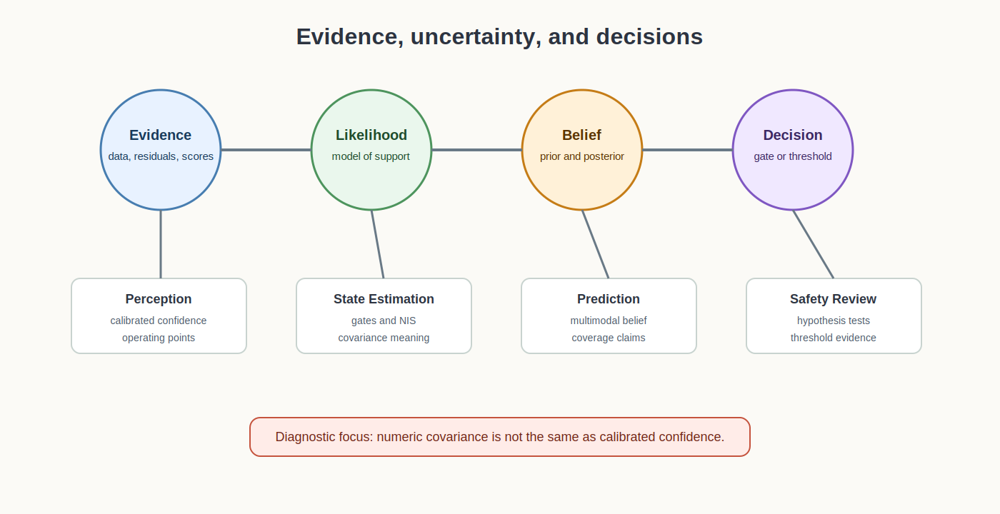

# Probability and Statistics Foundations for Autonomy

<!-- kb-visual:start -->

*Visual: section-level autonomy-role diagram showing probability and statistics foundations, autonomy problem classes, stack interfaces, reading paths, and failure diagnosis.*
<!-- kb-visual:end -->

## Why This Foundation Exists

Probability and statistics define what autonomy means by uncertainty, evidence, likelihood, confidence, calibration, and thresholds. Without those semantics, covariance matrices, detector scores, gates, conformal intervals, robust losses, and release metrics become numbers without a defensible interpretation.

This foundation exists so reviews can distinguish numerical output from statistical support. A tracker, detector, estimator, or validation report can be well engineered and still be unsafe if its probabilities are uncalibrated, priors are implicit, tails are wrong, or operating thresholds do not match the claim.

## What This Field Studies From First Principles

This section studies belief, evidence, likelihoods, priors, Gaussian covariance and information form, detection theory, ROC and precision-recall tradeoffs, Mahalanobis and chi-square gates, robust statistics, RANSAC, mixture models, graphical models, information theory, calibration, conformal prediction, and threshold setting.

The first-principles questions are: what random variable is modeled, what evidence changes belief, what likelihood is assumed, what prior enters the result, how uncertainty is calibrated, and what decision rule turns probability into action.

## Autonomy Problem Map

Probability and statistics span perception, tracking, localization, prediction, validation, and safety. The foundation consumes data samples, scores, residuals, covariances, priors, labels, hypotheses, and operating constraints. It produces likelihoods, calibrated scores, gates, confidence sets, robust weights, hypothesis tests, and threshold evidence.

The autonomy risk is false confidence. A system may have a covariance, confidence score, or threshold that looks precise but does not reflect the actual frequency of errors in the operating domain.

## Core Mental Model

Think in claims and evidence. A probabilistic quantity should say what event it refers to, what data supports it, what assumptions make it valid, and how it is consumed by a downstream decision.

The practical model is: `data and assumptions -> likelihood or score -> calibrated uncertainty -> decision threshold -> monitored error rate`. Failures usually come from mixing score semantics, using covariances as decorative fields, overfitting thresholds, ignoring tail behavior, or treating robust losses as statistical guarantees.

## What This Foundation Lets You Review

- Does each likelihood, prior, covariance, and confidence score have an explicit semantic meaning?
- Are gates and thresholds calibrated to the operating point being claimed?
- Do robust losses or RANSAC tests reject outliers without hiding systematic bias?
- Are multimodal beliefs represented when a single Gaussian would be misleading?
- Do confidence intervals, conformal sets, and reliability plots match observed error frequencies?

## Problem-Class Coverage

| Problem Class | Role Of This Foundation | Representative Applied Pages |
|---|---|---|
| Perception and scene understanding | primary - this foundation owns score semantics, calibration, detection thresholds, confidence claims, and uncertainty summaries. | [Uncertainty Quantification and Calibration](../../30-autonomy-stack/perception/overview/uncertainty-quantification-calibration.md) - review whether perception confidence matches observed error rates. |
| Localization, SLAM, and state estimation | supporting - estimators use probabilistic gates and covariances, while temporal fusion architecture belongs to state estimation. | [Robust State Estimation and Multi-Sensor Fusion](../../30-autonomy-stack/localization-mapping/overview/robust-state-estimation-multi-sensor.md) - debug NIS, NEES, and Mahalanobis checks whose statistics are not calibrated. |
| Mapping and spatial memory | supporting - maps use evidence accumulation and confidence, but persistent representation policy belongs to mapping. | [Robust State Estimation and Multi-Sensor Fusion](../../30-autonomy-stack/localization-mapping/overview/robust-state-estimation-multi-sensor.md) - review whether map update evidence is overconfident before it becomes persistent. |
| Prediction and world modeling | primary - probabilistic prediction depends on calibrated likelihoods, multimodal beliefs, and confidence sets. | [Conformal Boxes](../../30-autonomy-stack/perception/methods/conformal-boxes.md) - debug coverage claims when predicted uncertainty fails at deployment. |
| Planning and decision making | supporting - planning consumes risk estimates and thresholds, but owns utility and action selection. | [Conformal Boxes](../../30-autonomy-stack/perception/methods/conformal-boxes.md) - review whether uncertainty sets passed to planners preserve claimed coverage. |
| Control and actuation | not central - control consumes risk and covariance contracts but does not own probabilistic semantics. | [Robust State Estimation and Multi-Sensor Fusion](../../30-autonomy-stack/localization-mapping/overview/robust-state-estimation-multi-sensor.md) - debug when control confidence depends on estimator covariance that lacks statistical support. |
| Safety, validation, and assurance | primary - safety claims depend on calibrated confidence, hypothesis tests, operating points, and threshold evidence. | [Uncertainty Quantification and Calibration](../../30-autonomy-stack/perception/overview/uncertainty-quantification-calibration.md) - review release evidence for reliability, coverage, and threshold drift. |
| Runtime systems and operations | supporting - runtime monitors score drift, calibration drift, tail events, and threshold health. | [Conformal Boxes](../../30-autonomy-stack/perception/methods/conformal-boxes.md) - debug production coverage regressions under changing data distributions. |

## Reading Paths By Task

For likelihood and covariance semantics, start with [Gaussian Noise, Covariance, and Information](gaussian-noise-covariance-information.md), then read [Likelihood, MAP, MLE, and Least Squares](likelihood-map-mle-least-squares.md).

For gates and operating points, read [Mahalanobis and Chi-Square Gating](mahalanobis-chi-square-gating.md), then [Detection Theory, ROC, PR, and Operating Points](detection-theory-roc-pr-operating-points.md).

For outliers, hypotheses, and robust review, read [Robust Statistics, RANSAC, and Hypothesis Testing](robust-statistics-ransac-hypothesis-testing.md), then [Robust Losses and M-Estimators](robust-losses-m-estimators-huber-cauchy-tukey-geman-mcclure.md).

For calibrated uncertainty and multimodal beliefs, read [Uncertainty Quantification, Calibration, and Conformal Prediction](uncertainty-quantification-calibration-conformal.md), [Mixture Models and Multimodal Beliefs](mixture-models-multimodal-beliefs.md), and [Probabilistic Graphical Models and Message Passing](probabilistic-graphical-models-message-passing.md).

## Dependency Map

Probability and statistics depend on measurement models from sensors and geometry, residual definitions from optimization and estimation, and data splits or runtime observations from systems engineering. It feeds perception confidence, data association gates, estimator consistency checks, prediction uncertainty, validation thresholds, and safety evidence.

The dependency review should ask whether uncertainty semantics are being used as designed. A covariance can be numerically available because linear algebra produced it; this foundation asks whether it is statistically calibrated enough to justify a gate, threshold, or confidence claim.

## Interfaces, Artifacts, and Failure Modes

Core artifacts include likelihood functions, priors, posterior summaries, covariance matrices, information matrices, Mahalanobis distances, chi-square gates, ROC and PR curves, calibration plots, conformal sets, robust weights, hypothesis-test logs, and threshold justifications.

Diagnostic case: A tracker swaps identities because gates use covariance values that are numerically present but not statistically calibrated.

Common failure modes include score-probability confusion, uncalibrated confidence, hidden priors, Gaussian assumptions in multimodal scenes, threshold overfitting, tail-risk blindness, robust losses treated as proof, and calibration sets that do not represent deployment.

## Boundaries With Neighboring Foundations

- Owns: belief, evidence, uncertainty semantics, likelihoods, priors, calibration, hypothesis testing, robust statistics, and thresholds.
- Hands off to: optimization for solver algorithms and state estimation for temporal fusion architecture.
- Does not own: solver algorithms or the temporal fusion architecture that decides where statistics enter estimator state.
- Diagnostic logic: if the failure is about what a probability, covariance, gate, confidence score, or threshold means statistically, debug here; if the failure is how the nonlinear problem is solved, move to optimization; if it is where the statistic enters prediction/update over time, move to state estimation.

## Pages In This Section

Likelihoods, information, and graphical structure:

- [Gaussian Noise, Covariance, and Information](gaussian-noise-covariance-information.md)
- [Likelihood, MAP, MLE, and Least Squares](likelihood-map-mle-least-squares.md)
- [Information Theory for Perception and ML](information-theory-for-perception-ml.md)
- [Probabilistic Graphical Models and Message Passing](probabilistic-graphical-models-message-passing.md)

Detection, gates, and operating points:

- [Detection Theory, ROC, PR, and Operating Points](detection-theory-roc-pr-operating-points.md)
- [Mahalanobis and Chi-Square Gating](mahalanobis-chi-square-gating.md)
- [Robust Statistics, RANSAC, and Hypothesis Testing](robust-statistics-ransac-hypothesis-testing.md)

Robustness, multimodality, and calibrated uncertainty:

- [Robust Losses and M-Estimators](robust-losses-m-estimators-huber-cauchy-tukey-geman-mcclure.md)
- [Mixture Models and Multimodal Beliefs](mixture-models-multimodal-beliefs.md)
- [Uncertainty Quantification, Calibration, and Conformal Prediction](uncertainty-quantification-calibration-conformal.md)

## Core Sources

This overview synthesizes the section pages listed above; no additional external sources were used.
