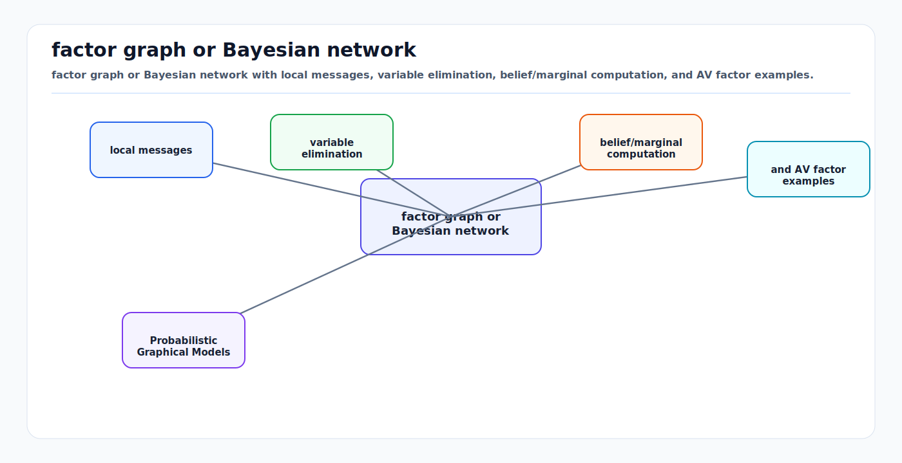

# Probabilistic Graphical Models and Message Passing

<!-- kb-visual:start -->


*Visual: factor graph or Bayesian network with local messages, variable elimination, belief/marginal computation, and AV factor examples.*
<!-- kb-visual:end -->

Probabilistic graphical models turn high-dimensional inference into local
structure. Instead of writing one opaque joint distribution over every pose,
landmark, object, map cell, latent token, and action, we represent how variables
depend on each other and exploit that structure for estimation, learning, and
planning.

## Related docs

- [Likelihood, MAP, MLE, and Least Squares](likelihood-map-mle-least-squares.md)
- [Gaussian Noise, Covariance, Information, Whitening, and Uncertainty Ellipses](gaussian-noise-covariance-information.md)
- [Mixture Models and Multimodal Beliefs](mixture-models-multimodal-beliefs.md)
- [Bayesian Filtering and Error-State Kalman Filters](../state-estimation/bayesian-filtering-and-eskf.md)
- [Particle Filters and Hypothesis Management](../state-estimation/particle-filters-and-hypothesis-management.md)
- [GTSAM Factor Graphs](../state-estimation/gtsam-factor-graphs.md)
- [Factor Graph Solver Patterns: Ceres, GTSAM, and g2o](../optimization/factor-graph-solver-patterns-ceres-gtsam-g2o.md)
- [Schur Complement, Marginalization, and PCG](../numerical-linear-algebra/schur-complement-marginalization-pcg.md)

## Why it matters for AV, perception, SLAM, and mapping

Autonomy systems are full of local constraints:

- A camera measurement constrains one pose, one landmark, intrinsics, and
  extrinsics.
- An IMU preintegration factor constrains two poses, velocities, and biases.
- A track transition connects one object state at time `t` to the same object at
  `t + 1`.
- A semantic map prior constrains nearby cells, lane boundaries, or object
  classes.
- A planner cost term touches a few trajectory states and controls.

The full posterior is large, but each measurement is local. Graphical models
make locality explicit. Dellaert and Kaess describe factor graphs as a compact
way to model large robotics inference problems, including SLAM, SFM, and sensor
fusion, and emphasize that graph sparsity determines computational cost. The
same representation also supports incremental inference, variable elimination,
Bayes trees, and sparse linear algebra.

## Core definitions

### Random variables and evidence

Let

```text
X = {x_1, ..., x_n}
Z = {z_1, ..., z_m}
```

where `X` are latent variables and `Z` are observations. In robotics, `X` may
contain poses, landmarks, velocities, calibration parameters, object tracks, map
cells, or latent world-model states.

The central inference target is usually:

```text
p(X | Z)
```

For planning or prediction, the target may instead be:

```text
p(x_future | x_now, action_sequence, map, observations)
```

### Bayesian network

A Bayesian network is a directed acyclic graph. Its joint distribution
factorizes as:

```text
p(x_1, ..., x_n) = product_i p(x_i | parents(x_i))
```

This is natural for causal generative models and temporal processes:

```text
p(x_0:T, z_1:T) = p(x_0) product_t p(x_t | x_{t-1}) p(z_t | x_t)
```

Kalman filters, hidden Markov models, and dynamic Bayesian networks are directed
graphical models.

### Markov random field

A Markov random field is an undirected graph. It represents local compatibility
through clique potentials:

```text
p(X) = (1 / Z) product_c psi_c(X_c)
```

where `Z` is the partition function. MRFs are useful for spatial smoothness,
label fields, occupancy regularization, and energy-based perception models.

### Factor graph

A factor graph is a bipartite graph with variable nodes and factor nodes:

```text
p(X | Z) proportional_to product_i phi_i(X_i)
```

Each factor `phi_i` touches only a subset `X_i` of variables. In a Gaussian
least-squares SLAM backend:

```text
phi_i(X_i) = exp(-0.5 * ||r_i(X_i)||^2_{Sigma_i})
```

Taking negative log probability gives:

```text
argmin_X sum_i 0.5 * ||r_i(X_i)||^2_{Sigma_i}
```

This is why factor graphs connect probability, optimization, and sparse linear
algebra.

## First-principles math

### Conditional independence

Graphical models are useful because they encode conditional independence.

In a Markov process:

```text
p(x_t | x_0:t-1, a_0:t-1) = p(x_t | x_{t-1}, a_{t-1})
```

The current state is a sufficient statistic for the past. If this assumption is
false because the state omits bias, intent, occlusion, map change, or weather,
then the graph may look clean but the estimator will be overconfident.

### Sum-product

Marginal inference asks:

```text
p(x_j) = sum_{X \ x_j} p(X)
```

On a tree-structured factor graph, exact marginal inference can be done by
messages. For variable `x` and factor `f`, the variable-to-factor message is:

```text
mu_{x -> f}(x) = product_{h in N(x) \ f} mu_{h -> x}(x)
```

The factor-to-variable message is:

```text
mu_{f -> x}(x) =
    sum_{X_f \ x} f(X_f) product_{y in N(f) \ x} mu_{y -> f}(y)
```

For continuous variables, the sum becomes an integral.

The marginal belief is:

```text
b(x) proportional_to product_{f in N(x)} mu_{f -> x}(x)
```

On trees, one forward-backward pass gives exact marginals. On loopy graphs,
loopy belief propagation is approximate and may fail to converge, but can still
be useful when loops are weak or damping is used.

### Max-product and MAP

MAP inference asks for the most probable assignment:

```text
X_star = argmax_X product_i phi_i(X_i)
```

Replacing sums with maxima gives max-product:

```text
mu_{f -> x}(x) =
    max_{X_f \ x} f(X_f) product_{y in N(f) \ x} mu_{y -> f}(y)
```

In log space:

```text
m_{f -> x}(x) =
    max_{X_f \ x} log f(X_f) + sum_{y in N(f) \ x} m_{y -> f}(y)
```

This connects belief propagation to dynamic programming, Viterbi decoding,
shortest paths, and discrete planning.

### Gaussian message passing

For linear Gaussian models, factors are quadratic:

```text
phi(x) proportional_to exp(-0.5 x^T Lambda x + eta^T x)
```

where `Lambda` is information and `eta` is the information vector. Multiplying
Gaussian factors adds information:

```text
Lambda_total = sum_i Lambda_i
eta_total = sum_i eta_i
```

Marginalization eliminates variables. If the information matrix is partitioned
as:

```text
[Lambda_aa Lambda_ab] [x_a] = [eta_a]
[Lambda_ba Lambda_bb] [x_b]   [eta_b]
```

then eliminating `x_b` creates a Schur complement:

```text
Lambda_marg = Lambda_aa - Lambda_ab Lambda_bb^-1 Lambda_ba
eta_marg    = eta_a - Lambda_ab Lambda_bb^-1 eta_b
```

This is the algebra behind landmark elimination in bundle adjustment, fixed-lag
smoothing, and marginalization priors.

### Variable elimination

Elimination rewrites the factor product by removing one variable at a time.
Eliminating `x_j` gathers all factors touching `x_j`, summarizes their effect on
the remaining variables, and creates a new factor:

```text
new_factor(S) = sum_{x_j} product_{f in N(x_j)} f(scope(f))
```

For Gaussian MAP, the analogous operation is sparse Cholesky or QR
factorization. Elimination order controls fill-in: a bad order can turn a sparse
SLAM graph into a dense matrix.

## Algorithmic patterns

| Pattern | What it computes | AV use | Main risk |
|---|---|---|---|
| Forward-backward | exact marginals in a chain | HMM localization, map matching, temporal labels | Markov state may be incomplete |
| Kalman filter | Gaussian filtering in a chain | tracking, ego localization, sensor fusion | linearization and covariance mismatch |
| Rauch-Tung-Striebel smoother | smoothed Gaussian trajectory | offline localization, calibration logs | batch latency |
| Loopy BP | approximate marginals on cyclic graphs | occupancy grids, semantic maps, association | nonconvergence or false confidence |
| Max-product | MAP assignment | data association, discrete maneuvers | commits to one mode |
| Junction tree | exact inference after clustering | small discrete PGM subproblems | treewidth explosion |
| Variable elimination | MAP or marginals via ordering | SLAM, bundle adjustment, Bayes trees | fill-in and gauge issues |
| Incremental smoothing | update factorizations online | iSAM2-style SLAM | stale linearization and ordering policy |

## AV, perception, SLAM, mapping, and planning relevance

### SLAM and localization

SLAM factor graphs typically contain:

```text
variables: poses, landmarks, velocities, IMU biases, calibration states
factors: priors, odometry, IMU, projection, scan matching, GNSS, loop closures
```

The graph answers both estimation and design questions:

- Which variables does each sensor constrain?
- Which degrees of freedom are weakly observable?
- Which factors introduce long-range loops?
- Which variables can be marginalized without making the graph too dense?

### Multi-object tracking

Tracking can be written as a dynamic graphical model:

```text
p(X_1:T, A_1:T | Z_1:T)
```

where `A_t` are association variables. If associations are known, each track is
almost a chain. If associations are unknown, the posterior becomes a mixture
over assignments. This is why JPDA, MHT, particle filters, and learned
association models exist.

### Occupancy and mapping

Independent occupancy grids assume:

```text
p(M | Z) = product_c p(m_c | Z)
```

This is fast but ignores spatial correlation. MRF or factor-graph formulations
can add smoothness, object-shape priors, dynamic flow, and map-consistency
constraints. The tradeoff is compute and the risk of smoothing away thin or rare
hazards.

### World models and planning

A learned world model can be treated as a factorization:

```text
p(s_0:T, o_1:T | a_0:T-1)
  = p(s_0) product_t p(s_{t+1} | s_t, a_t) p(o_t | s_t)
```

Planning then asks for action sequences that score well under predicted future
beliefs. This is the same structural idea as model predictive control or belief
space planning: roll forward a model, evaluate local costs, and update as new
evidence arrives.

## Implementation notes

- Design the variables before choosing a solver. A clean factor graph follows
  the conditional independences of the problem, not the class hierarchy of a
  library.
- Keep factor scopes small. Large factors may be statistically convenient but
  can destroy sparsity.
- Store factor units and noise models next to residual definitions. A graph
  with mixed meters, radians, pixels, logits, and grid cells needs explicit
  whitening.
- Use log probabilities or energies in software. Products of small
  probabilities underflow.
- Distinguish filtering from smoothing. Filtering estimates `p(x_t | z_1:t)`;
  smoothing estimates `p(x_0:t | z_1:t)` or fixed-lag variants.
- Track linearization points for nonlinear factors. Messages or Gaussian
  approximations are local around the point where Jacobians were computed.
- Treat marginalization as a model change. Marginal priors can become dense and
  can freeze old linearization errors into the active problem.
- Test each custom factor with finite differences, synthetic data, and
  perturbation checks before deploying it in a large graph.

## Failure modes and diagnostics

| Symptom | Likely cause | Diagnostic |
|---|---|---|
| Posterior becomes overconfident | repeated correlated evidence treated as independent | audit factor independence and innovation statistics |
| Runtime grows sharply | fill-in from elimination order or large factors | inspect sparsity before and after ordering |
| Loopy BP oscillates | strong cycles or incompatible potentials | add damping, schedule messages, or solve as optimization |
| Map is oversmoothed | prior dominates measurements | compare per-factor cost and residual slices |
| Loop closure deforms map | false loop with overconfident covariance | replay with robust loss and loop residual histograms |
| Marginal prior destabilizes graph | stale linearization or dense prior misuse | check fixed-lag boundary variables and relinearization |
| Association flips tracks | MAP assignment collapses multimodal posterior | keep multiple hypotheses or soften association factors |
| Belief looks calibrated offline but fails online | graph omits latency, bias, weather, or domain state | add hidden state or condition noise by scenario slice |

## Sources

- Frank Dellaert and Michael Kaess, "Factor Graphs for Robot Perception": https://www.cs.cmu.edu/~kaess/pub/Dellaert17fnt.html
- Frank Dellaert, "Factor Graphs and GTSAM: A Hands-on Introduction": https://repository.gatech.edu/entities/publication/0c2ac17c-1df4-48fe-8532-8f746868934a
- Frank Dellaert, "Factor Graphs: Exploiting Structure in Robotics," Annual Review of Control, Robotics, and Autonomous Systems: https://www.annualreviews.org/doi/10.1146/annurev-control-061520-010504
- Daphne Koller and Nir Friedman, "Probabilistic Graphical Models: Principles and Techniques," MIT Press: https://mitpress.mit.edu/9780262013192/probabilistic-graphical-models/
- Sebastian Thrun, Wolfram Burgard, and Dieter Fox, "Probabilistic Robotics," MIT Press: https://mitpress.mit.edu/9780262201629/probabilistic-robotics/
