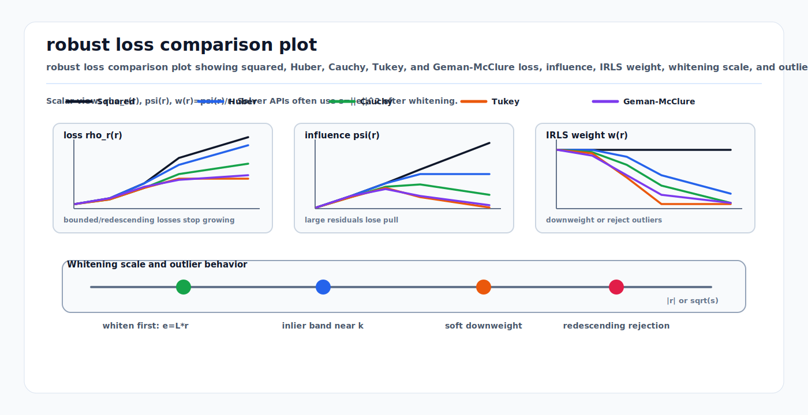

# Robust Losses and M-Estimators: Huber, Cauchy, Tukey, and Geman-McClure

<!-- kb-visual:start -->


*Visual: robust loss comparison plot showing squared, Huber, Cauchy, Tukey, and Geman-McClure loss, influence, IRLS weight, whitening scale, and outlier rejection behavior.*
<!-- kb-visual:end -->

Robust losses are the small mathematical wrapper that keeps a large estimator
from believing every residual equally. In SLAM, perception, calibration, and
tracking, the residual model is often locally useful but globally imperfect:
feature matches can be wrong, LiDAR points can belong to moving objects, radar
returns can be ghosts, GNSS can jump under multipath, and labels can be noisy.
Squared loss lets these residuals grow unlimited influence. Robust losses reduce
that influence after a residual becomes too large to look like an inlier.

## Related docs

- [Robust Statistics, RANSAC, and Hypothesis Testing](robust-statistics-ransac-hypothesis-testing.md)
- [Likelihood, MAP, MLE, and Least Squares](likelihood-map-mle-least-squares.md)
- [Gaussian Noise, Covariance, Information, Whitening, and Uncertainty Ellipses](gaussian-noise-covariance-information.md)
- [Mahalanobis and Chi-Square Gating](mahalanobis-chi-square-gating.md)
- [Nonlinear Least Squares from First Principles](../optimization/nonlinear-least-squares-first-principles.md)
- [Factor Graph Solver Patterns: Ceres, GTSAM, and g2o](../optimization/factor-graph-solver-patterns-ceres-gtsam-g2o.md)
- [GTSAM Factor Graph Optimization](../state-estimation/gtsam-factor-graphs.md)
- [Point Cloud Registration Math: ICP, NDT, and GICP](../geometry-3d/point-cloud-registration-math-icp-ndt-gicp.md)

## Why it matters for SLAM and perception

Robust losses show up wherever a stack minimizes residuals:

- ICP and point-to-plane registration downweight dynamic objects, mixed pixels,
  rain or snow speckles, and bad nearest-neighbor matches.
- Visual odometry and bundle adjustment downweight wrong feature tracks,
  rolling-shutter artifacts, occlusions, and reprojection outliers.
- Pose graph SLAM downweights false loop closures and weak GPS or map priors.
- GNSS and radar fusion downweight multipath and ghost returns after gating.
- Perception training uses Smooth L1 or Huber-style losses for box regression
  when labels or decoded boxes have heavy-tailed errors.

The loss is not a substitute for the sensor model. A robust kernel should be
applied after residuals are in comparable statistical units.

## Core math

For a whitened scalar residual `r`, ordinary least squares minimizes:

```text
rho(r) = 0.5 * r^2
```

The influence function is:

```text
psi(r) = d rho(r) / d r
```

For squared loss:

```text
psi(r) = r
```

Influence grows without bound, so one very large residual can dominate the
solution. An M-estimator replaces the quadratic penalty:

```text
min_x sum_i rho(r_i(x))
```

Many solvers implement this through iteratively reweighted least squares
(IRLS):

```text
w(r) = psi(r) / r
min_dx 0.5 * sum_i w(r_i) * (r_i + J_i dx)^2
```

For vector residual blocks, use the whitened norm:

```text
s_i = ||L_i r_i||^2
```

where `L_i` is the square-root information matrix. Robust thresholds are then
in whitened units, not raw meters, pixels, radians, or Doppler units.

## Common robust losses

For residual `r` and scale `k`:

| Loss | Behavior | Typical use |
|---|---|---|
| Squared | Influence grows linearly forever. | Clean Gaussian inliers with reliable associations. |
| Huber | Quadratic near zero, linear after `k`. | General-purpose SLAM, GNSS, visual reprojection, and mild outliers. |
| Cauchy | Logarithmic growth for large residuals. | More aggressive scan matching and map localization outlier rejection. |
| Tukey bisquare | Redescending; large residuals get near-zero influence. | Good initialization with clear gross outliers. |
| Geman-McClure | Bounded, nonconvex, strong rejection. | Robust PGO, GNC schedules, and high-outlier loop closure problems. |

Huber loss:

```text
rho(r) = 0.5 * r^2                 if |r| <= k
rho(r) = k * (|r| - 0.5 * k)       otherwise

w(r) = 1                           if |r| <= k
w(r) = k / |r|                     otherwise
```

Cauchy-style loss:

```text
rho(r) = 0.5 * k^2 * log(1 + (r / k)^2)
w(r) = 1 / (1 + (r / k)^2)
```

Tukey bisquare:

```text
rho(r) = (k^2 / 6) * (1 - (1 - (r / k)^2)^3)   if |r| <= k
rho(r) = k^2 / 6                               otherwise

w(r) = (1 - (r / k)^2)^2                       if |r| <= k
w(r) = 0                                       otherwise
```

Geman-McClure-style loss:

```text
rho(r) = r^2 / (r^2 + k^2)
w(r) = k^2 / (r^2 + k^2)^2
```

The exact constants vary across libraries. The operational question is the
same: how quickly should a residual lose influence as it leaves the inlier
noise band?

## Choosing a loss

| Situation | Prefer | Reason |
|---|---|---|
| First robustification pass | Huber | Convex and easier to optimize. |
| Scan matching with dynamic clutter | Cauchy or Huber | Keeps useful medium residuals while weakening strong outliers. |
| False loop closures after verification | GNC, switchable constraints, or Geman-McClure-style losses | Direct nonconvex robust losses can need a schedule or switch model. |
| Good initialization and gross outliers | Tukey or Geman-McClure | Redescending behavior can fully suppress bad measurements. |
| Poor initialization | Least squares, Huber, or graduated robustification | Strong redescending losses can ignore residuals needed for recovery. |
| Safety evidence and diagnostics | Huber plus gates and residual histograms | Easier to explain, tune, and audit. |

Use robust losses only on factors that can plausibly be outliers. IMU
preintegration, odometry continuity, and hard frame constraints usually need
different treatment from camera feature tracks, loop closures, radar detections,
or GNSS fixes.

## Whitening and scale

Robust loss scale should usually be set after whitening:

```text
e = L * r
cost = rho(||e||^2)
```

This is why a Huber threshold such as `k = 1.345` means roughly "number of
sigmas" in many factor-graph APIs, not 1.345 meters or pixels. If residuals are
not whitened first, a threshold that works for LiDAR meters will be meaningless
for camera pixels or IMU bias units.

Practical checks:

- Plot whitened residual histograms before and after robustification.
- Plot robust weights against residual magnitude.
- Separate residuals by sensor, range, class, weather, and map region.
- Log how many residuals are nearly ignored by a redescending loss.
- Compare pre-gate and post-gate innovation statistics to avoid selection bias.

## Failure modes

| Symptom | Likely cause | Diagnostic |
|---|---|---|
| One sensor still dominates | Covariance is too tight before robustification. | Inspect per-factor whitened residuals and weights. |
| Good data is ignored | Robust threshold is too low. | Plot weights and inlier residual distribution. |
| Solver converges to a bad local minimum | Nonconvex loss was applied too early. | Start with Huber or use graduated nonconvexity. |
| Map jumps after a loop closure | Robust loss cannot fix a plausible but wrong association alone. | Add geometric verification, switchable constraints, or loop quarantine. |
| Validation looks good only after rejection | Selection bias from gates and robust weights. | Report pre-gate and post-gate statistics separately. |
| Robust kernel hides model bias | Residual model is wrong by range, class, weather, or timing. | Bin residuals by operating condition and fix the model. |

## Sources

- Huber, "Robust Estimation of a Location Parameter": https://projecteuclid.org/journals/annals-of-mathematical-statistics/volume-35/issue-1/Robust-Estimation-of-a-Location-Parameter/10.1214/aoms/1177703732.full
- Ceres Solver, "LossFunction": https://ceres-solver.readthedocs.io/latest/nnls_modeling.html#lossfunction
- GTSAM Doxygen, `gtsam::noiseModel::Robust`: https://gtsam.org/doxygen/a04491.html
- SciPy, `scipy.optimize.least_squares`: https://docs.scipy.org/doc/scipy/reference/generated/scipy.optimize.least_squares.html
- Black and Rangarajan, "On the Unification of Line Processes, Outlier Rejection, and Robust Statistics with Applications in Early Vision": https://doi.org/10.1023/A:1008185302314
