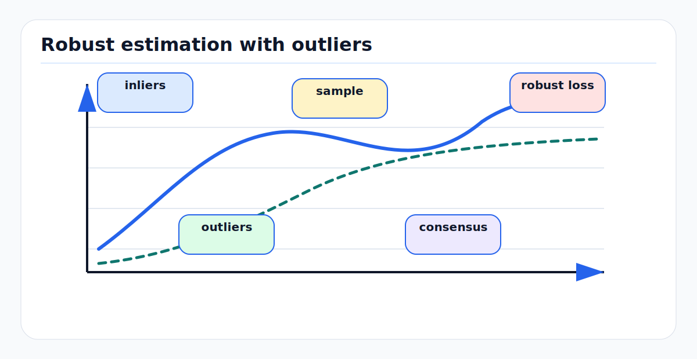

# Robust Statistics, RANSAC, and Hypothesis Testing

Robust estimation is what keeps a perception or mapping stack from treating bad
data as merely surprising good data. Gaussian least squares is powerful when the
model is right and residuals are light-tailed. Real AV data contains clutter,
occlusion, multipath, dynamic objects, annotation errors, calibration drift, and
wrong associations. Robust statistics, RANSAC, and hypothesis testing are
different ways to prevent those failures from dominating the estimate.

<!-- kb-figure:start -->


*Figure: how RANSAC and robust losses protect estimates from outlier-dominated residuals.*
<!-- kb-figure:end -->

## Related docs

- [Likelihood, MAP, MLE, and Least Squares](likelihood-map-mle-least-squares.md)
- [Gaussian Noise, Covariance, Information, Whitening, and Uncertainty Ellipses](gaussian-noise-covariance-information.md)
- [Mahalanobis and Chi-Square Gating](mahalanobis-chi-square-gating.md)
- [Mixture Models and Multimodal Beliefs](mixture-models-multimodal-beliefs.md)
- [GTSAM Factor Graph Optimization](../state-estimation/gtsam-factor-graphs.md)
- [Sensor Calibration and Time Synchronization](../geometry-3d/sensor-calibration-time-synchronization.md)

## Why it matters for AV, perception, SLAM, and mapping

Outliers are not rare edge cases in autonomy:

- A camera feature match may connect two visually similar but different lane
  markings.
- A LiDAR scan matcher may include moving vehicles as if they were static map
  structure.
- GNSS can jump under multipath while still reporting a covariance.
- Radar detections include ghosts and multipath reflections.
- Semantic landmarks can be confused by repeated objects, construction zones,
  and temporary signage.
- Loop closures can be geometrically plausible but globally wrong.

Classical least squares gives every squared residual unlimited influence. One
bad residual can bend a calibration, move a map, or pull a track into clutter.
Robust estimation changes the loss or the sample set so that large residuals do
not automatically dominate.

## First-principles math

### From squared loss to M-estimation

Gaussian MLE minimizes

```text
min_x 0.5 * sum_i r_i(x)^2
```

For vector residuals, use the squared whitened norm:

```text
s_i = ||R_i r_i(x)||^2
```

An M-estimator replaces the quadratic loss with a robust loss:

```text
min_x sum_i rho(s_i)
```

Ordinary least squares is the special case

```text
rho(s) = 0.5 * s
```

The influence of a scalar residual is controlled by

```text
psi(r) = d rho(r) / d r
```

Quadratic loss has influence proportional to `r`, so influence grows without
bound. Robust losses reduce or cap this influence.

### Common robust losses

For scalar whitened residual `r` and threshold `k`:

Huber loss:

```text
rho(r) = 0.5 r^2                  if |r| <= k
rho(r) = k (|r| - 0.5 k)          otherwise
```

Huber behaves like least squares near zero and like absolute error for large
residuals. It is convex and usually easier to optimize than redescending losses.

Cauchy-style loss:

```text
rho(r) = 0.5 k^2 log(1 + (r / k)^2)
```

This heavily weakens large outliers, but can make the objective more nonconvex.

Tukey-style redescending losses eventually give very large residuals near-zero
influence. They can be effective when the initialization is good and outliers
are extreme, but they can also ignore residuals that would have helped recover
from a bad initial estimate.

GTSAM's robust noise model separates the Gaussian noise model from the robust
estimator: first whiten residuals using the noise model, then apply the robust
weight. This matters because robust parameters such as a Huber threshold are in
whitened units, not raw meters or pixels.

### Iteratively reweighted least squares

Many robust objectives are solved by iteratively reweighted least squares
(IRLS). At iteration `t`, compute residuals and weights:

```text
w_i = psi(r_i) / r_i
```

Then solve

```text
min_dx 0.5 * sum_i w_i * (r_i + J_i dx)^2
```

For vector whitened residuals, weights are often applied to the residual block.
The robust objective becomes a wrapper around a standard least-squares step, an
implementation pattern also described in SciPy's least-squares documentation.

### RANSAC

RANSAC is a hypothesize-and-verify estimator. It does not try to make all data
fit. It repeatedly samples minimal subsets, fits a model, and scores how many
measurements agree with that model.

Algorithm:

```text
best_model = none
best_score = -inf
for iteration in 1..N:
    sample minimal subset
    fit model from subset
    compute residuals for all measurements
    inliers = measurements with residual <= threshold
    score model by inlier count or robust score
refit best_model using its inliers
```

If the inlier probability is `w`, the minimal sample size is `s`, and the
desired success probability is `p`, then the probability a sample is all inliers
is

```text
w^s
```

The probability that `N` samples all fail is

```text
(1 - w^s)^N
```

Set this to `1 - p` and solve:

```text
N >= log(1 - p) / log(1 - w^s)
```

RANSAC is valuable when outliers are numerous and structured, such as feature
matching for homography, fundamental matrix, essential matrix, PnP, plane
fitting, and loop-closure proposal validation. OpenCV's calibration and 3D
reconstruction module exposes RANSAC and USAC variants for these geometric
estimation problems.

### Hypothesis testing

Robust estimation is not just a loss function. It is also a decision process.
For a residual statistic `T`, define:

```text
H0: measurement is consistent with the model
H1: measurement is not consistent with the model
```

For Gaussian residuals:

```text
T = r^T S^-1 r
T ~ chi2(df = m) under H0
```

A significance level `alpha` gives rejection threshold:

```text
reject H0 if T > chi2_ppf(1 - alpha, df = m)
```

In tracking this becomes a validation gate. In SLAM it can reject a loop closure
candidate. In calibration it can flag samples whose residuals are not explained
by the assumed noise.

Important distinction:

- A gate rejects data before estimation.
- A robust loss downweights data during estimation.
- RANSAC proposes a clean consensus set before final fitting.
- A mixture model keeps multiple explanations alive instead of choosing one
  immediately.

## Implementation notes

- Always set robust thresholds in whitened units unless the library explicitly
  expects raw units.
- Use robust loss after a reasonable initial gate. Robust losses reduce damage
  from outliers, but they do not make arbitrary bad associations harmless.
- RANSAC thresholds should be tied to measurement noise. A 3 pixel threshold may
  be too tight for a wide-angle camera edge feature and too loose for a refined
  calibration target.
- Refit the final model on all inliers using the desired maximum-likelihood or
  MAP objective. The minimal-sample model is only a hypothesis.
- Track inlier ratio, residual distribution, and number of iterations. These are
  health signals, not debug-only details.
- Use deterministic seeds in regression tests and logged random seeds in
  production replay. RANSAC is stochastic; nondeterminism without traceability
  makes incident analysis hard.
- Prefer modern RANSAC variants such as PROSAC, LO-RANSAC, MAGSAC, or USAC when
  available for high-outlier computer-vision tasks.
- Do not use robust losses to hide a bad model. If residuals are biased by range,
  class, or weather, fix the model or split the noise model.

## Failure modes and diagnostics

| Symptom | Likely cause | Diagnostic |
|---|---|---|
| Robust solver still fails | Outlier rate too high or initialization too poor | Run RANSAC or add stronger proposal gating. |
| Solver ignores good measurements | Robust threshold too low | Plot weights versus whitened residuals. |
| RANSAC result varies run to run | Too few iterations or low inlier ratio | Log sample count, inlier ratio, and success probability. |
| RANSAC picks wrong structure | Dominant outlier structure | Visualize inlier mask and test semantic/dynamic filters. |
| Inlier threshold is brittle | Raw-unit threshold ignores heteroscedastic noise | Gate on Mahalanobis distance or range-dependent noise. |
| Loop closures pass but deform map | Plausible local geometry, wrong global association | Add independent checks: appearance, odometry consistency, and switchable constraints. |
| NIS looks good only after rejection | Selection bias | Compare pre-gate and post-gate statistics. |
| Robust cost converges to local minimum | Nonconvex loss and bad start | Use graduated nonconvexity or start with Huber/least squares. |

## Sources

- GTSAM Doxygen, `gtsam::noiseModel::Robust`: https://gtsam.org/doxygen/a04491.html
- SciPy, `scipy.optimize.least_squares`: https://docs.scipy.org/doc/scipy-1.13.0/reference/generated/scipy.optimize.least_squares.html
- SciPy, `scipy.special.huber`: https://docs.scipy.org/doc/scipy-1.13.0/reference/generated/scipy.special.huber.html
- Fischler and Bolles, "Random Sample Consensus," SRI publication page: https://www.sri.com/publication/artificial-intelligence-pubs/random-sample-consensus-a-paradigm-for-model-fitting-with-applications-to-image-analysis-and-automated-cartography-2/
- OpenCV, "USAC: Improvement of Random Sample Consensus": https://docs.opencv.org/4.x/de/d3e/tutorial_usac.html
- OpenCV, `calib3d` camera calibration and 3D reconstruction reference: https://docs.opencv.org/4.x/d9/d0c/group__calib3d.html
- NIST/SEMATECH e-Handbook of Statistical Methods, "Chi-Square Distribution": https://www.itl.nist.gov/div898/handbook/eda/section3/eda3666.htm
