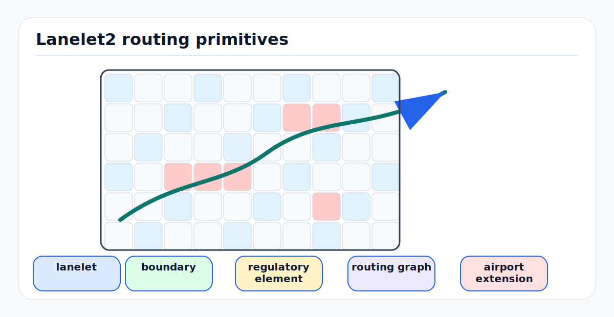

# Lanelet2 Map Representation for Autonomous Driving

<!-- kb-figure:start -->


*Figure: how lanelets, boundaries, regulatory elements, and routing graphs encode drivable structure.*
<!-- kb-figure:end -->

## Overview

Lanelet2 is an open-source C++ library developed at FZI Forschungszentrum Informatik (Karlsruhe Institute of Technology) for handling high-definition map data in autonomous driving. Released under a BSD 3-Clause license, it provides a complete framework -- not just a format -- encompassing map primitives, traffic rules interpretation, routing, coordinate projection, validation, and I/O. It uses the OpenStreetMap (OSM) XML format for persistence and benefits from OSM's mature tooling ecosystem.

The framework is designed around three core principles:
1. **Separation of physical and relational layers** -- observable features (markings, curbs) are distinct from semantic relationships (lanes, traffic rules)
2. **Extensibility** -- custom traffic rules, regulatory elements, projectors, and parsers can be plugged in without modifying the core
3. **Multi-participant support** -- a single map serves vehicles, bicycles, pedestrians, and emergency vehicles through different traffic rule interpretations

Lanelet2 is the primary map format for Autoware (the leading open-source autonomous driving stack) and is used in production and research systems worldwide.

---

## 1. Data Model

Lanelet2 divides the world into six hierarchical primitives, organized into a **physical layer** (observable real-world features) and a **relational layer** (semantic connections between physical features).

### 1.1 Physical Layer

#### Points

The atomic building block. Each point has:
- A unique ID
- A 3D coordinate (x, y, z in metric space; stored as lat, lon, ele in OSM)
- Key-value attribute tags

Points alone carry no semantic meaning. They gain significance when assembled into linestrings. Individual points can be tagged with `type=begin` (dash start), `type=end` (dash terminus), `type=pole` (guardrail post), or `type=dot` (dotted marking).

#### Linestrings

An ordered list of points with linear interpolation between them. Linestrings represent every physically observable boundary in the map: road markings, curbs, guard rails, walls, fences. They must contain at least one point and must not self-intersect.

Every linestring requires a `type` tag that determines its physical nature and directly controls whether lane changes are permitted across it:

| Type | Subtype | Lane Change Permitted? |
|------|---------|----------------------|
| `line_thin` | `solid` | No |
| `line_thin` | `dashed` | Yes |
| `line_thin` | `dashed_solid` | Left-to-right only |
| `line_thin` | `solid_dashed` | Right-to-left only |
| `line_thin` | `solid_solid` | No |
| `line_thick` | *(same subtypes)* | *(same rules)* |
| `curbstone` | `high` | No (impassable) |
| `curbstone` | `low` | No (passable, e.g. sidewalk beyond) |
| `virtual` | -- | No (non-physical boundary, used at intersections) |
| `road_border` | -- | No (end of passable area) |

Additional types that always prohibit lane changes: `guard_rail`, `wall`, `fence`, `jersey_barrier`, `gate`, `door`, `rail`, `keepout`, `zebra_marking`, `pedestrian_marking`, `bike_marking`.

Lane change behavior can be overridden with explicit tags:
- `lane_change=yes` -- permits bidirectional crossing regardless of type
- `lane_change:left=yes/no` and `lane_change:right=yes/no` -- directional overrides (must be used together)

Optional linestring attributes include `width` (meters), `height` (meters), `color` (default: white), and `temporary` (yes/no, for construction markings).

**Traffic signs** are represented as linestrings (or points) with `type=traffic_sign` and a region-specific identifier (e.g., `subtype=de206` for a German stop sign, `subtype=usR1-1` for a US stop sign).

**Traffic lights** use `type=traffic_light` with subtypes like `red_yellow_green`, `red_yellow`, `red`.

#### Polygons

Similar to linestrings but forming enclosed areas (first and last points are implicitly connected). Polygons are rarely used for core mapping; they serve as containers for custom area-based data. They are identified in OSM by the tag `area=yes` on a way element.

### 1.2 Relational Layer

#### Lanelets

The central primitive. A lanelet represents **one atomic section of a lane** -- the smallest undividable unit of directed travel. Each lanelet consists of:
- Exactly one **left bound** (linestring)
- Exactly one **right bound** (linestring)
- An optional **centerline** (linestring, auto-computed if absent)
- Zero or more **regulatory elements** (references)

Lanelets are **one-directional by default**. The direction follows the linestring point ordering (left bound and right bound must run in the same direction). Bidirectional lanelets require explicit `one_way=no` tagging.

**Adjacency rules**: Adjacent lanelets must share identical linestring endpoints. When a lanelet has multiple successors, it represents a divergence point (e.g., a fork). Adjacent lanelets that share a boundary linestring may permit lane changes depending on the boundary type.

**Core tags for lanelets**:

| Tag | Values | Default | Purpose |
|-----|--------|---------|---------|
| `type` | `lanelet` | auto-set | Identifies as lanelet |
| `subtype` | `road`, `highway`, `play_street`, `emergency_lane`, `bus_lane`, `bicycle_lane`, `exit`, `walkway`, `shared_walkway`, `crosswalk`, `stairs` | `road` | Controls inferred participants and speed |
| `location` | `urban`, `nonurban` | `urban` | Affects speed limit inference |
| `speed_limit` | e.g., `30 km/h` | inferred | Explicit override |
| `one_way` | `yes`/`no` | `yes` | Direction control |
| `participant:TYPE` | `yes`/`no` | inferred from subtype | Override participant access |
| `road_name` | string | -- | Road identifier |
| `road_surface` | `asphalt`, `concrete`, `dirt`, etc. | -- | Surface type |
| `region` | ISO 3166-2 code | -- | Country for traffic rules |

#### Areas

Areas represent **undirected traffic** within a bounded surface -- places where vehicles can move in any direction rather than following a lane. Examples: parking lots, pedestrian plazas, emergency pull-offs, intersections with free-form movement.

Areas are defined by an ordered list of linestrings in clockwise orientation forming the outer boundary, with optional counter-clockwise inner boundaries representing holes. They connect to lanelets by sharing a linestring (when parallel) or by sharing linestring endpoints (when a lanelet leads into the area).

Area subtypes include: `parking`, `freespace`, `vegetation`, `keepout`, `building`, `traffic_island`.

#### Regulatory Elements

The generic mechanism for expressing traffic rules. Regulatory elements are referenced by the lanelets or areas they affect. They consist of:
- A `type=regulatory_element` tag (auto-added)
- A `subtype` identifying the rule kind
- **Role-based references** to map primitives (linestrings, lanelets, polygons)

The five built-in subtypes are:

**TrafficLight** (`subtype=traffic_light`):
- `refers` role: the traffic light linestring/polygon
- `ref_line` role: optional stop line (defaults to lanelet end if omitted)

**TrafficSign** (`subtype=traffic_sign`):
- `refers` role: the sign itself
- `cancels` role: sign marking end of restriction
- `ref_line` / `cancel_line` roles: linestrings marking restriction boundaries

**SpeedLimit** (`subtype=speed_limit`):
- `refers` role: the speed limit sign
- Optional `sign_type` tag (e.g., `"50 km/h"`) for direct specification

**RightOfWay** (`subtype=right_of_way`):
- `right_of_way` role: lanelets with priority
- `yield` role: lanelets required to yield
- `ref_line` role: optional stop positions

**AllWayStop** (`subtype=all_way_stop`):
- `yield` role: all approaching lanelets
- `refers` role: constituent stop signs
- `ref_line` role: stop positions per lanelet

Optional tags on regulatory elements:
- `dynamic=yes/no` (default no): indicates the rule changes based on external conditions (e.g., speed limit active only when road is wet). By default Lanelet2 ignores dynamic elements.
- `fallback=yes/no` (default no): marks a lower-priority rule that activates when the primary rule fails (e.g., right-of-way rules that apply when traffic lights are broken).

### 1.3 Architecture: Pointer-Based Data Model

Lanelet2 primitives do not store data directly. Each primitive holds a **pointer** to an internal, uncopyable data object. This design has critical implications:

- **Copy semantics**: Copying a primitive copies only the pointer. All copies observe the same underlying data. Modifying a point through one linestring reference is visible to all other linestrings sharing that point.
- **2D/3D views**: The same data can be viewed as `Point2d` (x, y only) or `Point3d` (x, y, z). The underlying data is shared.
- **Inversions**: Linestrings and lanelets can be inverted (reversed order) with zero data copy overhead.
- **Const correctness**: A `ConstLinestring3d` guarantees immutability of all underlying data. Accessing its points yields `ConstPoint3d` objects that cannot be upgraded to mutable references.

The **LaneletMap** is the primary container, organized into **layers by primitive type** (point layer, linestring layer, lanelet layer, area layer, regulatory element layer). It supports:
- **Bounding box queries** via precalculated R-tree spatial indices
- **ID-based lookup** across all layers
- **Nearest-neighbor queries**

A **LaneletSubmap** is a lighter container that holds only explicitly added elements without pulling in transitive references (useful for extracting route segments without dragging in all regulatory element targets).

**CompoundLineString** and **CompoundPolygon** compose multiple atomic primitives into a single logical entity while internally maintaining separate pointers.

**Caching caveats**:
1. Lanelet centerlines are cached on first computation. Moving boundary points does not invalidate the cache.
2. LaneletMap spatial indices are precalculated. Moving points does not update the R-tree.

---

## 2. Routing on Lanelet Maps

The `lanelet2_routing` module constructs routing graphs at runtime from the map, traffic rules, and cost models. Unlike conventional map formats where the routing graph is predefined, Lanelet2 interprets it dynamically -- the same map produces different routing graphs for vehicles vs. pedestrians vs. bicycles.

### 2.1 Routing Graph Construction

Three inputs are required:

```cpp
LaneletMapPtr map = load("map.osm", Origin({49, 8}));
traffic_rules::TrafficRulesPtr rules =
    traffic_rules::TrafficRulesFactory::create(
        Locations::Germany, Participants::Vehicle);
routing::RoutingGraphPtr graph =
    routing::RoutingGraph::build(*map, *rules);
```

The traffic rules determine which lanelets are passable (e.g., a vehicle cannot use a `walkway` lanelet), making the routing graph participant-specific.

### 2.2 Lanelet Relations in the Graph

The routing graph encodes five relationship types between lanelets:

| Relation | Meaning |
|----------|---------|
| **Succeeding** | Next lanelet in the same lane |
| **Left** | Reachable via lane change to the left |
| **Right** | Reachable via lane change to the right |
| **Adjacent left/right** | Neighboring but unreachable (solid boundary) |
| **Conflicting** | Intersecting paths (e.g., at an intersection) |
| **Area** | Reachable area connection |

### 2.3 Route vs. Path vs. Sequence

These are distinct concepts in Lanelet2:

- **Route**: All lanelets that can be used to reach a destination without driving on a different road. A route includes lane-change alternatives and parallel lanes. It captures the full "corridor" of options.
- **LaneletPath**: An ordered sequence of individual lanelets/areas from start to goal, connected through successors and lane changes. A route contains multiple possible paths.
- **LaneletSequence**: A subset of a path consisting of consecutive lanelets without any lane changes -- effectively a single continuous lane segment.

### 2.4 Routing Cost Models

Built-in cost models include distance-based and travel-time-based calculations. Lane change costs are configurable separately from forward travel costs. Custom routing costs can be implemented by extending the `RoutingCost` base class:

```python
import lanelet2
from lanelet2 import routing

class CustomCost(routing.RoutingCost):
    def getCostSucceeding(self, trafficRules, from_, to):
        return 1.0  # uniform cost
    def getCostLaneChange(self, trafficRules, from_, to):
        return 5.0  # penalize lane changes
```

### 2.5 Key Query Operations

```cpp
// Shortest path
Optional<routing::LaneletPath> path =
    graph->shortestPath(from, to, routingCostId);

// Full route with lane-change options
Optional<routing::Route> route =
    graph->getRoute(from, to, routingCostId);

// All lanelets reachable within a cost budget
ConstLanelets reachable =
    graph->reachableSet(lanelet, maxCost, routingCostId);

// Possible paths from a lanelet
routing::LaneletPaths paths =
    graph->possiblePaths(lanelet, maxCost, routingCostId);
```

### 2.6 Multi-Participant Routing and Conflict Detection

A **RoutingGraphContainer** holds routing graphs for multiple participant types (vehicles, pedestrians, cyclists). This enables cross-domain conflict detection -- for example, finding lanelets where a vehicle route conflicts with a pedestrian crossing. The container supports both 2D and 3D conflict analysis (height-aware, distinguishing bridges from underpasses).

---

## 3. Regulatory Elements and Traffic Rules

### 3.1 The Traffic Rules Module

The `lanelet2_traffic_rules` package interprets the map from the perspective of a specific country and participant type. It answers three questions:
1. **Can this participant use this lanelet?** (`canPass()`)
2. **What is the speed limit here?** (`speedLimit()`)
3. **Can the participant change lanes here?** (`canChangeLane()`)

Traffic rules are instantiated via a factory:

```cpp
auto rules = TrafficRulesFactory::create(
    Locations::Germany, Participants::Vehicle);
```

The abstract `GenericTrafficRules` class implements behavior based on the tagging specification. Country-specific subclasses override interpretation of signs and default speed limits. The system uses ISO 3166-2 region codes to select the correct country interpretation.

### 3.2 Participant Type Hierarchy

Participants follow a hierarchical structure:
- `vehicle` (parent of `vehicle:car`, `vehicle:bus`, `vehicle:truck`, `vehicle:motorcycle`, `vehicle:taxi`, `vehicle:emergency`)
- `vehicle:car` (parent of `vehicle:car:electric`, `vehicle:car:combustion`)
- `pedestrian`
- `bicycle`

A traffic rule registered for `vehicle` automatically handles all vehicle subtypes. However, if a lanelet has `participant:vehicle:car=no` and `participant:vehicle:bus=yes`, a `Vehicle` rule reports the lanelet as impassable (conservative interpretation), while a `Vehicle:Bus` rule reports it as passable.

### 3.3 Speed Limit Determination

Speed limits are resolved in priority order:
1. Explicit `speed_limit` tag on the lanelet (e.g., `speed_limit=30 km/h`)
2. SpeedLimit regulatory element referencing the lanelet
3. Inferred from `subtype` + `location` combination (e.g., `road` + `urban` = city speed limit for that country)
4. Average participant speed for the road type (serves as a cap)

Fine-grained overrides are possible: `speed_limit:vehicle:bus=40 km/h` sets a bus-specific limit. `speed_limit_mandatory=no` marks advisory speeds.

### 3.4 Custom Traffic Rules

Custom traffic rule classes are registered via `RegisterTrafficRules`:

```cpp
static lanelet::RegisterTrafficRules<AirportTrafficRules> reg(
    "airport", Participants::Vehicle);
```

This mechanism allows airport-specific rule sets that interpret custom tags (e.g., taxiway speed limits, stand entry rules) without modifying the Lanelet2 core.

---

## 4. Airport-Specific Extensions

Lanelet2 was designed for road-based autonomous driving, but its extensibility makes it adaptable to airport airside operations. The framework provides three extension mechanisms: custom tags on existing primitives, custom regulatory elements, and custom traffic rule classes.

### 4.1 Mapping Airport Primitives to Lanelet2

| Airport Feature | Lanelet2 Primitive | Recommended Tags |
|----------------|-------------------|------------------|
| Taxiway centerline path | Lanelet (left/right bounds = taxiway edges) | `subtype=taxiway`, `location=airport` |
| Taxiway intersection | Area (free-form movement zone) | `subtype=taxiway_intersection` |
| Aircraft stand / parking position | Area | `subtype=aircraft_stand`, `stand_id=A1` |
| Apron / ramp area | Area | `subtype=apron`, `apron_name=Terminal1` |
| Vehicle service road | Lanelet | `subtype=service_road`, `participant:vehicle=yes` |
| Pedestrian walkway | Lanelet | `subtype=walkway` |
| Jet blast exclusion zone | Area | `subtype=keepout`, `hazard=jet_blast` |
| Runway crossing point | Lanelet with regulatory element | `subtype=runway_crossing` |
| Holding position (Cat I/II/III) | Regulatory element (custom) | `subtype=holding_position`, `category=CAT_III` |
| FOD (Foreign Object Debris) zone | Area | `subtype=keepout`, `hazard=fod_risk` |

### 4.2 Custom Regulatory Elements for Airside

Airport operations require regulatory elements beyond the standard road set:

**Holding Position** -- Analogous to a stop line, but with categories (CAT I, II, III) that determine when an autonomous vehicle must stop relative to runway operations:

```cpp
class HoldingPosition : public lanelet::RegulatoryElement {
public:
    static constexpr char RuleName[] = "holding_position";

    // The stop line where the vehicle must hold
    ConstLineString3d stopLine() const {
        return getParameters<ConstLineString3d>(RoleName::RefLine).front();
    }

    // Category determines the distance from the runway
    std::string category() const {
        return attribute("category").value();
    }

private:
    friend class RegisterRegulatoryElement<HoldingPosition>;
    explicit HoldingPosition(const RegulatoryElementDataPtr& data)
        : RegulatoryElement(data) {}
};
```

**Clearance Required Zone** -- Areas requiring ATC clearance before entry (e.g., active runway crossings):

```
type=regulatory_element
subtype=clearance_required
refers=<area_id>
ref_line=<stop_line_id>
```

**Speed Restriction Zone** -- Airport-specific speed limits that vary by vehicle type and zone:

```
type=regulatory_element
subtype=speed_limit
sign_type=15 km/h
dynamic=yes  # may change based on operational status
```

**Right of Way for Aircraft** -- Aircraft always have priority over ground vehicles. This can be modeled as a `right_of_way` regulatory element where all vehicle lanelets near an active taxiway are in the `yield` role.

### 4.3 Taxiway Naming Conventions (ICAO)

Taxiways follow ICAO naming conventions that should be preserved as tags:
- Single letters (Alpha, Bravo, Charlie...) excluding India (I), Oscar (O), and X-ray (X) to avoid confusion with runway numbers
- Designation progresses logically from one end of the airport to the other
- Stub taxiways use double letters (e.g., AA, AB)
- Apron connector taxiways may use prefixed names (e.g., NC = North Cargo, TA = Terminal A)

These designators map to Lanelet2 tags: `taxiway_id=A`, `road_name=Taxiway Alpha`.

### 4.4 Jet Blast Zones

Jet blast hazard areas vary by aircraft type and engine power setting (idle vs. breakaway thrust). These map to Lanelet2 `keepout` areas with additional attributes:

```
type=multipolygon
subtype=keepout
hazard=jet_blast
aircraft_category=C  # ICAO aircraft category
thrust_setting=breakaway
blast_distance_m=120
```

Dynamic jet blast zones (varying with which stands are occupied and by what aircraft type) require the `dynamic=yes` tag and runtime resolution by a custom traffic rules implementation.

### 4.5 Stands and Apron Areas

Aircraft stands follow ICAO Annex 14 definitions:
- Each stand is an Area with `subtype=aircraft_stand`
- Stand designators (e.g., `stand_id=42L`) follow airport-specific numbering
- Visual Docking Guidance System (VDGS) positions can be marked as points within the stand area
- Stands connect to apron taxilanes (modeled as lanelets) and the apron area itself

Apron areas are modeled as large Areas (`subtype=apron`) containing or adjacent to stands. The apron boundary is typically defined by painted lines or physical barriers, both representable as linestrings.

---

## 5. AIXM/AMXM to Lanelet2 Conversion

### 5.1 Source Data Formats

**AIXM (Aeronautical Information Exchange Model)** version 5.1 is the international standard for aeronautical data exchange. It is a GML 3.2.1-compliant XML schema covering:
- RunwayElement, RunwayDisplacedArea, RunwayIntersection
- TaxiwayElement (with type, width, shoulder width, length)
- ApronElement (polygon geometry with surface properties)
- AircraftStand (designator, type, visual docking system info)
- TaxiwayHoldingPosition
- Surface data (composition, PCN, contamination)

AIXM uses a temporality model (time slices) for tracking feature validity over time.

**AMXM (Aerodrome Mapping Exchange Model)** is a EUROCAE/RTCA specification for Aerodrome Mapping Databases (AMDB). It consists of a UML model and a GML 3.2 XML schema. AMXM covers the spatial layout of an aerodrome in terms of features represented as points, lines, or polygons with attributes like surface type.

AMXM features include: runways, taxiways, aprons, parking stands, buildings, lighting fixtures, taxiway guidance lines, intersections, holding positions, service roads, frequency areas, and markings.

### 5.2 Conversion Pipeline

A conversion from AIXM/AMXM to Lanelet2 requires:

1. **Geometry extraction**: Parse GML geometries (polygons, lines, points) from AIXM/AMXM XML
2. **Coordinate transformation**: Convert from the source CRS (typically WGS84 geographic coordinates) to Lanelet2's metric coordinate system via the appropriate projector
3. **Feature mapping**:
   - `TaxiwayElement` polygons -> derive left/right boundary linestrings -> create lanelets with `subtype=taxiway`
   - `ApronElement` polygons -> create Areas with `subtype=apron`
   - `AircraftStand` points/polygons -> create Areas with `subtype=aircraft_stand`
   - `TaxiwayHoldingPosition` lines -> create linestrings + holding position regulatory elements
   - `RunwayElement` polygons -> create Areas with `subtype=keepout` (for ground vehicle maps, runways are typically no-go zones)
4. **Topology construction**: Build lanelet adjacency by sharing boundary linestrings at taxiway intersections. Ensure endpoints match exactly for routing connectivity.
5. **Regulatory element generation**: Create holding positions, speed limits, and clearance requirements from AIXM operational status data
6. **Validation**: Run `lanelet2_validate` to check topological consistency

### 5.3 Key Challenges

- **Polygon-to-lanelet conversion**: AIXM taxiways are polygons; Lanelet2 lanelets require left/right boundary linestrings. This requires extracting or computing boundary curves from polygon edges, which can be ambiguous at intersections.
- **Temporal data**: AIXM time slices model feature validity (e.g., a taxiway closed for maintenance). Lanelet2 has no native temporal model, requiring an external layer to manage dynamic state.
- **Level of detail**: AMXM provides detailed marking and lighting data that has no direct Lanelet2 equivalent but can be stored as custom tags or additional linestrings.
- **Coordinate precision**: Airport surveys typically use local airport coordinate systems or national grid references. Careful datum transformation is needed.

---

## 6. Dynamic Zones (NOTAMs, Construction)

### 6.1 The Challenge

Airport environments change frequently: NOTAMs close taxiways, construction zones appear, jet blast zones shift with aircraft movements, and weather conditions alter operational constraints. Lanelet2's base design treats maps as static, but its extensibility supports dynamic overlays.

### 6.2 Approaches for Dynamic Zone Integration

**Tag-based dynamic markers**: Regulatory elements with `dynamic=yes` signal that a rule's applicability depends on runtime state. A custom `TrafficRules` implementation resolves these by querying external state (NOTAM feeds, ATC commands, stand allocation systems).

**Map overlay pattern**: Maintain a base Lanelet2 map representing the permanent infrastructure. Apply runtime modifications as a separate layer:

```python
import lanelet2

base_map = lanelet2.io.load("airport_base.osm", origin)

# NOTAM: Taxiway B closed
for ll in base_map.laneletLayer:
    if ll.attributes.get("taxiway_id") == "B":
        ll.attributes["participant:vehicle"] = "no"

# Construction zone: add keepout area
construction_area = create_area_from_polygon(construction_coords)
construction_area.attributes["subtype"] = "keepout"
construction_area.attributes["hazard"] = "construction"
construction_area.attributes["notam_id"] = "A1234/26"
construction_area.attributes["valid_from"] = "2026-03-20T00:00Z"
construction_area.attributes["valid_until"] = "2026-04-15T23:59Z"
base_map.add(construction_area)
```

**Geofencing integration**: Dynamic geofences (keep-in/keep-out zones) translate to:
- **Keep-out**: Add `keepout` areas or set `participant:vehicle=no` on affected lanelets
- **Keep-in**: Restrict the routing graph to a subset of lanelets by modifying traffic rules to report out-of-zone lanelets as impassable
- **Conditional zones**: Use `dynamic=yes` regulatory elements with custom resolution logic

**NOTAM-to-map pipeline**:
1. Parse NOTAM text or structured NOTAM data (AIXM Digital NOTAM)
2. Identify affected geographic features (taxiway designator, runway, apron area)
3. Resolve to map primitives via taxiway/runway ID tags
4. Apply restrictions: close lanelets, add keepout areas, modify speed limits
5. Rebuild routing graph with updated traffic rules
6. When NOTAM expires, revert changes

### 6.3 Temporal Validity

Lanelet2 has no built-in temporal model. For airport operations, a wrapper layer should:
- Track NOTAM validity periods and automatically apply/remove restrictions
- Version map states for logging and replay
- Integrate with stand allocation and ATC systems for real-time updates

---

## 7. OSM Format and Tagging

### 7.1 Primitive-to-OSM Mapping

Lanelet2 maps are stored as standard OSM XML (`.osm` files). The mapping is direct:

| Lanelet2 Primitive | OSM Element | Identifying Tags |
|-------------------|-------------|-----------------|
| Point | `<node>` | `ele` tag for z-coordinate |
| LineString | `<way>` | type/subtype tags |
| Polygon | `<way>` | `area=yes` |
| Lanelet | `<relation>` | `type=lanelet` |
| Area | `<relation>` | `type=multipolygon` |
| Regulatory Element | `<relation>` | `type=regulatory_element` |

### 7.2 Relation Member Roles

**Lanelet relations** have exactly these members:
- Way with role `right` (right bound linestring)
- Way with role `left` (left bound linestring)
- Way with role `centerline` (optional)
- Relation with role `regulatory_element` (zero or more)

Any additional members cause a parse error.

**Area relations** (type=multipolygon):
- Ways with role `outer` (ordered outer boundary segments)
- Ways with role `inner` (ordered inner boundary segments for holes)

**Regulatory element relations** translate parameters directly to member roles (`refers`, `ref_line`, `cancel_line`, `yield`, `right_of_way`, etc.).

### 7.3 Coordinate Storage

Points store geographic coordinates as OSM node attributes:
- `lat` and `lon`: WGS84 latitude and longitude
- `ele` tag: z-coordinate (distance to WGS84 ellipsoid)

On loading, Lanelet2 reprojects these to metric (Cartesian) coordinates using the specified projector and origin point. The origin should be close to the map area for projection accuracy.

### 7.4 ID Conventions

Positive IDs are recommended. Some OSM editors treat negative IDs as uncommitted/modifiable. Lanelet2 supports any integer ID but positive values avoid tool compatibility issues.

### 7.5 Example OSM Structure

```xml
<?xml version='1.0' encoding='UTF-8'?>
<osm version='0.6'>
  <!-- Point -->
  <node id='1' lat='49.0' lon='8.0'>
    <tag k='ele' v='0.0'/>
  </node>
  <node id='2' lat='49.0001' lon='8.0'>
    <tag k='ele' v='0.0'/>
  </node>

  <!-- LineString (road marking) -->
  <way id='10'>
    <nd ref='1'/><nd ref='2'/>
    <tag k='type' v='line_thin'/>
    <tag k='subtype' v='dashed'/>
    <tag k='color' v='white'/>
  </way>

  <!-- Lanelet -->
  <relation id='100'>
    <member type='way' ref='10' role='left'/>
    <member type='way' ref='11' role='right'/>
    <member type='relation' ref='200' role='regulatory_element'/>
    <tag k='type' v='lanelet'/>
    <tag k='subtype' v='road'/>
    <tag k='location' v='urban'/>
    <tag k='speed_limit' v='30 km/h'/>
  </relation>

  <!-- Regulatory Element (speed limit) -->
  <relation id='200'>
    <member type='way' ref='30' role='refers'/>
    <tag k='type' v='regulatory_element'/>
    <tag k='subtype' v='speed_limit'/>
    <tag k='sign_type' v='30 km/h'/>
  </relation>
</osm>
```

---

## 8. Tools

### 8.1 JOSM Editor

JOSM (Java OpenStreetMap Editor) is the primary map editing tool for Lanelet2. Setup requires:

1. **Map Paint Styles**: Add `lanelets.mapcss` and `lines.mapcss` via Preferences -> Map Settings -> Map Paint Styles. These provide visualization of the physical layer (markings, boundaries) and the relational layer (lanelets, areas).
2. **Tagging Presets**: Add `laneletpresets.xml` via Preferences -> Map Settings -> Tagging Presets. This adds a `Presets -> lanelet2` menu for creating properly-tagged elements.
3. **PicLayer Plugin**: For overlaying satellite imagery or point cloud raster images as reference backgrounds.

**JOSM strengths**: Excellent for manipulating linestrings (cut, split, create curves), bulk tag editing, and relation management. **JOSM limitations**: Not designed for creating complex relations like multi-member regulatory elements; this often requires scripting assistance.

### 8.2 Vector Map Builder (TIER IV)

A web-based tool at `tools.tier4.jp` for creating Autoware-compatible Lanelet2 maps. Key features:
- Browser-based, no installation required
- Point cloud overlay for precise feature placement
- GUI for creating lanelets, areas, and regulatory elements
- Exports directly to Lanelet2 `.osm` format
- Requires a TIER IV account

### 8.3 lanelet2_validate

Command-line validation tool built with the framework:

```bash
lanelet2_validate airport_map.osm --lat 51.88 --lon -1.29
```

Three categories of validators:
1. **Map validators**: Check primitive tags, positioning, topology (e.g., self-intersecting linestrings, missing type tags)
2. **Traffic rule validators**: Find primitives that cannot be interpreted by the specified traffic rules (e.g., missing speed limit information)
3. **Routing graph validators**: Detect disconnected lanelets, unreachable islands, dead-end routes

Validators follow the single-responsibility principle (one check per validator) and are extensible via `RegisterMapValidator<CustomValidator>`.

Autoware provides an additional `autoware_lanelet2_map_validator` with Autoware-specific checks (elevation tags, turn directions, traffic light formatting).

### 8.4 CommonRoad Scenario Designer

Python tool for converting between map formats:

```bash
pip install commonroad-scenario-designer
crdesigner --input_file map.xodr --output_file map.osm odrlanelet2
```

Supports OpenDRIVE-to-Lanelet2 conversion (straightforward) and provides a GUI for scenario editing.

### 8.5 FlexMap Fusion (TUM)

A ROS 2 tool for map georeferencing and OSM data fusion, allowing integration of public OpenStreetMap road data with Lanelet2 maps.

---

## 9. ROS Integration

### 9.1 ROS 2 Packages

Lanelet2 is available as pre-built ROS packages:

```bash
sudo apt install ros-${ROS_DISTRO}-lanelet2
```

Supported distributions: ROS 1 (Melodic, Noetic), ROS 2 (Foxy, Humble, Iron, Jazzy, Rolling). Also available via PyPI (`pip install lanelet2`) for standalone Python use.

### 9.2 Autoware Integration

Autoware uses Lanelet2 as its primary map format with the `autoware_lanelet2_extension` package providing:

**Map loading**: The `lanelet2_map_loader` node loads `.osm` files and projects them into MGRS grid coordinates. It publishes the map as `lanelet_msgs::MapBin` (binary serialized map).

**Visualization**: The `lanelet2_map_visualizer` node subscribes to `MapBin` and produces `visualization_msgs::MarkerArray` for RViz display, converting:
- Lanelets -> triangle markers (filled polygons)
- LineStrings -> line strip markers
- Traffic lights -> colored triangle markers

**Map TF generator**: The `map_tf_generator` publishes a transform frame at the map center for RViz camera positioning.

### 9.3 Autoware Format Extensions

Autoware extends the base Lanelet2 format with:

| Extension | Purpose |
|-----------|---------|
| `ele` tag on all nodes | Required for 3D traffic light recognition |
| `turn_direction` on intersection lanelets | Turn indicator activation (`left`, `right`, `straight`) |
| `local_x`, `local_y` on nodes | Non-georeferenced local coordinate maps |
| `MetaInfo` element | `format_version` and `map_version` tracking |
| Light bulb linestrings | Individual bulb colors/arrows for traffic light detection |
| `no_drivable_lane` tag | Marks lanelets outside the operational design domain |
| Detection areas | Custom regulatory element for object detection triggers |
| No stopping/parking areas | Custom regulatory elements for restricted zones |
| Speed bumps | Custom regulatory element for speed reduction |
| Crosswalk polygons | Accurate crosswalk area definition beyond basic lanelet bounds |

### 9.4 Python API in ROS

```python
import lanelet2
from lanelet2 import core, io, projection, routing, traffic_rules

# Load map
projector = projection.UtmProjector(lanelet2.io.Origin(51.88, -1.29))
map_data = io.load("/path/to/airport.osm", projector)

# Create traffic rules
rules = traffic_rules.create(
    traffic_rules.Locations.Germany,  # or custom airport rules
    traffic_rules.Participants.Vehicle)

# Build routing graph
graph = routing.RoutingGraph(map_data, rules)

# Query shortest path
path = graph.shortestPath(
    map_data.laneletLayer[100],
    map_data.laneletLayer[200])

# Spatial queries
from lanelet2 import geometry
point = core.BasicPoint2d(100.0, 200.0)
nearby = map_data.laneletLayer.nearest(point, 5)

# Object matching
from lanelet2 import matching
obj = matching.Object2d(1, core.BasicPoint2d(100.0, 200.0), [])
matches = matching.getDeterministicMatches(map_data, obj, 4.0)
```

---

## 10. Coordinate Systems and Projections

### 10.1 Storage vs. Runtime Coordinates

**Stored** (in `.osm` files): WGS84 geographic coordinates (lat, lon) with elevation tag (ele).

**Runtime** (in memory): Metric Cartesian coordinates (x, y, z in meters) after projection.

### 10.2 Available Projectors

| Projector | Use Case | Notes |
|-----------|----------|-------|
| `UtmProjector` | General purpose | UTM zones, max 0.04% distance distortion. Default uses EPSG:25832 (ETRF89). |
| `MercatorProjector` | Legacy (Lanelet1) | Custom reference point. Not recommended. |
| `LocalCartesianProjector` | Small areas, proper elevation handling | Similar to UTM but treats elevation correctly. Good for airports. |
| `GeocentricProjector` | Global applications | Earth-centered Cartesian. |
| `MGRSProjector` | Autoware integration | Military Grid Reference System, used by Autoware for map loading. |

### 10.3 Origin Point

Every projection requires an origin point (latitude, longitude) close to the map area. This origin defines the local coordinate frame's zero point. For airport maps, the aerodrome reference point (ARP) is the natural origin.

### 10.4 Tectonic Drift Consideration

Lanelet2 defaults to ETRF89 (European Terrestrial Reference Frame 1989), which drifts ~2.5 cm/year relative to WGS84. Since 1989, this accumulates to >0.5 m of offset. For airport applications requiring centimeter accuracy:
- Use `LocalCartesianProjector` which handles this correctly
- Or explicitly account for the epoch when transforming GPS coordinates

### 10.5 Point Cloud Alignment

For maps created from LiDAR surveys:
- The point cloud and vector map must share the same coordinate system
- Autoware loads PCD files directly as (x, y, z) and projects Lanelet2 maps from lat/lon
- Alignment is achieved by ensuring both use the same projection origin

---

## 11. Comparison with Other Map Formats

### 11.1 Lanelet2 vs. OpenDRIVE

| Aspect | Lanelet2 | OpenDRIVE |
|--------|----------|-----------|
| **Modeling approach** | Bottom-up: boundaries define lanes | Top-down: reference line with lane offsets |
| **Complexity** | Simple, flexible, interpretive | Structured, standardized, prescriptive |
| **Primary use** | Real-world autonomous driving | Simulation |
| **File format** | OSM XML (`.osm`) | Custom XML (`.xodr`) |
| **Lane representation** | Left/right boundary linestrings | Offset from road reference line |
| **Extensibility** | Custom tags, regulatory elements, traffic rules | Fixed schema with user data extensions |
| **Open-source tooling** | Full framework (routing, validation, rules) | Format spec only; tools mostly commercial |
| **Conversion** | OpenDRIVE -> Lanelet2: straightforward | Lanelet2 -> OpenDRIVE: very difficult |
| **Adoption** | Autoware, research, real-world deployment | Simulation (CARLA, VTD, esmini) |
| **Non-road environments** | Extensible to airports, warehouses | Road-focused |

OpenDRIVE defines roads relative to a parametric reference line (typically the road centerline), with lanes specified as lateral offsets along this line. This is mathematically precise but conceptually complex and rigid. Lanelet2's boundary-based approach is more intuitive for representing real-world features observed by sensors and more naturally handles irregular geometries (like airport aprons).

### 11.2 Lanelet2 vs. HERE HD Live Map

| Aspect | Lanelet2 | HERE HD Live Map |
|--------|----------|-----------------|
| **Type** | Open-source framework | Commercial cloud service |
| **Update model** | Manual map editing | Near-real-time crowd-sourced updates |
| **Format** | OSM XML | NDS (Navigation Data Standard) |
| **Coverage** | User-created per deployment | Global road network |
| **Cost** | Free | Subscription-based |
| **Customizability** | Fully extensible | Fixed schema |
| **Offline operation** | Full offline capability | Cloud-dependent for updates |
| **Airport support** | Extensible with custom elements | Road-focused |

HERE HD Live Map provides lane-level detail with near-real-time updates from fleet sensor data, making it suitable for highway ADAS. However, its proprietary NDS format, cloud dependency, and road-only focus make it unsuitable for closed airport environments where Lanelet2's offline, extensible design is a better fit.

### 11.3 Lanelet2 vs. NDS.Live

NDS (Navigation Data Standard) is a database-oriented binary format designed for embedded automotive systems. NDS.Live extends it for autonomous driving with HD layers. Key differences from Lanelet2:
- Binary tile-based format vs. OSM XML
- Designed for global-scale maps with incremental updates vs. deployment-specific maps
- Governed by an industry association (BMW, Mercedes, HERE) vs. academic open-source
- More complex data model optimized for storage efficiency vs. human-readable simplicity

### 11.4 Suitability for Airport Operations

For airport airside autonomous vehicles, Lanelet2 has clear advantages:
- **Extensibility**: Custom airport primitives without format modification
- **Offline-first**: Airport networks are isolated, fixed environments
- **Open source**: Full visibility and control over map interpretation
- **Autoware integration**: Direct path to a production autonomous driving stack
- **Validation**: Built-in tools for checking map consistency

---

## 12. Map Creation Workflow for New Airports

### 12.1 Data Acquisition

**Option A: LiDAR Survey**
1. Conduct mobile mapping survey of the airside area using vehicle-mounted LiDAR + IMU + GNSS
2. Process raw data through SLAM pipeline (e.g., LeGO-LOAM, LIO-SAM) to produce georeferenced point cloud
3. Export as PCD files for both localization (full density) and map creation (filtered)

**Option B: Aerial Imagery + Existing Data**
1. Obtain high-resolution aerial/satellite imagery of the airport
2. Acquire AMDB (Aerodrome Mapping Database) data if available (provides surveyed geometry)
3. Obtain airport AIP (Aeronautical Information Publication) charts for taxiway layouts

**Option C: Combined Approach** (recommended)
1. LiDAR survey for precise 3D geometry and localization map
2. AMDB/AIXM data for authoritative feature identification (taxiway designators, stand numbers)
3. Aerial imagery for visual verification and gap-filling

### 12.2 Map Authoring

**Step 1: Prepare reference data**
- Convert point cloud to 2D occupancy grid (PGM/PNG) for JOSM overlay
- Set the projection origin to the aerodrome reference point (ARP)
- If using AMDB data, convert polygon geometries to boundary linestrings

**Step 2: Create physical layer in JOSM**
- Load the point cloud raster via PicLayer plugin
- Enable Lanelet2 map paint styles and tagging presets
- Trace taxiway edges as linestrings with appropriate types (`curbstone:low`, `line_thin:solid`, or `virtual` depending on the boundary type)
- Mark stand boundaries, apron edges, and service road markings
- Add traffic sign and holding position point/linestring features
- Georeference: ensure JOSM initial scale matches the raster resolution (resolution x 100)

**Step 3: Create relational layer**
- Build lanelets from pairs of boundary linestrings (left/right roles)
- Tag lanelets with airport-specific subtypes and attributes
- Create areas for stands, aprons, and exclusion zones
- Ensure topological connectivity: adjacent lanelets share endpoints; lanelets entering areas share linestring endpoints with the area boundary

**Step 4: Add regulatory elements**
- Create holding position regulatory elements at runway crossings
- Add speed limit regulatory elements per zone
- Create clearance-required regulatory elements for controlled areas
- Link regulatory elements to affected lanelets/areas

**Step 5: Add metadata**
- Tag all lanelets with taxiway designators and zone identifiers
- Add surface type information (`road_surface=concrete`)
- Set the `region` tag for traffic rule selection
- Add elevation (`ele`) to all points for 3D operations

### 12.3 Validation

```bash
# Basic validation
lanelet2_validate airport.osm --lat 51.88 --lon -1.29

# With traffic rules validation (using custom airport rules)
lanelet2_validate airport.osm --lat 51.88 --lon -1.29 \
    --participant vehicle --location airport
```

Custom validators for airport maps should check:
- All lanelets have taxiway designators
- All stands are reachable via the routing graph
- No disconnected lanelet islands exist
- Holding positions exist at all runway crossings
- Speed limits are defined for all zones
- Keepout areas do not overlap with drivable lanelets

### 12.4 Integration Testing

1. Load the map in RViz with point cloud overlay to visually verify alignment
2. Build a routing graph and verify routes between key locations (stands to taxiways, gate to gate)
3. Run path planning between all stand pairs to confirm full connectivity
4. Test object matching to verify vehicles localize correctly within lanelets
5. Simulate NOTAM scenarios (taxiway closure) and verify route recalculation

### 12.5 Maintenance

- **Version control**: Store `.osm` files in git; the XML format produces meaningful diffs
- **Change management**: Track map modifications with `MetaInfo` format/map version tags
- **Periodic resurvey**: Re-validate against updated AMDB data and new aerial imagery
- **Dynamic overlay management**: Maintain a pipeline from NOTAM feed to map overlay application

---

## Key References

- Poggenhans, F. et al. "Lanelet2: A high-definition map framework for the future of automated driving." IEEE ITSC 2018.
- FZI Lanelet2 repository: https://github.com/fzi-forschungszentrum-informatik/Lanelet2
- Lanelet2 core documentation (primitives): https://github.com/fzi-forschungszentrum-informatik/Lanelet2/blob/master/lanelet2_core/doc/LaneletPrimitives.md
- Lanelet2 architecture: https://github.com/fzi-forschungszentrum-informatik/Lanelet2/blob/master/lanelet2_core/doc/Architecture.md
- Lanelet2 routing: https://github.com/fzi-forschungszentrum-informatik/Lanelet2/blob/master/lanelet2_routing/README.md
- Lanelet2 traffic rules: https://github.com/fzi-forschungszentrum-informatik/Lanelet2/blob/master/lanelet2_traffic_rules/README.md
- Regulatory element tagging: https://github.com/fzi-forschungszentrum-informatik/Lanelet2/blob/master/lanelet2_core/doc/RegulatoryElementTagging.md
- Linestring tagging: https://github.com/fzi-forschungszentrum-informatik/Lanelet2/blob/master/lanelet2_core/doc/LinestringTagging.md
- Lanelet/area tagging: https://github.com/fzi-forschungszentrum-informatik/Lanelet2/blob/master/lanelet2_core/doc/LaneletAndAreaTagging.md
- Map format (OSM): https://github.com/fzi-forschungszentrum-informatik/Lanelet2/blob/master/lanelet2_maps/README.md
- Projections: https://github.com/fzi-forschungszentrum-informatik/Lanelet2/blob/master/lanelet2_projection/doc/Map_Projections_Coordinate_Systems.md
- Autoware Lanelet2 extensions: https://github.com/autowarefoundation/autoware_lanelet2_extension/blob/main/autoware_lanelet2_extension/docs/lanelet2_format_extension.md
- OpenDRIVE to Lanelet2 conversion: https://muetsch.io/how-to-convert-opendrive-to-lanelet2.html
- JOSM map creation tutorial: https://zhibopotame.github.io/tech/2022/10/08/hd_map_with_josm.html
- AIXM specification: https://aixm.aero/page/aixm-51-specification
- AMXM specification: https://amxm.aero/page/about-amxm
- EUROCONTROL aerodrome mapping: https://ext.eurocontrol.int/aixm_confluence/display/ACGAMD/Movement+Area+Management
- FAA AGVS guidance: https://www.faa.gov/airports/new_entrants/agvs_on_airports
- Vector Map Builder: https://tools.tier4.jp/feature/vector_map_builder_ll2
- Autoware map creation guide: https://autowarefoundation.github.io/autoware-documentation/main/how-to-guides/integrating-autoware/creating-maps/
