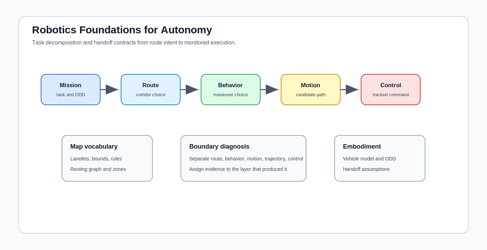

# Robotics Foundations for Autonomy

<!-- kb-visual:start -->

*Visual: section-level autonomy-role diagram showing robotics foundations, autonomy problem classes, stack interfaces, reading paths, and failure diagnosis.*
<!-- kb-visual:end -->

## Why This Foundation Exists

Robotics gives autonomy its task vocabulary. It separates the robot, environment, route, behavior, motion plan, trajectory, controller, and operational constraints so teams can assign responsibilities instead of treating the stack as one undifferentiated planning block.

This foundation exists because many autonomy reviews fail at boundaries. A route planner, behavior planner, motion generator, trajectory validator, and controller can all be called planning, but they own different assumptions and leave different evidence when something goes wrong.

## What This Field Studies From First Principles

Robotics studies embodied agents acting under constraints. This section focuses on autonomy decomposition, route and behavior planning, motion and trajectory generation, Lanelet2 map vocabulary, embodiment assumptions, and handoff contracts between planning layers and downstream control.

The key first-principles question is what problem is being solved at each layer: where to go, what maneuver to choose, what path or trajectory to generate, what constraints validate it, and what controller can track it.

## Autonomy Problem Map

Robotics spans task framing, planning vocabulary, map primitives, embodiment, and handoff contracts. It consumes mission goals, maps, scene state, operational rules, and vehicle assumptions. It produces route intent, behavior decisions, motion candidates, trajectory contracts, and review language for stack boundaries.

The autonomy risk is boundary collapse. If every failure is called a planner bug, teams can miss whether the route was impossible, the behavior was unsafe, the motion trajectory was infeasible, or the controller contract was underspecified.

## Core Mental Model

Think in layers with explicit contracts. Route planning chooses the corridor. Behavior planning chooses the maneuver. Motion planning generates candidate movement. Trajectory generation adds timing and feasibility. Control tracks the reference. Runtime and safety systems monitor evidence.

The review model is: `mission -> route -> behavior -> motion -> trajectory -> control -> monitored execution`. Robotics owns the vocabulary and contracts that keep those arrows inspectable.

## What This Foundation Lets You Review

- Is a reported planning failure actually a route, behavior, motion, trajectory, control, or runtime failure?
- Do handoff contracts specify frames, timing, constraints, lane semantics, and embodiment assumptions?
- Are Lanelet2 concepts used consistently across map, route, behavior, and planning interfaces?
- Does the planner assume a robot body, kinematic model, or operating domain that differs from the deployed vehicle?
- Can review artifacts identify which layer made the decision that led to an unsafe or infeasible outcome?

## Problem-Class Coverage

| Problem Class | Role Of This Foundation | Representative Applied Pages |
|---|---|---|
| Perception and scene understanding | supporting - robotics consumes scene state but does not own perception model semantics. | [Behavior Planning and Maneuver Arbitration](../../30-autonomy-stack/planning/behavior-planning-maneuver-arbitration.md) - review whether perceived actors are translated into behavior-relevant constraints. |
| Localization, SLAM, and state estimation | supporting - route and motion layers need pose and map alignment, but estimation architecture is separate. | [Frenet Planner Augmentation](../../30-autonomy-stack/planning/frenet-planner-augmentation.md) - debug whether map-relative coordinates and vehicle pose match the planning contract. |
| Mapping and spatial memory | supporting - Lanelet2 and map vocabulary shape planning interfaces, but map update policy is mapping-owned. | [Behavior Planning and Maneuver Arbitration](../../30-autonomy-stack/planning/behavior-planning-maneuver-arbitration.md) - review lane, rule, and route semantics used during maneuver choice. |
| Prediction and world modeling | supporting - prediction informs behavior and motion decisions, but robotics owns the task decomposition around it. | [Behavior Planning and Maneuver Arbitration](../../30-autonomy-stack/planning/behavior-planning-maneuver-arbitration.md) - debug whether predicted interactions are consumed at the correct planning layer. |
| Planning and decision making | primary - this foundation owns route, behavior, motion, trajectory vocabulary, and planning-layer handoff contracts. | [Frenet Planner Augmentation](../../30-autonomy-stack/planning/frenet-planner-augmentation.md) - review whether motion generation is being judged separately from behavior choice. |
| Control and actuation | supporting - robotics defines the trajectory contract but control owns closed-loop command feasibility. | [Trajectory Tracking Control](../../30-autonomy-stack/planning/trajectory-tracking-control.md) - debug planner-controller boundary errors without merging them into one planning fault. |
| Safety, validation, and assurance | supporting - clear decomposition makes safety evidence traceable across task layers. | [Behavior Planning and Maneuver Arbitration](../../30-autonomy-stack/planning/behavior-planning-maneuver-arbitration.md) - review which planning layer produced the safety-relevant decision. |
| Runtime systems and operations | supporting - runtime monitors execution and releases, while robotics defines what should be monitored at layer boundaries. | [Trajectory Tracking Control](../../30-autonomy-stack/planning/trajectory-tracking-control.md) - debug execution logs by mapping control faults back to trajectory or behavior contracts. |

## Reading Paths By Task

For planning vocabulary, start with [Planning Taxonomy and Trajectory Generation](planning-taxonomy-and-trajectory-generation.md), then compare applied behavior, motion, and tracking pages in the autonomy stack.

For map-planning semantics, read [Lanelet2 Maps](lanelet2-maps.md) before reviewing route graphs, lane boundaries, regulatory elements, and planner-facing map contracts.

For embodied AI transfer questions, read [Embodied AI Crossover](embodied-ai-crossover.md) after the planning taxonomy so learning-based policy claims can be evaluated against vehicle autonomy boundaries.

## Dependency Map

Robotics depends on maps, geometry, state estimation, prediction, and vehicle constraints to define useful planning problems. It hands behavior and trajectory contracts to controls, safety monitors, runtime systems, and validation workflows.

The important dependency is semantic, not just technical: every layer must know which decision it is allowed to make and which evidence it must preserve for review.

## Interfaces, Artifacts, and Failure Modes

Core artifacts include route graphs, Lanelet2 primitives, behavior state machines, maneuver decisions, motion candidates, trajectory contracts, validation reports, planner logs, and handoff schemas.

Diagnostic case: A planner/controller bug is misdiagnosed because route selection, behavior choice, motion generation, and tracking control are treated as one planning block.

Common failure modes include ambiguous planning ownership, route-behavior mismatch, map vocabulary drift, hidden embodiment assumptions, infeasible trajectory contracts, and incident reviews that cannot identify the responsible layer.

## Boundaries With Neighboring Foundations

- Owns: robot and task vocabulary, autonomy problem decomposition, route and behavior and motion-planning vocabulary, handoff contracts, Lanelet2, and embodiment assumptions.
- Hands off to: controls for closed-loop command feasibility and systems engineering for timing and release evidence.
- Does not own: controls or systems engineering local failure modes.

## Pages In This Section

- [Embodied AI Crossover](embodied-ai-crossover.md)
- [Lanelet2 Maps](lanelet2-maps.md)
- [Planning Taxonomy and Trajectory Generation](planning-taxonomy-and-trajectory-generation.md)

## Core Sources

This overview synthesizes the section pages listed above; no additional external sources were used.

