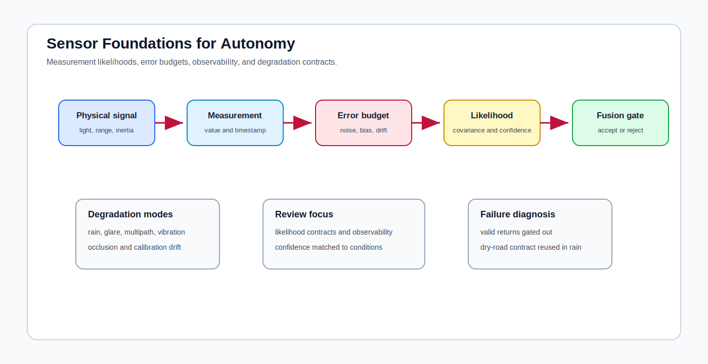

# Sensor Foundations for Autonomy

<!-- kb-visual:start -->

*Visual: section-level autonomy-role diagram showing sensor foundations, autonomy problem classes, stack interfaces, reading paths, and failure diagnosis.*
<!-- kb-visual:end -->

## Why This Foundation Exists

Sensors define what the autonomy stack can measure and how trustworthy each measurement is under real operating conditions. Every perception, localization, mapping, and fusion claim inherits assumptions about likelihoods, noise, observability, degradation, confidence, and modality handoff.

This foundation exists because sensor errors are often copied into higher-level modules as if they were semantic failures. A fusion stack can fail because the measurement likelihood is wrong, the error budget is unrealistic, the operating condition changed, or the confidence contract was reused outside its validation regime.

## What This Field Studies From First Principles

Sensor foundations study cross-modality measurement likelihoods, noise models, covariance and confidence contracts, error budgets, observability limits, degradation modes, calibration assumptions, and the handoff from raw or feature measurements into estimation and perception.

The section is intentionally modality-spanning. It asks how camera, LiDAR, radar, GNSS, IMU, odometry, and other measurements should be represented before downstream modules interpret them.

## Autonomy Problem Map

Sensors feed perception, localization, mapping, state estimation, health monitoring, and operations. They consume physical measurements and calibration context, then produce likelihoods, covariances, confidences, validity flags, observability limits, and degradation signals.

The autonomy risk is invalid confidence. If a measurement is treated as reliable in rain, glare, multipath, vibration, occlusion, thermal drift, or calibration drift without evidence, downstream systems can reject good data or trust bad data.

## Core Mental Model

Think in likelihood contracts. A sensor output is not only a value; it is a claim about how the value was measured, what noise model applies, what conditions degrade it, and what downstream consumers are allowed to infer.

The review model is: `physical signal -> measurement model -> noise and bias -> confidence contract -> fusion gate -> downstream decision`. Sensor foundations own the contract up to the point where geometry, signal processing, or perception-specific semantics take over.

## What This Foundation Lets You Review

- Does each modality have a measurement likelihood and confidence contract matched to the operating condition?
- Are noise, bias, dropout, calibration drift, and degradation represented in the error budget?
- Is the claimed state observable from the available sensor suite and motion excitation?
- Do fusion gates and confidence thresholds change under rain, glare, multipath, vibration, or occlusion?
- Is the modality handoff explicit about what is raw signal, feature evidence, likelihood, or semantic inference?

## Problem-Class Coverage

| Problem Class | Role Of This Foundation | Representative Applied Pages |
|---|---|---|
| Perception and scene understanding | supporting - sensors define measurement confidence before perception assigns semantics. | [Production Perception Systems](../../30-autonomy-stack/perception/overview/production-perception-systems.md) - review whether perception confidence is grounded in sensor degradation evidence. |
| Localization, SLAM, and state estimation | primary - measurement likelihoods, covariances, and observability limits are central to robust fusion. | [Robust State Estimation and Multi-Sensor Fusion](../../30-autonomy-stack/localization-mapping/overview/robust-state-estimation-multi-sensor.md) - debug gating, covariance, and modality trust failures. |
| Mapping and spatial memory | supporting - map updates depend on sensor likelihoods and degradation flags, but persistence semantics are mapping-owned. | [Robust State Estimation and Multi-Sensor Fusion](../../30-autonomy-stack/localization-mapping/overview/robust-state-estimation-multi-sensor.md) - review whether bad measurements can become persistent map state. |
| Prediction and world modeling | not central - prediction consumes perception and tracks, not raw sensor likelihood ownership. | [Production Perception Systems](../../30-autonomy-stack/perception/overview/production-perception-systems.md) - debug whether missed detections originate in sensor confidence rather than model semantics. |
| Planning and decision making | supporting - planners consume uncertainty and health signals derived from sensors. | [Production Perception Systems](../../30-autonomy-stack/perception/overview/production-perception-systems.md) - review degraded-mode triggers that should alter planning assumptions. |
| Control and actuation | supporting - control depends on reliable state inputs but does not own modality error budgets. | [Sensor Calibration Fleet Operations](../../40-runtime-systems/software-operations/sensor-calibration-fleet-ops.md) - debug control incidents that trace back to calibration drift or bad sensor health flags. |
| Safety, validation, and assurance | primary - sensor error budgets, degradation modes, and observability limits are safety evidence. | [Sensor Calibration Fleet Operations](../../40-runtime-systems/software-operations/sensor-calibration-fleet-ops.md) - review fleet evidence for calibration, drift, and sensor health assurance. |
| Runtime systems and operations | supporting - operations monitor calibration, health, and degradation but use sensor contracts to define alerts. | [Sensor Calibration Fleet Operations](../../40-runtime-systems/software-operations/sensor-calibration-fleet-ops.md) - debug fleet incidents where health checks failed to expose invalid likelihoods. |

## Reading Paths By Task

For measurement likelihoods and noise, start with [Sensor Likelihoods, Noise, and Error Budgets](sensor-likelihoods-noise-error-budgets.md), then connect the contract to state estimation and perception applied pages.

For degradation review, use the same page as a checklist for weather, occlusion, multipath, calibration drift, saturation, and observability limitations.

For operational handoff, read the sensor page alongside fleet calibration and runtime operations material so the measurement contract is visible in logs and alerts.

## Dependency Map

Sensors depend on hardware physics, calibration geometry, signal processing, and operating-domain assumptions. They hand likelihoods, confidences, covariances, health flags, and degradation indicators to perception, fusion, mapping, localization, planning, safety, and operations.

The most important dependency question is whether the consumer knows the difference between a measurement, a feature, a confidence score, and a semantic claim.

## Interfaces, Artifacts, and Failure Modes

Core artifacts include noise models, covariance tables, error budgets, likelihood functions, confidence calibration plots, observability analyses, degradation taxonomies, calibration records, gating thresholds, and sensor-health logs.

Diagnostic case: A fusion stack gates out valid LiDAR returns in rain because the range-noise model and confidence contract were copied from dry-road data.

Common failure modes include overconfident covariances, stale calibration, weather-specific dropout, multipath, occlusion, sensor saturation, unmodeled bias, invalid observability claims, and confidence scores reused outside their validation domain.

## Boundaries With Neighboring Foundations

- Owns: cross-modality measurement likelihoods, error-budget contracts, observability limits, degradation modes, and modality handoff assumptions.
- Hands off to: geometry for projection and calibration geometry and signal processing for waveform and raw-to-feature transforms.
- Does not own: perception model semantics.

## Pages In This Section

- [Sensor Likelihoods, Noise, and Error Budgets](sensor-likelihoods-noise-error-budgets.md)

## Core Sources

This overview synthesizes the section pages listed above; no additional external sources were used.

