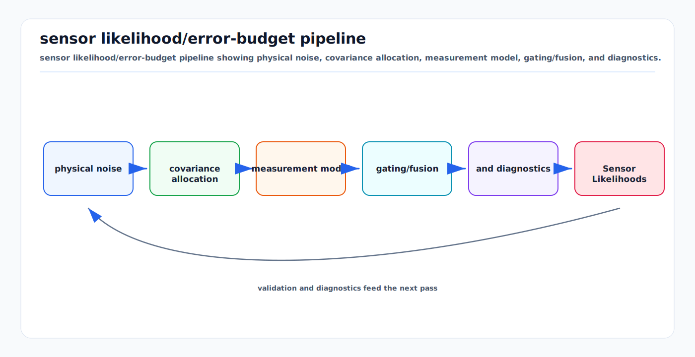

# Sensor Likelihoods, Noise, and Error Budgets

<!-- kb-visual:start -->


*Visual: sensor likelihood/error-budget pipeline showing physical noise, covariance allocation, measurement model, gating/fusion, and diagnostics.*
<!-- kb-visual:end -->

A sensor model is a probabilistic statement about what measurements should look
like if a hypothesized state is true. An error budget is the accounting system
that separates random noise, bias, calibration error, timing error, quantization,
environmental effects, and algorithmic approximation. The first-principles goal
is to make every residual explainable before it enters a filter, optimizer, or
evaluation metric.

---

## Related docs

- [Bayesian Filtering and Error-State Kalman Filters](../state-estimation/bayesian-filtering-and-eskf.md)
- [Data Association and Gating](../state-estimation/data-association-and-gating.md)
- [Sampling, FFT, Windowing, and Filtering](../signal-processing/sampling-fft-windowing-filtering.md)
- [Radar Ambiguity, Chirp Design, and Doppler Limits](../signal-processing/radar-ambiguity-chirp-design-doppler-limits.md)
- [Time Sync, PTP, Timestamping, and Latency Models](../systems-engineering/time-sync-ptp-timestamping-latency-models.md)

---

## Why it matters for AV, perception, SLAM, and mapping

Perception and localization stacks often fail because a residual is treated as
"noise" when it is actually a systematic error. Camera reprojection error,
LiDAR range bias, radar angle uncertainty, GNSS multipath, wheel slip, and IMU
bias each have different structure. A single covariance number cannot capture
all of them.

For AV systems, likelihoods drive:

- Kalman and particle filter updates
- scan matching and factor graph residual weighting
- detection confidence calibration
- data association gates
- track lifecycle probabilities
- simulation realism and test pass/fail thresholds

Good likelihoods make uncertainty actionable. Bad likelihoods produce smooth,
confident, wrong outputs.

---

## Core math and algorithm steps

### Generative measurement model

Start with:

```
z = h(x, theta) + b + v + e_env + e_time
```

where:

- `x` is the state being estimated
- `theta` are calibration parameters
- `b` is bias
- `v` is random noise
- `e_env` is environment-dependent error
- `e_time` is timestamp or latency-induced error

The likelihood is:

```
p(z | x) = distribution of measurement residual r
r = z - h(x, theta)
```

For Gaussian residuals:

```
p(z | x) = N(r; 0, R)
negative_log_likelihood =
  0.5 r^T R^-1 r + 0.5 log(det(R)) + constant
```

For heavy-tailed residuals, use Student-t, Huber, Cauchy, Tukey, mixture, or
explicit outlier models instead of pretending all residuals are Gaussian.

### Error budget decomposition

For independent small errors, variances add:

```
sigma_total^2 =
  sigma_random^2 +
  sigma_bias_uncertainty^2 +
  sigma_calibration^2 +
  sigma_timestamp^2 +
  sigma_quantization^2 +
  sigma_environment^2
```

Timing converts into spatial error:

```
delta_p ~= v * delta_t
delta_yaw_residual ~= yaw_rate * delta_t
```

Extrinsic rotation error converts into range-dependent lateral error:

```
delta_lateral ~= range * delta_theta
```

Quantization variance for a uniform quantization step `q`:

```
sigma_quantization^2 = q^2 / 12
```

### Camera likelihoods

For a calibrated pinhole camera:

```
u = project(K, T_cam_body, T_body_world, P_world)
r = u_meas - u_pred
```

Common pixel residual covariance terms:

```
R_pixel =
  feature_localization_noise +
  calibration_uncertainty +
  rolling_shutter_error +
  motion_blur_error +
  time_offset_error
```

Image sensor noise often includes photon shot noise, dark noise, read noise,
fixed-pattern noise, and quantization. EMVA 1288 provides a standardized way
to characterize camera sensitivity, noise, SNR, and dynamic range.

### LiDAR likelihoods

LiDAR residuals may be point-to-point, point-to-plane, range image, or occupancy
residuals:

```
r_point_plane = n^T (p_meas - p_map)
```

Covariance depends on:

- range and incidence angle
- beam divergence and receiver SNR
- surface reflectivity
- wet, dusty, snowy, or foggy air
- rolling scan motion compensation
- target motion during scan
- calibration and timestamp quality

Plane residuals are not independent when many points come from the same surface.
Downsample or model correlation before treating thousands of points as separate
high-confidence measurements.

### Radar likelihoods

Radar detections are naturally polar and Doppler-bearing:

```
z = [range, azimuth, elevation, radial_velocity, power]
```

Use a sensor-frame residual:

```
r_range = range_meas - norm(p_rel)
r_az = wrap(az_meas - atan2(y, x))
r_vr = vr_meas - dot(v_rel, unit_ray)
```

Radar angle uncertainty is often much larger than range or Doppler uncertainty.
Multipath and sidelobes are structured outliers, not zero-mean Gaussian noise.

### Empirical calibration loop

```
collect controlled data with reference truth
compute residuals by sensor, range, angle, speed, class, weather, and lighting
remove known systematic bias or model it explicitly
fit covariance or robust likelihood parameters
validate with held-out routes and scenarios
monitor residual distributions in replay and fleet logs
```

---

## Implementation notes

- Store units with every covariance. Pixels, radians, meters, meters per second,
  and normalized detector scores are not interchangeable.
- Keep covariance frame explicit. A Cartesian covariance in sensor frame must
  be transformed before world-frame fusion.
- Separate aleatoric noise from epistemic uncertainty. Poor calibration or
  unknown weather should not be hidden as ordinary random noise.
- Use residual whitening in diagnostics:

```
r_white = L^-1 r,  where S = L L^T
```

Whitened residuals should be close to zero-mean, unit-scale if the model is
right.

- Track per-sensor residual histograms and NIS by context.
- Avoid double counting: a vendor object list already includes filtering and
  association assumptions.
- Do not tune covariance only until trajectories look smooth. Validate against
  residual statistics and reference truth.

---

## Failure modes and diagnostics

| Failure mode | Symptom | Diagnostic |
|---|---|---|
| Bias treated as noise | Mean residual remains nonzero. | Residual mean by range, angle, temperature, or speed. |
| Underestimated covariance | Filter rejects good measurements or becomes inconsistent. | NIS/NEES above chi-squared expectation. |
| Overestimated covariance | Sensor has little effect and faults are hidden. | Residuals small relative to predicted sigma. |
| Correlated residuals | Optimizer becomes overconfident with many points. | Effective residual count much smaller than sample count. |
| Timestamp error | Residual grows with speed and yaw rate. | Plot residual versus ego velocity and angular rate. |
| Environment mismatch | Rain, fog, glare, wet ground, or multipath degrades model. | Residual and false-positive rate by condition tag. |
| Detector score misuse | Confidence is fused as probability without calibration. | Reliability diagram and expected calibration error. |

---

## Sources

- EMVA 1288 release downloads: https://www.emva.org/standards-technology/emva-1288/emva-standard-1288-downloads-2/
- EMVA 1288 Release A2.01 PDF: https://www.emva.org/wp-content/uploads/emva_1288_rela2.01_official.pdf
- Thrun, "Probabilistic Algorithms in Robotics": https://www.cs.cmu.edu/~thrun/papers/thrun.probrob.pdf
- Sarkka, "Bayesian Filtering and Smoothing": https://users.aalto.fi/~ssarkka/pub/cup_book_online_20131111.pdf
- Sola, "Quaternion kinematics for the error-state Kalman filter": https://arxiv.org/abs/1711.02508
- Texas Instruments, "Introduction to mmWave Sensing: FMCW Radars": https://training.ti.com/intro-mmwave-sensing-fmcw-radars
- OpenVINS filter evaluation metrics: https://docs.openvins.com/eval-metrics.html
