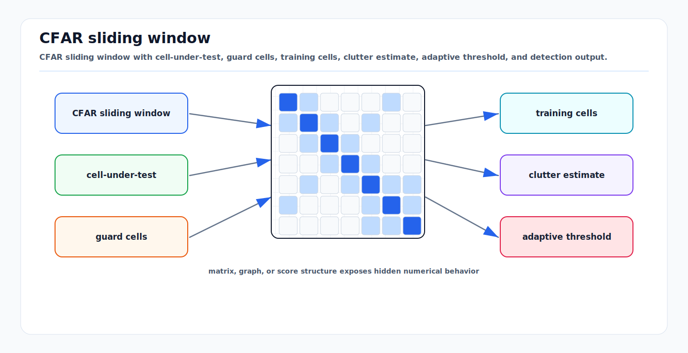

# CFAR Detection and Thresholding

<!-- kb-visual:start -->


*Visual: CFAR sliding window with cell-under-test, guard cells, training cells, clutter estimate, adaptive threshold, and detection output.*
<!-- kb-visual:end -->

Constant false alarm rate (CFAR) detection adapts a threshold to the local noise
or clutter floor. The first-principles reason is that a fixed threshold cannot
work across all ranges, angles, weather, terrain, interference, and antenna
sidelobes. CFAR decides what becomes a radar detection before tracking,
classification, or fusion sees it.

---

## Related docs

- [FMCW, MIMO, and Doppler Radar Fundamentals](radar-fmcw-mimo-doppler.md)
- [Radar Ambiguity, Chirp Design, and Doppler Limits](radar-ambiguity-chirp-design-doppler-limits.md)
- [Sampling, FFT, Windowing, and Filtering](sampling-fft-windowing-filtering.md)
- [Data Association and Gating](../state-estimation/data-association-and-gating.md)
- [Sensor Likelihoods, Noise, and Error Budgets](../sensors/sensor-likelihoods-noise-error-budgets.md)

---

## Why it matters for AV, perception, SLAM, and mapping

Radar perception begins with thresholding a range-Doppler-angle power field. If
CFAR is too aggressive, low-RCS pedestrians, cones, FOD, and distant vehicles
never become detections. If it is too permissive, trackers must handle a flood
of clutter and ghosts. The threshold policy therefore changes object recall,
false positives, track stability, and radar map quality.

CFAR parameters are also scenario-dependent. Airport aprons, highways, tunnels,
wet pavement, parked aircraft, guardrails, vegetation, and rain all create
different clutter statistics.

---

## Core math and algorithm steps

### Cell under test

For a power map `P`, define a cell under test (CUT):

```
P_cut = P[r, d]
```

Use guard cells around the CUT so target energy does not contaminate the noise
estimate. Use training cells around the guard region to estimate local clutter.

```
training cells | guard | CUT | guard | training cells
```

### CA-CFAR

Cell-averaging CFAR estimates noise as:

```
Z = mean(training_cell_powers)
threshold = alpha * Z
detect if P_cut > threshold
```

For exponentially distributed noise power and `N` training cells, a common
CA-CFAR scale for desired false alarm probability `P_fa` is:

```
alpha = N * (P_fa^(-1/N) - 1)
```

This formula assumes independent homogeneous training cells. Real automotive
radar often violates that assumption.

### GO, SO, and OS-CFAR

| Variant | Rule | Useful when | Risk |
|---|---|---|---|
| CA-CFAR | mean all training cells | homogeneous background | fails at clutter edges and multi-target cells |
| GO-CFAR | use greater of leading/trailing estimates | clutter edge protection | can miss weak targets near clutter |
| SO-CFAR | use smaller of leading/trailing estimates | target masking reduction | more false alarms at clutter edges |
| OS-CFAR | sort training cells and use selected rank | interfering targets and nonhomogeneous clutter | rank and scale need tuning |

Ordered-statistic CFAR:

```
sorted_training = sort(training_powers)
Z = sorted_training[k]
threshold = alpha_os * Z
```

The rank `k` controls robustness against outliers inside the training window.

### Two-dimensional CFAR

In range-Doppler maps, use 2D training and guard windows:

```
for each range bin r and Doppler bin d:
  collect training cells around (r, d), excluding guard cells
  estimate local noise/clutter
  compare CUT to threshold
```

Some stacks run CFAR separately by range and Doppler; others run 2D CFAR or
apply CFAR after noncoherent antenna accumulation. The decision changes what
weak or extended targets survive.

### Detection post-processing

After thresholding:

```
group adjacent detections
keep local maxima
estimate SNR/noise floor
estimate angle for selected cells
attach Doppler, range, power, and covariance metadata
send detections to clustering or tracking
```

Peak grouping is not cosmetic. Without it, one physical target can produce many
detections from adjacent bins and sidelobes.

---

## Implementation notes

- Tune CFAR on power, not arbitrary display dB values, unless the algorithm is
  explicitly derived for log-domain statistics.
- Keep guard cells large enough for the main lobe and window sidelobes.
- Do not use training cells that cross known invalid regions, range wrap zones,
  or strong static leakage zones.
- Parameterize by range and angle when the noise floor varies over the field of
  view.
- Record per-detection threshold, estimated noise, SNR, and CFAR variant. These
  fields make downstream tracker failures explainable.
- Evaluate CFAR jointly with tracker metrics. A detector setting that improves
  per-frame precision may harm track continuity.
- Use replay slices with corner cases: rain, wet ground, tunnels, metal fences,
  aircraft, close bright vehicles, and sparse low-RCS targets.

---

## Failure modes and diagnostics

| Failure mode | Symptom | Diagnostic |
|---|---|---|
| Target masking | Weak target near strong target disappears. | Inspect training cells contaminated by strong return. |
| Clutter edge false alarms | Detections line up along walls, guardrails, or ground transitions. | Compare CA-CFAR with GO/OS-CFAR in same region. |
| Too few guard cells | Threshold rises around true target. | Main lobe leaks into training cells. |
| Too many training cells | Local adaptation too slow. | Threshold ignores localized clutter patch. |
| Log-domain error | False alarm rate not close to design value. | Validate with simulated exponential noise. |
| Sidelobe detections | Multiple detections around one bright reflector. | Check windowing and peak grouping. |
| Nonstationary interference | Bursty false detections across many bins. | Time-frequency plots and raw ADC inspection. |

---

## Sources

- Rohling, "Radar CFAR Thresholding in Clutter and Multiple Target Situations": https://ieeexplore.ieee.org/document/4102735
- Rohling radar CFAR overview slides: https://www.nato-us.org/sensors2005/papers/rohling.pdf
- OpenRadar CFAR documentation: https://openradar.readthedocs.io/en/latest/dsp/cfar.html
- OpenRadar Doppler processing documentation: https://openradar.readthedocs.io/en/latest/dsp/doppler_processing.html
- RadarSimPy CFAR example: https://radarsimx.com/wp-content/uploads/html/processing_cfar.html
- Richards radar signal processing topics: https://mrichards.ece.gatech.edu/tableofcontents/
- SciPy peak finding documentation: https://docs.scipy.org/doc/scipy/reference/generated/scipy.signal.find_peaks.html
