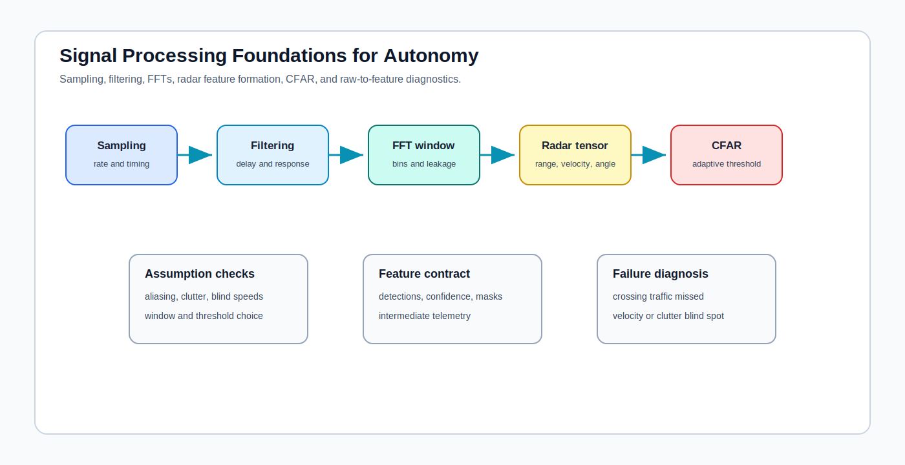

# Signal Processing Foundations for Autonomy

<!-- kb-visual:start -->

*Visual: section-level autonomy-role diagram showing signal processing foundations, autonomy problem classes, stack interfaces, reading paths, and failure diagnosis.*
<!-- kb-visual:end -->

## Why This Foundation Exists

Signal processing turns sampled physical signals into usable features. Before perception or fusion sees a radar detection, filtered trace, frequency bin, or tracked measurement, assumptions about sampling, filtering, FFTs, windows, thresholds, clutter, and aliasing have already shaped the evidence.

This foundation exists because raw-to-feature assumptions can create silent blind spots. A downstream detector may look wrong when the real issue is chirp design, Doppler ambiguity, CFAR thresholding, filter delay, spectral leakage, or a clutter model that failed in a specific environment.

## What This Field Studies From First Principles

Signal processing studies sampling, filtering, transforms, frequency-domain interpretation, radar range-Doppler-angle formation, MIMO processing, CFAR detection, windowing, aliasing, clutter suppression, and raw-to-feature contracts.

The autonomy emphasis is diagnostic: what assumptions were made before a feature became an object, track, occupancy update, or perception input.

## Autonomy Problem Map

Signal processing sits between sensor physics and higher-level perception or estimation. It consumes sampled signals and sensor timing, then produces filtered values, spectra, detections, range-Doppler maps, angle estimates, thresholds, and confidence cues.

The autonomy risk is preprocessing opacity. If a pipeline only logs final detections, reviewers cannot tell whether missed objects were absent from the raw signal, suppressed by filtering, smeared by windowing, hidden by ambiguity, or rejected by thresholding.

## Core Mental Model

Think of signal processing as a chain of assumptions. Sampling decides what frequencies can be represented. Filtering changes amplitude, phase, delay, and noise. FFTs expose bins but introduce leakage and resolution tradeoffs. CFAR and clutter suppression decide which evidence survives as a detection.

The review model is: `sampled signal -> filter -> transform -> detection threshold -> feature contract -> perception or fusion`. Each stage should preserve enough metadata to debug why evidence was lost or distorted.

## What This Foundation Lets You Review

- Do sampling rates, chirp parameters, and timing assumptions avoid aliasing and blind spots for the expected motion?
- Are filtering side effects such as delay, attenuation, ringing, and phase shift represented in downstream contracts?
- Do FFT, windowing, and binning choices match the required range, velocity, angle, and resolution claims?
- Are CFAR thresholds and clutter models validated against weather, multipath, and dense operational scenes?
- Does the raw-to-feature handoff expose enough intermediate evidence to debug missed detections?

## Problem-Class Coverage

| Problem Class | Role Of This Foundation | Representative Applied Pages |
|---|---|---|
| Perception and scene understanding | primary - radar and filtered sensor features shape what perception can detect or classify. | [K-Radar](../../30-autonomy-stack/perception/methods/k-radar.md) - review whether range-Doppler-angle preprocessing explains detector failures. |
| Localization, SLAM, and state estimation | supporting - filters and measurement preprocessing affect estimator inputs but do not own estimator architecture. | [Radar and LiDAR Fusion in Adverse Weather](../../30-autonomy-stack/perception/overview/radar-lidar-fusion-adverse-weather.md) - debug whether degraded measurements were filtered before fusion. |
| Mapping and spatial memory | supporting - mapping consumes processed detections or filtered measurements, not raw signal chains. | [Radar and LiDAR Fusion in Adverse Weather](../../30-autonomy-stack/perception/overview/radar-lidar-fusion-adverse-weather.md) - review whether preprocessing artifacts can become persistent map evidence. |
| Prediction and world modeling | not central - prediction works on tracks, objects, or scene state after signal processing. | [Dual Radar and 4D Radar Adverse Weather](../../30-autonomy-stack/perception/datasets-benchmarks/dual-radar-4d-radar-adverse-weather.md) - debug dataset blind spots caused by preprocessing choices before model training. |
| Planning and decision making | supporting - planners consume perception outputs affected by signal processing, especially in degraded sensing. | [Radar and LiDAR Fusion in Adverse Weather](../../30-autonomy-stack/perception/overview/radar-lidar-fusion-adverse-weather.md) - review planning assumptions when adverse-weather evidence is suppressed upstream. |
| Control and actuation | not central - control consumes state estimates, not raw signal transforms. | [Dual Radar and 4D Radar Adverse Weather](../../30-autonomy-stack/perception/datasets-benchmarks/dual-radar-4d-radar-adverse-weather.md) - debug whether control-facing state errors began as missed radar evidence. |
| Safety, validation, and assurance | primary - aliasing, CFAR thresholds, clutter, and blind spots need validation evidence. | [K-Radar](../../30-autonomy-stack/perception/methods/k-radar.md) - review safety claims against radar preprocessing and detection-threshold limits. |
| Runtime systems and operations | supporting - runtime monitors signal health, dropped frames, and degraded pipelines using processing metadata. | [Dual Radar and 4D Radar Adverse Weather](../../30-autonomy-stack/perception/datasets-benchmarks/dual-radar-4d-radar-adverse-weather.md) - debug operational reports with raw-to-feature telemetry instead of final detections only. |

## Reading Paths By Task

For sampling and filtering basics, start with [Sampling, FFT, Windowing, and Filtering](sampling-fft-windowing-filtering.md), then read [Sensor Filtering](sensor-filtering-alpha-beta-kalman-complementary.md) for tracking-oriented filters.

For radar feature formation, read [Radar FMCW, MIMO, and Doppler](radar-fmcw-mimo-doppler.md), then [Radar Ambiguity, Chirp Design, and Doppler Limits](radar-ambiguity-chirp-design-doppler-limits.md).

For detection thresholds, read [CFAR Detection and Thresholding](cfar-detection-thresholding.md) after the radar and FFT notes so threshold failures can be traced to upstream resolution and clutter assumptions.

## Dependency Map

Signal processing depends on sensor sampling, timing, waveform design, and hardware limits. It hands features, spectra, detections, thresholds, and confidence metadata to perception, fusion, state estimation, mapping, and runtime health monitoring.

The dependency review should identify where a physical signal becomes a durable feature. That handoff must preserve enough information to distinguish absent evidence from discarded evidence.

## Interfaces, Artifacts, and Failure Modes

Core artifacts include sampled traces, filter coefficients, frequency responses, FFT bins, window choices, range-Doppler-angle tensors, CFAR thresholds, clutter estimates, detection masks, and raw-to-feature logs.

Diagnostic case: A radar detector misses crossing traffic because chirp/FFT/CFAR assumptions produce a blind spot in velocity or clutter conditions.

Common failure modes include aliasing, spectral leakage, filter delay, phase distortion, wrong window choice, range or Doppler ambiguity, CFAR over-suppression, clutter leakage, ghost targets, and missing intermediate telemetry.

## Boundaries With Neighboring Foundations

- Owns: raw-to-feature transforms including sampling, filtering, FFT, radar range-Doppler-angle, CFAR, windowing, aliasing, and clutter.
- Hands off to: sensors for sensor hardware likelihoods and perception or machine learning for learned perception semantics.
- Does not own: modality error budgets.

## Pages In This Section

- [CFAR Detection and Thresholding](cfar-detection-thresholding.md)
- [Radar Ambiguity, Chirp Design, and Doppler Limits](radar-ambiguity-chirp-design-doppler-limits.md)
- [Radar FMCW, MIMO, and Doppler](radar-fmcw-mimo-doppler.md)
- [Sampling, FFT, Windowing, and Filtering](sampling-fft-windowing-filtering.md)
- [Sensor Filtering](sensor-filtering-alpha-beta-kalman-complementary.md)

## Core Sources

This overview synthesizes the section pages listed above; no additional external sources were used.

