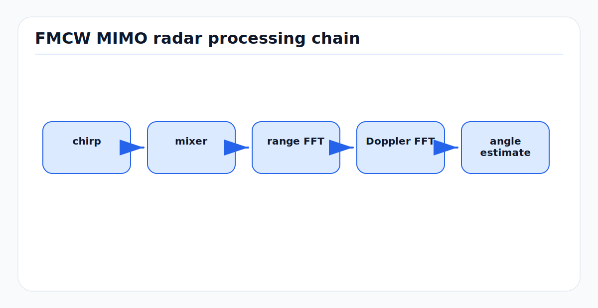

# FMCW, MIMO, and Doppler Radar Fundamentals

Automotive and autonomy radars are active RF sensors. They measure range,
angle, radial velocity, and reflected power through a signal-processing chain,
not through direct geometric projection. Radar point clouds are sparse and
noisy compared with LiDAR, but Doppler and weather robustness make radar a
critical perception and localization sensor.

---

<!-- kb-figure:start -->


*Figure: how FMCW radar turns beat frequencies and antenna phase into range, velocity, and angle.*
<!-- kb-figure:end -->

## 1. FMCW Range Measurement

Frequency-modulated continuous-wave (FMCW) radar transmits chirps whose
frequency changes linearly over time:

```
f_tx(t) = f_c + S*t
S = B / T_chirp
```

The received echo is delayed by:

```
tau = 2*r / c
```

Mixing received and transmitted signals gives a beat frequency:

```
f_b ~= S * tau = 2*S*r/c
r = c*f_b/(2*S)
```

Range resolution is set by chirp bandwidth:

```
delta_r = c / (2*B)
```

This is why 77 GHz radars with GHz-class bandwidth can resolve decimeter-scale
range bins even though the carrier wavelength is millimeters.

---

## 2. Doppler Velocity

Doppler comes from phase change across chirps:

```
f_d = 2*v_r / lambda
v_r = lambda*f_d/2
```

In a chirp frame, radar usually performs:

```
Range FFT   over fast time samples within each chirp
Doppler FFT over slow time chirps in a frame
Angle FFT   over antenna channels
```

The output is a range-Doppler-angle cube. A detection point carries radial
velocity relative to the radar:

```
v_r = dot(v_target - v_sensor, unit_ray)
```

Radar does not directly measure tangential velocity. A crossing target can have
near-zero Doppler even while moving fast.

### Sensor Model Impact

| Task | Why the model matters |
|---|---|
| Perception | Doppler separates moving objects from static clutter and gives immediate velocity without tracking latency. |
| SLAM | Static radar detections can estimate ego velocity and constrain localization when LiDAR/camera degrade. |
| Mapping | Radar maps should store reflectors with RCS/Doppler stability, not assume dense geometry. |
| Validation | Radar must be validated by range, angle, Doppler, RCS, weather, multipath, and ego-motion bins. |

---

## 3. MIMO Angle Estimation

Multiple-input multiple-output (MIMO) radar uses several transmit and receive
antennas to form a larger virtual array.

```
N_virtual = N_tx * N_rx
```

For a far-field target, phase differences across antennas encode angle:

```
delta_phase = 2*pi*d*sin(theta)/lambda
```

Angle estimation methods:

| Method | Strength | Risk |
|---|---|---|
| Angle FFT | fast and common | resolution limited by aperture and sidelobes |
| Beamforming/Capon | better interference handling | more compute and covariance sensitivity |
| MUSIC/ESPRIT | super-resolution in ideal conditions | fragile with multipath, coherent targets, calibration errors |

Angular resolution depends on aperture, wavelength, SNR, windowing, and target
separation. Elevation requires a vertical aperture or planar array.

### TDM-MIMO Doppler Coupling

Time-division multiplexed MIMO transmits different TX chirps at different
times. Moving targets accumulate phase between TX slots. Angle processing must
apply Doppler compensation; otherwise velocity appears as angle bias.

---

## 4. Radar Signal-Processing Pipeline

Typical processing:

```
ADC samples
  -> range FFT
  -> clutter/static removal or high-pass filtering
  -> Doppler FFT
  -> CFAR detection on range-Doppler map
  -> angle estimation on selected cells
  -> peak grouping / clustering
  -> tracking and classification
  -> point cloud and object list
```

Windowing trades resolution for sidelobe suppression:

```
rectangular: narrow main lobe, high sidelobes
Hann/Hamming: wider main lobe, lower sidelobes
Blackman: stronger sidelobe suppression, lower resolution
```

For fusion, it matters whether a radar point is a raw detection, clustered
detection, or tracker output. Tracker outputs already include temporal model
assumptions and should not be fused as independent raw measurements.

---

## 5. CFAR Detection

Constant false alarm rate (CFAR) adapts the detection threshold to local noise
and clutter.

Cell-averaging CFAR:

```
noise_est = mean(training_cells)
threshold = alpha * noise_est
detect if cell_power > threshold
```

Guard cells around the test cell prevent target energy from contaminating the
noise estimate.

CFAR variants:

| Variant | Use |
|---|---|
| CA-CFAR | homogeneous noise fields |
| GO-CFAR | clutter edges, choose greater side estimate |
| SO-CFAR | multiple targets, choose smaller side estimate |
| OS-CFAR | robust to interfering targets using ordered statistic |

CFAR defines what becomes a radar point. Low-RCS pedestrians, cones, and FOD may
not cross threshold at long range, while bright metal objects can create many
detections and sidelobes.

---

## 6. RCS, SNR, and Range Equation

Radar cross section (RCS) describes how strongly a target reflects energy back
toward the radar. Received power follows the radar range equation:

```
P_r = P_t * G_t * G_r * lambda^2 * sigma /
      ((4*pi)^3 * R^4 * L)
```

where `sigma` is RCS and `R` is range. The `R^4` loss is severe: double the
range and received power falls by 16x for a point target.

SNR affects:

- detection probability
- range and Doppler peak precision
- angle estimation variance
- tracker covariance

RCS is not a stable object class label by itself. It changes with aspect angle,
material, wetness, polarization, multipath, and target microstructure. Aircraft,
GSE, jet bridges, signs, and wet ground can be strong reflectors.

---

## 7. Multipath, Ghosts, and Clutter

Radar multipath can create detections at geometrically impossible locations.
Common causes:

- ground bounce
- building and terminal reflections
- aircraft fuselage reflections
- guardrails and fences
- mutual radar interference
- sidelobes from bright reflectors

Ghost symptoms:

```
position inconsistent with camera/LiDAR
Doppler inconsistent with apparent location
appears mirrored across a flat reflector
unstable over small ego-motion changes
high RCS but no physical object
```

Mitigation:

- fuse with LiDAR/camera occupancy when available
- use Doppler consistency and multi-frame tracking
- model static reflector maps for recurring ghost zones
- reject detections outside drivable/free-space constraints
- avoid overconfident radar angle covariance

---

## 8. Doppler Ego-Velocity Estimation

For a static object, measured radial velocity is caused by ego motion:

```
v_r_i = -dot(v_ego + omega_ego x p_i, unit_ray_i)
```

With many static radar points, solve for ego velocity:

```
min_v sum_i rho( v_r_i + dot(v, unit_ray_i) )
```

Use robust loss `rho` because dynamic objects and ghosts violate the static
assumption.

Ego-Doppler is valuable when:

- wheel odometry slips on wet apron or snow
- GNSS velocity is unavailable or multipath-corrupted
- LiDAR scan matching is weak in rain/fog
- camera motion estimation fails in low light

Limitations:

- Requires enough static detections over diverse azimuths.
- Radial-only geometry is weak when all detections lie in one direction.
- Mount yaw error biases lateral velocity.
- TDM-MIMO and Doppler ambiguity handling must be correct.

---

## 9. Noise Models for Fusion

Radar detection measurement:

```
z = [r, azimuth, elevation, v_r, rcs]
```

Approximate covariance:

```
Sigma_z = diag(sigma_r^2, sigma_az^2, sigma_el^2, sigma_vr^2)
```

Starting guidance:

- Range is usually better than angle.
- Elevation is often worse than azimuth unless using high-channel 4D radar.
- Doppler is precise for radial motion but ambiguous if velocity wrapping or
  compensation is wrong.
- Inflate covariance for low SNR, low RCS, high sidelobe region, multi-target
  bins, and suspected multipath.

Cartesian covariance:

```
Sigma_xyz = J_polar_to_cartesian * Sigma_range_angle *
            J_polar_to_cartesian^T
```

For object tracking, keep radar measurement covariance separate from tracker
state covariance. A vendor object list may already be filtered and correlated
over time.

---

## 10. Radar-Camera and Radar-LiDAR Fusion

Fusion roles:

| Pair | Radar contribution | Other sensor contribution |
|---|---|---|
| Radar + camera | sparse metric depth, velocity, weather robustness | semantics, classification, lane/sign/light recognition |
| Radar + LiDAR | Doppler and adverse-weather continuity | dense geometry and object shape |
| Radar + IMU/wheel | ego-velocity cross-check | angular rate and short-term propagation |
| Radar + map | stable reflector landmarks | global frame and semantic constraints |

Practical hooks:

- Calibrate radar yaw/pitch/roll carefully; angle errors dominate at range.
- Time-align radar frames with ego motion; Doppler compensation uses the
  correct acquisition interval.
- Use radar to validate whether a LiDAR/camera object is moving.
- In rain/fog, raise radar weight but keep multipath/ghost gating active.

---

## 11. Failure Modes

| Failure mode | Cause | Mitigation |
|---|---|---|
| Ghost object | multipath or sidelobe | Doppler/geometry consistency, LiDAR/camera cross-check |
| Wrong velocity sign | frame or convention mismatch | projection tests with known approaching/receding targets |
| Angle bias | mount yaw/pitch error, antenna calibration | extrinsic calibration and residual monitoring |
| Doppler aliasing | velocity exceeds unambiguous range | ambiguity flags, multi-PRI schemes, tracker validation |
| Missed pedestrian/FOD | low RCS or CFAR threshold | multi-sensor fusion and detection tuning |
| Static clutter treated as movers | wrong ego compensation | IMU/wheel/GNSS/radar ego-motion consistency |
| Overconfident radar factor | sparse multipath-heavy points | robust kernels and covariance inflation |

---

## 12. Sources

- Texas Instruments, "MIMO Radar." SWRA554A application report. https://www.ti.com/lit/an/swra554a/swra554a.pdf
- Texas Instruments, "Introduction to mmWave Sensing: FMCW Radars." https://training.ti.com/intro-mmwave-sensing-fmcw-radars
- Richards, "Fundamentals of Radar Signal Processing." McGraw-Hill.
- Richards table of contents and radar signal processing topics. https://mrichards.ece.gatech.edu/tableofcontents/
- Patole et al., "Automotive radars: A review of signal processing techniques." IEEE Signal Processing Magazine, 2017.
- Sun et al., "Signal Processing for TDM MIMO FMCW Millimeter-Wave Radar Sensors." IEEE Access, 2021. https://doaj.org/article/daaa8af0eb8043a685faf1df71e5414d
- OpenRadar mmWave DSP documentation. https://openradar.readthedocs.io/en/latest/dsp/angle_estimation.html
- Roriz et al., "4D Millimeter-Wave Radar in Autonomous Driving: A Survey." https://arxiv.org/html/2306.04242v4
