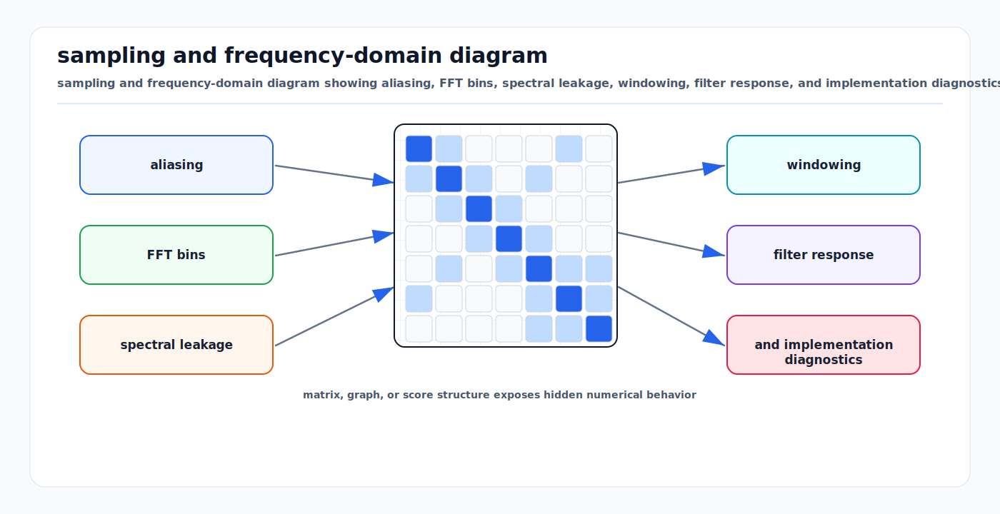

# Sampling, FFT, Windowing, and Filtering

<!-- kb-visual:start -->


*Visual: sampling and frequency-domain diagram showing aliasing, FFT bins, spectral leakage, windowing, filter response, and implementation diagnostics.*
<!-- kb-visual:end -->

Sampling turns continuous sensor signals into discrete data. FFTs expose
frequency structure. Windowing controls spectral leakage. Filtering shapes
signal bandwidth, delay, and noise. The first-principles question is always:
what information exists in the signal, what information did sampling preserve,
and what did processing distort?

---

## Related docs

- [Radar Ambiguity, Chirp Design, and Doppler Limits](radar-ambiguity-chirp-design-doppler-limits.md)
- [CFAR Detection and Thresholding](cfar-detection-thresholding.md)
- [Sensor Filtering: Alpha-Beta, Kalman, and Complementary](sensor-filtering-alpha-beta-kalman-complementary.md)
- [Sensor Likelihoods, Noise, and Error Budgets](../sensors/sensor-likelihoods-noise-error-budgets.md)
- [Time Sync, PTP, Timestamping, and Latency Models](../systems-engineering/time-sync-ptp-timestamping-latency-models.md)

---

## Why it matters for AV, perception, SLAM, and mapping

Vehicle sensors are sampled systems. Cameras expose over finite intervals,
LiDAR scans accumulate over rotating or solid-state patterns, radars sample ADC
chirps, IMUs sample acceleration and angular rate, and wheel encoders quantize
motion. Signal-processing choices affect detection latency, velocity estimates,
map alignment, and filter consistency.

Bad sampling or filtering can create aliasing, phase lag, ringing, false peaks,
or over-smoothed signals that look plausible but are late. In a moving vehicle,
latency is a spatial error.

---

## Core math and algorithm steps

### Sampling and Nyquist

For sampling period `T_s`:

```
f_s = 1 / T_s
```

A band-limited signal with maximum frequency `f_max` can be sampled without
aliasing only if:

```
f_s > 2 * f_max
```

Frequencies above `f_s / 2` fold into lower frequencies. This is aliasing, not
noise. Anti-alias filtering must happen before sampling or before downsampling.

### Discrete Fourier transform

For `N` samples `x[n]`:

```
X[k] = sum_{n=0}^{N-1} x[n] exp(-j 2 pi k n / N)
```

Frequency bin spacing:

```
delta_f = f_s / N
```

For real-valued input, use a real FFT (`rfft`) and corresponding real frequency
bins. Zero padding interpolates the displayed spectrum; it does not improve the
true resolution set by observation time.

### Windowing

The FFT assumes the finite block is periodic. If the block does not end at an
integer number of cycles, discontinuities create spectral leakage. Windowing
multiplies the data:

```
x_w[n] = w[n] * x[n]
```

Tradeoffs:

| Window | Strength | Cost |
|---|---|---|
| Rectangular | narrowest main lobe | high sidelobes |
| Hann/Hamming | lower sidelobes | wider main lobe |
| Blackman/Blackman-Harris | strong sidelobe suppression | more resolution loss |
| Flat top | better amplitude estimate | wide main lobe |

Use FFT-periodic windows for spectral analysis and symmetric windows for FIR
filter design.

### Filtering

Linear time-invariant filtering:

```
y[n] = sum_k b[k] x[n-k] - sum_k a[k] y[n-k]
```

FIR filters use only feed-forward terms. IIR filters use feedback and can reach
sharp frequency responses with fewer coefficients, but they introduce nonlinear
phase unless designed or applied carefully.

Common choices:

| Filter | Use | Risk |
|---|---|---|
| Moving average | quick smoothing | delay and poor frequency selectivity |
| Butterworth IIR | smooth passband | phase delay and stability at high order |
| Bessel IIR | phase behavior | slower rolloff |
| FIR linear phase | predictable delay | more coefficients |
| Median | impulse rejection | nonlinear, can distort dynamics |
| Savitzky-Golay | smooth derivatives | window assumptions can fail at edges |

### Delay and phase

For real-time systems, filter delay is part of the measurement model. A linear
phase FIR of length `M` has group delay:

```
delay = (M - 1) / 2 samples
```

Forward-backward filtering can remove phase delay offline, but it uses future
samples and is not causal. Do not use offline zero-phase filtering to estimate
the latency of an online stack.

### Basic processing checklist

```
choose sample rate from signal bandwidth and latency budget
anti-alias before ADC or decimation
remove invalid samples and saturations explicitly
window blocks before spectral estimation
scale FFT amplitudes consistently
filter with known passband, stopband, delay, and edge behavior
validate on synthetic signals with known frequency, phase, and amplitude
```

---

## Implementation notes

- Use `scipy.fft` for FFTs and `scipy.signal` for windows and filters.
- Use second-order sections (`output="sos"`) for higher-order IIR filters to
  improve numerical stability.
- Record sample time from hardware timestamps when available, not loop arrival
  time.
- Do not infer physical frequency from FFT index without `f_s` and `N`.
- Check units after every transform: ADC counts, volts, power, dB, meters, or
  radians.
- Treat missing samples and dropped frames as timing events, not ordinary
  zero-valued samples.
- Validate filter response with impulse, step, sine sweep, and known-noise
  tests before using it in a safety-relevant estimator.

---

## Failure modes and diagnostics

| Failure mode | Symptom | Diagnostic |
|---|---|---|
| Aliasing | Low-frequency artifact from high-frequency source. | Repeat test at higher sample rate or with stronger anti-alias filter. |
| Spectral leakage | Energy smeared across bins. | Compare rectangular and tapered windows. |
| Wrong FFT scaling | Amplitude changes with `N`. | Test a sine wave with known amplitude. |
| Filter lag | Perception or control output arrives late. | Step response and group delay measurement. |
| Edge artifacts | Startup transient or replay boundary spike. | Inspect first and last window lengths. |
| IIR instability | Output grows or rings unexpectedly. | Check pole locations and use SOS implementation. |
| Offline/online mismatch | Lab results better than vehicle behavior. | Remove noncausal filtering from online-equivalent tests. |

---

## Sources

- SciPy FFT documentation: https://docs.scipy.org/doc/scipy/reference/fft.html
- SciPy FFT tutorial: https://docs.scipy.org/doc/scipy/tutorial/fft.html
- SciPy signal processing API: https://docs.scipy.org/doc/scipy/reference/signal.html
- SciPy window generation documentation: https://docs.scipy.org/doc/scipy/reference/generated/scipy.signal.windows.get_window.html
- SciPy Butterworth filter documentation: https://docs.scipy.org/doc/scipy/reference/generated/scipy.signal.butter.html
- SciPy filtering with second-order sections: https://docs.scipy.org/doc/scipy/reference/generated/scipy.signal.sosfilt.html
- Smith, "The Scientist and Engineer's Guide to Digital Signal Processing": https://www.dspguide.com/
