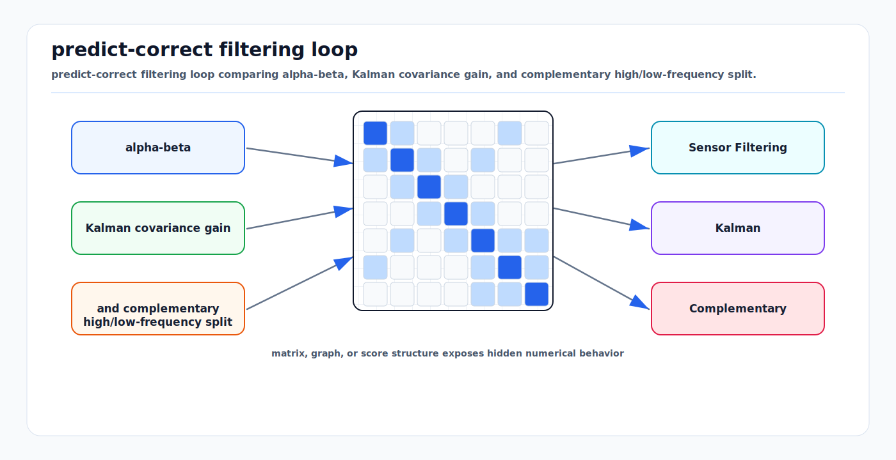

# Sensor Filtering: Alpha-Beta, Kalman, and Complementary

<!-- kb-visual:start -->


*Visual: predict-correct filtering loop comparing alpha-beta, Kalman covariance gain, and complementary high/low-frequency split.*
<!-- kb-visual:end -->

Simple filters are often the right tool when the state, noise, and latency
requirements are clear. Alpha-beta filters, Kalman filters, and complementary
filters all combine prediction with measurement correction, but they make
different assumptions about dynamics, uncertainty, and frequency content.

---

## Related docs

- [Bayesian Filtering and Error-State Kalman Filters](../state-estimation/bayesian-filtering-and-eskf.md)
- [Information Filters and Smoothers](../state-estimation/information-filters-and-smoothers.md)
- [Sampling, FFT, Windowing, and Filtering](sampling-fft-windowing-filtering.md)
- [Sensor Likelihoods, Noise, and Error Budgets](../sensors/sensor-likelihoods-noise-error-budgets.md)
- [Time Sync, PTP, Timestamping, and Latency Models](../systems-engineering/time-sync-ptp-timestamping-latency-models.md)

---

## Why it matters for AV, perception, SLAM, and mapping

Not every signal needs a full nonlinear smoother. Object range rates, wheel
speed, low-level radar tracks, IMU attitude priors, lane boundary smoothing, and
diagnostic residuals often need low-latency filtering with predictable behavior.
The wrong simple filter, however, can add delay, suppress real maneuvers, or
hide faults.

The practical question is: what states are being estimated, what dynamics are
assumed, and how much lag can the autonomy stack tolerate?

---

## Core math and algorithm steps

### Alpha-beta filter

The alpha-beta filter is a fixed-gain position-velocity tracker for roughly
constant velocity motion. State:

```
x = position
v = velocity
dt = sample interval
```

Predict:

```
x_pred = x + v * dt
v_pred = v
```

Residual:

```
r = z - x_pred
```

Update:

```
x = x_pred + alpha * r
v = v_pred + (beta / dt) * r
```

Larger `alpha` and `beta` follow measurements more aggressively. Smaller gains
smooth more but lag and under-react to maneuvers. The alpha-beta filter can be
viewed as a steady-state Kalman-like tracker with fixed gains.

### Kalman filter

For linear-Gaussian dynamics:

```
x_k = F x_{k-1} + B u_k + w_k,   w_k ~ N(0, Q)
z_k = H x_k + v_k,               v_k ~ N(0, R)
```

Prediction:

```
x_pred = F x + B u
P_pred = F P F^T + Q
```

Update:

```
y = z - H x_pred
S = H P_pred H^T + R
K = P_pred H^T S^-1
x = x_pred + K y
P = (I - K H) P_pred
```

Unlike alpha-beta filtering, Kalman gain adapts from covariance, process noise,
and measurement noise.

### Complementary filter

A complementary filter fuses sensors by frequency content. For attitude, gyro
integration is good at short time scales but drifts; accelerometer gravity is
noisy under vehicle acceleration but stable long term for roll/pitch.

One simple scalar form:

```
angle_gyro = angle_prev + gyro_rate * dt
angle = alpha * angle_gyro + (1 - alpha) * angle_accel
```

where:

```
alpha = tau / (tau + dt)
```

This is equivalent to high-pass behavior on the gyro-integrated estimate and
low-pass behavior on the absolute reference. Nonlinear complementary filters on
SO(3) generalize this idea to rotations without treating orientation as a flat
Euclidean vector.

### Choosing the filter

| Filter | Use when | Avoid when |
|---|---|---|
| Moving average | visualization or simple denoising | control or tracking needs low lag |
| Alpha-beta | constant-velocity scalar/vector tracking | noise varies strongly or maneuvers dominate |
| Kalman | linear state with meaningful `Q` and `R` | non-Gaussian or multi-modal belief dominates |
| EKF/ESKF | nonlinear geometry with local Gaussian errors | poor initialization or severe nonlinearity |
| Complementary | sensors separate by frequency band | biases and dynamics are not observable |

---

## Implementation notes

- Always compute filters at measurement timestamps. Variable `dt` must be part
  of the update.
- Track filter delay and expose it in the timestamp or latency budget.
- Initialize state and covariance explicitly; startup transients are often
  mistaken for sensor faults.
- Use innovation gating for Kalman-style updates.
- Tune alpha-beta gains against maneuver response and noise rejection, not just
  a smooth-looking plot.
- Use complementary filters for attitude only with clear assumptions about
  acceleration and magnetic disturbances.
- Publish health signals: innovation, gain, covariance, saturation, dropped
  samples, and reset reason.

---

## Failure modes and diagnostics

| Failure mode | Symptom | Diagnostic |
|---|---|---|
| Excessive lag | Filtered object or speed trails true motion. | Step response and phase delay test. |
| Under-modeled acceleration | Position residual grows during maneuvers. | Residual correlates with acceleration or yaw rate. |
| Wrong `Q/R` ratio | Kalman filter either jitters or ignores measurements. | NIS distribution and gain trace. |
| Complementary filter drift | Heading or roll slowly biases. | Compare against static and dynamic reference intervals. |
| Magnetometer corruption | Yaw jumps near steel, motors, aircraft, or chargers. | Magnetic norm and innovation monitoring. |
| Reset discontinuity | Downstream planner sees state jump. | Reset reason and covariance inflation audit. |
| Hidden dropout | Filter coasts smoothly through missing data. | Expose measurement age and update count. |

---

## Sources

- Welch and Bishop, "An Introduction to the Kalman Filter": https://www.cs.unc.edu/~welch/media/pdf/kalman_intro.pdf
- Kalman, "A New Approach to Linear Filtering and Prediction Problems": https://www.cs.unc.edu/~welch/kalman/media/pdf/Kalman1960.pdf
- MathWorks alpha-beta filter documentation: https://www.mathworks.com/help/fusion/ref/trackingabf.html
- NIST, "Equivalency of LMSF and Alpha-Beta-Gamma Filters": https://www.nist.gov/publications/equivalency-lmsf-and-alpha-beta-gamma-filters
- Mahony et al., "Nonlinear Complementary Filters on the Special Orthogonal Group": https://core.ac.uk/download/pdf/52787176.pdf
- Madgwick, "An efficient orientation filter for inertial and inertial/magnetic sensor arrays": https://www.x-io.co.uk/res/doc/madgwick_internal_report.pdf
- SciPy signal filtering documentation: https://docs.scipy.org/doc/scipy/reference/signal.html
