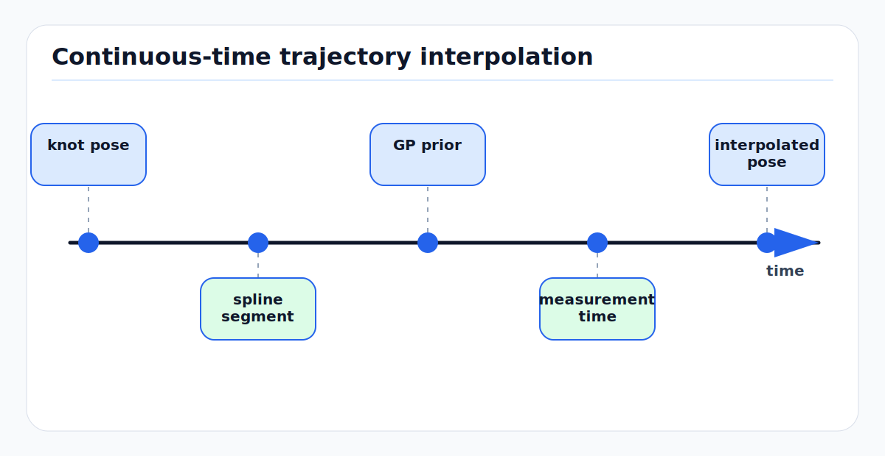

# Continuous-Time Trajectory Splines and Gaussian Process Priors

Most estimators pretend the robot state exists only at discrete keyframes. Real
sensors do not. A rolling-shutter camera exposes rows at different times, a
spinning LiDAR collects each point at a different azimuth time, an IMU samples at
hundreds of hertz, and wheel/GNSS/radar measurements arrive asynchronously.
Continuous-time trajectory estimation represents pose as a function `T(t)` so
every measurement can be evaluated at its own acquisition time.

The practical question is not "continuous or discrete?" It is: what assumptions
make the function between optimized states well defined, observable, and cheap
enough to solve? Splines and Gaussian process (GP) priors are the two dominant
answers.

---

<!-- kb-figure:start -->


*Figure: how splines and Gaussian-process priors support measurements arriving between discrete keyframes.*
<!-- kb-figure:end -->

## 1. Related Docs

- [Lie Groups, SE(3), SO(3), and Jacobians](../geometry-3d/lie-groups-se3-so3-jacobians.md)
- [Coordinate Frames, Projections, and SE(3)](../geometry-3d/coordinate-frames-projections-se3.md)
- [Sensor Calibration and Time Synchronization Fundamentals](../geometry-3d/sensor-calibration-time-synchronization.md)
- [IMU Error Models and Preintegration](imu-error-models-preintegration.md)
- [GTSAM Factor Graph Optimization](gtsam-factor-graphs.md)
- [Nonlinear Least Squares from First Principles](../optimization/nonlinear-least-squares-first-principles.md)
- [Sparse Matrices, Fill-In, and Ordering](../numerical-linear-algebra/sparse-matrices-fill-in-ordering.md)

---

## 2. Why Continuous Time Exists

For a measurement `z_i` acquired at time `t_i`, the residual usually has the
form:

```text
r_i = z_i - h_i(x(t_i), theta)
```

where `theta` may include calibration parameters, landmarks, map variables, or
time offsets. A discrete estimator must either:

1. create a state exactly at `t_i`,
2. interpolate between nearby states outside the optimizer, or
3. assign `z_i` to a nearby keyframe and absorb timing error into noise.

Continuous-time estimation makes the interpolation part of the model:

```text
x(t) = Phi(t; c_0, c_1, ..., c_K)
```

The variables `c_k` are control poses, knot states, or GP support states. The
optimizer changes them, and every residual updates consistently.

This matters when:

- LiDAR scans bend because the platform moves during one revolution.
- Rolling-shutter rows are projected with the wrong camera pose.
- Camera, IMU, LiDAR, wheel, and GNSS samples have different rates.
- Calibration jointly estimates extrinsics and time offset.
- A map or replay tool needs poses at arbitrary timestamps.

---

## 3. State on a Manifold

For rigid-body motion, pose is not a vector in Euclidean space. It is an element
of `SE(3)`:

```text
T(t) =
[ R(t)  p(t) ]
[ 0     1    ]
```

Small updates live in the tangent space:

```text
T <- Exp(delta_xi) T
delta_xi in R^6
```

A continuous-time trajectory may model:

- position `p(t)` and orientation `R(t)` separately,
- pose `T(t)` directly on `SE(3)`,
- velocity and bias states in addition to pose,
- calibration parameters as time-invariant variables.

The central constraint is that interpolation must respect the manifold. Linear
interpolation of quaternion components or transformation matrix entries creates
invalid motion unless followed by projection, and that projection changes the
intended uncertainty.

---

## 4. Spline Trajectories

### 4.1 Intuition

A spline trajectory uses a small set of control variables to define a smooth
curve. Local support is the key property: changing one control point affects
only a bounded time interval. This keeps Jacobians sparse.

For scalar uniform B-splines:

```text
x(t) = sum_j B_j,k(u) c_j
```

where:

- `c_j` are control points,
- `B_j,k` are degree-`k` basis functions,
- `u` is normalized time between knots.

Higher degree gives smoother derivatives. A cubic B-spline is commonly used
because it gives continuous position, velocity, and acceleration in vector
spaces while retaining local support.

### 4.2 Pose Splines

For rotations or poses, a common construction composes local increments:

```text
R(u) = R_i
       Exp(B_1(u) * log(R_i^T R_(i+1)))
       Exp(B_2(u) * log(R_(i+1)^T R_(i+2)))
       Exp(B_3(u) * log(R_(i+2)^T R_(i+3)))
```

Analogous cumulative formulations exist for `SE(3)`. The exact convention
depends on left/right perturbations and whether translation is interpolated in
world, body, or group coordinates. Pick one convention and keep the Jacobians,
velocity extraction, and residual definitions consistent.

### 4.3 Cost Function

A spline batch estimator solves:

```text
min_c,theta  sum_i || z_i - h_i(Phi(t_i; c), theta) ||^2_Ri
             + smoothness_or_prior_terms
```

Smoothness may be implicit in the spline degree and knot spacing, or explicit:

```text
E_smooth = integral || d^2 x(t) / dt^2 ||^2_Q dt
```

This says fast changes in acceleration are unlikely unless measurements demand
them.

### 4.4 Knot Spacing

Knot spacing is a modeling choice, not just a compute knob.

| Knot spacing | Effect |
|---|---|
| Too wide | cannot represent fast turns, suspension motion, or scan distortion |
| Too narrow | overfits noise, weakens observability, increases solve cost |
| Nonuniform | useful for eventful intervals but complicates implementation |

A good rule is to make the trajectory bandwidth higher than the motion that
must be corrected, then let measurement noise and priors suppress overfitting.

---

## 5. Gaussian Process Priors

### 5.1 First Principle

A GP trajectory treats state over time as a random function:

```text
x(t) ~ GP(mu(t), K(t, t'))
```

A motion prior defines which functions are likely. In continuous-time robotics,
the GP prior is often generated by a stochastic differential equation:

```text
x_dot(t) = A(t) x(t) + F(t) w(t)
w(t) ~ white noise with power spectral density Q_c
```

For a constant-velocity model in vector space:

```text
d/dt [ p ] = [ 0 I ] [ p ] + [ 0 ] w(t)
     [ v ]   [ 0 0 ] [ v ]   [ I ]
```

The process noise says acceleration is unknown but bounded in distribution.
Large `Q_c` allows agile motion; small `Q_c` enforces smooth motion.

### 5.2 Exactly Sparse Structure

Barfoot, Tong, and Sarkka showed that GP priors derived from linear time-varying
SDEs can have exactly sparse inverse covariance when represented at support
states. The prior between neighboring support states looks like:

```text
r_k = x_(k+1) - Phi_k x_k
Q_k = integral Phi(t_(k+1), tau) F Q_c F^T Phi(t_(k+1), tau)^T d tau

cost_prior = sum_k r_k^T Q_k^-1 r_k
```

This is the same algebraic shape as a Markov process model or smoother:

```text
x_k  --prior--  x_(k+1)  --prior--  x_(k+2)
```

The GP interpretation adds continuous interpolation. For a time `tau` between
support states `i` and `i+1`:

```text
x(tau) = Lambda(tau) x_i + Psi(tau) x_(i+1)
```

where `Lambda` and `Psi` are computed from the motion prior. Measurements at
arbitrary times connect only to nearby support states, so the factor graph stays
sparse.

### 5.3 GP vs Spline View

| Aspect | Spline trajectory | GP prior trajectory |
|---|---|---|
| Primary idea | deterministic basis functions | probabilistic motion prior |
| Smoothness | degree, knot spacing, regularization | process-noise spectral density |
| Uncertainty | added through residual weights | built into interpolation covariance |
| Locality | local basis support | Markov prior and local interpolation |
| Tuning knob | knot spacing and smoothness weight | support spacing and `Q_c` |

They are not enemies. Both are continuous-time priors. Splines are often easier
to implement for calibration and rolling-shutter models. GP priors are often
easier to connect to Kalman smoothing, uncertainty, and physical motion models.

---

## 6. How It Appears in Perception, SLAM, and Mapping

| Area | Continuous-time use |
|---|---|
| LiDAR SLAM | deskew every point by evaluating `T(t_point)` before registration |
| visual-inertial calibration | estimate camera-IMU extrinsic and time offset while fitting a smooth trajectory |
| rolling-shutter vision | project each image row using its exposure time |
| radar fusion | compensate detections using ego pose at radar acquisition time |
| dense mapping | integrate depth/range data into TSDF/occupancy maps at point time |
| incident replay | query aligned vehicle pose at any logged sensor timestamp |

Kalibr is a canonical example of the calibration use case: a continuous-time
spline trajectory lets camera and IMU residuals share one motion model while
extrinsics and temporal offsets are estimated.

---

## 7. Observability and Failure Modes

| Failure mode | Root cause | Symptom |
|---|---|---|
| Over-smooth trajectory | knots too far apart or prior too strong | deskew leaves curved walls and rolling-shutter residuals |
| Overfit trajectory | knots too close or prior too weak | motion explains sensor noise; calibration becomes unstable |
| Bad time offset estimate | motion lacks excitation or timestamps are inconsistent | low residuals with wrong extrinsics or phase lag |
| Wrong manifold convention | left/right perturbations mixed | optimizer diverges or velocities have wrong sign |
| Boundary artifacts | weak constraints at first/last knots | trajectory curls at log edges |
| Degenerate calibration motion | no rotations, no acceleration, planar-only scene | extrinsic/time parameters correlate strongly |
| Hidden latency | using receipt time instead of acquisition time | residuals grow with speed and yaw rate |
| Ignored covariance | all measurements weighted equally | high-rate sensor dominates even when biased |

Continuous-time models can hide problems by explaining them as motion. A
trajectory that looks plausible is not proof that calibration, timing, and map
geometry are correct.

---

## 8. Implementation Checklist

- Define time semantics: acquisition time, sensor clock, host clock, and offset.
- Store every measurement timestamp in a common time base before optimization.
- Choose support spacing from platform dynamics and scan/exposure duration.
- Use manifold-aware interpolation for `SO(3)` and `SE(3)`.
- Derive analytic Jacobians or verify autodiff Jacobians against finite
  differences on the manifold.
- Add priors or fixed gauges for global pose, yaw, scale, and clock offset as
  required by the sensor set.
- Keep GP/spline support local so each residual touches only nearby states.
- Include boundary support states outside the measurement interval when using
  splines with finite support.
- Validate with synthetic data where the true trajectory, time offset, and
  calibration are known.
- Plot residuals versus timestamp, image row, LiDAR azimuth, speed, and yaw
  rate. Time errors usually appear as structured residuals.
- Stress test with high angular velocity, braking, bumps, and sensor dropouts.
- Export both optimized support states and a documented query function
  `T(t_query)`; downstream code should not reimplement interpolation casually.

---

## 9. Minimal Mental Model

Continuous-time estimation replaces:

```text
measurement -> nearest pose
```

with:

```text
measurement timestamp -> trajectory query -> residual
```

The trajectory query is not bookkeeping. It is a prior about how the platform
moved between optimized states. Spline models express that prior with basis
functions; GP models express it with stochastic dynamics and covariance.

---

## 10. Sources

- Paul Furgale, Timothy D. Barfoot, and Gabe Sibley, "Continuous-Time Batch Estimation using Temporal Basis Functions": https://furgalep.github.io/bib/furgale_icra12.pdf
- Paul Furgale et al., "Continuous-time batch trajectory estimation using temporal basis functions": https://journals.sagepub.com/doi/abs/10.1177/0278364915585860
- Timothy D. Barfoot, Chi Hay Tong, and Simo Sarkka, "Batch Continuous-Time Trajectory Estimation as Exactly Sparse Gaussian Process Regression": https://arxiv.org/abs/1412.0630
- Sean Anderson, Timothy D. Barfoot, Chi Hay Tong, and Simo Sarkka, "Batch Nonlinear Continuous-Time Trajectory Estimation as Exactly Sparse Gaussian Process Regression": https://doi.org/10.1007/s10514-015-9455-y
- Jing Dong, Byron Boots, and Frank Dellaert, "Sparse Gaussian Processes for Continuous-Time Trajectory Estimation on Matrix Lie Groups": https://arxiv.org/abs/1705.06020
- Kalibr visual-inertial calibration toolbox: https://github.com/ethz-asl/kalibr
- Timothy D. Barfoot, Cedric Le Gentil, and Sven Lilge, "Revisiting Continuous-Time Trajectory Estimation via Gaussian Processes and the Magnus Expansion": https://arxiv.org/abs/2601.03360
