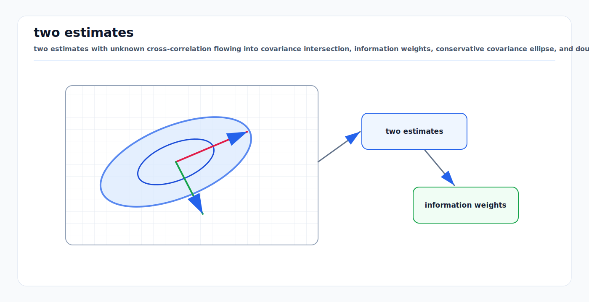

# Fusion with Unknown Correlations and Covariance Intersection

<!-- kb-visual:start -->


*Visual: two estimates with unknown cross-correlation flowing into covariance intersection, information weights, conservative covariance ellipse, and double-counting warning.*
<!-- kb-visual:end -->

Multi-sensor fusion is only as good as its correlation accounting. If two
estimates share a prior, process noise, map, feature track, or upstream sensor,
then fusing them as independent double-counts information and makes covariance
too small.

Covariance intersection (CI) is the conservative tool for the case where each
input estimate has a mean and covariance, but the cross-correlation is unknown.

---

## Related Docs

- [Bayesian Filtering and Error-State Kalman Filters](bayesian-filtering-and-eskf.md)
- [Information Filters and Smoothers](information-filters-and-smoothers.md)
- [RTK-GPS, IMU, and Multi-Sensor Localization](rtk-gps-imu-localization.md)
- [Gaussian Noise, Covariance, and Information](../probability-statistics/gaussian-noise-covariance-information.md)
- [Mahalanobis Distance, Chi-Square Gates, NIS, and NEES](../probability-statistics/mahalanobis-chi-square-gating.md)

---

## Where Unknown Correlation Comes From

| Situation | Shared information |
|---|---|
| Track-to-track fusion | common process model, previous fused track, exchanged messages |
| GNSS/INS plus fused localization | same IMU or GNSS appears in both products |
| LiDAR map localization plus SLAM odometry | same map or scan-matching constraints |
| Multi-robot map fusion | prior map segments and loop-closure information |
| Perception output plus raw sensor fusion | detector output already used the same image, point cloud, or radar |
| Networked estimation | messages recirculate through graph cycles |

If the lineage of each estimate is not tracked, independence is usually an
unsafe assumption.

---

## Naive Independent Fusion

For two estimates `(x_1, P_1)` and `(x_2, P_2)`, independent Gaussian fusion in
information form is:

```text
Y = P_1^-1 + P_2^-1
y = P_1^-1 x_1 + P_2^-1 x_2
P = Y^-1
x = P y
```

This is optimal only when the estimation errors are independent. If the errors
are positively correlated, the result can be overconfident. In safety monitors,
that can be worse than a visibly noisy estimate because the system believes it
has more integrity margin than it really has.

---

## Covariance Intersection

CI replaces the independence sum with a convex information-weighted blend:

```text
P_CI^-1 = omega P_1^-1 + (1 - omega) P_2^-1

x_CI = P_CI (
  omega P_1^-1 x_1 + (1 - omega) P_2^-1 x_2
)

0 <= omega <= 1
```

The weight is chosen to minimize a scalar size of the fused covariance, such as:

```text
minimize log(det(P_CI))
```

or:

```text
minimize trace(P_CI)
```

When the inputs are conservative and unbiased, CI gives a conservative fused
estimate for any unknown cross-correlation. It is often less accurate than
fusion with known correlations, but it avoids false precision.

---

## Weight Selection

| Objective | Meaning | Common use |
|---|---|---|
| `log det(P)` | minimize uncertainty volume | multi-dimensional localization |
| `trace(P)` | minimize total marginal variance | tracking and simple implementation |
| largest eigenvalue | minimize worst-axis variance | safety envelopes and protection bounds |
| fixed omega | deterministic fallback | low-compute embedded systems |

The chosen objective should match the downstream decision. A parking or docking
planner may care about lateral covariance more than volume, while a map-fusion
backend may care about determinant or trace.

---

## When CI Is the Right Tool

Use CI when:

- cross-covariance is unknown or too expensive to maintain,
- communication topology can create double-counting,
- an upstream module provides only mean and covariance,
- a safety monitor needs conservative bounds,
- two estimates cover the same state but have overlapping data lineage.

Avoid CI when:

- the exact joint covariance is available and trustworthy,
- the estimates are truly independent,
- one estimate is biased or faulted and should be rejected before fusion,
- the state vectors do not align and require careful common-state projection.

CI handles correlation uncertainty; it does not solve bias, outlier, frame, or
timestamp errors.

---

## Partial Knowledge and Distributed Fusion

CI is the baseline for completely unknown correlation. If more structure is
known, less conservative methods may be possible:

| Method | Idea | Risk |
|---|---|---|
| Track lineage | avoid fusing duplicate raw evidence | requires metadata discipline |
| Split covariance | separate independent and common components | wrong split breaks consistency |
| Covariance union | cover disagreement or possible bias between estimates | can be very conservative |
| Inverse or ellipsoidal CI variants | exploit partial correlation structure | assumptions must be explicit |
| Factor-graph fusion | share raw factors instead of fused estimates | higher bandwidth and compute |

The best fix is often architectural: move the fusion boundary upstream so that
raw independent measurements are fused once in a common graph.

---

## Diagnostics

- Record source lineage for every fused estimate.
- Flag any fusion between a raw sensor product and a downstream estimate that
  already consumed that sensor.
- Compare covariance against empirical error with NEES when truth is available.
- Run replay with CI versus independent fusion and inspect covariance collapse.
- Check that CI output covariance is not smaller than both inputs in every
  arbitrary direction without a defensible reason.
- Monitor disagreement between input means. Large disagreement is an outlier or
  bias problem, not only a correlation problem.

---

## Failure Modes

| Failure mode | Symptom | Mitigation |
|---|---|---|
| Double-counted GNSS | fused covariance shrinks during multipath | track lineage or use CI |
| Recirculated tracks | distributed nodes become overconfident after repeated exchange | CI, channel filters, or rumor control |
| Biased input | CI produces conservative covariance around the wrong mean | fault detection before fusion |
| Wrong state alignment | covariance looks reasonable in the wrong frame | transform mean and covariance with adjoints |
| Sequential CI order effects | output changes with fusion order | batch objective or deterministic ordering |
| Over-conservative CI | planner degrades unnecessarily | expose partial correlation or fuse raw factors |

---

## Minimal Mental Model

If you do not know whether two estimates are independent, do not add their
information matrices as if they are. CI fuses by choosing a conservative point
inside the uncertainty geometry rather than pretending missing correlation data
does not exist.

---

## Sources

- Julier and Uhlmann, "A Non-divergent Estimation Algorithm in the Presence of Unknown Correlations": https://doi.org/10.1109/ACC.1997.609105
- Julier and Uhlmann, "Using Covariance Intersection for SLAM": https://doi.org/10.1016/j.robot.2006.06.011
- Reinhardt, Noack, Arambel, and Hanebeck, "Minimum Covariance Bounds for the Fusion under Unknown Correlations": https://doi.org/10.1109/LSP.2015.2414972
- Noack et al., "A Quarter Century of Covariance Intersection: Correlations Still Unknown?": https://www.diva-portal.org/smash/get/diva2:1853630/FULLTEXT01.pdf
- Bakr and Lee, "Distributed Multisensor Data Fusion under Unknown Correlation and Data Inconsistency": https://doi.org/10.3390/s17102478
- Clark, Julier, Mahler, and Ristic, "Robust Multi-Object Sensor Fusion with Unknown Correlations": https://ieeexplore.ieee.org/document/5595888
