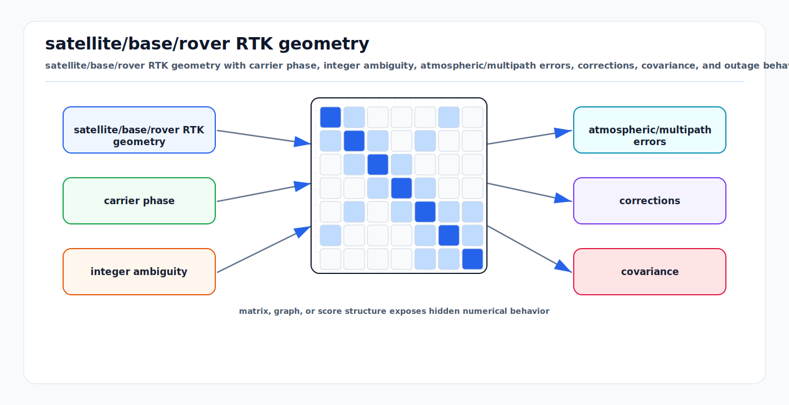

# GNSS and RTK Error Models

<!-- kb-visual:start -->


*Visual: satellite/base/rover RTK geometry with carrier phase, integer ambiguity, atmospheric/multipath errors, corrections, covariance, and outage behavior.*
<!-- kb-visual:end -->

GNSS provides global position and time. RTK turns carrier-phase measurements and
base-station corrections into centimeter-class relative positioning when the
integer ambiguities are correctly resolved. In autonomy, GNSS is both a sensor
and a map-registration authority. Its errors are structured, environment
dependent, and often non-Gaussian.

---

## 1. Sensor Model Impact

| Task | Why the model matters |
|---|---|
| Perception | GNSS/RTK pose and covariance decide whether detections can be placed into map context, geofenced, or compared with surveyed zones. A false fix can make correct object detections appear in the wrong lane, stand, or safety area. |
| SLAM | GNSS factors anchor local odometry and loop closures to a global frame, but overconfident multipath updates can warp the whole graph. |
| Mapping | RTK defines georeferencing for point clouds, camera semantics, surveyed boundaries, and airport map alignment. Datum, projection, and lever-arm mistakes become map errors. |
| Validation | GNSS quality must be replayed with fix state, covariance, correction age, satellite geometry, and multipath context so localization and perception metrics are interpreted correctly. |

---

## 2. GNSS Observables

### Pseudorange

Pseudorange is code-phase range from satellite to receiver antenna:

```
P_i = rho_i + c*(dt_r - dt_s) + T_i + I_i
      + b_code + multipath_P + epsilon_P
```

where:

- `rho_i`: geometric range from satellite to receiver
- `dt_r`, `dt_s`: receiver and satellite clock offsets
- `T_i`: tropospheric delay
- `I_i`: ionospheric delay for code
- `b_code`: hardware/code biases
- `multipath_P`, `epsilon_P`: multipath and measurement noise

Pseudorange noise is meter-level for standalone GNSS, depending on signal,
receiver, multipath, satellite geometry, and corrections.

### Carrier Phase

Carrier phase measures the phase of the RF carrier:

```
Phi_i * lambda = rho_i + c*(dt_r - dt_s) + T_i - I_i
                 + lambda*N_i + b_phase
                 + multipath_Phi + epsilon_Phi
```

Carrier phase has millimeter-to-centimeter precision but includes an unknown
integer ambiguity `N_i`. The ionosphere sign is opposite to code because phase
is advanced while code is delayed.

### Doppler

Doppler measures range rate:

```
D_i * lambda ~= -rho_dot_i + c*(dt_dot_r - dt_dot_s) + noise
```

It is useful for velocity, cycle-slip detection, and tight GNSS/IMU fusion.

---

## 3. RTK and Ambiguity Resolution

RTK uses a base receiver at known position and a rover on the vehicle. By
differencing measurements from common satellites, many satellite and receiver
clock terms cancel.

Double-differenced carrier phase:

```
delta_delta_Phi * lambda =
  delta_delta_rho + delta_delta_T - delta_delta_I
  + lambda * delta_delta_N + noise
```

The estimator first solves a float solution where ambiguities are real-valued,
then attempts integer ambiguity resolution:

```
N_fixed = integer_argmin_N (N - N_float)^T Q_N^-1 (N - N_float)
```

The LAMBDA method is the canonical approach for efficient integer least-squares
ambiguity resolution.

RTK states:

| State | Meaning | Typical autonomy handling |
|---|---|---|
| Single | standalone code solution | meter-level, low weight or degraded mode |
| DGPS/DGNSS | code differential corrections | sub-meter to meter-level |
| Float RTK | carrier ambiguities estimated but not fixed | decimeter-level if geometry and corrections are good |
| Fixed RTK | integer ambiguities resolved | centimeter-level, but false fix is dangerous |

---

## 4. Error Sources

| Error source | Behavior | Mitigation |
|---|---|---|
| Satellite clock/orbit | common-mode for nearby base/rover | broadcast/precise corrections, differencing |
| Ionosphere | dispersive, frequency-dependent, spatially varying | dual frequency, short baselines, iono models |
| Troposphere | non-dispersive, elevation and weather dependent | mapping functions, estimate zenith delay |
| Multipath | reflected signals, site-specific, non-Gaussian | antenna placement, choke/ring ground plane, elevation masks, robust gating |
| Receiver noise | signal and hardware dependent | quality receiver/antenna, SNR weighting |
| Cycle slip | carrier lock interruption | Doppler/code checks, reset ambiguity |
| Satellite geometry | DOP amplification | multi-constellation, satellite selection |
| Base-rover baseline | residual atmosphere grows with distance | local base or network RTK/VRS |
| Interference/spoofing | corrupted measurements | RF monitoring, consistency with IMU/LiDAR/map |

---

## 5. Atmospheric Modeling

### Ionosphere

First-order ionospheric delay is frequency dependent:

```
I_f proportional_to TEC / f^2
```

Dual-frequency receivers can form ionosphere-free combinations, but RTK often
relies on short-baseline differencing so rover and base see similar ionosphere.
Residual ionosphere grows with baseline length and ionospheric activity.

### Troposphere

Tropospheric delay is commonly split:

```
T(elevation) = m_h(e) * ZHD + m_w(e) * ZWD
```

where `ZHD` is zenith hydrostatic delay, `ZWD` is zenith wet delay, and `m(e)`
are elevation mapping functions. Low-elevation satellites have longer paths and
larger atmospheric and multipath errors.

Practical weighting:

```
sigma_sat_i = sigma0 / sin(elevation_i)
```

Many receivers internally weight observations by elevation and carrier-to-noise
density `C/N0`.

---

## 6. Multipath and Non-Gaussian Errors

Multipath occurs when direct and reflected GNSS signals reach the antenna.
Airside environments are multipath-heavy:

- aircraft fuselage and tails
- terminal glass and metal structures
- jet bridges and service vehicles
- wet apron surfaces
- hangars and fuel trucks

Multipath can bias pseudorange by meters and carrier phase by centimeters or
more. It is not well modeled as zero-mean Gaussian. In a factor graph or ESKF,
GNSS updates should use robust kernels, innovation gating, and quality-based
covariance inflation.

Indicators:

```
low C/N0
high residuals on a subset of satellites
low elevation
rapid position jumps
float/fix toggling
fixed solution inconsistent with inertial prediction
```

---

## 7. Covariance and Fusion

A GNSS receiver may output position covariance, HDOP/VDOP, fix status, and
protection/integrity fields. Treat these as useful but not infallible.

Approximate position covariance:

```
Sigma_position ~= DOP_matrix * sigma_range^2
```

For a position factor:

```
r = p_gnss_ENU - (p_base_ENU + R_base * lever_arm_base_to_antenna)
r ~ N(0, Sigma_gnss)
```

Lever-arm correction is mandatory:

```
p_antenna = p_base + R_base * l_base_antenna
```

If orientation uncertainty is significant, lever-arm uncertainty contributes to
position covariance:

```
delta_p ~= -R_base * skew(l_base_antenna) * delta_theta
```

Practical covariance policy:

| Condition | Position sigma starting point |
|---|---|
| RTK fixed, open sky, short baseline | 0.01 to 0.03 m horizontal, 0.02 to 0.06 m vertical |
| RTK float | 0.1 to 0.5 m, quality dependent |
| DGNSS | 0.3 to 2.0 m |
| standalone GNSS | 1.5 to 10 m |
| terminal/aircraft multipath | inflate by 5x to 50x or reject |
| suspected false fix | reject fixed status and gate as outlier |

Use receiver-provided covariance when available, but cap minimum covariance to
avoid overconfident fixes in multipath.

---

## 8. Outage and Degradation Behavior

GNSS degradation is not binary. Modes include:

- satellite count falls gradually
- geometry worsens while fix remains valid
- corrections are delayed or lost
- RTK fixed drops to float
- receiver reports fixed but position jumps
- carrier cycle slips reset ambiguities
- complete outage under aircraft, terminal, or hangar

State-estimation policy:

```
if fixed and innovation passes gate:
    use tight covariance
elif float and innovation passes gate:
    use inflated covariance
elif stale corrections or poor C/N0/DOP:
    inflate or reject
else:
    rely on IMU + wheel + LiDAR/radar/vision localization
```

During outage, uncertainty should grow. If the fused output covariance remains
small while GNSS is unavailable and LiDAR/map constraints are weak, the
estimator is overconfident.

---

## 9. Map Georeferencing

GNSS ties local maps to Earth frames. Common frame chain:

```
WGS84 lat/lon/height
  -> ECEF
  -> local ENU or UTM
  -> map
  -> odom
  -> base_link
```

Mapping implications:

- The map origin, datum, geoid/ellipsoid height convention, and projection must
  be versioned.
- UTM zone and local tangent-plane origin must be fixed for a site map.
- Base station coordinates must be surveyed in the same datum as the map.
- Antenna phase center offsets and vehicle lever arm must be documented.
- Do not mix ellipsoidal height, geoid height, and local surveyed elevation
  silently.

For airside mapping, centimeter local consistency matters near aircraft stands,
but absolute georeferencing matters for integration with airport maps, asset
management, and incident reconstruction.

---

## 10. Validation

Validation should include:

- open-sky baseline runs
- terminal and hangar multipath runs
- aircraft occlusion and service-vehicle occlusion
- correction outage and delayed correction replay
- repeated map alignment passes
- false-fix detection tests
- lever-arm and heading sensitivity tests

Useful metrics:

```
GNSS innovation NIS
fix state duration and transition count
correction age
satellite count by constellation
HDOP/VDOP/PDOP
C/N0 distribution
cycle slip count
position jump rate
map residual versus GNSS residual
```

---

## 11. Failure Modes

| Failure mode | Cause | Mitigation |
|---|---|---|
| False RTK fix corrupts trajectory | wrong integer ambiguities accepted | innovation gating, inertial/map consistency, hold fixed minima |
| Meter jump near terminal | multipath and satellite blockage | robust kernels, covariance inflation, reject low-quality epochs |
| Wrong map offset | datum/projection/base coordinate mismatch | survey control and georeference audits |
| Heading error from GNSS course | low speed or multipath | do not use course heading below speed threshold |
| Lever-arm bias | antenna offset ignored or wrong frame | calibrate and apply `R * lever_arm` |
| Outage overconfidence | process noise too small or stale covariance | grow covariance and trigger degraded mode |
| Vertical inconsistency | ellipsoid/geoid/local height mix | explicit height convention in map metadata |

---

## 12. Sources

- RTKLIB ver. 2.4.2 Manual. https://www.rtklib.com/prog/manual_2.4.2.pdf
- Navipedia, "GNSS Measurements Modelling." https://www.navipedia.org/navipedia/index.php/GNSS_Measurements_Modelling
- Teunissen, "The least-squares ambiguity decorrelation adjustment: a method for fast GPS integer ambiguity estimation." Journal of Geodesy, 1995.
- Teunissen, "Performance of the LAMBDA method for fast GPS ambiguity resolution." ION GPS, 1997. https://www.ion.org/publications/abstract.cfm?articleID=100034
- Misra and Enge, "Global Positioning System: Signals, Measurements, and Performance." Ganga-Jamuna Press.
- Hofmann-Wellenhof, Lichtenegger, Wasle, "GNSS: Global Navigation Satellite Systems." Springer.
- Takasu and Yasuda, "Development of the Low-cost RTK-GPS Receiver with an Open Source Program Package RTKLIB." 2009.
- Seepersad and Bisnath, "Reduction of PPP convergence period through pseudorange multipath and noise mitigation." GPS Solutions, 2015.
