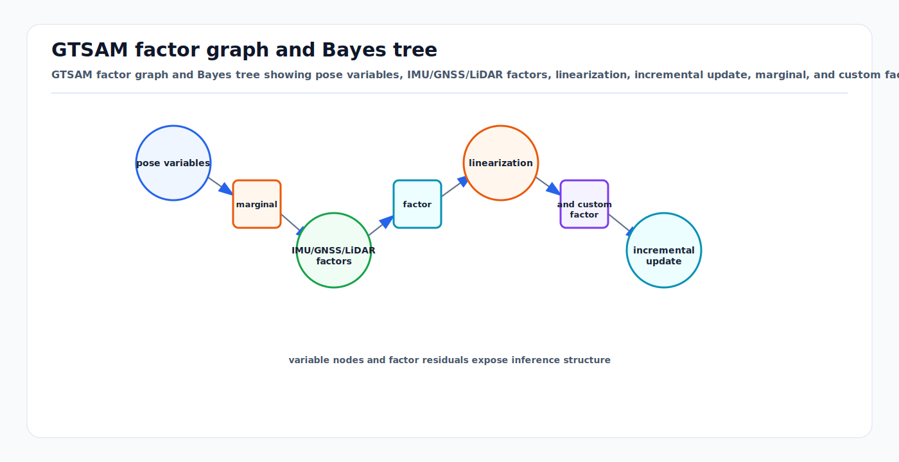

# GTSAM Factor Graph Optimization: Comprehensive Technical Reference

<!-- kb-visual:start -->


*Visual: GTSAM factor graph and Bayes tree showing pose variables, IMU/GNSS/LiDAR factors, linearization, incremental update, marginal, and custom factor lifecycle.*
<!-- kb-visual:end -->

## Related docs

- [Robust Losses and M-Estimators](../probability-statistics/robust-losses-m-estimators-huber-cauchy-tukey-geman-mcclure.md)
- [Gaussian Noise, Covariance, Information, Whitening, and Uncertainty Ellipses](../probability-statistics/gaussian-noise-covariance-information.md)
- [Likelihood, MAP, MLE, and Least Squares](../probability-statistics/likelihood-map-mle-least-squares.md)
- [Probabilistic Graphical Models and Message Passing](../probability-statistics/probabilistic-graphical-models-message-passing.md)
- [Nonlinear Least Squares from First Principles](../optimization/nonlinear-least-squares-first-principles.md)
- [Jacobians, Autodiff, and Manifold Linearization](../optimization/jacobians-autodiff-manifold-linearization.md)
- [Gauss-Newton, Levenberg-Marquardt, and Dogleg](../optimization/gauss-newton-levenberg-marquardt-dogleg.md)
- [Factor Graph Solver Patterns: Ceres, GTSAM, and g2o](../optimization/factor-graph-solver-patterns-ceres-gtsam-g2o.md)
- [Nonlinear Solver Diagnostics Crosswalk](../optimization/nonlinear-solver-diagnostics-crosswalk.md)
- [Eigenvalues, Hessian Conditioning, and Observability](../numerical-linear-algebra/eigenvalues-hessian-conditioning-observability.md)
- [Sparse Matrices, Fill-In, and Ordering](../numerical-linear-algebra/sparse-matrices-fill-in-ordering.md)
- [Sparse Estimation Backend Crosswalk](../numerical-linear-algebra/sparse-estimation-backend-crosswalk.md)
- [Cholesky, LDLT, and Normal Equations](../numerical-linear-algebra/cholesky-ldlt-normal-equations.md)
- [QR, SVD, and Rank-Revealing Solvers](../numerical-linear-algebra/qr-svd-rank-revealing-solvers.md)
- [Square-Root Information and Covariance Recovery](../numerical-linear-algebra/square-root-information-and-covariance-recovery.md)
- [Schur Complement, Marginalization, and PCG](../numerical-linear-algebra/schur-complement-marginalization-pcg.md)
- [Lie Groups SE(3), SO(3), Adjoints, and Jacobians](../geometry-3d/lie-groups-se3-so3-jacobians.md)
- [IMU Error Models and Preintegration](imu-error-models-preintegration.md)
- [SLAM/VIO Observability, FEJ, Nullspace, and Consistency](slam-vio-observability-fej-nullspace-consistency.md)
- [GLIM and GTSAM Pipeline Hub](../../30-autonomy-stack/localization-mapping/slam-methods/glim-gtsam-pipeline-hub.md)
- [GLIM](../../30-autonomy-stack/localization-mapping/slam-methods/glim.md)

## Table of Contents

- [GLIM Reading Frame](#glim-reading-frame)
- [GTSAM Mathematical Stack Coverage Map](#gtsam-mathematical-stack-coverage-map)
1. [Factor Graph Fundamentals](#1-factor-graph-fundamentals)
2. [Mathematical Foundations](#2-mathematical-foundations)
3. [ISAM2 Algorithm and the Bayes Tree](#3-isam2-algorithm-and-the-bayes-tree)
4. [Factor Types for Autonomous Vehicles](#4-factor-types-for-autonomous-vehicles)
5. [IMU Preintegration Theory](#5-imu-preintegration-theory)
6. [VGICP Algorithm Details](#6-vgicp-algorithm-details)
7. [GPU Acceleration via gtsam_points](#7-gpu-acceleration-via-gtsam_points)
8. [Tuning Guide: Noise Models and Covariance](#8-tuning-guide-noise-models-and-covariance)
9. [Adding Custom Factors](#9-adding-custom-factors)
10. [Failure Modes and Recovery](#10-failure-modes-and-recovery)
11. [Comparison: GTSAM vs Ceres vs g2o](#11-comparison-gtsam-vs-ceres-vs-g2o)
12. [AV System Integration Patterns](#12-av-system-integration-patterns)

---

## GLIM Reading Frame

GLIM is a concrete application of the GTSAM model described on this page. Read it as:

```text
range/IMU measurements
  -> residual factors
  -> sparse factor graph
  -> linearized Jacobian and Hessian
  -> Bayes tree or batch sparse solve
  -> optimized odometry, submaps, and global map
```

The mapping from concepts is:

| GTSAM concept | GLIM use |
|---|---|
| `Values` | Pose, velocity, bias, and submap-pose assignments such as `X(i)`, `V(i)`, and `B(i)` |
| `NonlinearFactorGraph` | Odometry and global mapping objectives |
| Noise model | Measurement covariance and whitening for scan matching, IMU, loop, plane, GNSS, or custom factors |
| Custom factor | `gtsam_points` scan-matching or VGICP-style residuals |
| iSAM2 / Bayes tree | Incremental smoothing and partial relinearization where applicable |
| Fixed-lag smoothing | Bounded odometry window with marginalization of old variables |
| Hessian / information matrix | Local observability and covariance approximation for the current linearized graph |

This is why GLIM should not be reduced to "GTSAM plus ICP." The key design move is putting point-cloud registration error into factor evaluation, then using GTSAM-style sparse optimization to solve the resulting map problem.

## GTSAM Mathematical Stack Coverage Map

Read GTSAM as a layered mathematical stack. The C++ API names are useful, but the underlying questions are probabilistic, geometric, numerical, and operational:

```text
measurements
  -> likelihood factors and priors
  -> whitened residual blocks
  -> manifold-aware Jacobians
  -> sparse linearized Gaussian graph
  -> ordered elimination / Bayes tree
  -> nonlinear update, marginal, or incremental relinearization
```

| GTSAM layer | Main GTSAM objects or methods | Mathematical method | Dedicated KB coverage | GLIM relevance |
|---|---|---|---|---|
| Probabilistic model | `NonlinearFactorGraph`, `PriorFactor`, `BetweenFactor`, `NoiseModelFactorN` | Factorization of a posterior into local likelihoods and priors | [Probabilistic Graphical Models and Message Passing](../probability-statistics/probabilistic-graphical-models-message-passing.md), [Likelihood, MAP, MLE, and Least Squares](../probability-statistics/likelihood-map-mle-least-squares.md) | Odometry, scan matching, loop closure, GNSS, plane, and custom map factors become one joint posterior |
| Noise and whitening | `noiseModel::Diagonal`, `noiseModel::Gaussian`, robust noise models | Covariance, information, square-root information, Mahalanobis distance | [Gaussian Noise, Covariance, Information, Whitening, and Uncertainty Ellipses](../probability-statistics/gaussian-noise-covariance-information.md), [Square-Root Information and Covariance Recovery](../numerical-linear-algebra/square-root-information-and-covariance-recovery.md) | Sensor trust is encoded by sigmas and square-root information before factors enter the solve |
| Nonlinear objective | `error()`, `linearize()`, `NonlinearOptimizer` | MAP as nonlinear least squares | [Nonlinear Least Squares from First Principles](../optimization/nonlinear-least-squares-first-principles.md) | GLIM registration costs are solved as local nonlinear least-squares updates, not as isolated ICP transforms |
| Manifold state space | `Pose2`, `Pose3`, `Rot3`, `NavState`, `Values`, `retract`, `localCoordinates` | Lie groups, local tangent coordinates, Exp/Log-style updates | [Lie Groups SE(3), SO(3), Adjoints, and Jacobians](../geometry-3d/lie-groups-se3-so3-jacobians.md), [Jacobians, Autodiff, and Manifold Linearization](../optimization/jacobians-autodiff-manifold-linearization.md) | Pose, velocity, bias, and submap updates must use the same tangent convention across scan, IMU, and loop factors |
| Linearization | `GaussianFactorGraph`, `JacobianFactor`, `HessianFactor`, `linearizeToHessianFactor` | Taylor expansion, Jacobian blocks, approximate Hessian `J^T J` | [Jacobians, Autodiff, and Manifold Linearization](../optimization/jacobians-autodiff-manifold-linearization.md), [Eigenvalues, Hessian Conditioning, and Observability](../numerical-linear-algebra/eigenvalues-hessian-conditioning-observability.md) | Scan geometry weak modes appear as small eigenvalues in the local Hessian or information matrix |
| Nonlinear step | `GaussNewtonOptimizer`, `LevenbergMarquardtOptimizer`, `DoglegOptimizer`, iSAM2 GN/Dogleg params | Gauss-Newton, LM damping, trust-region dogleg | [Gauss-Newton, Levenberg-Marquardt, and Dogleg](../optimization/gauss-newton-levenberg-marquardt-dogleg.md), [Nonlinear Solver Diagnostics Crosswalk](../optimization/nonlinear-solver-diagnostics-crosswalk.md) | Poor initialization or dynamic-object residuals show up as rejected steps, damping growth, or bad actual/predicted reduction |
| Sparse solve | `EliminatePreferCholesky`, QR choices, ordering APIs | Sparse Cholesky, sparse QR, fill-reducing ordering | [Cholesky, LDLT, and Normal Equations](../numerical-linear-algebra/cholesky-ldlt-normal-equations.md), [QR, SVD, and Rank-Revealing Solvers](../numerical-linear-algebra/qr-svd-rank-revealing-solvers.md), [Sparse Matrices, Fill-In, and Ordering](../numerical-linear-algebra/sparse-matrices-fill-in-ordering.md) | City-scale mapping depends on sparse block structure, good ordering, and diagnosing Cholesky failures as observability/modeling signals |
| Elimination and inference | `GaussianBayesNet`, `BayesTree`, multifrontal elimination | Variable elimination, conditionals, separators, clique trees | [Probabilistic Graphical Models and Message Passing](../probability-statistics/probabilistic-graphical-models-message-passing.md), [Sparse Matrices, Fill-In, and Ordering](../numerical-linear-algebra/sparse-matrices-fill-in-ordering.md) | Incremental updates only remain fast when affected cliques stay local and loop closures do not force huge re-elimination |
| Incremental smoothing | `ISAM2`, `ISAM2Params`, `relinearizeThreshold`, `relinearizeSkip` | Bayes tree update, partial relinearization, incremental reordering | [Factor Graph + iSAM2 + GTSAM](../../30-autonomy-stack/localization-mapping/slam-methods/factor-graph-isam2-gtsam.md) | Live GLIM-style odometry needs bounded update latency and explicit monitoring of relinearization behavior |
| Marginals and fixed lag | `Marginals`, `IncrementalFixedLagSmoother`, factor removal | Schur complement, marginal covariance, dense prior factors | [Schur Complement, Marginalization, and PCG](../numerical-linear-algebra/schur-complement-marginalization-pcg.md), [Square-Root Information and Covariance Recovery](../numerical-linear-algebra/square-root-information-and-covariance-recovery.md) | Old pose/velocity/bias states can be removed, but their information becomes a prior on the active separator |
| Robustness | `noiseModel::Robust`, Huber, Cauchy, Tukey-like kernels, switchable factors in user code | M-estimation, IRLS-style weighting, outlier influence control | [Robust Losses and M-Estimators](../probability-statistics/robust-losses-m-estimators-huber-cauchy-tukey-geman-mcclure.md) | Loop closures, GNSS in urban canyons, and dynamic-object scan residuals need robustification plus front-end gating |
| Inertial navigation | `PreintegratedImuMeasurements`, `ImuFactor`, `CombinedImuFactor`, `imuBias::ConstantBias` | On-manifold preintegration, bias random walk, gravity-constrained dynamics | [IMU Error Models and Preintegration](imu-error-models-preintegration.md) | IMU factors stabilize deskew, short-term motion, bias estimation, and poor-geometry LiDAR segments |
| Observability and consistency | Priors, gauges, marginal covariances, `IndeterminantLinearSystemException` | Nullspaces, rank deficiency, gauge fixing, Hessian conditioning | [SLAM/VIO Observability, FEJ, Nullspace, and Consistency](slam-vio-observability-fej-nullspace-consistency.md), [Eigenvalues, Hessian Conditioning, and Observability](../numerical-linear-algebra/eigenvalues-hessian-conditioning-observability.md) | A visually plausible map can still be mathematically weak if global frame, yaw, scale, or local scan directions are underconstrained |

For GLIM specifically, use this reading order:

1. Start with this page for the GTSAM object model: `NonlinearFactorGraph`, `Values`, factors, noise models, and optimizer choices.
2. Read [GLIM](../../30-autonomy-stack/localization-mapping/slam-methods/glim.md) for the concrete pipeline: preprocessing, odometry, submaps, global mapping, offline correction, multi-session merge, and extensions.
3. Read the math pages in the table when a GLIM symptom points to a layer: bad residuals, wrong Jacobians, rank deficiency, fill-in, marginalization artifacts, robust-kernel behavior, or iSAM2 relinearization.
4. Keep the pipeline and the math connected during debugging. "GLIM failed" is usually too broad; the actionable question is whether the failure is in factor modeling, whitening, initialization, scan geometry, sparse elimination, marginalization, or front-end data quality.

---

## 1. Factor Graph Fundamentals

### What is a Factor Graph?

A factor graph is a bipartite graphical model consisting of two types of nodes: **variable nodes** (representing unknown quantities to estimate) and **factor nodes** (representing probabilistic constraints derived from measurements or prior knowledge). Edges connect factors to the variables they constrain. The joint probability distribution factorizes as a product of local functions:

```
P(X) ∝ ∏ᵢ fᵢ(Xᵢ)
```

where each factor `fᵢ` depends on a subset `Xᵢ` of the full variable set `X`.

### Factor Graphs vs Bayesian Networks vs Markov Random Fields

| Property | Factor Graph | Bayesian Network | Markov Random Field |
|---|---|---|---|
| **Graph type** | Bipartite (factors + variables) | Directed acyclic graph | Undirected graph |
| **Edges** | Factor-to-variable only | Directed parent-to-child | Undirected variable-to-variable |
| **Factorization** | Product of arbitrary factors | Product of conditional probabilities | Product of potential functions over cliques |
| **Cyclic dependencies** | Naturally represented | Cannot represent (DAG constraint) | Naturally represented |
| **Inference** | Variable elimination, message passing | Belief propagation | Junction tree, MCMC |
| **Robotics fit** | Excellent: factors map to sensors | Awkward for loop closures | Lacks compositional structure |

**Why factor graphs dominate in robotics:**

1. **Compositional structure** -- Each sensor measurement maps directly to a factor. Adding a GPS sensor means adding GPS factors; adding a LiDAR means adding scan-matching factors. The graph grows organically with the sensor suite.
2. **Sparsity exploitation** -- Each measurement constrains only a small subset of variables (e.g., odometry constrains two consecutive poses). This yields sparse Jacobians and Hessians, enabling efficient variable elimination.
3. **Incremental inference** -- The Bayes tree data structure (Section 3) enables incremental updates without costly re-computation, essential for real-time autonomy.

Factor graphs subsume both Bayesian networks and Markov random fields: any BN or MRF can be converted to an equivalent factor graph by converting conditional distributions or clique potentials into factors.

### GTSAM's Design Philosophy

GTSAM (Georgia Tech Smoothing and Mapping) is a BSD-licensed C++ library that implements sensor fusion using factor graphs and Bayes networks as the computing paradigm rather than sparse matrices directly. Key architectural decisions:

- **Functional approach**: Classes correspond to mathematical objects (factor graphs, values) that are conceptually immutable. A factor graph specifies a function to be applied to values, not a mutable data structure.
- **Separation of concerns**: `NonlinearFactorGraph` specifies the probability density P(X|Z), while `Values` stores specific variable assignments for evaluation.
- **Manifold-aware optimization**: Variables live on differentiable manifolds (Lie groups like SE(3), SO(3)), not in flat Euclidean space. Optimization occurs in tangent spaces via retract/local operations.
- **Key-based variable addressing**: Variables are addressed using `Key` (typedef to `size_t`), created via `symbol('x', 1)` for pose 1 or `symbol('l', 5)` for landmark 5.

The upstream documentation currently lists GTSAM 4.2 as the stable release and the active development line as pre-4.3. Check the official docs before pinning a version, because wrapper, C++ standard, and hybrid-inference support can change across the 4.3 line.

---

## 2. Mathematical Foundations

### Maximum A Posteriori (MAP) Estimation

The core problem in factor-graph-based localization is MAP estimation. Given measurements Z, we seek the most probable configuration X*:

```
X* = argmax_X P(X | Z) = argmax_X P(Z | X) P(X)
```

Taking the negative log, this becomes a nonlinear least-squares (NLS) problem:

```
X* = argmin_X  ∑ᵢ ||hᵢ(Xᵢ) - zᵢ||²_Σᵢ
```

where `hᵢ(Xᵢ)` is the measurement prediction function, `zᵢ` is the actual measurement, and `||e||²_Σ = eᵀ Σ⁻¹ e` is the Mahalanobis distance weighted by covariance `Σᵢ`.

### Nonlinear Least Squares Optimization

**Gauss-Newton method**: Linearize each factor around the current estimate `X⁰`:

```
hᵢ(X⁰ + δ) ≈ hᵢ(X⁰) + Jᵢ δ
```

where `Jᵢ = ∂hᵢ/∂X` is the Jacobian. Substituting into the cost:

```
δ* = argmin_δ  ∑ᵢ ||Jᵢ δ - bᵢ||²_Σᵢ
```

where `bᵢ = zᵢ - hᵢ(X⁰)`. This yields the normal equations:

```
(JᵀΣ⁻¹J) δ* = JᵀΣ⁻¹ b
```

or equivalently `Hδ* = g` where `H = JᵀΣ⁻¹J` (the approximate Hessian / information matrix) and `g = JᵀΣ⁻¹b`.

**Levenberg-Marquardt (LM)**: Adds a damping term `λI` to the Hessian:

```
(H + λI) δ* = g
```

When `λ` is large, LM behaves like gradient descent (robust to poor linearization); when `λ` is small, it behaves like Gauss-Newton (fast quadratic convergence near the solution). GTSAM's `LevenbergMarquardtOptimizer` adaptively adjusts `λ` based on the actual-vs-predicted cost reduction ratio.

**Dogleg method**: Interpolates between the Gauss-Newton step and the steepest descent step within a trust region. Used less commonly but available in GTSAM.

### Variable Elimination

GTSAM exploits the sparsity of factor graphs through **variable elimination**, the algorithmic equivalent of Gaussian elimination on sparse matrices but operating on the graphical model directly.

**Process:**
1. Select a variable to eliminate
2. Collect all factors involving that variable
3. Combine them and marginalize out the variable, producing:
   - A conditional density on the eliminated variable
   - A new factor on the remaining variables (the "fill-in")
4. Repeat until all variables are eliminated

The result is an ordered collection of conditionals forming a **Bayes net** (or **Bayes tree**, see Section 3).

**Elimination ordering matters**: Poor orderings create excessive fill-in, increasing computation from O(n) to O(n³). GTSAM uses the **COLAMD** (Column Approximate Minimum Degree) heuristic to find near-optimal orderings automatically.

### Factorization Methods

GTSAM supports two elimination methods:

- **Cholesky factorization**: Operates on the Hessian H = RᵀR (symmetric positive definite). Faster but requires no constrained noise models. `EliminatePreferCholesky()` is the default.
- **QR factorization**: Operates on the Jacobian J directly. More numerically stable and handles constrained noise models. Falls back to this when Cholesky fails.

**Multifrontal elimination**: GTSAM builds a **junction tree** where each node is a cluster of factors with a clique of variables eliminated simultaneously. This maps directly to multifrontal sparse matrix factorization, with the junction tree encoding the block structure of the factored matrix.

### Manifold Optimization: Lie Groups in GTSAM

Poses and rotations are not Euclidean vectors -- they live on smooth manifolds (Lie groups). GTSAM handles this through two key operations:

**Retract**: Maps a tangent vector `ξ` at point `p` back to the manifold:
```
p' = retract_p(ξ)
```

**LocalCoordinates**: Maps a manifold element back to the tangent space:
```
ξ = localCoordinates_p(p')
```

For Lie groups, these correspond to the **exponential map** (`Exp`) and **logarithmic map** (`Log`):

```
T' = T · Exp(ξ)       (retract via right multiplication)
ξ = Log(T⁻¹ · T')     (local coordinates)
```

**Key Lie groups in GTSAM:**

| Group | Dimension | Description | Tangent space |
|---|---|---|---|
| SO(2) | 1 | 2D rotations | angular velocity θ |
| SE(2) | 3 | 2D rigid transforms | (x, y, θ) |
| SO(3) | 3 | 3D rotations | angular velocity ω ∈ ℝ³ |
| SE(3) | 6 | 3D rigid transforms | (ω, v) ∈ ℝ⁶ -- twist |

**BetweenFactor residual on SE(3):**

```
r = Log(ΔT⁻¹ · T_i⁻¹ · T_j)
```

This 6-dimensional residual vector lies in the Lie algebra se(3) and represents the error between the measured relative transform `ΔT` and the actual relative transform `T_i⁻¹ · T_j`.

**Uncertainty representation**: Noise is modeled as a zero-mean Gaussian in the tangent space, mapped to the manifold via retraction:

```
T_measured = T_true · Exp(η),    η ~ N(0, Σ)
```

**Covariance ordering convention** (critical for correct noise model specification):
- `Pose3`: orientation-then-translation (φ, ρ) -- upper-left 3x3 block is rotation uncertainty
- `Pose2`: translation-then-orientation (x, y, θ) -- for historical reasons
- ROS convention differs: translation-then-orientation for 3D

GTSAM 4.x defaults to the full SE(3) exponential map rather than the Cayley approximation, providing better convergence for most problems.

---

## 3. ISAM2 Algorithm and the Bayes Tree

### The Problem with Batch Optimization

Batch methods (Gauss-Newton, LM) recompute the entire solution from scratch at each timestep. For a robot accumulating measurements over time, this means O(n²) total work for n poses -- unacceptable for real-time operation.

### ISAM (Incremental Smoothing and Mapping)

The original iSAM algorithm maintained a QR factorization of the measurement Jacobian, updating it incrementally as new measurements arrived. However, it required periodic batch steps to:
1. Relinearize variables whose linearization points had become stale
2. Reorder variables to maintain sparsity

### ISAM2: The Bayes Tree Revolution

iSAM2 (Kaess et al., IJRR 2012) eliminates the need for periodic batch steps through two key innovations:

**The Bayes Tree data structure**: A directed tree that encodes the factored posterior distribution. Unlike the clique tree (junction tree), the Bayes tree:
- Is directed, mapping naturally to the square root information matrix (R factor)
- Each clique stores a conditional density on its frontal variables given its separator variables
- The root clique contains the variables eliminated last (typically the most connected)
- Parent-child relationships encode the fill-in structure from variable elimination

**Construction**: Factor Graph → (eliminate) → Bayes Net → (organize by cliques) → Bayes Tree

**Incremental updates via the Bayes Tree:**

When a new measurement arrives:
1. **Identify affected cliques**: Walk up from the involved variable's clique to the root, marking cliques that need re-elimination
2. **Remove affected cliques**: Convert them back to factors (un-eliminate)
3. **Add new factors**: Insert the new measurement factors
4. **Re-eliminate**: Only the affected portion of the tree is re-factored
5. **Re-attach**: Connect the re-eliminated subtree back to the unchanged portion

This is analogous to a partial re-factorization of a sparse matrix, but operating on the graphical model directly.

**Fluid relinearization**: Rather than relinearizing all variables periodically, iSAM2 selectively relinearizes only variables whose estimates have changed significantly since their last linearization. This is tracked per-variable using a threshold on the change magnitude in the tangent space.

**Incremental variable reordering**: When new variables are added, the elimination ordering may become suboptimal. iSAM2 dynamically updates the ordering by examining the affected portion of the Bayes tree, avoiding the O(n) cost of full reordering.

**Computational complexity**: Each update costs O(λk) where λ is the average clique size and k is the number of affected cliques. In typical SLAM problems, only a small fraction of cliques are affected by each new measurement, yielding amortized near-constant-time updates.

### GTSAM Usage

```cpp
// Create ISAM2 with default parameters
ISAM2Params params;
params.relinearizeThreshold = 0.01;  // relinearize when delta > threshold
params.relinearizeSkip = 1;          // check every update
ISAM2 isam(params);

// Incremental update loop
for each timestep:
    NonlinearFactorGraph newFactors;
    Values newValues;

    // Add new measurements as factors
    newFactors.add(BetweenFactor<Pose3>(X(i), X(i+1), odom, odomNoise));
    newValues.insert(X(i+1), initialEstimate);

    // Incremental update
    isam.update(newFactors, newValues);

    // Get current estimate
    Values currentEstimate = isam.calculateEstimate();
```

### When NOT to Use ISAM2

iSAM2 requires the problem to be **well-constrained** (observable). It will fail or produce poor results when:
- Variables have gauge freedom (e.g., visual odometry without absolute reference)
- The system is rank-deficient (unconstrained degrees of freedom)
- Problems with structure-from-motion where global scale is unobservable

For such problems, use batch LM optimization or Ceres Solver instead.

---

## 4. Factor Types for Autonomous Vehicles

### Prior Factor

Anchors a single variable to a known value:

```cpp
// Prior on initial pose
PriorFactor<Pose3>(X(0), initialPose, priorNoise)

// Prior on initial velocity
PriorFactor<Vector3>(V(0), initialVelocity, velNoise)
```

**AV usage**: Initialize the factor graph with the vehicle's starting pose from RTK-GPS. Without at least one prior, the system has gauge freedom and optimization will fail.

### BetweenFactor (Wheel Odometry)

Constrains the relative transform between two poses:

```cpp
// Wheel odometry from CAN bus encoders
Pose3 wheelOdom = computeOdomFromEncoders(leftEncoder, rightEncoder);
auto odomNoise = noiseModel::Diagonal::Sigmas(
    (Vector6() << 0.01, 0.01, 0.005,   // rotation sigmas (rad)
                   0.05, 0.02, 0.01     // translation sigmas (m)
    ).finished()
);
graph.add(BetweenFactor<Pose3>(X(i), X(i+1), wheelOdom, odomNoise));
```

**Residual**: `r = Log(ΔT⁻¹ · T_i⁻¹ · T_j)` ∈ ℝ⁶

**AV specifics**: Wheel odometry noise is non-isotropic -- forward motion is well-constrained by encoders, lateral motion less so (wheel slip), and heading drift accumulates. Encoder covariance can be mapped to pose covariance using the body manipulator Jacobian of the vehicle's kinematic model.

### GPS Factor

A unary position constraint in a Cartesian frame (ENU, NED, or ECEF):

```cpp
// GPS measurement (position only, no orientation)
Point3 gpsPosition(eastMeters, northMeters, upMeters);
auto gpsNoise = noiseModel::Isotropic::Sigma(3, 1.5);  // 1.5m CEP
graph.add(GPSFactor(X(i), gpsPosition, gpsNoise));
```

`GPSFactor` inherits from `NoiseModelFactor1<Pose3>` and constrains only the translation component of the pose. It extracts the position via `Pose3::translation()` and computes:

```
error = T.translation() - gps_measurement
```

**Lever arm correction**: The GPS antenna is typically offset from the vehicle body frame origin. This must be accounted for:

```cpp
Point3 leverArm(0.5, 0.0, 1.2);  // antenna offset in body frame
Point3 correctedGPS = gpsPosition - pose.rotation().rotate(leverArm);
```

**AV usage**: GPS factors act as absolute drift-bounding constraints. Even with 2-5m accuracy, they prevent unbounded odometry drift. RTK-GPS with cm-level accuracy dramatically tightens the solution. GPS factors alone can fully constrain all unknown poses, including orientations (through position change over time).

### IMU Preintegration Factor

See Section 5 for detailed theory. In GTSAM:

```cpp
auto params = PreintegrationParams::MakeSharedU(9.81);  // gravity up
params->setGyroscopeCovariance(1e-6 * I_3x3);
params->setAccelerometerCovariance(1e-4 * I_3x3);
params->setIntegrationCovariance(1e-8 * I_3x3);

PreintegratedImuMeasurements pim(params, currentBias);

// Integrate at IMU rate (e.g., 200 Hz)
for each IMU measurement between keyframes:
    pim.integrateMeasurement(accel, gyro, dt);

// Add factor between keyframes (e.g., 10 Hz)
graph.add(ImuFactor(X(i), V(i), X(i+1), V(i+1), B(i), pim));
graph.add(BetweenFactor<imuBias::ConstantBias>(
    B(i), B(i+1), zeroBias, biasNoise));
```

The `ImuFactor` connects: pose at time i (`X(i)`), velocity at time i (`V(i)`), pose at time i+1 (`X(i+1)`), velocity at time i+1 (`V(i+1)`), and IMU bias (`B(i)`).

### LiDAR Scan Matching Factors

Traditional approach: Run ICP/GICP externally, convert result to BetweenFactor. This loses information by approximating the full matching cost as a single Gaussian.

**Matching cost factor approach** (gtsam_points): The factor directly embeds the scan matching objective into the graph, re-evaluating alignment at each optimization iteration:

```
e_GICP(T) = ∑_k d_k^T (C'_k + T C_k T^T)^{-1} d_k
```

This preserves multimodal information and enables the optimizer to jointly refine all scan alignments globally. See Sections 6 and 7 for VGICP details and GPU acceleration.

### Loop Closure Factor

Structurally identical to BetweenFactor but derived from place recognition (scan context, DBoW, etc.):

```cpp
// Loop closure detected between pose i and pose j
Pose3 loopTransform = computeLoopTransform(scan_i, scan_j);
auto loopNoise = noiseModel::Diagonal::Sigmas(loopSigmas);
graph.add(BetweenFactor<Pose3>(X(i), X(j), loopTransform, loopNoise));
```

**Critical**: Loop closure noise must account for the scan matching uncertainty. Overconfident loop closures (too-small noise) can warp the entire trajectory. Using robust noise models (Section 8) is essential for handling false positive loop detections.

---

## 5. IMU Preintegration Theory

### Motivation

An IMU produces accelerometer and gyroscope readings at high frequency (100-400 Hz), but the optimization graph operates at keyframe rate (1-30 Hz). Naively adding every IMU sample as a separate factor would create an intractably large graph.

**Preintegration** summarizes all IMU measurements between two keyframes into a single compound measurement -- a "preintegrated IMU measurement" -- that serves as a between-factor without requiring knowledge of the absolute state.

### The IMU Measurement Model

Raw IMU measurements include:

**Gyroscope** (angular velocity in body frame):
```
ω_measured = ω_true + b_g + η_g
```

**Accelerometer** (specific force in body frame):
```
a_measured = R_WB^T (a_true - g_W) + b_a + η_a
```

where `R_WB` is the rotation from world to body, `g_W` is gravity in the world frame, `b_g`, `b_a` are slowly-varying biases, and `η_g`, `η_a` are white noise.

### Preintegrated Measurements (Forster et al.)

Between keyframes at times `i` and `j`, the preintegrated measurements are defined as relative quantities in the body frame at time `i`:

**Rotation preintegration** (on SO(3) manifold):
```
ΔR_ij = ∏_{k=i}^{j-1} Exp((ω_k - b_g) Δt)
```

**Velocity preintegration**:
```
Δv_ij = ∑_{k=i}^{j-1} ΔR_ik (a_k - b_a) Δt
```

**Position preintegration**:
```
Δp_ij = ∑_{k=i}^{j-1} [Δv_ik Δt + ½ ΔR_ik (a_k - b_a) Δt²]
```

**Key insight**: These preintegrated quantities depend only on IMU measurements and the bias estimate, NOT on the absolute pose or velocity. This means they can be computed independently and used as constraints between any two keyframe states.

### On-Manifold Treatment (Forster et al., TRO 2016)

The original preintegration by Lupton & Sukthankar used Euler angles, which suffer from gimbal lock and singularities. Forster et al. reformulated preintegration properly on the SO(3) manifold:

1. **Rotation noise**: Multiplicative noise on the rotation group, not additive in Euler angles
2. **Covariance propagation**: Uses the right Jacobian of SO(3) to properly propagate uncertainty through the exponential map
3. **Residual computation**: The rotation residual is computed as `Log(ΔR_ij^T · R_i^T · R_j)`, which lies in the Lie algebra so(3)

### Bias Correction via First-Order Update

When the bias estimate changes during optimization, the preintegrated measurements must be corrected. Rather than re-integrating all raw measurements (expensive), a first-order Taylor expansion is used:

```
ΔR_ij(b_g) ≈ ΔR_ij(b̂_g) · Exp(∂ΔR/∂b_g · δb_g)
Δv_ij(b) ≈ Δv_ij(b̂) + ∂Δv/∂b_g · δb_g + ∂Δv/∂b_a · δb_a
Δp_ij(b) ≈ Δp_ij(b̂) + ∂Δp/∂b_g · δb_g + ∂Δp/∂b_a · δb_a
```

The Jacobians `∂ΔR/∂b_g`, `∂Δv/∂b`, `∂Δp/∂b` are accumulated during the preintegration step alongside the measurements. This avoids costly recomputation while maintaining accuracy -- the error from first-order approximation has been shown to be negligible in practice.

### Covariance Propagation

The preintegration covariance `Σ_ij` is propagated recursively at each IMU step:

```
Σ_{k+1} = A_k Σ_k A_k^T + B_k Q B_k^T
```

where `A_k` is the state transition Jacobian, `B_k` maps noise to state, and `Q` is the IMU noise covariance matrix. This gives the uncertainty of the preintegrated measurement, used as the noise model for the IMU factor.

### GTSAM's NavState Implementation

GTSAM 4 uses a more efficient implementation based on integrating on the NavState tangent space (combining SO(3) and ℝ⁹ for rotation, velocity, and position):

```python
# NavState encapsulates pose and velocity
state_i = gtsam.NavState(pose_i, velocity_i)

# PreintegratedImuMeasurements handles accumulation
pim = gtsam.PreintegratedImuMeasurements(params, bias)
for k in range(num_imu_samples):
    pim.integrateMeasurement(accel[k], gyro[k], dt)

# ImuFactor connects two NavStates and a bias
factor = gtsam.ImuFactor(X(i), V(i), X(i+1), V(i+1), B(i), pim)
```

### Parameter Setup Guide

```python
params = gtsam.PreintegrationParams.MakeSharedU(9.81)  # Z-up convention

# From IMU datasheet (convert from spectral density to variance)
# σ_g: gyroscope noise density [rad/s/√Hz]
# σ_a: accelerometer noise density [m/s²/√Hz]
params.setGyroscopeCovariance(sigma_g**2 * np.eye(3))
params.setAccelerometerCovariance(sigma_a**2 * np.eye(3))

# Integration uncertainty (numerical integration error)
params.setIntegrationCovariance(1e-8 * np.eye(3))

# Bias random walk
bias_noise = gtsam.noiseModel.Diagonal.Sigmas(
    np.array([sigma_bg, sigma_bg, sigma_bg,   # gyro bias
              sigma_ba, sigma_ba, sigma_ba])   # accel bias
)
```

**Typical values for MEMS IMU (e.g., BMI088):**
- Gyroscope noise density: ~0.014 deg/s/√Hz → σ_g ≈ 2.4e-4 rad/s/√Hz
- Accelerometer noise density: ~0.17 mg/√Hz → σ_a ≈ 1.7e-3 m/s²/√Hz
- Gyroscope bias stability: ~3 deg/hr → σ_bg ≈ 1.5e-5 rad/s
- Accelerometer bias stability: ~0.04 mg → σ_ba ≈ 4e-4 m/s²

---

## 6. VGICP Algorithm Details

### Background: From ICP to GICP to VGICP

**ICP (Iterative Closest Point)**: Minimizes point-to-point distances. Fast but sensitive to initialization and noise.

**GICP (Generalized ICP)**: Models each point as a local Gaussian distribution (estimated from neighboring points). Minimizes distribution-to-distribution distances:

```
e_GICP = ∑_k (p'_k - T·p_k)^T (C'_k + T·C_k·T^T)^{-1} (p'_k - T·p_k)
```

where `C_k` and `C'_k` are the covariance matrices of the corresponding points in the source and target clouds. This is more robust than point-to-point ICP because it accounts for the local surface geometry.

**VGICP (Voxelized GICP)**: Replaces the expensive nearest-neighbor search in GICP with voxel-based lookup, achieving comparable accuracy with dramatically better performance.

### VGICP Mathematical Formulation

**Voxel distribution estimation**: Unlike NDT (which estimates distributions from point positions within voxels), VGICP aggregates per-point distributions into voxel distributions. For a voxel containing points {p₁, ..., p_n} with individual covariances {C₁, ..., C_n}:

```
μ_voxel = (1/n) ∑ pₖ
C_voxel = (1/n) ∑ Cₖ + (1/n) ∑ (pₖ - μ)(pₖ - μ)^T
```

This dual aggregation captures both per-point uncertainty and the spatial spread within the voxel.

**Correspondence model**: VGICP uses distribution-to-multi-distribution correspondence. Source points are matched to target voxels via hash-map lookup (O(1) per point), replacing the O(log n) KD-tree search in GICP. Each source point may correspond to multiple target voxel distributions.

**Optimization objective**: The total cost minimized over the rigid transform T:

```
T* = argmin_T ∑_k d_k^T (C'_k + T C_k T^T)^{-1} d_k
```

where `d_k = μ'_{v(k)} - T·p_k` is the residual between the source point (transformed) and its corresponding target voxel mean.

### Performance Characteristics

- **CPU**: ~30 Hz for typical outdoor LiDAR scans (~100k points)
- **GPU**: ~120 Hz for the same workload
- **Accuracy**: Comparable to GICP (distribution-to-distribution matching preserves surface geometry information)
- **Voxel resolution**: Typically 0.5m-2.0m for outdoor LiDAR, 0.1m-0.5m for indoor

### VGICP vs NDT

| Property | VGICP | NDT |
|---|---|---|
| Distribution estimation | Aggregated point covariances | From point positions only |
| Matching model | Distribution-to-distribution | Point-to-distribution |
| Resolution sensitivity | Lower (inherits GICP robustness) | Higher (voxel size critical) |
| GPU friendliness | Excellent (no branching) | Good |

---

## 7. GPU Acceleration via gtsam_points

### Overview

`gtsam_points` (by Kenji Koide, MIT license) extends GTSAM with point cloud registration factors and GPU-accelerated optimization for range-based SLAM. Version 1.2.0 (Jan 2026), tested on Ubuntu 22.04/24.04 with CUDA 12.2-13.1 and NVIDIA Jetson Orin.

### Architecture: Matching Cost Factors vs Pose Graph

Traditional LiDAR SLAM computes scan matching externally and inserts results as BetweenFactor constraints in a pose graph. This has two problems:
1. Approximating multimodal matching results as a single Gaussian loses information
2. Estimating the covariance of the scan match result is difficult and often inaccurate

gtsam_points instead creates **matching cost factors** that embed the full scan matching objective into the factor graph:

```
f_match(T_i, T_j) = ∑_k e_GICP(P_i, P_j, T_i, T_j)
```

The matching cost is re-evaluated at each optimization iteration, allowing the optimizer to jointly refine all alignments globally. This has been shown to outperform pose graph approaches, particularly on long trajectories (Koide et al., 2021).

### GPU Parallelization Strategy

The `IntegratedVGICPFactorGPU` offloads computation to CUDA:

1. **Batched evaluation**: A customized `NonlinearFactorGraph` class first issues all cost evaluation tasks to the GPU simultaneously
2. **Parallel data association**: Voxel lookup is parallelized across all points in all factors
3. **Efficient reduction**: Summation uses GPU-native reduction techniques without atomic operations
4. **Async pipeline**: GPU synchronization occurs only when the linearized system needs to be assembled

This approach achieves ~2x real-time performance on a GTX 1660 Ti for full KITTI sequences with >4,500 factors.

### Complete Factor List

**Scan matching factors:**
| Factor | Method | GPU variant |
|---|---|---|
| IntegratedICPFactor | Point-to-point ICP | No |
| IntegratedPointToPlaneICPFactor | Point-to-plane ICP | No |
| IntegratedGICPFactor | Distribution-to-distribution | No |
| IntegratedVGICPFactor | Voxelized GICP | **Yes** (IntegratedVGICPFactorGPU) |
| IntegratedLOAMFactor | Point-to-plane + point-to-edge | No |

**Continuous-time factors**: IntegratedCT_ICPFactor, IntegratedCT_GICPFactor -- model motion during scan acquisition.

**Colored factors**: IntegratedColorConsistencyFactor, IntegratedColoredGICPFactor -- combine geometric and photometric alignment.

**Bundle adjustment**: PlaneEVMFactor, EdgeEVMFactor, LsqBundleAdjustmentFactor -- eigenvalue minimization for global consistency.

### Extended Optimizers

gtsam_points provides extended versions of GTSAM optimizers that handle GPU factor batching:
- `LevenbergMarquardtOptimizerExt`
- `ISAM2Ext`
- `IncrementalFixedLagSmootherExt`

### Data Structures

- **KdTree**: Parallel construction via nanoflann
- **IncrementalVoxelMap**: iVox-style incremental voxel map for efficient online data association
- **IncrementalCovarianceVoxelMap**: Maintains running covariance estimates per voxel
- **FastOccupancyGrid**: Bit-block representation with flat hashing for rapid overlap estimation
- **B-Spline**: Cubic SE(3) interpolation for continuous-time trajectory representation

### Build Configuration

```bash
# CPU-only
cmake .. -DCMAKE_BUILD_TYPE=Release

# With GPU support
cmake .. -DCMAKE_BUILD_TYPE=Release -DBUILD_WITH_CUDA=ON

# Multi-architecture GPU build
cmake .. -DCMAKE_BUILD_TYPE=Release -DBUILD_WITH_CUDA=ON \
         -DBUILD_WITH_CUDA_MULTIARCH=ON
```

Requires GTSAM 4.2a9 or 4.3a0, Eigen, nanoflann. Optional: PCL, OpenMP, CUDA 12.2+, iridescence (visualization).

### Benchmark Results (KITTI Dataset)

Without loop closure:
- Rotational error: 0.14 deg/100m
- Translational error: 0.52 m/100m

Runtime (GTX 1660 Ti):
- Global optimization (>4500 factors): 884ms average
- Local mapping: 123.9ms average

---

## 8. Tuning Guide: Noise Models and Covariance

### GTSAM Noise Model Hierarchy

```
noiseModel::Base
├── noiseModel::Gaussian
│   ├── noiseModel::Diagonal
│   │   ├── noiseModel::Isotropic
│   │   │   └── noiseModel::Unit
│   │   └── noiseModel::Constrained
│   └── (Full Gaussian with off-diagonal terms)
└── noiseModel::Robust
    └── (Gaussian + M-estimator)
```

### Noise Model Types

**Full Gaussian**: Specifies the complete covariance matrix. Used when measurement errors are correlated (e.g., GPS with correlated horizontal errors).

```cpp
Matrix3 cov;
cov << 4.0, 0.5, 0.0,
       0.5, 9.0, 0.0,
       0.0, 0.0, 1.0;
auto noise = noiseModel::Gaussian::Covariance(cov);
```

**Diagonal**: Independent noise per dimension. Most common for sensor noise:

```cpp
// Specify standard deviations
auto noise = noiseModel::Diagonal::Sigmas(
    (Vector6() << 0.01, 0.01, 0.005,  // rotation (rad)
                   0.05, 0.02, 0.01    // translation (m)
    ).finished()
);
```

**Isotropic**: Same noise in all dimensions:

```cpp
auto noise = noiseModel::Isotropic::Sigma(3, 1.5);  // 3D, 1.5m
```

**Constrained**: Hard constraints (zero sigma). Enforces exact equality:

```cpp
auto noise = noiseModel::Constrained::All(6);  // hard constraint on SE(3)
```

**Unit**: Identity covariance (unweighted least squares).

### Robust Noise Models (M-estimators)

Standard least squares is heavily influenced by outliers. Robust noise models replace the squared cost `ρ(x) = x²/2` with functions that grow more slowly for large residuals.

**Available M-estimators in GTSAM:**

| Estimator | ρ(x) behavior | Use case |
|---|---|---|
| **Huber** | Quadratic for \|x\|<k, linear beyond | General-purpose, mild outliers |
| **Cauchy** | Logarithmic growth | Aggressive outlier rejection |
| **Tukey** (bisquare) | Zero beyond threshold | Hard outlier rejection |
| **Geman-McClure** | Bounded influence | Strong outliers, bounded cost |
| **Welsch** | Exponential decay | Smooth outlier rejection |
| **Fair** | Smooth transition | Conservative outlier handling |

**Mathematical framework**: The M-estimator objective is:

```
minimize ∑ ρ(rᵢ / σᵢ)
```

Solved via **Iteratively Reweighted Least Squares (IRLS)** using weight function `w(x) = ψ(x)/x` where `ψ = dρ/dx` is the influence function.

**Huber example** (the most commonly used):

```
ρ(x) = { x²/2           if |x| < k
        { k|x| - k²/2    otherwise

w(x) = { 1              if |x| < k
        { k/|x|          otherwise
```

The parameter `k` controls the transition point. In GTSAM, `k` is expressed in "number of sigmas" (whitened units), typically k=1.345.

**Usage:**

```cpp
auto measurementNoise = noiseModel::Diagonal::Sigmas(sigmas);
auto huber = noiseModel::Robust::Create(
    noiseModel::mEstimator::Huber::Create(1.345),
    measurementNoise
);
graph.addExpressionFactor(predicted, measurement, huber);
```

### Tuning Recommendations for AV Localization

**Wheel odometry noise:**
```
rotation: [0.005, 0.005, 0.01] rad  (roll/pitch well-constrained, yaw drifts)
translation: [0.02, 0.05, 0.01] m   (forward accurate, lateral less so)
```
- Scale noise with speed: higher speed → more wheel slip → larger sigmas
- On gravel/wet surfaces, multiply translation sigmas by 2-5x

**GPS noise:**
```
RTK fixed: Isotropic::Sigma(3, 0.02)    // 2 cm
RTK float: Isotropic::Sigma(3, 0.5)     // 50 cm
Standard:  Isotropic::Sigma(3, 2.0)     // 2 m
```
- Adjust dynamically based on fix quality (HDOP, number of satellites)
- Near buildings/structures: increase sigma or use robust noise model
- GPS factors should use Huber robust kernel to handle multipath

**LiDAR scan matching:**
```
VGICP between consecutive frames: Diagonal::Sigmas([0.001, 0.001, 0.001, 0.02, 0.02, 0.01])
Loop closure: Diagonal::Sigmas([0.01, 0.01, 0.01, 0.1, 0.1, 0.05])
```
- Loop closures should ALWAYS use robust kernels to handle false positives

**IMU preintegration:**
- Use datasheet noise densities as starting point
- Multiply by 2-10x for real-world conditions (vibration, temperature)
- Integration covariance: start with 1e-8, increase if seeing numerical issues

**Bias noise (between consecutive bias variables):**
```
gyro bias: [1e-5, 1e-5, 1e-5] rad/s
accel bias: [1e-4, 1e-4, 1e-4] m/s²
```
- Too tight: bias cannot adapt to changing conditions
- Too loose: bias becomes poorly constrained, solution unstable

### Covariance Estimation and Validation

**A priori estimation**: Start with sensor datasheets. Convert spectral noise densities to variance: `σ² = (noise_density)² × sample_rate`.

**Empirical validation**: Compare predicted covariances (from `Marginals`) with actual error distributions over logged data. If actual errors consistently exceed predicted uncertainty, increase the noise sigmas.

**Consistency check (NIS - Normalized Innovation Squared)**: For a factor with residual `e` and predicted covariance `Σ`:
```
NIS = e^T Σ^{-1} e
```
Should follow a chi-squared distribution with DoF equal to the residual dimension. If NIS is consistently too high, noise model is overconfident.

---

## 9. Adding Custom Factors

### C++ Custom Factor

Inherit from `NoiseModelFactorN` (where N is the number of variables):

```cpp
class NeuralOdometryFactor : public NoiseModelFactor2<Pose3, Pose3> {
    Pose3 measured_;  // NN-predicted relative pose

public:
    NeuralOdometryFactor(Key key1, Key key2, const Pose3& measured,
                          const SharedNoiseModel& model)
        : NoiseModelFactor2(model, key1, key2), measured_(measured) {}

    Vector evaluateError(const Pose3& p1, const Pose3& p2,
                         boost::optional<Matrix&> H1 = boost::none,
                         boost::optional<Matrix&> H2 = boost::none) const override {
        // Compute relative pose
        Pose3 hx = p1.between(p2, H1, H2);  // GTSAM computes Jacobians

        // Error in tangent space
        return measured_.localCoordinates(hx);
    }
};
```

**Jacobian computation options:**
1. **Analytic**: Hand-derive and implement Jacobians. Fastest runtime but error-prone.
2. **Chain rule via GTSAM**: Use GTSAM's built-in Jacobian propagation through `between()`, `compose()`, etc. Recommended approach.
3. **Numerical**: Use `numericalDerivative` for prototyping (slow, not for production).

### Python Custom Factor

GTSAM's `CustomFactor` class allows Python callbacks:

```python
def error_neural_odom(measurement: np.ndarray,
                       this: gtsam.CustomFactor,
                       values: gtsam.Values,
                       jacobians: Optional[List[np.ndarray]]) -> np.ndarray:
    """Custom factor using neural network predicted odometry."""
    key0, key1 = this.keys()[0], this.keys()[1]
    pose_i = values.atPose3(key0)
    pose_j = values.atPose3(key1)

    # Predicted relative transform
    predicted = pose_i.between(pose_j)

    # Error in tangent space
    error = gtsam.Pose3.Logmap(measurement.inverse().compose(predicted))

    if jacobians is not None:
        # Numerical Jacobians (for prototyping)
        jacobians[0] = gtsam.numericalDerivative11(
            lambda p: error_fn(p, pose_j, measurement), pose_i)
        jacobians[1] = gtsam.numericalDerivative11(
            lambda p: error_fn(pose_i, p, measurement), pose_j)

    return error

# Create and add to graph
nn_noise = gtsam.noiseModel.Diagonal.Sigmas(nn_sigmas)
factor = gtsam.CustomFactor(
    nn_noise, [X(i), X(i+1)],
    partial(error_neural_odom, nn_predicted_pose)
)
graph.add(factor)
```

**Performance note**: Python custom factors incur callback overhead but can call any Python library (PyTorch, TensorFlow) in the error function. For production, implement in C++.

### Neural Network Learned Odometry Integration

**Architecture pattern for learned odometry as a factor:**

1. **Offline**: Train a neural network to predict relative poses from sensor data (e.g., image pairs, LiDAR scans)
2. **Online**: Run inference to get predictions and uncertainty estimates
3. **Factor creation**: Wrap predictions as custom factors with learned or calibrated noise models
4. **Joint optimization**: The factor graph jointly optimizes NN predictions with traditional sensor factors

**Key design decisions:**

- **Noise model**: The NN should output uncertainty estimates (e.g., via MC dropout, ensembles, or a learned covariance head). If not available, use conservative fixed noise models.
- **Bias-aware**: Unlike traditional odometry, NN predictions may have systematic biases. Consider adding a learnable bias variable to the factor graph.
- **Graceful degradation**: Weight NN factors lower than well-characterized sensors (IMU, GPS). Use robust noise models to handle NN failure modes.

### GTSAM Expressions API (Automatic Differentiation)

For simpler custom factors, GTSAM 4's Expressions API provides automatic differentiation:

```cpp
// Define expressions for unknowns
Pose3_ x1(X(1)), x2(X(2));

// Expression for relative pose
Pose3_ predicted = between(x1, x2);

// Add expression factor
graph.addExpressionFactor(predicted, measurement, noise);
```

The Expressions API automatically chains Jacobians using the reverse-mode AD algorithm, eliminating the need to derive or implement Jacobians manually. This is particularly useful for complex measurement functions.

---

## 10. Failure Modes and Recovery

### IndeterminantLinearSystemException

**The most common GTSAM failure.** Thrown when the Hessian matrix is indefinite or singular during variable elimination.

**Common causes:**

1. **Missing constraints**: A variable with insufficient factors to be fully determined:
   - Landmark observed by only one camera (3D position underconstrained)
   - Missing prior on the first pose (global reference frame undefined)
   - No GPS or absolute measurement → gauge freedom

2. **Poor conditioning**: Vastly different measurement uncertainties or variable scales:
   - Mixing mm-precision LiDAR with m-precision GPS without proper noise models
   - Near-degenerate geometry (camera viewing surface edge-on, landmark at infinity)

3. **Numerical accumulation**: Even well-posed problems can become numerically singular:
   - Very long trajectories without loop closures
   - Aggressive marginalization creating dense prior factors

4. **ISAM2-specific**: Variables that become unobservable after graph changes (e.g., landmark leaves field of view before sufficient observations)

**Debugging workflow:**

```cpp
try {
    isam.update(newFactors, newValues);
} catch (IndeterminantLinearSystemException& e) {
    // e.nearbyVariable() gives the variable where the problem was detected
    // (NOT necessarily the source of the problem)
    Key problemVar = e.nearbyVariable();

    // Examine the linear system
    auto linearGraph = graph.linearize(values);
    auto jacobian = linearGraph->sparseJacobian_();
    // Analyze singular values, check for zero pivots
}
```

**Fixes:**
- Add priors to unconstrained variables: `PriorFactor<Pose3>(X(0), initial, strongNoise)`
- Verify every variable has at least one well-conditioned factor
- Check noise model magnitudes are consistent (no extreme ratios)
- For ISAM2: switch to batch LM optimizer for debugging

### Divergence from Poor Initialization

GTSAM's nonlinear optimization is local -- it converges to the nearest minimum. Poor initial estimates can lead to convergence to a wrong solution or divergence entirely.

**Symptoms:**
- Poses jump to unreasonable values after optimization
- Cost function increases rather than decreases
- Solution "wraps" trajectory incorrectly at loop closures

**Mitigation:**
- Initialize new poses from IMU-propagated or odometry-composed estimates, not arbitrary values
- For ISAM2, use the previous timestep's estimate as the starting point for the next
- Check that initial estimates are within the basin of attraction (roughly: within one rotation revolution and a few meters)
- For particularly challenging initializations, run a few LM iterations before switching to ISAM2

### Catastrophic Failure from Odometry Noise

Research has shown GTSAM solution accuracy can degrade by >1700% as odometry noise increases, with catastrophic failures becoming common. The proprioceptive odometry is a dominating factor because GTSAM relies on it to bootstrap the solver.

**Mitigation:**
- Never rely solely on wheel odometry for initialization -- fuse with IMU
- Implement sanity checks on odometry inputs (reject physically impossible velocities)
- Use `LevenbergMarquardtParams::setMaxIterations()` to bound computation time
- Monitor the cost function; if it's not decreasing, fall back to a known-good state

### Marginalization-Induced Inconsistency

In fixed-lag smoothing, marginalized variables create dense prior factors that:
- Introduce spurious correlations between remaining variables
- Can cause fill-in that degrades computational performance
- May introduce inconsistency if the linearization point was poor when marginalized

**Mitigation:**
- Use longer smoothing windows when possible (more memory but better consistency)
- Monitor the condition number of the marginalized prior
- Consider concurrent filtering and smoothing approaches
- Treat landmarks separately: create new landmark variables each window rather than marginalizing old ones

### GPS Multipath and Outlier Corruption

A single bad GPS measurement with an overconfident noise model can warp the entire trajectory.

**Mitigation:**
- Always use robust noise models (Huber or Cauchy) for GPS factors
- Implement a chi-squared consistency test before adding GPS factors
- Dynamically adjust noise based on HDOP, satellite count, and fix quality
- In urban canyons: increase GPS noise by 5-10x or disable GPS entirely

---

## 11. Comparison: GTSAM vs Ceres vs g2o

### Architecture Comparison

| Feature | GTSAM | Ceres Solver | g2o |
|---|---|---|---|
| **Core paradigm** | Factor graphs + Bayes trees | Nonlinear least squares | Hypergraph optimization |
| **Language** | C++ (Python bindings) | C++ (Python via pyceres) | C++ |
| **License** | BSD | BSD | BSD (with LGPL deps) |
| **Primary use** | SLAM, VIO, SfM | General NLS, BA, SLAM | Pose graph SLAM, BA |
| **Incremental** | ISAM2 (native) | No | Limited (online variant) |
| **Autodiff** | Expressions API (limited) | Full autodiff + jet types | No (manual Jacobians) |
| **Manifold support** | Native Lie groups (SO3, SE3) | Manifold class (since 2.1) | Vertex types with oplus |
| **Sparse solvers** | Internal (multifrontal) | CHOLMOD, CX_SPARSE, EIGEN | CHOLMOD, CSparse, PCG |
| **Marginalization** | Built-in (Schur, fixed-lag) | SchurComplement (manual) | Marginal support |

### Performance Comparison

Based on benchmark studies (Ajuric et al., 2021):

**M3500 dataset (standard pose graph benchmark):**
- GTSAM and Ceres achieve the lowest objective function value
- Ceres is slightly faster than GTSAM for batch optimization
- g2o converges to a slightly higher cost

**Larger / harder datasets:**
- Ceres and GTSAM both converge reliably; Ceres is faster in batch mode
- g2o may not converge to the global minimum on difficult problems

**Incremental problems (online SLAM):**
- GTSAM with ISAM2 is dramatically faster (orders of magnitude for long sequences)
- Ceres requires batch re-solving at each step
- g2o has a basic online variant but lacks Bayes tree efficiency

### Strengths and Weaknesses

**GTSAM strengths:**
- ISAM2 incremental solver is unmatched for real-time SLAM
- Native manifold optimization with proper Lie group support
- Rich factor library for navigation (IMU, GPS, vision, LiDAR)
- Hybrid discrete-continuous inference (GTSAM 4.3)
- Mature fixed-lag smoothing and marginalization
- Best internal sparsity exploitation (multifrontal elimination)

**GTSAM weaknesses:**
- ISAM2 requires well-constrained problems (no gauge freedom)
- Limited autodiff compared to Ceres
- Steeper learning curve
- Analytic Jacobians required for best performance in C++

**Ceres strengths:**
- Full automatic differentiation (no manual Jacobians needed)
- Largest user community and excellent documentation
- Handles gauge freedom gracefully (local parameterization)
- More general: applicable beyond robotics
- Slightly faster for batch problems
- Robust trust-region methods (LM, Dogleg)

**Ceres weaknesses:**
- No incremental solver (must re-solve from scratch each step)
- No built-in Bayes tree or junction tree inference
- Less specialized for SLAM-specific patterns
- Manual Schur complement setup for marginalization

**g2o strengths:**
- Simple API (vertex + edge paradigm)
- Fast for standard pose graph SLAM
- Widely used in visual SLAM (ORB-SLAM, SVO)
- Supports Gauss-Newton, LM, and Dogleg
- Easy to get started with

**g2o weaknesses:**
- No automatic differentiation
- Limited incremental capabilities
- May not converge on difficult problems
- Less actively developed than GTSAM and Ceres
- Fewer noise model options

### When to Choose Which

| Use case | Recommended solver | Reason |
|---|---|---|
| Real-time AV localization | **GTSAM (ISAM2)** | Incremental updates essential |
| Offline mapping / bundle adjustment | **Ceres** | Faster batch, autodiff convenient |
| Visual SLAM research (ORB-SLAM style) | **g2o** | Ecosystem compatibility |
| IMU+GPS+LiDAR fusion | **GTSAM** | Best IMU preintegration support |
| LiDAR-only SLAM with GPU | **GTSAM + gtsam_points** | GPU-accelerated VGICP factors |
| Problems with gauge freedom | **Ceres** | Handles rank-deficient systems |
| Hybrid discrete-continuous | **GTSAM** | Only option with native support |
| Rapid prototyping | **Ceres** | Autodiff eliminates Jacobian derivation |

---

## 12. AV System Integration Patterns

### LIO-SAM Architecture (Reference Implementation)

LIO-SAM (Shan et al., IROS 2020) demonstrates a production-quality GTSAM-based AV localization architecture with four factor types:

**Dual factor graph design:**

1. **Map optimization graph** (persistent): Optimizes LiDAR odometry and GPS factors over the full trajectory. Maintained continuously throughout operation.

2. **IMU preintegration graph** (periodic reset): Optimizes IMU and LiDAR odometry factors, estimates IMU bias. Reset periodically to ensure real-time odometry at IMU frequency.

**Factor pipeline:**
1. IMU preintegration de-skews point clouds and provides initial guess
2. Feature extraction (edge/planar from surface roughness)
3. Scan-to-map matching produces LiDAR odometry factors
4. GPS factors added when available (absolute position constraint)
5. Loop closure factors from scan context matching
6. ISAM2 incremental optimization at LiDAR frame rate

### Airside AV Factor Graph Design

For airport airside operations (low speed, GPS-challenged near terminals, precise docking required):

```
Factor Graph Structure:
├── Prior(X₀)                          -- RTK-GPS initial pose
├── IMUFactor(X_i, V_i, X_{i+1}, V_{i+1}, B_i)  -- 200 Hz IMU
├── BetweenFactor(X_i, X_{i+1})        -- Wheel encoder odometry (50 Hz)
├── GPSFactor(X_i)                     -- RTK-GPS position (5-10 Hz)
├── IntegratedVGICPFactor(X_i, X_j)    -- LiDAR scan matching (10 Hz)
├── LoopClosureFactor(X_i, X_j)        -- Place recognition
├── BiasFactor(B_i, B_{i+1})           -- IMU bias random walk
└── [Optional] NeuralOdometryFactor    -- Learned visual/radar odometry
```

**Noise model recommendations for airside:**
- GPS near terminals: increase sigma to 5-10m (multipath from metal structures)
- GPS on taxiway: use RTK-grade sigma (2 cm)
- Wheel odometry on wet/painted surfaces: multiply translation sigma by 3x
- LiDAR in rain/fog: increase VGICP noise, use robust kernel

### Fixed-Lag Smoothing for Bounded Memory

For continuous AV operation, the factor graph must not grow indefinitely:

```cpp
IncrementalFixedLagSmoother smoother(lagSeconds, isam2Params);

// At each timestep
smoother.update(newFactors, newValues, newTimestamps);

// Variables older than lagSeconds are automatically marginalized
// Their information is preserved as a dense prior on the remaining variables
```

Typical lag: 5-30 seconds for AV localization. Longer lags provide better accuracy but consume more memory and computation.

### Monitoring and Health Checks

Production AV systems should monitor:

1. **Cost function value**: Should decrease monotonically during optimization. Increasing cost indicates initialization or noise model problems.
2. **Marginal covariance**: If `Marginals(graph, result).marginalCovariance(X(latest))` grows beyond acceptable bounds, localization may be degrading.
3. **Innovation consistency**: Compare each factor's residual against its predicted uncertainty (NIS test).
4. **Solver timing**: ISAM2 update should complete within the inter-measurement interval. Track worst-case latencies.
5. **Bias estimates**: IMU biases should vary slowly. Rapid changes indicate sensor issues or incorrect noise models.

---

## References and Further Reading

### Primary Papers

- Kaess, M., Johannsson, H., Roberts, R., Ila, V., Leonard, J., Dellaert, F. "iSAM2: Incremental Smoothing and Mapping Using the Bayes Tree." IJRR, 2012.
- Forster, C., Carlone, L., Dellaert, F., Scaramuzza, D. "On-Manifold Preintegration for Real-Time Visual-Inertial Odometry." TRO, 2016.
- Koide, K., Yokozuka, M., Oishi, S., Banno, A. "Voxelized GICP for Fast and Accurate 3D Point Cloud Registration." ICRA, 2021.
- Koide, K., Yokozuka, M., Oishi, S., Banno, A. "Globally Consistent 3D LiDAR Mapping with GPU-accelerated GICP Matching Cost Factors." RA-L, 2021.
- Shan, T., Englot, B., Meyers, D., Wang, W., Ratti, C., Rus, D. "LIO-SAM: Tightly-coupled Lidar Inertial Odometry via Smoothing and Mapping." IROS, 2020.
- Dellaert, F. "Factor Graphs and GTSAM: A Hands-on Introduction." Georgia Tech Technical Report, 2012.
- Segal, A., Haehnel, D., Thrun, S. "Generalized-ICP." RSS, 2009.

### Online Resources

- [GTSAM Official Site](https://gtsam.org/)
- [GTSAM Documentation Index](https://gtsam.org/docs/)
- [GTSAM Tutorials](https://gtsam.org/tutorials/intro.html)
- [GTSAM Concepts](https://gtsam.org/notes/gtsam-concepts/)
- [GTSAM by Example (Jupyter Book)](https://gtbook.github.io/gtsam-examples/)
- [gtsam_points GitHub](https://github.com/koide3/gtsam_points)
- [GTSAM GitHub Repository](https://github.com/borglab/gtsam)
- [GTSAM NonlinearFactorGraph API](https://gtsam.org/doxygen/a05091.html)
- [GTSAM ISAM2Params API](https://gtsam.org/doxygen/a04967.html)
- [GTSAM Marginals API](https://gtsam.org/doxygen/a05003.html)
- [Factor Graphs for Robot Perception (Dellaert & Kaess)](https://gtsam.org/2020/06/01/factor-graphs.html)
- [GTSAM Manifold Concepts](https://gtsam.org/2021/02/23/uncertainties-part2.html)
- [Robust Noise Models in GTSAM](https://gtsam.org/2019/09/20/robust-noise-model.html)
- [GTSAM Noise Model Reference](https://deepwiki.com/borglab/gtsam/2.4-noise-models)
- [G2O vs GTSAM vs Ceres Comparison](https://medium.com/@jianzhuhuai0108/g2o-vs-gtsam-vs-ceres-solver-from-a-programmers-perspective-f45ac68a90fd)
- [GTSAM ISAM2 Documentation](https://gtsam-jlblanco-docs.readthedocs.io/en/latest/iSAM.html)
- [GTSAM IMU Factor Notes](https://gtbook.github.io/gtsam-examples/ImuFactorExample101.html)
- [GPU-Accelerated GICP Paper (arXiv)](https://arxiv.org/abs/2109.07073)
- [GTSAM IndeterminantLinearSystem Debugging](https://github.com/borglab/gtsam/issues/550)
- [LIO-SAM GitHub](https://github.com/TixiaoShan/LIO-SAM)
