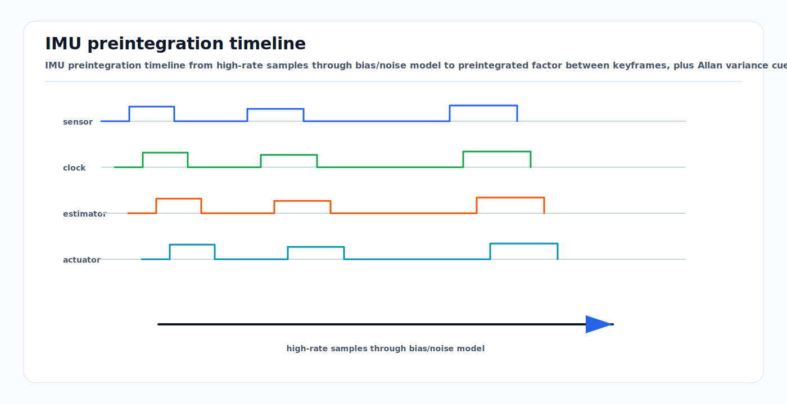

# IMU Error Models and Preintegration

<!-- kb-visual:start -->


*Visual: IMU preintegration timeline from high-rate samples through bias/noise model to preintegrated factor between keyframes, plus Allan variance cue.*
<!-- kb-visual:end -->

## Related Docs

- [GTSAM Factor Graph Optimization](gtsam-factor-graphs.md)
- [GLIM](../../30-autonomy-stack/localization-mapping/slam-methods/glim.md)
- [Lie Groups SE(3), SO(3), Adjoints, and Jacobians](../geometry-3d/lie-groups-se3-so3-jacobians.md)
- [Gaussian Noise, Covariance, Information, Whitening, and Uncertainty Ellipses](../probability-statistics/gaussian-noise-covariance-information.md)
- [SLAM/VIO Observability, FEJ, Nullspace, and Consistency](slam-vio-observability-fej-nullspace-consistency.md)

An IMU is the short-term motion backbone for localization. It measures angular
rate and specific force at high rate, but its errors integrate quickly into
attitude, velocity, and position drift. Correct IMU modeling is the difference
between a factor graph that bridges GNSS/LiDAR gaps and one that becomes
confident in the wrong trajectory.

---

## 1. Measurement Model

For body frame `B` and world frame `W`:

```
omega_m = omega_true + b_g + n_g
a_m     = R_WB^T * (a_W - g_W) + b_a + n_a
```

where:

- `omega_m`: measured angular velocity
- `a_m`: measured specific force
- `b_g`, `b_a`: gyroscope and accelerometer biases
- `n_g`, `n_a`: white measurement noise
- `R_WB`: rotation from body to world
- `g_W`: gravity in world coordinates

The nominal strapdown dynamics are:

```
R_dot = R * skew(omega_m - b_g - n_g)
v_dot = R * (a_m - b_a - n_a) + g
p_dot = v
```

Biases are commonly modeled as random walks:

```
b_g_dot = n_bg
b_a_dot = n_ba
```

### Sensor Model Impact

| Task | Why the model matters |
|---|---|
| Perception | LiDAR deskew, radar Doppler compensation, and camera projection during motion rely on high-rate attitude and velocity. |
| SLAM | IMU preintegration constrains motion between visual/LiDAR keyframes and improves initialization. |
| Mapping | Motion-compensated scans prevent bent walls and doubled structures in maps. |
| Validation | Bias, vibration, saturation, and timestamp tests are required before trusting covariance during outages. |

---

## 2. Error Sources

| Error | Model | Effect |
|---|---|---|
| White noise | `n ~ N(0, sigma^2)` | random angle/velocity error that accumulates with integration |
| Bias | additive offset | gyro bias creates attitude drift; accel bias creates velocity and position drift |
| Bias random walk | `b_dot = n_b` | bias changes over time, temperature, vibration, and aging |
| Scale factor | `m = (I + S) true` | acceleration or angular-rate magnitude errors |
| Axis misalignment | non-orthogonal sensitivity axes | cross-axis coupling during turns and vibration |
| g sensitivity | gyro affected by acceleration | yaw/roll error under acceleration or vibration |
| Saturation/clipping | measurement range exceeded | unrecoverable integration error |
| Quantization | finite ADC/resolution | low-amplitude noise floor |
| Timestamp error | sample time wrong | phase lag and deskew error |

A full calibration model can be written:

```
omega_m = M_g * omega_true + G_g * a_true + b_g + n_g
a_m     = M_a * R_WB^T*(a_W - g_W) + b_a + n_a
```

Many estimators only use additive bias and white noise online. Scale,
misalignment, and g-sensitivity should still be calibrated offline or absorbed
into conservative process noise.

---

## 3. Noise Density and Discrete Covariance

Datasheets often report noise density:

```
gyro_noise_density: rad/s/sqrt(Hz)
accel_noise_density: m/s^2/sqrt(Hz)
```

For samples at rate `f_s` with bandwidth near Nyquist, a rough discrete
standard deviation is:

```
sigma_sample ~= noise_density * sqrt(f_s)
```

For continuous-time covariance used in propagation:

```
Q_c = diag(sigma_g^2, sigma_a^2, sigma_bg^2, sigma_ba^2)
Q_d ~= G * Q_c * G^T * dt
```

Conventions differ by library. Some APIs expect continuous noise densities,
some expect per-sample covariance, and some expect covariance multiplied by
`dt`. Verify with the library documentation and a stationary dataset.

---

## 4. Allan Variance Concepts

Allan deviation is a time-domain method for identifying inertial noise
processes from long stationary logs. For cluster time `tau`, it measures how
the average sensor output changes between adjacent time windows.

Log-log Allan deviation slopes indicate noise type:

| Slope | Common IMU interpretation |
|---|---|
| `-1` | quantization noise |
| `-1/2` | angle random walk or velocity random walk |
| `0` | bias instability |
| `+1/2` | rate random walk / acceleration random walk |
| `+1` | rate ramp |

Practical guidance:

- Record hours of stationary data at the deployment sample rate.
- Keep temperature stable or log temperature separately.
- Estimate noise terms from the slope regions, then validate in motion.
- Inflate stationary-derived values for vehicle vibration and thermal cycling,
  often by 2x to 20x depending on platform and mount.

Allan variance characterizes stochastic noise. It does not automatically
capture deterministic vibration harmonics, poor mounting, clipping, time offset,
or thermal transients.

---

## 5. Preintegration Motivation

IMUs run at 100 to 1000 Hz, while visual/LiDAR/GNSS keyframes may arrive at
1 to 30 Hz. Adding every IMU sample as a graph variable is inefficient.
Preintegration summarizes many IMU samples between keyframes `i` and `j` into
one relative motion factor.

```
IMU samples i...j
  -> preintegrated delta_R_ij, delta_v_ij, delta_p_ij
  -> one factor between states at i and j
```

The key idea from on-manifold preintegration is that the deltas are expressed
relative to the starting body frame and can be corrected for small bias changes
without reintegrating every sample.

### GTSAM and GLIM interpretation

In GTSAM, IMU preintegration turns high-rate inertial packets into a factor over neighboring navigation states. The graph usually contains pose `X(i)`, velocity `V(i)`, and bias `B(i)` variables. The preintegrated factor constrains the motion from `i` to `j`, while a bias between factor models slow bias drift.

In GLIM-like range-inertial SLAM, IMU factors serve four roles:

| Role | Why it matters |
|---|---|
| Deskew support | supplies continuous motion for correcting LiDAR scans acquired over time |
| Initialization | keeps scan matching inside the local basin during fast motion or sparse geometry |
| Observability support | constrains roll, pitch, velocity, and short-term translation when LiDAR geometry is weak |
| Bias estimation | prevents raw inertial drift from being mistaken for map deformation or scan residual bias |

The IMU does not make every direction observable. Gravity helps roll/pitch, but yaw and global position still need LiDAR, loop closures, GNSS, wheel odometry, map priors, or other constraints. If GLIM drifts in yaw on long feature-poor paths, that is usually an observability and aiding problem, not just an IMU tuning problem.

---

## 6. Preintegrated Measurements

Using bias linearization point `b_hat`:

```
Delta_R_ij = product_k Exp((omega_k - b_g_hat) * dt)

Delta_v_ij = sum_k Delta_R_ik * (a_k - b_a_hat) * dt

Delta_p_ij = sum_k [Delta_v_ik * dt
                 + 0.5 * Delta_R_ik * (a_k - b_a_hat) * dt^2]
```

Bias correction:

```
delta_b = b_current - b_hat

Delta_R(b) ~= Delta_R(b_hat) * Exp(J_R_bg * delta_b_g)
Delta_v(b) ~= Delta_v(b_hat) + J_v_ba * delta_b_a + J_v_bg * delta_b_g
Delta_p(b) ~= Delta_p(b_hat) + J_p_ba * delta_b_a + J_p_bg * delta_b_g
```

The preintegrated covariance is propagated at IMU rate:

```
P_k+1 = A_k * P_k * A_k^T + B_k * Q_imu * B_k^T
```

where `A_k` and `B_k` are Jacobians of the discrete preintegration dynamics.

---

## 7. Factor Residual

For states:

```
x_i = (R_i, p_i, v_i, b_i)
x_j = (R_j, p_j, v_j, b_j)
```

The IMU factor residual compares predicted relative motion to preintegrated
motion:

```
r_R = Log( Delta_R_ij(b_i)^T * R_i^T * R_j )

r_v = R_i^T * (v_j - v_i - g * dt_ij) - Delta_v_ij(b_i)

r_p = R_i^T * (p_j - p_i - v_i*dt_ij - 0.5*g*dt_ij^2)
      - Delta_p_ij(b_i)
```

Bias evolution is usually a separate between factor:

```
r_bg = b_g_j - b_g_i
r_ba = b_a_j - b_a_i
```

with covariance from the bias random-walk model.

---

## 8. Gravity Alignment and Observability

Accelerometers measure specific force, not gravity-free acceleration. At rest:

```
a_m ~= R_WB^T * (-g_W) + b_a
```

This lets the estimator align roll and pitch to gravity, but yaw remains
unobservable from gravity alone. Yaw needs magnetometer, GNSS course, wheel
motion, LiDAR/visual constraints, radar Doppler, or map matching.

Initialization risks:

- Incorrect gravity sign or ENU/NED convention flips roll/pitch.
- Stationary initialization cannot separate accelerometer bias from small tilt
  perfectly.
- Constant straight motion provides weak yaw observability.
- Visual-inertial monocular systems also need scale and gravity alignment.

For ground vehicles, level constraints can help but must account for slopes,
ramps, aircraft stand drainage grades, and vehicle suspension motion.

---

## 9. Vibration, Mounting, and Filtering

Vehicle IMUs experience engine vibration, tire impacts, washboard surfaces,
jet-blast vibration, and structural resonances. These are often colored and
axis-dependent, not white Gaussian noise.

Operational checks:

- Inspect PSD and spectrograms, not only Allan deviation.
- Mount the IMU rigidly near the vehicle body reference when possible.
- Avoid flexible brackets and long lever arms that amplify angular vibration.
- Check for clipping during bumps, braking, and sharp turns.
- Ensure anti-alias filtering matches sample rate.

If vibration is severe, increasing white noise alone may not fix the estimator.
Consider mechanical isolation, notch/low-pass filters with known delay,
better mounting, or modeling colored noise.

---

## 10. Practical GTSAM-Style Noise Guidance

Typical setup:

```
accelerometerCovariance = sigma_a^2 * I
gyroscopeCovariance     = sigma_g^2 * I
integrationCovariance   = small numerical integration noise
biasAccCovariance       = sigma_ba^2 * I
biasOmegaCovariance     = sigma_bg^2 * I
```

Guidance:

- Use datasheet noise density as a starting point.
- Confirm units: `deg/hr`, `deg/s/sqrt(Hz)`, `rad/s/sqrt(Hz)`, `mg`, and
  `m/s^2` are easy to mix.
- Estimate stationary noise and bias stability with Allan deviation.
- Validate in vehicle logs by checking residual consistency and bias estimates.
- Bias process noise too small prevents adaptation after temperature/vibration
  changes.
- Bias process noise too large lets bias absorb real motion and weakens
  inertial constraints.

Health monitors:

```
|b_g| and |b_a| magnitude and derivative
IMU factor residual NIS
gravity norm residual during stationary periods
sample interval jitter and dropped samples
saturation counters
temperature versus bias
```

---

## 11. Failure Modes

| Failure mode | Cause | Mitigation |
|---|---|---|
| Fast yaw drift | gyro z bias or yaw unobservable | LiDAR/vision/GNSS/radar heading constraints, bias tuning |
| Position blows up in outage | accelerometer bias and gravity misalignment | robust initialization, external updates, conservative covariance |
| Deskew bends scans | time offset or wrong IMU-LiDAR extrinsic | temporal calibration and projection replay |
| Optimizer diverges | bad initial gravity/bias or underestimated noise | initialize stationary, inflate noise, reject bad intervals |
| Bias estimate jumps | vibration, clipping, over-loose bias random walk | mount/filters, saturation checks, better process model |
| Roll/pitch sign wrong | ENU/NED or frame convention error | explicit gravity tests and frame unit tests |
| Preintegration covariance wrong | continuous/discrete unit mix | stationary and motion residual validation |

---

## 12. Sources

- Forster, Carlone, Dellaert, Scaramuzza, "On-Manifold Preintegration for Real-Time Visual-Inertial Odometry." IEEE TRO, 2017. https://arxiv.org/abs/1512.02363
- Author PDF of Forster et al. https://dellaert.github.io/files/Forster16tro.pdf
- GTSAM ImuFactor documentation. https://borglab.github.io/gtsam/imufactor/
- GTSAM PreintegratedImuMeasurements documentation. https://borglab.github.io/gtsam/preintegratedimumeasurements/
- El-Sheimy, Hou, Niu, "Analysis and Modeling of Inertial Sensors Using Allan Variance." IEEE Transactions on Instrumentation and Measurement, 2008. https://www.researchgate.net/publication/3094132_Analysis_and_Modeling_of_Inertial_Sensors_Using_Allan_Variance
- Hou and El-Sheimy, "Inertial Sensors Errors Modeling Using Allan Variance." ION GNSS, 2003. https://www.ion.org/publications/pdf.cfm?articleid=5475
- Trawny and Roumeliotis, "Indirect Kalman Filter for 3D Attitude Estimation." University of Minnesota technical report, 2005.
- Soloviev, "Inertial Navigation and Integrated Navigation." In GNSS Applications and Methods, Artech House.
