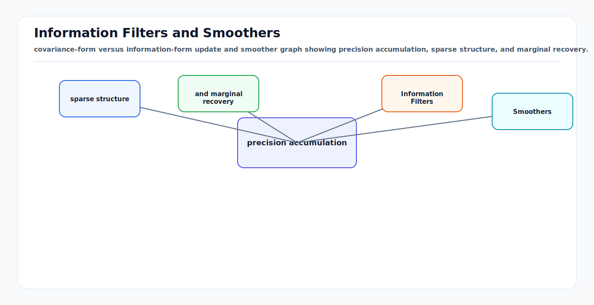

# Information Filters and Smoothers

<!-- kb-visual:start -->


*Visual: covariance-form versus information-form update and smoother graph showing precision accumulation, sparse structure, and marginal recovery.*
<!-- kb-visual:end -->

Information filters and smoothers express state estimation in terms of
precision, constraints, and factorized evidence. The first-principles shift is
from "what is the covariance of the state?" to "what information has each
measurement contributed about the state?" That representation is especially
useful when measurement factors are sparse and when delayed information should
revise a short trajectory segment rather than only the latest state.

---

## Related docs

- [Bayesian Filtering and Error-State Kalman Filters](bayesian-filtering-and-eskf.md)
- [GTSAM Factor Graph Optimization](gtsam-factor-graphs.md)
- [Data Association and Gating](data-association-and-gating.md)
- [Time Sync, PTP, Timestamping, and Latency Models](../systems-engineering/time-sync-ptp-timestamping-latency-models.md)
- [Benchmarking, Metrics, and Statistical Validity](../systems-engineering/benchmarking-metrics-statistical-validity.md)

---

## Why it matters for AV, perception, SLAM, and mapping

AV localization and mapping systems do not only estimate a current pose. They
also integrate delayed camera frames, LiDAR scans, IMU preintegration, wheel
odometry, GNSS fixes, map constraints, loop closures, and calibration factors.
Filtering gives low latency, but smoothing gives consistency when evidence
arrives late or constrains multiple poses.

Information form is a natural fit for SLAM because most measurements touch only
a few variables. A visual feature factor may touch one camera pose and one
landmark. An IMU factor touches adjacent states. A loop closure touches two
poses far apart in time. Sparse information matrices and factor graphs exploit
that structure.

---

## Core math and algorithm steps

### Gaussian information form

A Gaussian can be written in moment form:

```
p(x) = N(x; mu, P)
```

or information form:

```
Lambda = P^-1
eta = Lambda * mu

p(x) proportional to exp(
  -0.5 * x^T Lambda x + eta^T x
)
```

Recover moment form by:

```
P = Lambda^-1
mu = P * eta
```

Information form makes independent Gaussian evidence additive.

### Linear measurement update

For:

```
z = H x + v,    v ~ N(0, R)
```

the measurement contributes:

```
Lambda_meas = H^T R^-1 H
eta_meas = H^T R^-1 z
```

Update:

```
Lambda_new = Lambda_pred + Lambda_meas
eta_new = eta_pred + eta_meas
```

This additive structure is the same principle behind normal equations in least
squares and factor graphs.

### Prediction in information form

For dynamics:

```
x_k = F x_{k-1} + w,    w ~ N(0, Q)
```

prediction is easier in covariance form:

```
P_pred = F P F^T + Q
mu_pred = F mu
```

Information filters either convert through covariance, use matrix identities,
or augment/eliminate variables in a factor graph. In sparse SLAM, the latter is
often preferable.

### Batch smoothing as least squares

For a trajectory `X = {x_0, ..., x_T}` and factors `r_i(X_i)`:

```
min_X sum_i || r_i(X_i) ||^2_{Sigma_i^-1}
```

where:

```
||r||^2_A = r^T A r
```

Linearizing nonlinear factors around the current estimate gives:

```
r(x + dx) ~= r(x) + J dx
```

Solve the normal equations:

```
(J^T W J) dx = -J^T W r
```

Here `J^T W J` is the information matrix. Sparse solvers exploit the fact that
each factor only touches a small subset of variables.

### Fixed-lag smoothing

Fixed-lag smoothing keeps a sliding window:

```
X_window = {x_{t-L}, ..., x_t}
```

and marginalizes older variables. This supports delayed measurements while
bounding compute and memory:

```
add new factors
optimize active window
marginalize states older than lag L
publish current state and covariance/health
```

Marginalization creates a prior factor on the remaining variables. This prior
can become dense, so practical systems choose variable ordering and window
size carefully.

### RTS smoother

For linear-Gaussian models, the Rauch-Tung-Striebel smoother runs a forward
Kalman filter and a backward pass:

```
G_k = P_k F_k^T P_{k+1|k}^-1
x_k^s = x_k + G_k (x_{k+1}^s - x_{k+1|k})
P_k^s = P_k + G_k (P_{k+1}^s - P_{k+1|k}) G_k^T
```

This is a fixed-interval smoother: it estimates past states using future
measurements.

---

## Implementation notes

- Use filters for low-latency state output and smoothers for delayed,
  multi-state, or mapping constraints.
- Keep timestamps in the state graph. A delayed measurement should attach to
  the state at acquisition time, not arrival time.
- Use robust losses for scan matching, visual reprojection, and loop closure
  factors.
- Treat marginalization priors as approximations. Linearization point changes
  after marginalization can create inconsistency.
- Monitor solver health: residual distribution, number of iterations, factor
  errors by type, marginal covariance, and rejected robust factors.
- Use square-root methods or Cholesky factorization where possible instead of
  forming dense inverses.
- Keep information matrix sparsity visible in diagnostics. Fill-in is a runtime
  and numerical stability issue, not just an implementation detail.

---

## Failure modes and diagnostics

| Failure mode | Symptom | Diagnostic |
|---|---|---|
| Bad linearization | Optimizer converges to wrong local minimum. | Residual increases or requires many relinearizations. |
| Dense marginal prior | Runtime grows after old states are removed. | Inspect fill-in and factor arity after marginalization. |
| Overconfident prior | Smoother rejects valid later measurements. | NEES/NIS too high after marginalization events. |
| Timestamp error | Smoother fits delayed evidence by bending trajectory. | Residuals correlate with speed or yaw rate. |
| Loop closure outlier | Map or trajectory jumps globally. | Large robust loss residual with high leverage. |
| Gauge freedom | Solver singular or drifting without anchors. | Rank deficiency, unbounded covariance in global pose. |
| Double-counted evidence | Covariance collapses unrealistically. | Same sensor information appears as raw factor and derived factor. |

---

## Sources

- Sarkka, "Bayesian Filtering and Smoothing": https://users.aalto.fi/~ssarkka/pub/cup_book_online_20131111.pdf
- GTSAM FixedLagSmoother documentation: https://borglab.github.io/gtsam/fixedlagsmoother
- GTSAM factor graph concepts: https://gtsam.org/tutorials/intro.html
- Dellaert and Kaess, "Factor Graphs for Robot Perception": https://www.ri.cmu.edu/pub_files/2017/5/Dellaert17fnt.pdf
- Welch and Bishop, "An Introduction to the Kalman Filter": https://www.cs.unc.edu/~welch/media/pdf/kalman_intro.pdf
- Thrun, "Probabilistic Algorithms in Robotics": https://www.cs.cmu.edu/~thrun/papers/thrun.probrob.pdf
