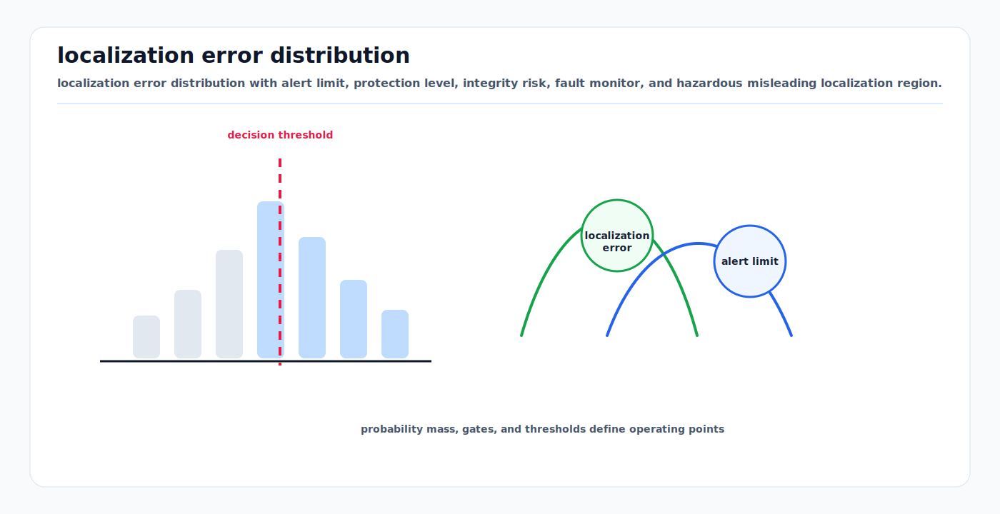

# Localization Integrity, Protection Levels, and RAIM

<!-- kb-visual:start -->


*Visual: localization error distribution with alert limit, protection level, integrity risk, fault monitor, and hazardous misleading localization region.*
<!-- kb-visual:end -->

Accuracy asks how close the estimate usually is. Integrity asks whether the
system can bound dangerous errors and warn in time when the bound is not good
enough.

For safety-critical localization, the estimator should publish more than pose
and covariance. It should publish whether the pose is usable for the operation,
with a protection level tied to an alert limit and target integrity risk.

---

## Related Docs

- [Bayesian Filtering and Error-State Kalman Filters](bayesian-filtering-and-eskf.md)
- [Data Association and Gating](data-association-and-gating.md)
- [RTK-GPS, IMU, and Multi-Sensor Localization](rtk-gps-imu-localization.md)
- [GNSS and RTK Error Models](gnss-rtk-error-models.md)
- [Mahalanobis Distance, Chi-Square Gates, NIS, and NEES](../probability-statistics/mahalanobis-chi-square-gating.md)
- [Benchmarking, Metrics, and Statistical Validity](../systems-engineering/benchmarking-metrics-statistical-validity.md)

---

## Core Terms

| Term | Meaning |
|---|---|
| Alert limit `AL` | maximum position error allowed for the operation |
| Protection level `PL` | computed bound expected to contain the true error at target integrity risk |
| Integrity risk | probability of hazardous misleading localization |
| HMI | hazardous misleading information: error exceeds `AL` without timely alert |
| Availability | system can support the operation, typically `PL <= AL` and monitor healthy |
| Continuity | probability the service remains available during the operation |
| Fault detection | monitor detects inconsistent measurements or subset solutions |
| Fault exclusion | monitor removes a suspected faulty source and recomputes integrity |

For ground vehicles, the relevant alert limit may be lateral, longitudinal,
vertical, heading, or a lane/zone boundary distance rather than a circular GPS
limit.

---

## RAIM Pattern

Receiver autonomous integrity monitoring (RAIM) uses redundant GNSS
pseudorange measurements to check position integrity. The aviation pattern is:

```text
estimate position
compute residual or solution-separation monitor
test against threshold
if no fault is detected, compute HPL/VPL
compare protection level with alert limit
alert or degrade if PL > AL or monitor fails
```

Classic RAIM needs redundancy. FAA guidance states that fault detection needs a
minimum of five satellites, or four with barometric aiding; fault detection and
exclusion needs six satellites, or five with barometric aiding.

Advanced RAIM (ARAIM) extends the idea with multi-constellation fault models,
integrity support messages, monitored fault subsets, fault detection/exclusion,
and horizontal/vertical protection-level computation.

---

## Protection Level vs Covariance

A covariance ellipse is not automatically an integrity bound. A protection
level must account for:

- target integrity risk, often much smaller than 5% or 1%,
- measurement geometry,
- nominal noise and bias bounds,
- monitored and unmonitored fault modes,
- missed-detection probability,
- residual-test or solution-separation thresholds,
- frame and axis of the operational hazard.

A simplified one-axis bound has the shape:

```text
PL_axis = K_integrity * sigma_axis + bias_bound + fault_margin
```

The multiplier `K_integrity` is selected from the allocated risk, not from a
generic "3 sigma" habit. For localization, compute protection levels in the
frame where the hazard is defined: lateral to lane, longitudinal to stop line,
vertical to clearance, or radial in an airfield zone.

---

## AV Localization Integrity Architecture

| Layer | Example monitor |
|---|---|
| Sensor health | GNSS satellite count/RAIM, LiDAR returns, camera exposure, IMU saturation |
| Measurement residual | NIS, scan-match residual, reprojection residual, map-matching score |
| Redundant subset | GNSS-only, LiDAR-map, vision-map, wheel/IMU dead-reckoning subsets |
| Solution separation | compare all-in solution with leave-one-source-out solutions |
| Protection level | lateral/longitudinal/vertical/heading PL with target risk allocation |
| Operational gate | allow, slow, stop, request takeover, or switch fallback if `PL > AL` |

The integrity monitor should be independent enough to catch estimator failure.
Using the same residuals, same map, and same covariance assumptions as the main
localizer can miss common-mode faults.

---

## Alert Limits

Alert limits come from the operation, not from estimator convenience.

| Operation | Possible alert-limit basis |
|---|---|
| highway lane keeping | lane width, vehicle width, lateral control margin |
| urban turn | curb, crosswalk, stop line, vulnerable road user zone |
| depot or airport apron | surveyed geofence, aircraft clearance, stand markings |
| docking | coupler geometry and speed-dependent stopping distance |
| map update | allowed map alignment error before publishing |

If the operation changes, the acceptable protection level changes. The same
pose estimate may be usable for route following but unusable for docking.

---

## Implementation Notes

- Publish `PL`, `AL`, integrity status, contributing monitor state, and time
  validity with every localization health message.
- Allocate integrity risk across axes, sensors, and fault hypotheses explicitly.
- Treat "monitor unavailable" as a degraded state, not as success.
- Keep fault detection separate from fault exclusion; exclusion can make the
  solution unavailable if redundancy is insufficient.
- Validate PL coverage with replay, simulation faults, map faults, and real
  degraded-sensor logs.
- Record hazardous misleading localization candidates: large error, low PL, and
  no alert.
- Use protection-level axes that match planner hazards.
- Document which faults are monitored and which remain assumed or unmonitored.

---

## Failure Modes

| Failure mode | Symptom | Mitigation |
|---|---|---|
| Accuracy-only reporting | covariance looks good but HMI occurs | compute PL against target integrity risk |
| Wrong alert limit | system is available in a maneuver where it should stop | operation-specific AL |
| Common-mode map fault | all perception sources agree with a wrong map | map integrity checks and independent references |
| Residual-only monitor | biased but self-consistent measurements pass | solution separation and subset monitors |
| Insufficient redundancy | fault detected but cannot be excluded | degrade or stop rather than reusing suspect source |
| Covariance underestimation | PL is too small | NEES/NIS, inflation, empirical calibration |
| Frame mismatch | lateral hazard evaluated with ENU radial bound | compute PL in hazard-aligned frame |

---

## Minimal Mental Model

The planner should not ask, "What is the pose?" It should ask, "Is this pose
protected enough for this maneuver?" Protection levels turn localization from a
best estimate into an operational safety contract.

---

## Sources

- FAA Aeronautical Information Publication, ENR 4.1, RAIM description and satellite redundancy: https://www.faa.gov/air_traffic/publications/atpubs/aip_html/part2_enr_section_4.1.html
- FAA Aeronautical Information Manual, Chapter 1, GPS/RAIM operational guidance: https://www.faa.gov/air_traffic/publications/atpubs/aim_html/chap1_section_1.html
- FAA WAAS overview, integrity and hazardous misleading information warning: https://www.faa.gov/about/office_org/headquarters_offices/ato/service_units/techops/navservices/gnss/waas/howitworks
- Blanch et al., "Advanced RAIM User Algorithm Description: Integrity Support Message Processing, Fault Detection, Exclusion, and Protection Level Calculation": https://web.stanford.edu/group/scpnt/gpslab/pubs/papers/Blanch_IONGNSS_2012_B5_nr7_rev2.pdf
- Reid et al., "Localization Requirements for Autonomous Vehicles": https://arxiv.org/abs/1906.01061
- Balakrishnan, Florez, and Reynaud, "Integrity Monitoring of Multimodal Perception System for Vehicle Localization": https://doi.org/10.3390/s20164654
- Li and Waslander, "Visual Measurement Integrity Monitoring for UAV Localization": https://arxiv.org/abs/1909.08537
- Mohanty, Gupta, and Gao, "A Particle Filtering Framework for Integrity Risk of GNSS-Camera Sensor Fusion": https://arxiv.org/abs/2101.06044
