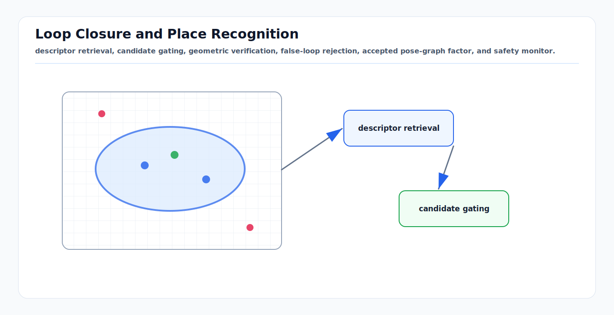

# Loop Closure and Place Recognition: First Principles

<!-- kb-visual:start -->


*Visual: descriptor retrieval, candidate gating, geometric verification, false-loop rejection, accepted pose-graph factor, and safety monitor.*
<!-- kb-visual:end -->

Loop closure is the claim that the robot has returned to a previously mapped
place. Place recognition proposes candidates; geometric verification tests
whether the proposed match is physically consistent; the backend decides whether
to add a pose-graph factor. A good loop closure reduces drift. A bad loop
closure can fold the entire map.

---

## Related Docs

- [GTSAM Factor Graphs](gtsam-factor-graphs.md)
- [Data Association and Gating](data-association-and-gating.md)
- [Mahalanobis Distance, Chi-Square Gates, NIS, and NEES](../probability-statistics/mahalanobis-chi-square-gating.md)
- [Point Cloud Registration Math: ICP, GICP, VGICP, and NDT](../geometry-3d/point-cloud-registration-math-icp-ndt-gicp.md)
- [Nonlinear Least Squares from First Principles](../optimization/nonlinear-least-squares-first-principles.md)

---

## The Pipeline

```text
current keyframe/submap
  -> descriptor
  -> database retrieval
  -> candidate gating
  -> geometric verification
  -> relative pose and covariance
  -> robust pose-graph factor
  -> safety monitor and rollback policy
```

The first-principles split is important: descriptor similarity is not geometric
truth. It is only a proposal mechanism.

---

## Descriptors and Retrieval

Place descriptors compress a keyframe, image, scan, or submap into a searchable
vector or structured key.

| Descriptor family | Typical input | Strength | Risk |
|---|---|---|---|
| Bag of visual words | ORB/BRIEF/SIFT features | Fast visual retrieval. | Repeated textures and lighting changes. |
| NetVLAD-style image descriptor | camera image | Learned appearance robustness. | Domain shift and weather/night changes. |
| Scan Context | LiDAR scan projected to polar BEV | Efficient yaw-aware LiDAR retrieval. | Repeated structures and height aliasing. |
| PointNetVLAD / sparse 3D descriptors | point cloud/submap | Learned 3D place retrieval. | Dataset bias and compute cost. |

Retrieval should optimize high recall at this stage. Precision is enforced by
later gates and geometric verification.

---

## Candidate Gating

Before expensive verification, reject candidates that violate simple facts:

```text
time gate:       not too close to current frame unless relocalizing
distance gate:   plausible travel distance since candidate
heading gate:    yaw difference plausible or descriptor estimates yaw
map gate:        same operational zone or connected route
semantic gate:   scene classes and static landmarks compatible
health gate:     candidate source map is current and trusted
```

For online SLAM, avoid closing loops against very recent keyframes; local
tracking already handles nearby continuity. For relocalization, recent matches
may be valid and the policy is different.

---

## Geometric Verification

A candidate becomes a loop closure only after estimating and validating a
relative transform:

```text
Z_ij = relative pose measurement between historical pose i and current pose j
```

Visual systems may use feature matching plus PnP, essential matrix checks, or
bundle adjustment. LiDAR systems may use ICP, GICP, NDT, TEASER-style robust
registration, or scan-to-submap alignment.

Verification should report:

```text
inlier count
inlier ratio
registration fitness
residual distribution
overlap
estimated covariance or information
pose jump if inserted
```

The loop closure factor is then:

```text
r_ij = Log( Z_ij^-1 * (X_i^-1 * X_j) )
```

where the residual lives in the pose tangent space and must be weighted by the
loop measurement covariance.

---

## Backend Insertion

Loop closures should be inserted more conservatively than odometry factors.
Common safeguards include:

- robust loss on loop factors,
- switchable or max-mixture constraints,
- graduated non-convex optimization for suspected outliers,
- delayed activation until multiple independent candidates agree,
- post-optimization residual and pose-jump audit,
- rollback or quarantine if the graph deforms unexpectedly.

The backend should be allowed to reduce the influence of a loop closure that
conflicts with the rest of the graph. It should not silently accept every
descriptor hit as truth.

---

## Safety Monitor

For AV and airside mapping, monitor:

```text
false loop rate by route segment
accepted loop residual before and after optimization
maximum pose correction jump
map deformation near operational boundaries
localization discontinuity seen by downstream consumers
descriptor nearest-neighbor margin
geometric verification failure reasons
```

Repeated stands, corridors, parking rows, loading bays, and terminal facades are
loop-closure hazard zones. In those zones, require independent geometry,
semantics, route context, or human/offline validation before map publication.

---

## Failure Modes

| Symptom | Likely cause | Diagnostic |
|---|---|---|
| Trajectory folds onto a wrong corridor. | False loop closure accepted. | Loop factor residuals and map deformation plot. |
| Real loops are missed. | Descriptor not invariant enough or gate too tight. | Recall by lighting, season, range, and viewpoint. |
| Good descriptor, bad pose. | Verification underconstrained or repeated geometry. | Registration Hessian/overlap and inlier geometry. |
| Sudden localization jump. | Backend correction applied directly to control frame. | Separate map correction from odom continuity. |
| Loops work offline but not online. | Candidate search too slow or database stale. | Retrieval latency and memory policy. |
| Robust loss hides bad loop. | Outlier remains with low weight but no audit. | Report final loop weights and quarantine low-weight edges. |

---

## Sources

- Cummins and Newman, "FAB-MAP: Probabilistic Localization and Mapping in the Space of Appearance": https://ora.ox.ac.uk/objects/uuid:917f6474-bc02-4d6d-8f51-c8bd90b2bbb8
- Galvez-Lopez and Tardos, "Bags of Binary Words for Fast Place Recognition in Image Sequences": https://github.com/dorian3d/DBoW2
- Mur-Artal and Tardos, "ORB-SLAM2": https://arxiv.org/abs/1610.06475
- Arandjelovic et al., "NetVLAD": https://arxiv.org/abs/1511.07247
- Kim and Kim, "Scan Context": https://doi.org/10.1109/IROS.2018.8593953
- Uy and Lee, "PointNetVLAD": https://arxiv.org/abs/1804.03492
- Yang et al., "TEASER: Fast and Certifiable Point Cloud Registration": https://arxiv.org/abs/2001.07715
