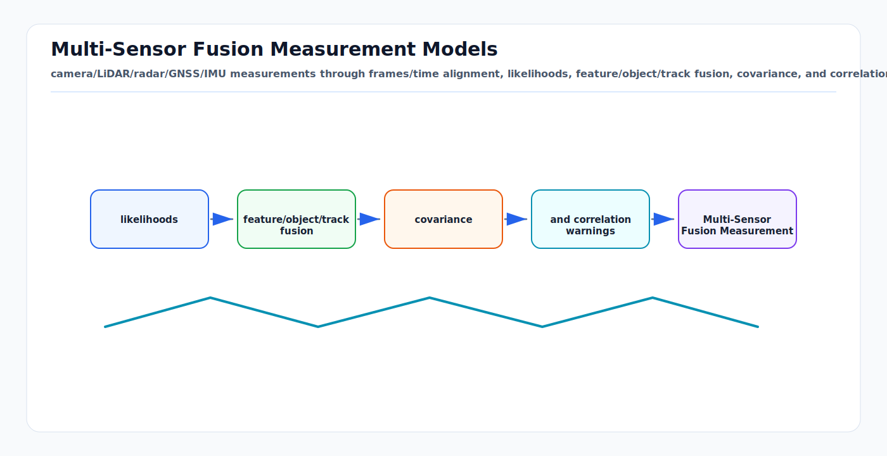

# Multi-Sensor Fusion Measurement Models: First Principles

<!-- kb-visual:start -->


*Visual: camera/LiDAR/radar/GNSS/IMU measurements through frames/time alignment, likelihoods, feature/object/track fusion, covariance, and correlation warnings.*
<!-- kb-visual:end -->

Multi-sensor fusion is not "average the sensors." It is the construction of
measurement likelihoods that connect sensor observations to a shared state at
the correct time and in the correct frame. The fusion backend can be an EKF,
UKF, fixed-lag smoother, factor graph, or learned module, but the first
question is always the same: what did this sensor measure, and what state would
have produced that measurement?

---

## Related Docs

- [Bayesian Filtering and Error-State Kalman Filters](bayesian-filtering-and-eskf.md)
- [RTK-GPS, IMU, and Multi-Sensor Localization](rtk-gps-imu-localization.md)
- [Fusion with Unknown Correlations and Covariance Intersection](fusion-unknown-correlations-covariance-intersection.md)
- [Sensor Likelihoods, Noise, and Error Budgets](../sensors/sensor-likelihoods-noise-error-budgets.md)
- [Sensor Calibration and Time Synchronization](../geometry-3d/sensor-calibration-time-synchronization.md)

---

## Measurement Model

For sensor `s` at acquisition time `t_s`:

```text
z_s = h_s(x(t_s), theta_s) + v_s
v_s ~ N(0, R_s)
```

where:

```text
z_s      measurement
x(t_s)  platform, object, map, or calibration state at measurement time
theta_s sensor intrinsics, extrinsics, scale, bias, and timing parameters
R_s      measurement covariance
h_s      prediction function from state to sensor space
```

The residual is:

```text
r_s = z_s - h_s(x, theta_s)
```

For rotations, poses, bearings, and wrapped angles, subtraction must be replaced
by the correct local-coordinate residual.

---

## Frames and Time

Every measurement model has a frame contract:

```text
map -> odom -> base -> sensor -> measurement coordinates
```

For a point measured by LiDAR:

```text
p_map = T_map_base(t) * T_base_lidar * p_lidar
```

For a camera pixel:

```text
u = project(K, T_camera_base * T_base_map(t) * P_map)
```

For radar:

```text
z = [range, azimuth, elevation, radial_velocity]
```

For GNSS:

```text
z = position in ECEF, ENU, or map frame after datum/projection handling
```

For IMU:

```text
z_acc  = R_world_imu^T (a_world - g) + bias_acc + noise
z_gyro = omega_body + bias_gyro + noise
```

Timestamp semantics matter as much as equations. A camera exposure midpoint, a
LiDAR point time inside a spinning scan, a radar frame time, and an IMU sample
time are not interchangeable.

---

## Likelihoods and Covariance

Whitened residuals put heterogeneous sensors in comparable units:

```text
e_s = L_s r_s
L_s^T L_s = R_s^-1
cost_s = e_s^T e_s
```

Covariance should represent the residual actually passed to the filter or
solver. If a LiDAR scan matcher outputs a pose, its covariance is not raw LiDAR
range noise; it is the uncertainty of the registration result. If a detector
outputs an object box, its covariance includes feature extraction, label noise,
occlusion, and assignment uncertainty.

Use robust losses and gates after whitening:

```text
accept if r_s^T S_s^-1 r_s <= chi_square_threshold
```

where `S_s` is the innovation covariance for a filter or the factor covariance
for a smoother.

---

## Fusion Levels

| Level | Example | Benefit | Risk |
|---|---|---|---|
| Raw measurement | IMU samples, GNSS pseudorange, pixel bearing. | Least double-counting if modeled once. | Larger model and calibration burden. |
| Feature | Visual landmark, LiDAR plane, radar point. | Good geometry with moderate data rate. | Association errors corrupt residuals. |
| Object | 3D box, tracklet, lane segment. | Compact and semantic. | Detector uncertainty is hard to model. |
| Track/state | Upstream fused pose or object track. | Easy integration. | Unknown correlation and double-counting. |

The later the fusion boundary, the more metadata is needed about lineage,
covariance, timestamps, and shared inputs.

---

## Correlation Warnings

Two estimates are not independent if they share:

- a prior state,
- an IMU propagation,
- the same map,
- the same camera/LiDAR/radar frame,
- a previous fused track,
- a loop closure or localization correction.

Naive information fusion adds confidence:

```text
P^-1 = P_1^-1 + P_2^-1
```

That is valid only under independence. If cross-correlation is unknown, use a
conservative method such as covariance intersection, track lineage to avoid
duplicates, or fuse the raw factors in one graph.

---

## Implementation Notes

- Store frame ID, acquisition time, processing time, and covariance with every
  measurement.
- Use acquisition time for state interpolation or prediction; arrival time is a
  scheduler fact, not a sensor fact.
- Keep residual functions small and testable with synthetic states.
- Use adjoints when transforming pose covariances between frames.
- Separate sensor noise, calibration uncertainty, and algorithm output
  uncertainty in the error budget.
- Gate each sensor in its native residual space before collapsing decisions
  into a fused state.
- Log normalized innovations by sensor, range, class, weather, and speed.

---

## Failure Modes

| Symptom | Likely cause | Diagnostic |
|---|---|---|
| Fusion improves logs but fails in turns. | Time offset or rolling acquisition ignored. | Residual mean versus yaw rate and speed. |
| Covariance collapses too fast. | Shared information fused as independent. | NEES/NIS and lineage audit. |
| GNSS jumps warp the local map. | Global measurement overconfident or wrong frame. | Inspect datum, map frame, and innovation gate. |
| Radar velocity contradicts tracks. | Radial velocity model or ego-motion compensation wrong. | Predict radial velocity from current track and compare. |
| Camera and LiDAR disagree by range. | Extrinsic, projection, or timestamp bias. | Residual direction versus image position and scan time. |
| Object fusion is unstable. | Detector covariance missing class/occlusion uncertainty. | Compare accepted residuals by class and occlusion state. |

---

## Sources

- Thrun, Burgard, and Fox, "Probabilistic Robotics": https://mitpress.mit.edu/9780262201629/probabilistic-robotics/
- GTSAM, "Factor Graphs and GTSAM": https://gtsam.org/tutorials/intro.html
- GTSAM `ImuFactor` documentation: https://borglab.github.io/gtsam/imufactor/
- ROS `robot_localization` state estimation nodes: https://docs.ros.org/en/jade/api/robot_localization/html/state_estimation_nodes.html
- Moore and Stouch, "A Generalized Extended Kalman Filter Implementation for the Robot Operating System": https://docs.ros.org/en/kinetic/api/robot_localization/html/_downloads/robot_localization_ias13_revised.pdf
- Julier and Uhlmann, "A Non-divergent Estimation Algorithm in the Presence of Unknown Correlations": https://doi.org/10.1109/ACC.1997.609105
