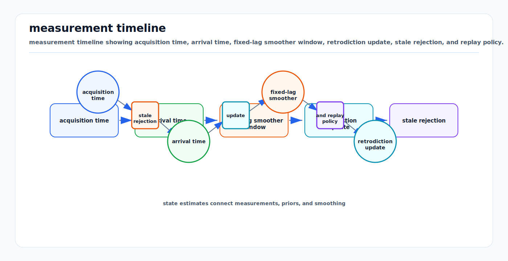

# Out-of-Sequence Measurements and Fixed-Lag Smoothing

<!-- kb-visual:start -->


*Visual: measurement timeline showing acquisition time, arrival time, fixed-lag smoother window, retrodiction update, stale rejection, and replay policy.*
<!-- kb-visual:end -->

Sensors report when a measurement was acquired; middleware reports when it
arrived. These are different times. Updating a current-time state with an old
measurement as if it were current injects timing-dependent spatial error.

Out-of-sequence measurement (OOSM) handling is the estimator policy for delayed
measurements whose acquisition time is earlier than already-processed data.
Fixed-lag smoothing is the standard robotics answer when delayed evidence is
important but full batch smoothing is too expensive.

---

## Related Docs

- [Bayesian Filtering and Error-State Kalman Filters](bayesian-filtering-and-eskf.md)
- [Information Filters and Smoothers](information-filters-and-smoothers.md)
- [Continuous-Time Trajectory Splines and Gaussian Process Priors](continuous-time-trajectory-splines-gp-priors.md)
- [IMU Error Models and Preintegration](imu-error-models-preintegration.md)
- [Sensor Calibration and Time Synchronization Fundamentals](../geometry-3d/sensor-calibration-time-synchronization.md)
- [Time Sync, PTP, Timestamping, and Latency Models](../systems-engineering/time-sync-ptp-timestamping-latency-models.md)

---

## Time Semantics

Every measurement should carry at least:

| Field | Meaning |
|---|---|
| acquisition time `t_z` | when the physical signal was sampled or integrated |
| sensor clock | time base used by the device |
| host receipt time `t_arr` | when software received the packet |
| estimator time `t_now` | state horizon already processed |
| latency estimate | modeled offset between acquisition and availability |

The residual belongs at `t_z`, not at `t_arr`.

```text
camera frame acquired at 10.000 s
arrives at estimator at 10.085 s
current propagated state is 10.080 s

This is an OOSM by acquisition time.
```

---

## Policy Options

| Policy | Mechanism | Use when |
|---|---|---|
| Reject stale | drop measurements older than maximum age | sensor is low value or delay is unbounded |
| Delay compensation | model known latency in the residual | delay is stable and smaller than state spacing |
| State-history EKF | update past state, propagate correction forward | low-dimensional filters with manageable buffers |
| Rollback and replay | restore checkpoint at `t_z`, replay later inputs | deterministic filter pipeline exists |
| Fixed-lag smoother | add factor at `t_z` inside sliding window | multi-sensor delayed evidence matters |
| Continuous-time smoother | evaluate trajectory at exact acquisition time | rolling shutter, LiDAR deskew, calibration |

The worst policy is silent arrival-time fusion.

---

## Fixed-Lag Smoothing

A fixed-lag smoother estimates only a recent trajectory window:

```text
X_window = { x_(t-L), ..., x_t }

minimize over X_window:
  sum_i || r_i(X_i, z_i) ||^2_Ri
```

When a delayed measurement arrives:

1. Convert `t_z` to the estimator time base.
2. If `t_z` is inside the active lag, attach the measurement factor to the
   corresponding state or interpolation interval.
3. Reoptimize or incrementally update the active window.
4. Publish the current state and updated covariance or health status.
5. If `t_z` is older than the lag boundary, reject it or process it through an
   explicitly designed stale-measurement path.

Variables older than the lag are marginalized into a prior. That keeps compute
bounded but makes the lag boundary a real information boundary.

---

## Retrodiction and Replay

Filters can handle OOSMs by retrodiction:

```text
buffer states and covariances
receive z_d at delayed time d
update x_d using z_d
propagate correction from d to now
```

This needs cross-covariances or stored transition products. A simpler but more
expensive implementation is rollback and replay:

```text
load checkpoint before t_z
insert delayed measurement in timestamp order
replay controls, IMU, and measurements to current time
```

Replay is attractive for deterministic logs and incident analysis. For online
systems, fixed-lag smoothing often gives the same conceptual benefit with a
bounded optimization window.

---

## Stale-Rejection Rules

Define rejection policies before tuning:

- `t_z < t_now - lag`: reject or route to offline smoother.
- sensor clock conversion missing: reject and report timestamp fault.
- frame duration overlaps multiple states but no interpolation exists: reject or
  down-weight until modeled.
- duplicate measurement ID: ignore or replace deterministically.
- message arrival would require replay beyond compute budget: reject and count
  budget miss.

Rejection should be visible in estimator health. Silent drops make replay and
safety analysis impossible.

---

## Implementation Notes

- Store measurements by acquisition time in a monotonic priority queue.
- Keep raw IMU/control data long enough to replay the entire lag plus margin.
- Use hardware timestamps where possible; receipt time is only a fallback.
- Make the online and replay estimators use the same ordering policy.
- Keep marginalization and FEJ policy consistent; stale linearization priors can
  create false certainty.
- Plot residuals against acquisition time, arrival delay, speed, yaw rate, and
  acceleration.
- Include sensor frame duration for rolling-shutter cameras and spinning LiDAR.
- Export counters for delayed accepted, delayed rejected, replayed, and
  over-lag measurements.

---

## Failure Modes

| Failure mode | Symptom | Mitigation |
|---|---|---|
| Arrival-time fusion | localization bias grows with speed and yaw rate | update at acquisition time |
| Lag too short | useful camera/GNSS updates are rejected | increase lag or reduce pipeline latency |
| Lag too long | solver misses real-time budget | reduce variables, marginalize features, or split smoother |
| Missing cross-covariance | retrodicted EKF correction is inconsistent | store transition products or use smoothing |
| Non-deterministic replay | online and offline estimates disagree | timestamp-total ordering and stable tie breaks |
| Stale marginal prior | old delayed measurement cannot affect current state | explicit over-lag policy |
| Hidden clock jump | many measurements become OOSM at once | clock monitor and time-base reset |

---

## Minimal Mental Model

A delayed measurement is not wrong because it arrived late. It is wrong only if
the estimator applies it at the wrong time or after the system has deliberately
closed the window in which it can still be used consistently.

---

## Sources

- GTSAM `FixedLagSmoother` documentation: https://borglab.github.io/gtsam/fixedlagsmoother/
- Ranganathan, Kaess, and Dellaert, "Fast 3D Pose Estimation with Out-of-Sequence Measurements": https://www.cs.cmu.edu/~kaess/pub/Ranganathan07iros.pdf
- Zhang, Li, and Zhu, "Optimal Update with Out-of-Sequence Measurements": https://sites.ecse.rpi.edu/~cvrl/keshu/paper/kzhang02oosm.pdf
- Challa, Evans, Wang, and Legg, "A Fixed-Lag Smoothing Solution to Out-of-Sequence Information Fusion Problems": https://doi.org/10.4310/CIS.2002.v2.n4.a1
- Lee and Johnson, "A General Solution for Update with Out-of-Sequence Measurements: The Augmented Fixed-Lag Smoother": https://doi.org/10.1109/TAES.2015.130458
- Sarkka, "Bayesian Filtering and Smoothing": https://users.aalto.fi/~ssarkka/pub/cup_book_online_20131111.pdf
