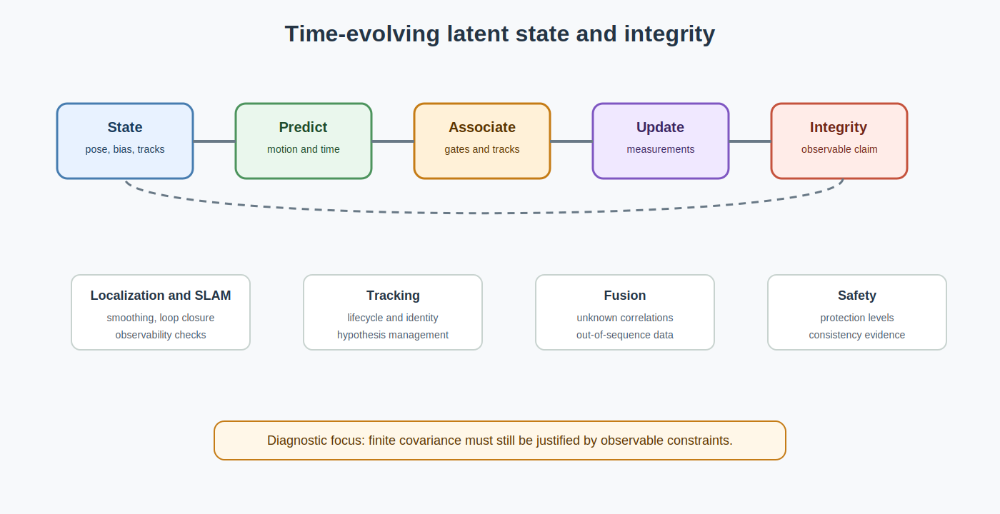

# State Estimation Foundations for Autonomy

<!-- kb-visual:start -->

*Visual: section-level autonomy-role diagram showing state-estimation foundations, autonomy problem classes, stack interfaces, reading paths, and failure diagnosis.*
<!-- kb-visual:end -->

## Why This Foundation Exists

State estimation gives autonomy a disciplined way to infer hidden, time-evolving state from imperfect measurements. Vehicle pose, velocity, bias, track state, map-relative constraints, and integrity claims all depend on prediction/update contracts that preserve timing, uncertainty, association, and observability.

This foundation exists because a finite covariance or smooth trajectory does not automatically mean the system knows where it is. Reviews need to identify what was predicted, what was measured, what was associated, what arrived late, what remains unobservable, and what confidence is justified.

## What This Field Studies From First Principles

State estimation studies latent state, motion and measurement models, Bayesian filtering, ESKF, information filters, smoothers, factor graphs, splines, GP priors, multi-sensor fusion, unknown correlations, data association, out-of-sequence measurements, particles, multi-object association, odometry, GNSS, IMU preintegration, VIO/SLAM consistency, and localization integrity.

The first-principles questions are: what state is estimated, how it evolves, what each measurement observes, how uncertainty moves through prediction and update, how associations are chosen, and what observability or integrity limits constrain confidence.

## Autonomy Problem Map

State estimation bridges sensors, geometry, probability, numerical linear algebra, mapping, perception, tracking, planning, and runtime health. It consumes measurements, timestamps, priors, motion models, frame geometry, covariances, associations, and loop closures. It produces state estimates, trajectories, covariance or information summaries, track histories, integrity bounds, and consistency diagnostics.

The autonomy risk is overtrusted latent state. If a localizer, tracker, or smoother stays numerically stable after its measurements stop constraining the right modes, downstream planning and control may inherit confidence that the evidence no longer supports.

## Core Mental Model

Think in prediction and correction over time. An estimator carries a belief about latent state, predicts it forward with a process model, updates it with associated measurements, and exposes both state and uncertainty to consumers.

The practical model is: `state definition -> prediction -> association -> measurement update or smoothing -> consistency and integrity checks -> interface contract`. Failures usually come from stale timing, wrong measurement models, unmodeled correlations, out-of-sequence data, association errors, unobservable modes, or covariance that no longer reflects actual evidence.

## What This Foundation Lets You Review

- Is the state vector explicit about pose, velocity, bias, clock, extrinsics, tracks, or other latent quantities?
- Do prediction and update contracts handle timing, out-of-sequence measurements, and delayed sensors?
- Are data association gates statistically meaningful and connected to the estimator lifecycle?
- Do observability, FEJ, nullspace, and integrity checks match the confidence exposed downstream?
- Are unknown correlations, loop closures, and marginalization choices handled without double counting evidence?

## Problem-Class Coverage

| Problem Class | Role Of This Foundation | Representative Applied Pages |
|---|---|---|
| Perception and scene understanding | supporting - perception supplies detections and measurements, while state estimation owns temporal fusion and track state once measurements are associated. | [Multi-Object Tracking](../../30-autonomy-stack/perception/overview/multi-object-tracking.md) - debug identity, lifecycle, and covariance failures after detections become tracks. |
| Localization, SLAM, and state estimation | primary - this foundation owns prediction/update, smoothing, fusion, association, observability, and integrity for time-evolving state. | [Robust State Estimation and Multi-Sensor Fusion](../../30-autonomy-stack/localization-mapping/overview/robust-state-estimation-multi-sensor.md) - review whether fusion evidence justifies pose confidence during outages. |
| Mapping and spatial memory | supporting - estimators provide poses and loop closures, while mapping owns persistent environment representation and update policy. | [Factor Graphs, iSAM2, and GTSAM](../../30-autonomy-stack/localization-mapping/slam-methods/factor-graph-isam2-gtsam.md) - debug when map changes are driven by estimator priors or stale loop closures. |
| Prediction and world modeling | supporting - tracking and hypotheses feed prediction, but prediction owns future behavior models. | [Multi-Object Tracking](../../30-autonomy-stack/perception/overview/multi-object-tracking.md) - review whether track uncertainty and lifecycle state support forecasting. |
| Planning and decision making | supporting - planners consume state, covariance, integrity, and track histories but own behavior choice. | [Robust State Estimation and Multi-Sensor Fusion](../../30-autonomy-stack/localization-mapping/overview/robust-state-estimation-multi-sensor.md) - debug planning confidence when localization uncertainty is understated. |
| Control and actuation | supporting - control depends on fresh pose, velocity, bias, and covariance contracts, but estimator design stays here. | [Robust State Estimation and Multi-Sensor Fusion](../../30-autonomy-stack/localization-mapping/overview/robust-state-estimation-multi-sensor.md) - review tracking error caused by stale or inconsistent state estimates. |
| Safety, validation, and assurance | primary - integrity, consistency, protection levels, observability, and fault detection are estimator safety responsibilities. | [Factor Graphs, iSAM2, and GTSAM](../../30-autonomy-stack/localization-mapping/slam-methods/factor-graph-isam2-gtsam.md) - debug whether backend confidence survives weak constraints and delayed updates. |
| Runtime systems and operations | supporting - runtime monitors estimator latency, sensor dropout, covariance growth, replay consistency, and fault flags. | [Multi-Object Tracking](../../30-autonomy-stack/perception/overview/multi-object-tracking.md) - review production track swaps or dropouts with estimator lifecycle evidence. |

## Reading Paths By Task

For filter design, start with [Bayesian Filtering and ESKF](bayesian-filtering-and-eskf.md), then read [Multi-Sensor Fusion Measurement Models](multi-sensor-fusion-measurement-models-first-principles.md), [IMU Error Models and Preintegration](imu-error-models-preintegration.md), and [Wheel Odometry and Encoder Models](wheel-odometry-encoder-models.md).

For smoothing and SLAM backends, read [Information Filters and Smoothers](information-filters-and-smoothers.md), [GTSAM Factor Graphs](gtsam-factor-graphs.md), [Continuous-Time Trajectory Splines and GP Priors](continuous-time-trajectory-splines-gp-priors.md), and [Out-of-Sequence Measurements and Fixed-Lag Smoothing](out-of-sequence-measurements-fixed-lag-smoothing.md). For the GLIM-specific cross-section path through GTSAM, Bayes trees, Hessians, marginalization, and sparse backend diagnostics, use the [GLIM and GTSAM Pipeline Hub](../../30-autonomy-stack/localization-mapping/slam-methods/glim-gtsam-pipeline-hub.md).

For association and tracking, read [Data Association and Gating](data-association-and-gating.md), [Probabilistic Multi-Object Association](probabilistic-multi-object-association.md), [Tracking Motion Models, Track Lifecycle, and Metrics](tracking-motion-models-track-lifecycle-metrics.md), and [Particle Filters and Hypothesis Management](particle-filters-and-hypothesis-management.md).

For localization integrity, read [GNSS RTK Error Models](gnss-rtk-error-models.md), [RTK GPS and IMU Localization](rtk-gps-imu-localization.md), [SLAM/VIO Observability, FEJ, and Nullspace Consistency](slam-vio-observability-fej-nullspace-consistency.md), [Localization Integrity, Protection Levels, and RAIM](localization-integrity-protection-levels-raim.md), and [Fusion with Unknown Correlations and Covariance Intersection](fusion-unknown-correlations-covariance-intersection.md).

## Dependency Map

State estimation depends on sensors for measurement timing and noise, geometry for frames and measurement models, probability for gates and consistency statistics, numerical linear algebra for factorization and covariance recovery, and optimization for nonlinear residual solves.

Downstream, it feeds localization, tracking, SLAM, mapping, planning, control, runtime monitors, and safety cases. The dependency review should distinguish the statistic from its role: probability explains Mahalanobis, NIS, and NEES semantics; state estimation explains where those statistics live in fusion, tracking, SLAM, and integrity.

## Interfaces, Artifacts, and Failure Modes

Core artifacts include state vectors, process models, measurement models, prediction/update logs, factor graphs, trajectories, covariance or information matrices, association decisions, NIS and NEES reports, protection levels, loop-closure records, OOSM queues, and track lifecycle state.

Diagnostic case: A localizer is trusted after a GNSS outage because covariance remains finite even though observable constraints no longer justify lane-level confidence.

Common failure modes include double-counted correlations, stale measurements, wrong timestamp semantics, inconsistent linearization, overconfident loop closures, association swaps, out-of-sequence data dropped silently, unobservable yaw or scale modes, and integrity monitors that lag the estimator state.

## Boundaries With Neighboring Foundations

- Owns: time-evolving latent state, prediction/update, smoothing, fusion, association, out-of-sequence data, observability, and integrity.
- Hands off to: probability for Mahalanobis, NIS, and NEES statistics; numerical linear algebra for matrix factorization; and mapping for persistent map policy.
- Does not own: raw probability semantics, low-level linear algebra, or persistent map policy.
- Diagnostic logic: if the failure is where measurements enter prediction/update, smoothing, tracking, SLAM, or integrity over time, debug here; if the question is statistical meaning of a gate, move to probability; if it is factorization or covariance extraction mechanics, move to numerical linear algebra.

## Pages In This Section

Filtering, smoothing, and trajectory representations:

- [Bayesian Filtering and ESKF](bayesian-filtering-and-eskf.md)
- [Information Filters and Smoothers](information-filters-and-smoothers.md)
- [Out-of-Sequence Measurements and Fixed-Lag Smoothing](out-of-sequence-measurements-fixed-lag-smoothing.md)
- [Continuous-Time Trajectory Splines and GP Priors](continuous-time-trajectory-splines-gp-priors.md)
- [Particle Filters and Hypothesis Management](particle-filters-and-hypothesis-management.md)

Measurement models, odometry, and sensor fusion:

- [Multi-Sensor Fusion Measurement Models](multi-sensor-fusion-measurement-models-first-principles.md)
- [IMU Error Models and Preintegration](imu-error-models-preintegration.md)
- [Wheel Odometry and Encoder Models](wheel-odometry-encoder-models.md)
- [GNSS RTK Error Models](gnss-rtk-error-models.md)
- [RTK GPS and IMU Localization](rtk-gps-imu-localization.md)
- [Fusion with Unknown Correlations and Covariance Intersection](fusion-unknown-correlations-covariance-intersection.md)

Association, tracking, and place recognition:

- [Data Association and Gating](data-association-and-gating.md)
- [Probabilistic Multi-Object Association](probabilistic-multi-object-association.md)
- [Tracking Motion Models, Track Lifecycle, and Metrics](tracking-motion-models-track-lifecycle-metrics.md)
- [Loop Closure and Place Recognition](loop-closure-place-recognition-first-principles.md)

SLAM graph structure, observability, and integrity:

- [GTSAM Factor Graphs](gtsam-factor-graphs.md)
- [SLAM/VIO Observability, FEJ, and Nullspace Consistency](slam-vio-observability-fej-nullspace-consistency.md)
- [Localization Integrity, Protection Levels, and RAIM](localization-integrity-protection-levels-raim.md)

## Core Sources

This overview synthesizes the section pages listed above; no additional external sources were used.
