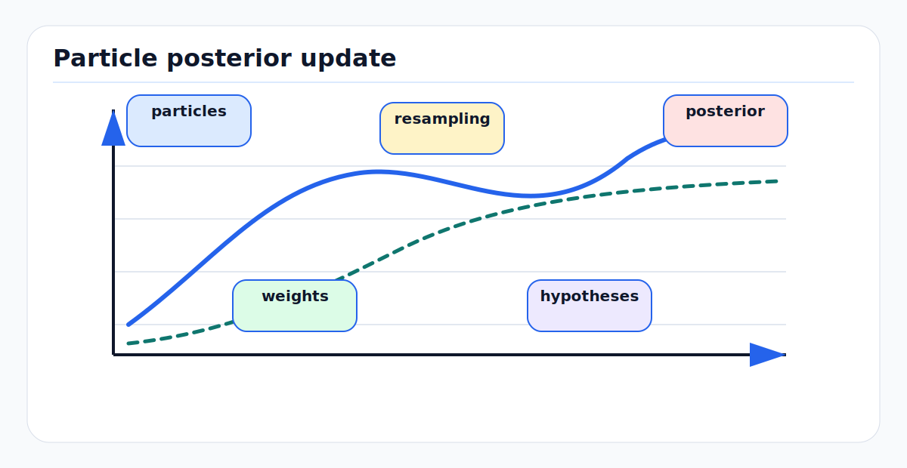

# Particle Filters and Hypothesis Management

Particle filters represent belief with weighted samples instead of one
Gaussian. Hypothesis management is the discipline of keeping enough alternative
explanations alive without letting compute explode. The first-principles
motivation is that many autonomy problems are nonlinear, non-Gaussian, and
multi-modal: the correct state may be one of several map locations, lanes,
object associations, or motion modes.

---

<!-- kb-figure:start -->


*Figure: how sample sets approximate multimodal beliefs and manage competing hypotheses.*
<!-- kb-figure:end -->

## Related docs

- [Bayesian Filtering and Error-State Kalman Filters](bayesian-filtering-and-eskf.md)
- [Data Association and Gating](data-association-and-gating.md)
- [Probabilistic Multi-Object Association](probabilistic-multi-object-association.md)
- [Information Filters and Smoothers](information-filters-and-smoothers.md)
- [Benchmarking, Metrics, and Statistical Validity](../systems-engineering/benchmarking-metrics-statistical-validity.md)

---

## Why it matters for AV, perception, SLAM, and mapping

Particle filters are useful when a single mean and covariance are misleading:

- global localization before the vehicle knows which map pose is correct
- kidnapped-robot recovery
- lane-level localization with multiple plausible lanes
- radar or vision tracking through ambiguous association
- SLAM with unknown correspondence and loop closure ambiguity
- object tracking with maneuver modes that are not locally Gaussian

The cost is sample inefficiency. A naive particle filter in a high-dimensional
vehicle state can collapse quickly. Practical systems use better proposals,
Rao-Blackwellization, mode splitting, pruning, and resampling diagnostics.

---

## Core math and algorithm steps

### Sequential importance sampling

The Bayes filter posterior is:

```
p(x_t | z_1:t) proportional to
  p(z_t | x_t) * integral p(x_t | x_{t-1}) p(x_{t-1} | z_1:t-1) dx
```

A particle filter approximates the posterior with samples:

```
belief_t ~= {x_t^i, w_t^i}_{i=1..N}
sum_i w_t^i = 1
```

For proposal distribution `q`:

```
x_t^i ~ q(x_t | x_{t-1}^i, z_t)
w_t^i proportional to w_{t-1}^i *
  p(z_t | x_t^i) p(x_t^i | x_{t-1}^i) /
  q(x_t^i | x_{t-1}^i, z_t)
```

The bootstrap particle filter uses the motion model as the proposal:

```
q(x_t | x_{t-1}, z_t) = p(x_t | x_{t-1})
w_t^i proportional to w_{t-1}^i * p(z_t | x_t^i)
```

### Resampling

Particle degeneracy occurs when most weight sits on a few particles. The
effective sample size is:

```
N_eff = 1 / sum_i (w_i^2)
```

A common rule:

```
if N_eff < N_threshold:
  resample particles proportional to weights
  set all weights to 1/N
```

Systematic or stratified resampling usually gives lower variance than naive
multinomial resampling.

### Monte Carlo localization

For map-based localization:

```
initialize particles over map pose hypotheses
for each control/odometry update:
  sample new pose from motion model
for each sensor update:
  compute likelihood from scan, visual landmarks, GNSS, or lane/map residuals
  normalize weights
  resample when needed
estimate pose as weighted mean, MAP particle, or clustered mode
```

Do not average across separated modes. If particles occupy two lanes, the
weighted mean may lie between lanes and be physically invalid.

### Rao-Blackwellized particle filters

Rao-Blackwellization samples only the hard discrete or nonlinear part and
analytically marginalizes a conditionally tractable part:

```
p(a, b | z) = p(a | z) p(b | a, z)
```

Example: in FastSLAM-style mapping, particles represent robot trajectory
hypotheses while landmark states are conditionally estimated with small filters.
This can reduce variance dramatically compared with sampling everything.

### Hypothesis lifecycle

A production hypothesis manager needs explicit operations:

```
spawn: create new hypotheses from unexplained evidence
score: update log likelihood with measurements and priors
split: branch when discrete alternatives are plausible
merge: combine nearly identical hypotheses
prune: remove low posterior mass hypotheses
cap: enforce compute budget while preserving diversity
recover: inject broad hypotheses after localization failure
```

Use log weights:

```
log_w_i <- log_w_i + log_likelihood_i
log_w_i <- log_w_i - logsumexp(log_w)
```

---

## Implementation notes

- Work in log probability for measurement likelihoods.
- Use likelihood floors carefully; they prevent total collapse but can hide a
  broken sensor model.
- Preserve mode diversity by clustering before pruning. A small far-away mode
  may be the recovery hypothesis.
- Use low-discrepancy or stratified resampling where appropriate.
- Add roughening or process noise after resampling if particles collapse to
  duplicate states.
- Make resampling conditional on `N_eff`; resampling every frame can reduce
  diversity.
- For vehicle pose, respect manifold structure. Average yaw angles on the
  circle and poses on the appropriate group.
- For multi-object tracking, keep object association hypotheses separate from
  object state uncertainty where possible.

---

## Failure modes and diagnostics

| Failure mode | Symptom | Diagnostic |
|---|---|---|
| Particle depletion | All particles cluster around wrong mode. | `N_eff` collapses; unique particle count drops after resampling. |
| Proposal mismatch | Correct state never sampled after fast motion. | High likelihood appears only at particle cloud edge. |
| Dimensionality explosion | Need impractical particle count. | Error grows with added states; RBPF or smoothing needed. |
| Overconfident likelihood | One bad measurement kills recovery modes. | Weight entropy collapses after one sensor frame. |
| Mode averaging | Published pose lies in impossible location. | Multiple clusters exist but output uses global mean. |
| Impoverished recovery | Kidnapped robot never relocalizes. | No global particle injection after localization fault. |
| Resampling jitter | Estimate noisy despite stable evidence. | Excessive resampling rate and low process noise tuning. |

---

## Sources

- Doucet and Johansen, "A Tutorial on Particle Filtering and Smoothing": https://www.stats.ox.ac.uk/~doucet/doucet_johansen_tutorialPF2011.pdf
- Thrun, "Probabilistic Algorithms in Robotics": https://www.cs.cmu.edu/~thrun/papers/thrun.probrob.pdf
- Thrun, "Particle Filters in Robotics": https://www.cs.cmu.edu/~thrun/papers/thrun.pf-in-robotics-uai02.pdf
- Grisetti, Stachniss, and Burgard, "Improved Techniques for Grid Mapping with Rao-Blackwellized Particle Filters": http://www.informatik.uni-freiburg.de/~stachnis/pdf/grisetti07tro.pdf
- Sarkka, "Bayesian Filtering and Smoothing": https://users.aalto.fi/~ssarkka/pub/cup_book_online_20131111.pdf
- Stone Soup particle filter examples: https://stonesoup.readthedocs.io/en/stable/auto_tutorials/04_ParticleFilter.html
