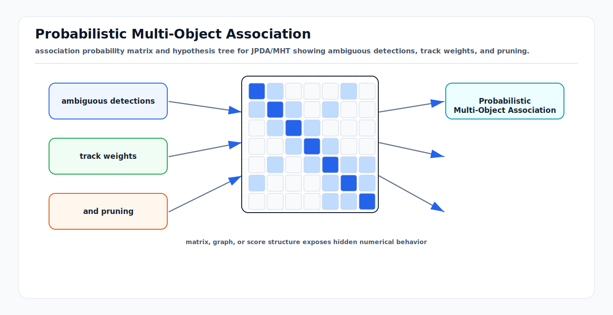

# Probabilistic Multi-Object Association

<!-- kb-visual:start -->


*Visual: association probability matrix and hypothesis tree for JPDA/MHT showing ambiguous detections, track weights, and pruning.*
<!-- kb-visual:end -->

Probabilistic multi-object association handles the case where the correct
measurement-to-track assignment is uncertain. Instead of committing immediately
to one pairing, it represents ambiguity in the posterior. This is the right
first-principles move when clutter, missed detections, occlusion, and close
objects make a single hard assignment brittle.

---

## Related docs

- [Data Association and Gating](data-association-and-gating.md)
- [Bayesian Filtering and Error-State Kalman Filters](bayesian-filtering-and-eskf.md)
- [Particle Filters and Hypothesis Management](particle-filters-and-hypothesis-management.md)
- [CFAR Detection and Thresholding](../signal-processing/cfar-detection-thresholding.md)
- [Benchmarking, Metrics, and Statistical Validity](../systems-engineering/benchmarking-metrics-statistical-validity.md)

---

## Why it matters for AV, perception, SLAM, and mapping

Autonomy scenes routinely contain multiple plausible explanations for the same
sensor evidence: a radar return may be clutter or a vehicle corner, a camera box
may overlap two pedestrians, and a LiDAR segment may merge through occlusion.
Hard nearest-neighbor association hides this uncertainty and can create
overconfident object tracks.

Probabilistic association is especially important for:

- dense urban object tracking with occlusion
- radar tracking in multipath and clutter
- multi-camera and radar-camera fusion with incomplete detections
- SLAM loop closure candidates that are plausible but not conclusive
- safety monitors that need uncertainty, not only object IDs

---

## Core math and algorithm steps

### Measurement model with clutter and missed detections

For track `i` and measurement `j`:

```
z_j = h_i(x_i) + v,       v ~ N(0, R_i)
P_D = probability of detection
lambda_c = clutter density
```

The likelihood for an in-gate measurement is:

```
L_ij = N(z_j; h_i(x_i), S_i)
S_i = H_i P_i H_i^T + R_i
```

A missed detection has probability:

```
L_i0 = 1 - P_D
```

Clutter likelihood is commonly represented by `lambda_c` over the validation
region.

### PDAF

The probabilistic data association filter (PDAF) handles one track in clutter.
After gating measurements, compute association probabilities:

```
beta_j proportional to P_D * L_j / lambda_c
beta_0 proportional to 1 - P_D
sum_j beta_j + beta_0 = 1
```

The innovation used for the update is the weighted innovation:

```
y_bar = sum_j beta_j * y_j
x_new = x_pred + K * y_bar
```

The covariance update includes both the usual Kalman reduction and a spread
term because the measurement identity is uncertain:

```
P_new = beta_0 * P_pred
      + (1 - beta_0) * P_kalman
      + K * (sum_j beta_j y_j y_j^T - y_bar y_bar^T) * K^T
```

### JPDA

Joint probabilistic data association (JPDA) extends PDA to multiple tracks. It
enumerates or samples feasible joint events:

```
theta = set of assignments where:
  each track has zero or one measurement
  each measurement is assigned to zero or one track
```

For each joint event:

```
P(theta | Z) proportional to
  product assigned likelihoods *
  product missed-detection terms *
  clutter terms
```

Then marginalize joint events to get per-track probabilities:

```
beta_ij = sum over theta where track i gets measurement j of P(theta | Z)
```

JPDA reduces premature identity swaps but can become expensive because the
number of feasible joint events grows combinatorially.

### MHT

Multiple hypothesis tracking (MHT) keeps competing global association histories
over time. A hypothesis is a consistent explanation of measurements, misses,
births, deaths, and track continuations.

```
for each parent hypothesis:
  generate feasible child association events
  score each child by motion likelihood, measurement likelihood, clutter, birth, death
  prune low-score children
  merge indistinguishable or near-equivalent hypotheses
  confirm/delete tracks using hypothesis weights and lifecycle rules
```

MHT delays commitment, which is valuable through occlusion. Its cost is
hypothesis explosion, so practical systems use gating, N-scan pruning, k-best
assignment, clustering, and score thresholds.

### RFS filters

Random finite set (RFS) methods model the multi-object state itself as a finite
set:

```
X_k = {x_1, x_2, ..., x_n}
Z_k = {z_1, z_2, ..., z_m}
```

Both cardinality and object states are random. This avoids forcing an arbitrary
ordering on objects. Common families include PHD, CPHD, multi-Bernoulli,
labeled multi-Bernoulli, GLMB, and PMBM filters.

Conceptually:

```
predict multi-object density over surviving and born objects
update with detection, missed detection, and clutter model
extract tracks or object estimates from labeled components or hypotheses
```

RFS filters are attractive when births, deaths, clutter, and missed detections
are first-class parts of the model rather than lifecycle patches around a bank
of single-object filters.

---

## Implementation notes

- PDAF is useful when a single track faces clutter but nearby tracks are not
  strongly interacting.
- JPDA is useful for local clusters of interacting tracks; cluster the problem
  by gates so the whole scene is not solved as one giant event.
- MHT is useful when identity through occlusion matters and a delayed decision
  is acceptable.
- RFS filters are useful when target count uncertainty is central, especially
  in radar and low-SNR detection domains.
- Track management is part of the probabilistic model. Birth, confirmation,
  deletion, and occlusion handling should have explicit probabilities or costs.
- Use log probabilities to avoid underflow.
- Estimate clutter density by sensor, range, azimuth, class, and scene context.
  A uniform clutter rate is rarely valid across the full field of view.
- Separate detector confidence from measurement likelihood. A high-confidence
  detector can still have a poor geometric residual.

---

## Failure modes and diagnostics

| Failure mode | Symptom | Diagnostic |
|---|---|---|
| Hypothesis explosion | Runtime spikes in crowded scenes. | Count hypotheses per cluster and per frame. |
| Probability dilution | JPDA tracks drift between close objects. | Association probabilities spread across several targets for too long. |
| Overconfident `P_D` | Missed detections cause premature deletion. | Track loss aligns with sensor range, occlusion, or weather bins. |
| Underestimated clutter | False positives become confirmed tracks. | Birth rate rises in known clutter zones. |
| Delayed commitment too long | Track IDs remain ambiguous after separation. | N-scan window exceeds scene interaction duration. |
| RFS extraction instability | Object count flickers even when density is stable. | Inspect cardinality distribution, not only extracted tracks. |
| Mixed sensor semantics | Radar points and camera boxes treated as equivalent evidence. | Residuals by sensor disagree but get fused into one probability. |

---

## Sources

- Stone Soup PDA tutorial: https://stonesoup.readthedocs.io/en/stable/auto_tutorials/07_PDATutorial.html
- Stone Soup JPDA tutorial: https://stonesoup.readthedocs.io/en/stable/auto_tutorials/08_JPDATutorial.html
- Reid, "An Algorithm for Tracking Multiple Targets": https://graphics.stanford.edu/courses/cs428-03-spring/Papers/readings/CollaborativeProcessing/Reid_MHT_ieee_trans_ac_1979.pdf
- Mahler, "Statistics 103 for Multitarget Tracking": https://pmc.ncbi.nlm.nih.gov/articles/PMC6338941/
- Vo et al., "An Overview of Multi-Object Estimation via Labeled Random Finite Set": https://arxiv.org/abs/2409.18531
- "Forty Years of Multiple Hypothesis Tracking": https://isif.org/files/isif/2024-01/02-022019-0012R1_LR.pdf
- MathWorks Sensor Fusion and Tracking Toolbox introduction to multiple target tracking: https://www.mathworks.com/help/fusion/ug/introduction-to-multiple-target-tracking.html
