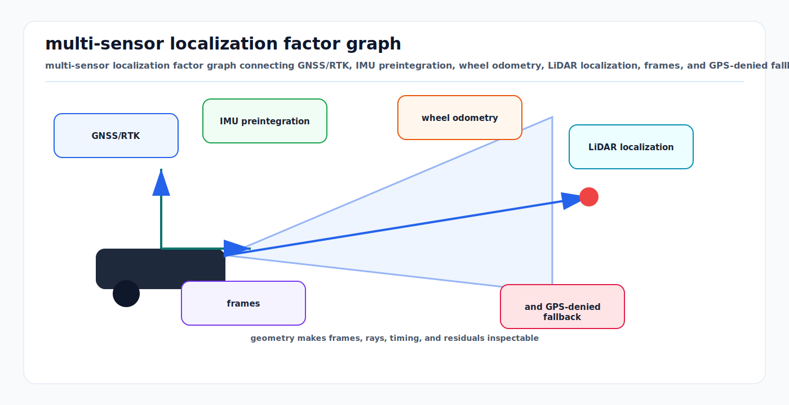

# RTK-GPS, IMU, and Multi-Sensor Localization: First Principles

<!-- kb-visual:start -->


*Visual: multi-sensor localization factor graph connecting GNSS/RTK, IMU preintegration, wheel odometry, LiDAR localization, frames, and GPS-denied fallback.*
<!-- kb-visual:end -->

## The Localization Foundation for the reference airside AV stack's GTSAM Factor Graph

---

## 1. GNSS Fundamentals

### 1.1 How GPS Positioning Works

```
Each satellite broadcasts: "I am at position (X_s, Y_s, Z_s) at time T_s"

Receiver measures: time of arrival T_r
Pseudorange: ρ = c · (T_r - T_s) = true_range + c · δt_receiver

For 4+ satellites:
  ρ_1 = ||P_user - P_sat1|| + c·δt
  ρ_2 = ||P_user - P_sat2|| + c·δt
  ρ_3 = ||P_user - P_sat3|| + c·δt
  ρ_4 = ||P_user - P_sat4|| + c·δt

4 equations, 4 unknowns: (X, Y, Z, δt) → solve via least squares
Standard accuracy: 2-5m horizontal (civilian GPS)
```

### 1.2 Multi-Constellation (GNSS)

```
GPS (US):      31 satellites, L1 (1575.42 MHz), L2 (1227.60 MHz), L5 (1176.45 MHz)
GLONASS (RU):  24 satellites, L1 (1602 MHz), L2 (1246 MHz)
Galileo (EU):  30 satellites, E1 (1575.42 MHz), E5 (1191.795 MHz)
BeiDou (CN):   35+ satellites, B1 (1561.098 MHz), B2 (1207.14 MHz)

Using all 4: 100+ satellites available → better geometry, redundancy
HDOP (Horizontal Dilution of Precision) improves with more satellites
```

---

## 2. RTK (Real-Time Kinematic)

### 2.1 How RTK Achieves cm-Level Accuracy

```
Standard GPS: measures pseudorange (time of flight) → meter-level accuracy
RTK: measures carrier phase (cycles of the radio wave) → cm-level accuracy

Carrier wavelength: L1 = c/f = 3×10⁸/1.57542×10⁹ = 0.1903m

Phase measurement: φ = fractional cycle (0.001 cycle resolution)
  → Position accuracy ≈ 0.001 × 0.1903m ≈ 0.19mm (theoretical)
  → Practical: 1-2cm horizontal, 2-3cm vertical

The catch: integer ambiguity — you measure fraction but don't know which cycle
  φ_measured = true_range/λ + N (integer, unknown)
  Must resolve N for each satellite → "fixing" integers
```

### 2.2 RTK Architecture

```
Base Station (known position):
  ├── Observes same satellites as rover
  ├── Computes corrections (since its position is known)
  └── Broadcasts corrections via radio or internet

Rover (on vehicle):
  ├── Receives satellite signals
  ├── Receives base station corrections
  ├── Applies differential correction
  └── Resolves integer ambiguities → cm-level position

Fix states:
  Float: Ambiguities estimated as real numbers → 10-50cm accuracy
  Fix:   Ambiguities resolved as integers → 1-2cm accuracy
  Time to fix: 30-120 seconds (depends on conditions)
```

### 2.3 NTRIP (Networked Transport of RTCM)

```
Instead of a physical base station, use a network of stations:
  ├── NTRIP Caster: Server distributing RTCM corrections
  ├── Mountpoints: Virtual base stations (real or VRS)
  ├── Protocol: HTTP-based streaming
  └── Data: RTCM 3.x messages (corrections)

reference airside AV stack uses: ntrip_client ROS package
  - Connects to NTRIP caster via internet
  - Streams RTCM corrections to GNSS receiver
  - Receiver applies corrections in real-time

Common NTRIP services:
  - UNAVCO (US, free for research)
  - OS Net (UK, Ordnance Survey)
  - SmartNet (commercial, global)
  - CORS (US, NGS)
```

### 2.4 RTK on Airport Airside

| Challenge | Impact | Mitigation |
|-----------|--------|------------|
| **Multipath near terminals** | Position errors 2-10m | Choke ring antenna, multi-constellation |
| **Signal shadowing by aircraft** | Loss of fix | Dual-antenna, LiDAR SLAM fallback |
| **Metallic apron surface** | Multipath reflections | Antenna elevation mask (15°+) |
| **Near taxiway/runway** | GNSS interference from ILS/DME | Filtered receiver, backup localization |
| **Time to first fix** | 30-120s after cold start | Maintain float solution, use IMU dead reckoning |

---

## 3. IMU Fundamentals

### 3.1 Sensor Types

```
Accelerometer: Measures specific force (acceleration + gravity)
  a_measured = a_body + R^T · g + b_a + n_a

  where: a_body = true acceleration
         R^T · g = gravity in body frame (must be subtracted)
         b_a = bias (slowly varying)
         n_a = noise (white Gaussian)

Gyroscope: Measures angular velocity
  ω_measured = ω_true + b_g + n_g

  where: b_g = bias (slowly varying — the main error source)
         n_g = noise
```

### 3.2 Microstrain GX5/CV7 (the reference airside AV stack's IMU)

```
Microstrain 3DM-GX5-25 (typical):
  Accelerometer:
    Range: ±8g
    Bias stability: 0.04 mg
    Noise density: 80 µg/√Hz
    Sample rate: up to 1000 Hz (reference airside AV stack uses 500Hz)

  Gyroscope:
    Range: ±900°/s
    Bias stability: 8°/hr
    Noise density: 0.005°/s/√Hz
    Sample rate: up to 1000 Hz

  Accuracy class: Tactical grade (between consumer and navigation grade)
  Cost: ~$3,000-5,000
```

### 3.3 IMU Drift

```
Without correction, IMU position drifts:
  Position error ≈ ½ · σ_a · t²  (from accelerometer noise)

  For Microstrain GX5:
    After 1 second:  ~0.04m error (acceptable)
    After 10 seconds: ~4m error (problematic)
    After 60 seconds: ~144m error (useless)

  → IMU alone is insufficient for localization
  → Must be fused with GPS/LiDAR/wheel odometry for correction
  → At 500Hz, provides excellent short-term motion estimates
```

---

## 4. IMU Preintegration (Forster et al.)

### 4.1 The Problem

```
GPS updates: 2 Hz
LiDAR updates: 10 Hz
IMU updates: 500 Hz

Between each GPS update (0.5s), there are 250 IMU measurements.
Naive: integrate all 250 IMU measurements → relative motion estimate.
Problem: if the optimizer changes the starting pose, you must re-integrate.
```

### 4.2 The Solution: Preintegrated Measurements

```
Preintegrate IMU measurements between keyframes i and j:

ΔR_ij = Π_{k=i}^{j-1} Exp((ω_k - b_g) · dt)         — rotation
Δv_ij = Σ_{k=i}^{j-1} ΔR_ik · (a_k - b_a) · dt       — velocity change
Δp_ij = Σ_{k=i}^{j-1} [Δv_ik · dt + ½ ΔR_ik · (a_k - b_a) · dt²]  — position change

Key insight: These quantities are INDEPENDENT of the absolute poses.
             If the optimizer changes pose_i, you don't need to re-integrate.
             Just update using first-order correction for bias changes.

Bias update (first-order):
  ΔR_ij(b_g) ≈ ΔR_ij(b̂_g) · Exp(∂ΔR/∂b_g · δb_g)
  Δv_ij(b_a, b_g) ≈ Δv_ij(b̂) + ∂Δv/∂b_a · δb_a + ∂Δv/∂b_g · δb_g
  Δp_ij(b_a, b_g) ≈ Δp_ij(b̂) + ∂Δp/∂b_a · δb_a + ∂Δp/∂b_g · δb_g
```

### 4.3 In GTSAM

```python
# GTSAM provides ImuFactor that encapsulates preintegration
from gtsam import PreintegratedImuMeasurements, ImuFactor

# Configure IMU noise model
imu_params = PreintegrationParams.MakeSharedU(gravity=9.81)
imu_params.setAccelerometerCovariance(accel_noise**2 * np.eye(3))
imu_params.setGyroscopeCovariance(gyro_noise**2 * np.eye(3))
imu_params.setIntegrationCovariance(1e-8 * np.eye(3))

# Preintegrate between keyframes
pim = PreintegratedImuMeasurements(imu_params, prior_bias)
for imu_measurement in imu_between_keyframes:
    pim.integrateMeasurement(accel, gyro, dt)

# Add as factor in GTSAM graph
graph.add(ImuFactor(pose_key_i, vel_key_i, pose_key_j, vel_key_j, bias_key, pim))
```

---

## 5. LiDAR-Based Localization

### 5.1 VGICP (Voxelized Generalized ICP)

reference airside AV stack uses GPU-accelerated VGICP for scan-to-map matching:

```
Standard ICP: Find closest point pairs, minimize distance
  min Σ ||p_i - T·q_i||²  where T = rigid transform, q_i = closest point to p_i

GICP: Model each point as a Gaussian distribution (accounts for surface geometry)
  min Σ (p_i - T·q_i)^T · (C_p + T·C_q·T^T)^{-1} · (p_i - T·q_i)
  C_p, C_q = covariance matrices from local surface normals

VGICP: Discretize map into voxels, precompute voxel-level distributions
  Instead of per-point correspondences: match point to voxel distribution
  → O(N) per iteration instead of O(N·log(M)) for kd-tree
  → GPU parallelizable (each point independently matched to its voxel)

GPU acceleration (gtsam_points):
  - Voxel map stored as GPU hash table
  - Point-to-voxel matching parallelized across CUDA threads
  - Jacobian computation on GPU
  - Result: 5-10ms per scan matching (vs 50-100ms CPU)
```

### 5.2 Map Format

```
the reference airside AV stack's maps:
  Format: PCD (Point Cloud Data)
  Size: 166MB and 287MB (dense maps)
  Content: x, y, z, intensity
  Usage: GlobalmapServerNodelet loads tiles around current position
  Matching: Current LiDAR scan matched against map via VGICP
```

---

## 6. Wheel Odometry

### 6.1 Ackermann Odometry

```
From wheel encoder ticks → displacement and heading change:

For Ackermann steering (third-generation tug):
  v = (v_RL + v_RR) / 2          — average rear wheel speed
  ω = v · tan(δ) / L             — yaw rate from steering angle

  dx = v · cos(θ) · dt
  dy = v · sin(θ) · dt
  dθ = ω · dt

For crab steering (third-generation tug crab mode):
  v_x = v · cos(δ_crab)          — forward component
  v_y = v · sin(δ_crab)          — lateral component
  ω = 0                           — no rotation

the reference airside AV stack's implementation handles both modes.
```

### 6.2 As GTSAM Factor

```python
# Wheel odometry as a BetweenFactor in GTSAM
from gtsam import BetweenFactorPose2, noiseModel

# Compute relative pose from wheel encoders
delta_pose = compute_wheel_odom(encoder_left, encoder_right, steering, dt)

# Noise model (tuned per vehicle)
odom_noise = noiseModel.Diagonal.Sigmas([0.05, 0.05, 0.01])  # x, y, theta

# Add to factor graph
graph.add(BetweenFactorPose2(pose_key_i, pose_key_j, delta_pose, odom_noise))
```

---

## 7. GTSAM Factor Graph Fusion

### 7.1 the reference airside AV stack's Factor Graph

```
Variable nodes:
  X_t = (position, orientation, velocity) at time t — Pose3 + velocity

Factor nodes:
  ├── IMU Preintegration Factor (500Hz → 20Hz keyframes)
  │   Connects: X_t, V_t, X_{t+1}, V_{t+1}, bias
  │
  ├── VGICP LiDAR Factor (10Hz, GPU)
  │   Connects: X_t to map (unary factor)
  │   Provides: absolute position + orientation from scan matching
  │
  ├── GPS Factor (2Hz)
  │   Connects: X_t to GPS measurement (unary factor)
  │   Noise: depends on fix quality (RTK fix: 2cm, float: 50cm, no fix: 5m)
  │
  ├── Wheel Odometry Factor (50Hz → 20Hz)
  │   Connects: X_t to X_{t+1} (between factor)
  │   Provides: relative motion from encoders
  │
  └── Level Factor (constant)
      Connects: X_t orientation
      Constrains: roll ≈ 0, pitch ≈ 0 (vehicle on flat ground)
```

### 7.2 ISAM2 (Incremental Smoothing and Mapping 2)

```
Instead of re-solving the entire factor graph every update:
  ISAM2 maintains a Bayes Tree — a factored representation
  When new factors arrive, only affected parts of the tree are updated

Computational complexity:
  Full batch: O(n³) for n variables → too slow at 20Hz
  ISAM2: O(k³) for k affected variables → fast enough for real-time
  Typically k << n (new measurement affects ~10-50 variables, not all 1000+)

the reference airside AV stack's SensorFusionNodelet:
  - Runs at 20Hz (50ms budget)
  - Maintains ~5-10s of history in the factor graph (fixed-lag)
  - Older variables are marginalized (absorbed into prior)
  - Output: /odom/fused at 20Hz, /odom/fused/high_rate at 50Hz (interpolated)
```

### 7.3 Adding Neural Network Factors (Future Enhancement)

```python
# A learned ego-motion factor from the world model
class LearnedOdometryFactor(gtsam.CustomFactor):
    def __init__(self, key1, key2, predicted_motion, noise_model):
        """
        predicted_motion: (dx, dy, dtheta) from world model's ego prediction
        noise_model: uncertainty of the world model prediction
        """
        super().__init__(noise_model, [key1, key2])
        self.predicted = predicted_motion

    def evaluateError(self, values, H=None):
        pose1 = values.atPose2(self.keys()[0])
        pose2 = values.atPose2(self.keys()[1])

        # Compute predicted pose2 from pose1 + predicted motion
        predicted_pose2 = pose1.compose(gtsam.Pose2(*self.predicted))

        # Error = difference between actual and predicted
        error = predicted_pose2.localCoordinates(pose2)

        # Jacobians (needed for optimization)
        if H is not None:
            # Compute numerically or analytically
            H[0] = compute_jacobian_wrt_pose1(pose1, self.predicted)
            H[1] = -np.eye(3)

        return error
```

---

## 8. Coordinate Systems

### 8.1 Frames in the reference airside AV stack's Stack

```
WGS84 (lat, lon, alt)
  │
  ├── UTM projection (GpsConversionNodelet)
  │   → (easting, northing, altitude) in meters
  │   → UTM zone determined by longitude
  │
  ├── map frame
  │   → Local reference frame, typically UTM with an offset
  │   → All mapping/planning happens here
  │
  ├── gps_odom frame
  │   → Odometry reference frame (continuous, no jumps)
  │   → GTSAM outputs poses in this frame
  │
  └── base_link frame
      → Vehicle body frame (x=forward, y=left, z=up)
      → Sensors are calibrated relative to base_link

TF tree: map → gps_odom → base_link
  map → gps_odom: Updated by GTSAM (corrects drift)
  gps_odom → base_link: Updated by odometry (smooth, continuous)
```

---

## 9. Localization Without GPS

When GPS is unavailable (near buildings, under aircraft, in tunnels):

```
Fallback chain:
1. LiDAR SLAM (VGICP scan-to-map) — primary without GPS
   Accuracy: 5-10cm if good map features
   Failure: featureless areas (open apron with no structures)

2. IMU + Wheel Odometry dead reckoning
   Accuracy: degrades ~4m per minute
   Useful: bridge short GPS gaps (< 30s)

3. UWB beacons (if installed)
   Accuracy: 10-30cm
   Useful: near terminals where GPS is worst

The factor graph handles all of this seamlessly:
  - When GPS is available: high-weight GPS factor
  - When GPS is unavailable: GPS factor removed, other factors dominate
  - Transition is smooth — no mode switching needed
```

---

## Sources

- Forster et al. "On-Manifold Preintegration for Real-Time Visual-Inertial Odometry." IEEE T-RO, 2017
- Kaess et al. "iSAM2: Incremental Smoothing and Mapping Using the Bayes Tree." IJRR, 2012
- Koide et al. "Voxelized GICP for Fast and Accurate 3D Point Cloud Registration." ICRA, 2021
- Takasu & Yasuda. "Development of the Low-cost RTK-GPS Receiver with an Open Source Program Package RTKLIB." 2009
- GTSAM documentation: https://gtsam.org/
- Microstrain 3DM-GX5 datasheet
