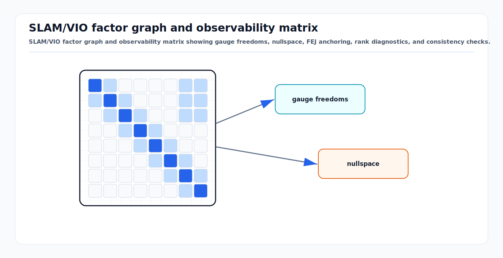

# SLAM/VIO Observability, FEJ, Nullspace, and Consistency

<!-- kb-visual:start -->


*Visual: SLAM/VIO factor graph and observability matrix showing gauge freedoms, nullspace, FEJ anchoring, rank diagnostics, and consistency checks.*
<!-- kb-visual:end -->

SLAM and visual-inertial odometry estimate state from relative measurements.
That makes some directions physically unobservable unless an external reference
is added. A consistent estimator must not become certain in those directions.

The practical question is not only whether the trajectory looks smooth. It is
whether the covariance, Hessian, or information matrix preserves the same gauge
freedoms as the real nonlinear system.

---

## Related Docs

- [Bayesian Filtering and Error-State Kalman Filters](bayesian-filtering-and-eskf.md)
- [Information Filters and Smoothers](information-filters-and-smoothers.md)
- [GTSAM Factor Graph Optimization](gtsam-factor-graphs.md)
- [Continuous-Time Trajectory Splines and Gaussian Process Priors](continuous-time-trajectory-splines-gp-priors.md)
- [Lie Groups, SE(3), SO(3), and Jacobians](../geometry-3d/lie-groups-se3-so3-jacobians.md)
- [Eigenvalues, Hessian Conditioning, and Observability](../numerical-linear-algebra/eigenvalues-hessian-conditioning-observability.md)

---

## Why It Matters

| System | Expected unobservable directions without absolute aid | Risk if mishandled |
|---|---|---|
| Pose-graph SLAM | global translation and global rotation gauge | singular solve, arbitrary map frame, false certainty after priors |
| Monocular visual SLAM | global Sim(3) gauge: translation, rotation, scale | scale drift hidden by overconfident covariance |
| Visual-inertial odometry | usually global position and yaw about gravity | yaw/position covariance collapses despite no absolute heading or position |
| LiDAR/visual odometry | global pose gauge and weak modes from geometry | scan matcher or BA reports precise but drifting state |
| Fixed-lag VIO | same gauge plus marginalization artifacts | old linearization priors inject fake constraints |

In production localization, inconsistency shows up as a health-monitor problem:
the estimator reports a small covariance while ground-truth error, replay
residuals, or map mismatch keeps growing.

---

## Core Idea

For a linearized estimator, stack measurement Jacobians through time:

```text
O =
[ H_0
  H_1 Phi_1,0
  H_2 Phi_2,0
  ... ]
```

The nullspace `N` contains perturbations that do not change any ideal
measurement:

```text
O N = 0
```

If the true nonlinear system has a four-dimensional unobservable subspace but
the linearized estimator has only three null directions, the estimator has
invented information. That invented information reduces covariance along a
gauge direction and makes the filter inconsistent.

---

## First-Estimate Jacobians

First-estimate Jacobian (FEJ) methods evaluate selected Jacobians at the first
available estimate of each state variable instead of the latest estimate. The
goal is to keep the linearized model's nullspace aligned with the nonlinear
system's nullspace.

For a feature update:

```text
r_k = z_k - h(x_current)
H_fej = dh/dx evaluated at x_first
r_k ~= H_fej (x - x_current) + n
```

The residual still uses the current predicted measurement, but the Jacobian is
anchored. For VIO, the first estimate of a feature is typically its initialized
triangulation value; the first estimate of a clone or state is the value at the
time it enters the estimator.

FEJ is useful when:

- EKF or MSCKF-style updates repeatedly relinearize the same state variables.
- A sliding window marginalizes states and keeps a prior factor.
- Feature tracks span enough time that changing linearization points would
  otherwise alter the observability matrix row by row.

FEJ is not a substitute for good initialization. Anchoring to a very poor first
estimate can preserve observability while still giving weak local accuracy.

---

## Nullspace-Aware Smoothers

Factor-graph and bundle-adjustment systems face the same issue in matrix form.
The linearized normal equations are:

```text
Hessian * dx = gradient
Hessian = J^T W J
```

Gauge directions appear as zero or near-zero eigenvalues of `Hessian`.
Common strategies are:

| Strategy | Use | Caution |
|---|---|---|
| Gauge fixing | add one pose prior or hold one pose fixed | changes the reported covariance unless interpreted as frame choice |
| Nullspace projection | project updates or priors away from gauge directions | requires correct basis and frame convention |
| Observability-constrained Jacobians | enforce the expected unobservable subspace | more algebra but better consistency |
| FEJ marginalization | keep prior Jacobians at their original linearization point | stale priors still need monitoring |
| Rank-revealing solve | detect deficient modes with QR/SVD/eigenvalues | diagnostic only unless policy handles it |

For fixed-lag VIO, marginalization is the common trap. Once a prior is created
from old variables, future relinearization cannot recover the exact nonlinear
information. A prior that accidentally constrains global yaw or position will
make the active window look better conditioned than it physically is.

---

## Consistency Diagnostics

Use more than one signal.

- Check Hessian or observability rank against the expected gauge dimension.
- Plot smallest singular values or eigenvalues over time.
- Run NEES when ground truth or survey reference is available.
- Run NIS by measurement type and compare with chi-square expectations.
- Verify that global yaw, global position, and scale covariance behave
  correctly when absolute references are removed.
- Re-run logs with global priors weakened or removed; the relative trajectory
  should not depend on arbitrary frame anchors.
- Inspect marginalization priors for dense fill-in and unexpected constraints
  on gauge variables.

Synthetic tests are important because the true nullspace is known. Real logs
are important because weak excitation, planar scenes, time offset, and bad
feature geometry create near-null modes that are not exactly zero.

---

## Implementation Notes

- Write down the gauge freedoms for each estimator mode before tuning noise.
- Store the first estimate needed by FEJ; do not silently overwrite it.
- Keep residual convention, perturbation side, and covariance frame consistent.
- When an absolute sensor is disabled, remove or inflate its prior rather than
  leaving a hard anchor in the graph.
- Treat rank deficiency as a health state, not only a solver exception.
- Do not tune covariance down to make maps look sharp; use NEES/NIS and replay
  residuals.
- Separate frame choice from information. A fixed origin is allowed for
  coordinates, but it should not imply physical certainty.

---

## Failure Modes

| Failure mode | Symptom | Mitigation |
|---|---|---|
| Spurious yaw information | yaw covariance shrinks in VIO without heading aid | FEJ or observability-constrained Jacobians |
| Hidden global prior | trajectory seems stable only because first pose is overconstrained | weaken prior, report covariance in anchored frame |
| Bad feature first estimate | FEJ preserves nullspace but residuals remain biased | delay feature initialization or use inverse depth |
| Marginalization inconsistency | fixed-lag prior rejects later valid measurements | FEJ prior, longer window, or prior reset policy |
| Weak excitation | scale, bias, or calibration covariance collapses incorrectly | rank diagnostics and excitation checks |
| Mixed perturbation convention | nullspace test fails after code changes | unit tests for Jacobians and adjoints |
| Solver hides singularity | damping makes a rank-deficient problem appear solved | inspect singular values and gauge modes |

---

## Minimal Mental Model

Observability is about what the sensors can know. Consistency is about whether
the estimator admits what the sensors cannot know. FEJ and nullspace-aware
linearization are tools for preventing the linearized estimator from learning
fictional information.

---

## Sources

- OpenVINS, "First-Estimate Jacobian Estimators": https://docs.openvins.com/fej.html
- Huang, Mourikis, and Roumeliotis, "Observability-based Rules for Designing Consistent EKF SLAM Estimators": https://doi.org/10.1177/0278364909353640
- Huang, Mourikis, and Roumeliotis, "A First-Estimates Jacobian EKF for Improving SLAM Consistency": https://people.csail.mit.edu/ghuang/paper/Huang2008ISER.pdf
- Hesch, Kottas, Bowman, and Roumeliotis, "Consistency Analysis and Improvement of Vision-Aided Inertial Navigation": https://doi.org/10.1109/TRO.2013.2277549
- Forster et al., "On-Manifold Preintegration for Real-Time Visual-Inertial Odometry": https://arxiv.org/abs/1512.02363
- GTSAM concepts and factor graph tutorials: https://gtsam.org/tutorials/intro.html
