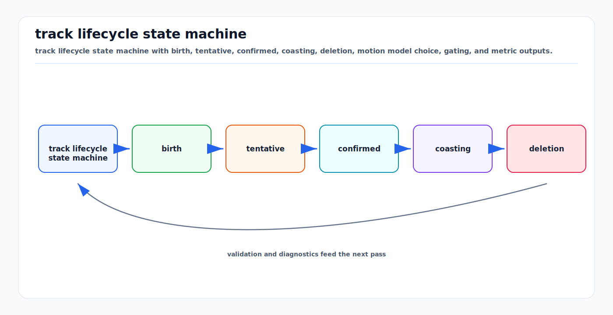

# Tracking Motion Models, Track Lifecycle, and Metrics

<!-- kb-visual:start -->


*Visual: track lifecycle state machine with birth, tentative, confirmed, coasting, deletion, motion model choice, gating, and metric outputs.*
<!-- kb-visual:end -->

Tracking turns detections into persistent object hypotheses. A detector answers
"what is visible now?" A tracker answers "which physical object is this over
time, where is it going, and how uncertain am I?" The hard parts are not only
Kalman equations. They are motion assumptions, data association, birth/death
policy, occlusion handling, and metrics that reveal identity errors instead of
hiding them inside detection scores.

---

## 1. Related Docs

- [Bayesian Filtering and Error-State Kalman Filters](bayesian-filtering-and-eskf.md)
- [Data Association and Gating](data-association-and-gating.md)
- [Probabilistic Multi-Object Association](probabilistic-multi-object-association.md)
- [Particle Filters and Hypothesis Management](particle-filters-and-hypothesis-management.md)
- [Mahalanobis Distance, Chi-Square Gates, NIS, and NEES](../probability-statistics/mahalanobis-chi-square-gating.md)
- [Detection Theory, ROC/PR Curves, and Operating Points](../probability-statistics/detection-theory-roc-pr-operating-points.md)
- [Sensor Filtering: Alpha-Beta, Kalman, and Complementary](../signal-processing/sensor-filtering-alpha-beta-kalman-complementary.md)

---

## 2. State, Measurement, and Belief

A single-object tracker maintains a belief:

```text
p(x_k | z_1:k)
```

where `x_k` may include position, velocity, acceleration, yaw, yaw rate, size,
class, and existence probability.

A common linear Gaussian model is:

```text
x_k = F x_(k-1) + q_k,     q_k ~ N(0, Q)
z_k = H x_k + r_k,         r_k ~ N(0, R)
```

The Kalman prediction/update is only one implementation. The modeling choices
behind `F`, `Q`, `H`, `R`, gating, and lifecycle policy usually matter more than
the matrix algebra.

---

## 3. Motion Models

### 3.1 Constant Velocity

For one axis:

```text
x = [ position, velocity ]^T
F = [ 1 dt ]
    [ 0 1  ]
```

With white acceleration noise spectral density `sigma_a^2`:

```text
Q = sigma_a^2 * [ dt^4/4  dt^3/2 ]
                [ dt^3/2  dt^2   ]
```

Constant velocity is robust and simple. It fails during braking, turns, and
stop-start motion unless process noise is large enough.

### 3.2 Constant Acceleration

```text
x = [ position, velocity, acceleration ]^T
F = [ 1 dt 0.5 dt^2 ]
    [ 0 1  dt       ]
    [ 0 0  1        ]
```

This can reduce lag for maneuvering objects but may overfit noisy detections and
create unstable acceleration estimates.

### 3.3 Coordinated Turn

For vehicles, yaw and yaw rate matter:

```text
state = [px, py, speed, yaw, yaw_rate]
```

A coordinated-turn model predicts curved motion. It is better for lane turns and
roundabouts but nonlinear and sensitive when yaw rate is near zero.

### 3.4 Interacting Multiple Model

An IMM runs several motion models and mixes their probabilities:

```text
models = { constant_velocity, constant_acceleration, coordinated_turn }
```

The tracker estimates both state and mode. IMM is useful when objects switch
between cruising, braking, and turning, but tuning mode transition probabilities
is operationally important.

---

## 4. Association and Gating

Before assigning detections to tracks, predict each track into measurement
space:

```text
z_hat = h(x_pred)
S = H P_pred H^T + R
nu = z - z_hat
d2 = nu^T S^-1 nu
```

A chi-square gate rejects unlikely candidates:

```text
accept candidate if d2 <= gamma
```

Then an assignment solver, commonly Hungarian/min-cost matching, chooses a
consistent set of detection-track matches. Costs may combine:

- Mahalanobis distance,
- 2D/3D IoU,
- class compatibility,
- appearance embedding distance,
- Doppler/radial velocity agreement,
- map/lane constraints.

SORT is the canonical simple baseline: Kalman filter prediction, bounding-box
association, and Hungarian assignment. DeepSORT adds an appearance metric to
reduce identity switches through occlusion.

---

## 5. Track Lifecycle

Track lifecycle policy controls when tracks are created, confirmed, coasted,
merged, split, and deleted.

```text
tentative -> confirmed -> coasted/lost -> deleted
```

Typical fields:

- `age`: frames since birth,
- `hits`: associated detections,
- `misses`: consecutive missed updates,
- `time_since_update`,
- `existence_probability`,
- `class_history`,
- `last_detection_time`,
- `last_update_source`.

### Birth

Create a tentative track when an unmatched detection passes quality gates. Do
not immediately expose every tentative track to planning. Require confirmation:

```text
confirm if hits >= M within N frames
```

### Coast

When a confirmed track misses a detection, predict it forward:

```text
x <- F x
P <- F P F^T + Q
```

Coasting preserves identity through short occlusions but increases false-track
risk if deletion is too slow.

### Death

Delete tracks when uncertainty, misses, or low existence probability exceed a
policy:

```text
delete if misses > max_misses
delete if existence_probability < p_min
delete if covariance too large for consumer
```

Lifecycle thresholds are operating points. They should be tuned against system
costs, not only benchmark metrics.

---

## 6. Failure Modes

| Failure | Cause | Consequence |
|---|---|---|
| track fragmentation | deletion too aggressive or detector flicker | one object becomes many short tracks |
| identity switch | association ambiguity during crossing/occlusion | prediction and behavior history attach to wrong object |
| ghost track | false detections confirmed or stale coast | planner reacts to nonexistent object |
| track lag | motion model too smooth or low process noise | braking/cut-in detected late |
| track jitter | detection noise trusted too much | unstable velocity and object box |
| class flapping | class updated every frame without smoothing | downstream behavior changes abruptly |
| duplicate tracks | birth policy ignores existing uncertain tracks | planner sees multiple obstacles |
| covariance inconsistency | `Q`/`R` not matched to errors | gates reject true detections or accept clutter |

---

## 7. Metrics

### 7.1 Detection Metrics Are Not Tracking Metrics

Frame-level precision/recall ignores identity. A tracker can have good detection
counts and still switch IDs at every occlusion. Tracking metrics must evaluate:

- localization,
- detection presence,
- identity association over time,
- fragmentation,
- false tracks and missed tracks.

### 7.2 CLEAR MOT

MOTA combines false positives, false negatives, and ID switches:

```text
MOTA = 1 - (FN + FP + IDSW) / GT
```

MOTP measures localization precision over matched objects. MOTA is widely known
but can be dominated by detection errors and may hide association quality.

### 7.3 IDF1

IDF1 measures identity precision/recall over matched identity trajectories:

```text
IDF1 = 2 * IDTP / (2 * IDTP + IDFP + IDFN)
```

It is useful when maintaining consistent object identity matters.

### 7.4 HOTA

HOTA was introduced to balance detection, association, and localization. Its
high-level intuition is:

```text
HOTA ~= geometric mean of detection accuracy and association accuracy
```

It is often more diagnostic than a single MOTA score because it decomposes
tracking behavior into interpretable components.

### 7.5 OSPA

OSPA is common in multi-target tracking theory. It measures distance between
sets while penalizing both localization error and cardinality error:

```text
OSPA_p,c(X, Y) =
  [ (1/n) ( min_assignment sum d_c(x_i, y_pi(i))^p
            + c^p * (n - m) ) ]^(1/p)
```

where `d_c` is capped at cutoff `c`, and `n >= m`. OSPA is useful when the
number of targets varies and the metric should remain a true set distance.

---

## 8. How It Appears in AV and Robotics

| Consumer | Tracker requirement |
|---|---|
| prediction | stable velocity, yaw, and identity history |
| planning | conservative existence and occupancy during occlusion |
| behavior | class and intent should not flicker |
| mapping | dynamic tracks should be removed from static map updates |
| safety | close-range false negatives are costlier than far false positives |
| evaluation | metrics should separate misses, false tracks, localization, and IDs |

The tracker is a contract between perception and planning. A box without
covariance, age, source, and lifecycle state is often not enough.

---

## 9. Implementation Checklist

- Define track state per class: pedestrian, cyclist, vehicle, unknown, static
  obstacle may need different dynamics.
- Tune measurement covariance by detector range, object size, occlusion, and
  sensor modality.
- Use chi-square gating before assignment to reduce impossible matches.
- Keep unmatched high-quality detections for birth; suppress births inside
  gates of existing tracks unless duplicate evidence is clear.
- Separate tentative tracks from planner-visible confirmed tracks.
- Carry covariance and existence probability through coast periods.
- Smooth class probabilities rather than hard-switching class labels per frame.
- Log association costs, gate distances, lifecycle transitions, and deletion
  reasons.
- Evaluate after the full tracking pipeline, not only detector outputs.
- Slice metrics by range, occlusion, density, turning, weather, and object class.
- Replay known crossing/occlusion scenarios whenever changing lifecycle policy.

---

## 10. Sources

- Yaakov Bar-Shalom, X. Rong Li, and Thiagalingam Kirubarajan, "Estimation with Applications to Tracking and Navigation": https://www.wiley.com/en-us/Estimation+with+Applications+to+Tracking+and+Navigation-p-9780471416555
- Samuel Blackman and Robert Popoli, "Design and Analysis of Modern Tracking Systems": https://us.artechhouse.com/Design-and-Analysis-of-Modern-Tracking-Systems-P982.aspx
- Alex Bewley et al., "Simple Online and Realtime Tracking": https://arxiv.org/abs/1602.00763
- Nicolai Wojke, Alex Bewley, and Dietrich Paulus, "Simple Online and Realtime Tracking with a Deep Association Metric": https://arxiv.org/abs/1703.07402
- Keni Bernardin and Rainer Stiefelhagen, "Evaluating Multiple Object Tracking Performance: The CLEAR MOT Metrics": https://link.springer.com/article/10.1155/2008/246309
- Jonathon Luiten et al., "HOTA: A Higher Order Metric for Evaluating Multi-Object Tracking": https://arxiv.org/abs/2009.07736
- Dominic Schuhmacher, Ba-Ngu Vo, and Ba-Tuong Vo, "A Consistent Metric for Performance Evaluation of Multi-Object Filters": https://doi.org/10.1109/TSP.2008.920469
