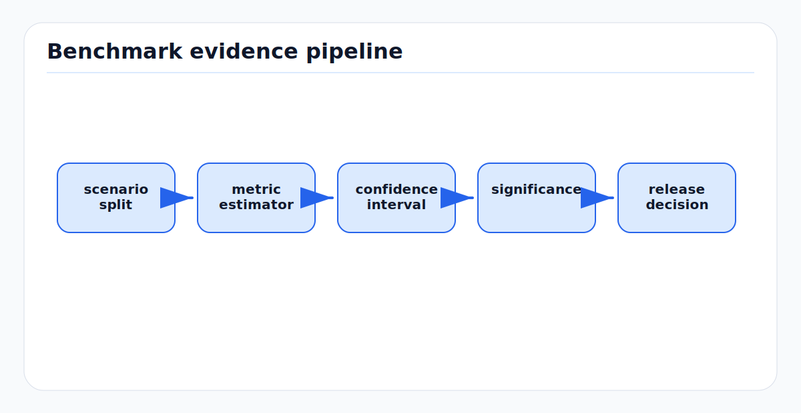

# Benchmarking, Metrics, and Statistical Validity

Benchmarks turn system behavior into evidence. Metrics turn evidence into
numbers. Statistical validity decides whether those numbers support the claim
being made. The first-principles rule is that a benchmark is only useful if its
dataset, protocol, metric, and uncertainty match the operational decision.

---

<!-- kb-figure:start -->


*Figure: how benchmark design turns scenario samples into statistically defensible release evidence.*
<!-- kb-figure:end -->

## Related docs

- [Data Association and Gating](../state-estimation/data-association-and-gating.md)
- [Probabilistic Multi-Object Association](../state-estimation/probabilistic-multi-object-association.md)
- [Information Filters and Smoothers](../state-estimation/information-filters-and-smoothers.md)
- [Sensor Likelihoods, Noise, and Error Budgets](../sensors/sensor-likelihoods-noise-error-budgets.md)
- [Time Sync, PTP, Timestamping, and Latency Models](time-sync-ptp-timestamping-latency-models.md)

---

## Why it matters for AV, perception, SLAM, and mapping

AV stacks are evaluated on detection, tracking, localization, mapping, latency,
comfort, safety envelopes, and degradation behavior. A single average score can
hide the scenario that matters most: a night pedestrian, a wet apron, a GNSS
multipath zone, a radar ghost, or a crowded occlusion.

Benchmarks must answer engineering questions:

- Does the change improve the target operating domain?
- Is the improvement larger than measurement noise and run-to-run variance?
- Which scenarios regress?
- Are metrics aligned with downstream risk?
- Is ground truth accurate enough for the claim?

---

## Core math and algorithm steps

### Define the estimand

Before computing metrics, define the quantity being estimated:

```
estimand = function(system behavior, ODD, dataset distribution, protocol)
```

Examples:

- mean 3D position RMSE over a route class
- 95th percentile lateral localization error during GNSS degradation
- pedestrian recall at fixed false positives per hour
- track ID switch rate in occluded crossings
- end-to-end latency at p99 under full sensor load

### Detection metrics

For binary detection:

```
precision = TP / (TP + FP)
recall = TP / (TP + FN)
F1 = 2 * precision * recall / (precision + recall)
```

Average precision integrates precision-recall behavior over confidence
thresholds. Detection metrics depend strongly on matching rules, IoU threshold,
range, class taxonomy, ignored regions, and duplicate handling.

### Tracking metrics

Tracking has detection, localization, and association dimensions. CLEAR MOT
metrics include MOTA and MOTP. HOTA explicitly decomposes tracking quality into
detection accuracy, association accuracy, and localization behavior, which is
often more informative when diagnosing ID switches versus detector misses.

Track evaluation should report at least:

```
false positives
false negatives
ID switches
fragmentation
association accuracy
localization error
track latency and age
```

### SLAM and localization metrics

For estimated poses `T_i` and ground truth `T_i_gt`, first define alignment:

```
SE(3), Sim(3), yaw-only, translation-only, or no alignment
```

Absolute trajectory error (ATE) measures global trajectory agreement after the
chosen alignment. Relative pose error (RPE) measures local drift over intervals
or segment lengths:

```
E_i = (T_i_gt^-1 T_{i+Delta}_gt)^-1 (T_i^-1 T_{i+Delta})
```

ATE is sensitive to global jumps and alignment. RPE is useful for drift and
local consistency. NEES and NIS evaluate whether reported covariance is
statistically consistent with actual error.

### Confidence intervals

A point estimate without uncertainty is incomplete. For runs or scenarios
`x_1, ..., x_n`, report:

```
mean = sum_i x_i / n
standard_error = std(x) / sqrt(n)
```

Use confidence intervals, paired tests, or bootstrap intervals depending on the
metric and data distribution. Paired comparisons are preferred when two methods
run on the same scenarios:

```
d_i = metric_i_method_B - metric_i_method_A
analyze distribution of d_i
```

Scenario-level bootstrap:

```
resample scenarios with replacement
compute aggregate metric for each resample
take percentile or BCa interval
```

### Multiple comparisons and slicing

Every extra scenario slice, metric, and threshold increases the chance of a
spurious win. Predefine primary metrics and use slice analysis for diagnosis.
When many formal claims are made, control false positives with appropriate
multiple-comparison procedures or mark results as exploratory.

---

## Implementation notes

- Freeze benchmark protocol before comparing methods: dataset version, labels,
  ignored regions, matching thresholds, alignment, and aggregation.
- Keep train, tuning, validation, and final test sets separate.
- Report per-scenario distributions, not only global averages.
- Use paired replay when possible so environmental and route variability cancel
  in comparisons.
- Weight scenarios according to the operational question. Equal-clip weighting
  and equal-frame weighting answer different questions.
- Include latency and compute budget in benchmark output. Accuracy at unusable
  latency is not an AV-ready result.
- Track ground-truth uncertainty. Motion capture, RTK, hand labels, and map
  references all have limits.
- Preserve failure examples with metric traces and raw artifacts for review.

---

## Failure modes and diagnostics

| Failure mode | Symptom | Diagnostic |
|---|---|---|
| Test-set leakage | Benchmark improves but field performance does not. | Audit tuning history and dataset reuse. |
| Metric mismatch | Score improves while downstream planner gets worse. | Compare metric slices to operational incidents. |
| Hidden variance | Small average win disappears on rerun. | Confidence intervals overlap; paired deltas unstable. |
| Ground-truth error | Algorithm penalized for correct behavior or rewarded for wrong behavior. | Inspect truth residuals and label uncertainty. |
| Aggregation bias | Common easy frames dominate rare critical cases. | Report per-scenario and tail metrics. |
| Multiple-comparison false win | One slice looks significant after many searches. | Count tested slices and predefine primary claims. |
| Alignment masking | SLAM drift hidden by overly flexible alignment. | Compare no-alignment, SE(3), and segment RPE. |
| Tracking metric ambiguity | ID quality hidden by detection score. | Report HOTA/AssA or ID metrics alongside detection metrics. |

---

## Sources

- OpenVINS filter evaluation metrics: https://docs.openvins.com/eval-metrics.html
- OpenVINS filter error evaluation: https://docs.openvins.com/eval-error.html
- TUM RGB-D benchmark tools: https://cvg.cit.tum.de/data/datasets/rgbd-dataset/tools
- Sturm et al., "A Benchmark for the Evaluation of RGB-D SLAM Systems": https://cvg.cit.tum.de/_media/spezial/bib/sturm12iros.pdf
- TrackEval repository: https://github.com/JonathonLuiten/TrackEval
- Luiten et al., "HOTA: A Higher Order Metric for Evaluating Multi-Object Tracking": https://www.cvlibs.net/publications/Luiten2020IJCV.pdf
- SciPy bootstrap confidence interval documentation: https://docs.scipy.org/doc/scipy/reference/generated/scipy.stats.bootstrap.html
- NIST Engineering Statistics Handbook, confidence intervals: https://www.itl.nist.gov/div898/handbook/prc/section2/prc221.htm
- NIST Technical Note 2119 on instrument performance confidence intervals: https://nvlpubs.nist.gov/nistpubs/TechnicalNotes/NIST.TN.2119.pdf
