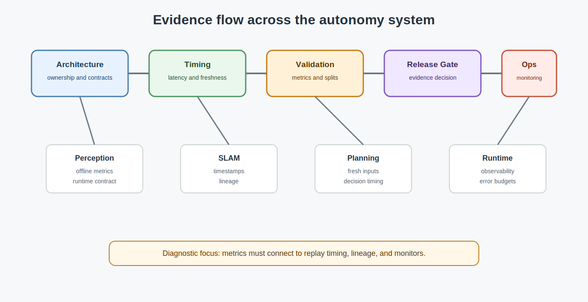

# Systems Engineering Foundations for Autonomy

<!-- kb-visual:start -->

*Visual: section-level autonomy-role diagram showing systems-engineering foundations, autonomy problem classes, stack interfaces, reading paths, and failure diagnosis.*
<!-- kb-visual:end -->

## Why This Foundation Exists

Systems engineering connects local autonomy algorithms to fleet-scale evidence. Timing, latency, interface contracts, validation metrics, release gates, observability, architecture tradeoffs, operational error budgets, and evidence flow decide whether a perception model, estimator, planner, or runtime component can be trusted in production.

This foundation exists because a component can be correct in isolation and still fail the system claim. Reviews need to trace data lineage, freshness, runtime timing, monitoring, validation splits, metric uncertainty, and release evidence across module boundaries.

## What This Field Studies From First Principles

Systems engineering studies architecture contracts, timing models, clock synchronization, latency budgets, validation metrics, statistical validity, release gates, observability, operations feedback, degraded-operation evidence, and cross-cutting design tradeoffs.

The first-principles questions are: what claim is being made, what evidence supports it, what interface carries it, what timing assumptions must hold, what monitors detect violation, what release gate blocks unsafe change, and what operational budget remains when conditions degrade.

## Autonomy Problem Map

Systems engineering spans all autonomy problem classes. It consumes component metrics, logs, timestamps, topic contracts, calibration records, data lineage, replay results, monitoring signals, and release criteria. It produces architecture decisions, timing budgets, freshness contracts, validation evidence, operational dashboards, and safety-case traceability.

The autonomy risk is untraceable confidence. A model can pass offline metrics while replay timing, stale data, broken lineage, or weak runtime monitoring makes the release claim unsupported.

## Core Mental Model

Think in evidence flow. Every system claim should connect requirements, interfaces, timing, metrics, runtime monitors, and release decisions in a chain that can be audited.

The practical model is: `architecture contract -> timing and data lineage -> validation metric -> release gate -> runtime observability -> operations feedback`. Failures usually enter through missing freshness contracts, replay/runtime mismatch, metric leakage, unmonitored latency, unclear ownership, or evidence that cannot be tied back to the deployed artifact.

## What This Foundation Lets You Review

- Do timing, latency, freshness, and synchronization contracts match the runtime behavior being claimed?
- Are architecture boundaries explicit about ownership, inputs, outputs, failure handling, and escalation?
- Do validation metrics include statistical uncertainty, data lineage, split integrity, and release thresholds?
- Can runtime observability detect stale data, degraded operation, timing drift, and evidence gaps?
- Does the release case connect offline results, replay behavior, monitoring, and operational budgets?

## Problem-Class Coverage

| Problem Class | Role Of This Foundation | Representative Applied Pages |
|---|---|---|
| Perception and scene understanding | supporting - systems engineering does not own perception math, but it owns the deployment, timing, evidence, and monitoring contracts around perception outputs. | [Perception-SLAM Runtime Interface Contract](../../40-runtime-systems/ml-deployment/perception-slam-runtime-interface-contract.md) - review whether perception outputs carry timing and lineage needed for release. |
| Localization, SLAM, and state estimation | supporting - estimator design belongs to state estimation, while systems engineering owns freshness, interface, replay, and monitoring evidence. | [Perception-SLAM Runtime Interface Contract](../../40-runtime-systems/ml-deployment/perception-slam-runtime-interface-contract.md) - debug interface failures where SLAM consumes perception outputs under unclear timing. |
| Mapping and spatial memory | supporting - mapping owns persistent representation, while systems engineering owns versioning evidence, deployment gates, and operational traceability. | [Topic Freshness and Stale Data Contracts](../../40-runtime-systems/middleware/topic-freshness-and-stale-data-contracts.md) - review whether map-facing topics can prove freshness and lineage. |
| Prediction and world modeling | supporting - prediction owns model semantics, while systems engineering owns validation evidence, latency budgets, and runtime monitoring. | [ROS 2 Timing Diagnostics and Observability](../../40-runtime-systems/monitoring-observability/ros2-timing-diagnostics-observability.md) - debug prediction regressions caused by timing drift rather than model logic. |
| Planning and decision making | supporting - planning owns behavior choice, while systems engineering owns the contracts and evidence that inputs and outputs are valid at decision time. | [Topic Freshness and Stale Data Contracts](../../40-runtime-systems/middleware/topic-freshness-and-stale-data-contracts.md) - review stale-input hazards before accepting planner safety claims. |
| Control and actuation | supporting - control owns closed-loop command behavior, while systems engineering owns timing, observability, and release evidence around command interfaces. | [ROS 2 Timing Diagnostics and Observability](../../40-runtime-systems/monitoring-observability/ros2-timing-diagnostics-observability.md) - debug actuation incidents where latency and monitor coverage shape the claim. |
| Safety, validation, and assurance | primary - this foundation owns cross-cutting release gates, metric validity, evidence flow, operational budgets, and auditability. | [Perception-SLAM Runtime Interface Contract](../../40-runtime-systems/ml-deployment/perception-slam-runtime-interface-contract.md) - review whether offline, replay, and runtime evidence support the safety case. |
| Runtime systems and operations | primary - systems engineering owns timing budgets, freshness contracts, observability architecture, and operational error budgets at system boundaries. | [ROS 2 Timing Diagnostics and Observability](../../40-runtime-systems/monitoring-observability/ros2-timing-diagnostics-observability.md) - debug production incidents using timing traces and monitor evidence. |

## Reading Paths By Task

For architecture and system tradeoffs, start with [Architecture Innovations](architecture-innovations.md), then read [Theoretical Foundations](theoretical-foundations.md) to connect integration choices to autonomy concepts.

For timing and synchronization reviews, read [Time Sync, PTP, Timestamping, and Latency Models](time-sync-ptp-timestamping-latency-models.md), then [Time Synchronization Error Budgets](time-synchronization-error-budgets.md).

For validation and release evidence, read [Benchmarking Metrics and Statistical Validity](benchmarking-metrics-statistical-validity.md), then connect metric claims to the runtime contracts used in deployment.

For degraded-operation examples, read [Signal Processing in Weather](signal-processing-weather.md) as a concrete case where sensing performance, runtime evidence, and release claims must agree.

## Dependency Map

Systems engineering depends on every local foundation for its own failure modes, assumptions, and artifacts. It does not re-explain those local mechanics; it connects them through timing, interfaces, validation, monitoring, release gates, and operational evidence.

Downstream, it feeds runtime operations, MLOps, safety cases, incident review, release management, and architecture decisions. The dependency review should ask whether each local claim survives the system context where it is consumed.

## Interfaces, Artifacts, and Failure Modes

Core artifacts include architecture contracts, interface schemas, topic freshness budgets, timestamp and clock reports, latency traces, validation protocols, metric confidence intervals, data lineage records, release gates, observability dashboards, incident timelines, and operational error budgets.

Diagnostic case: A perception model passes offline metrics but fails release because replay timing, data lineage, and runtime monitoring do not support the safety claim.

Common failure modes include offline/runtime mismatch, stale-topic contracts, unmonitored latency, broken data lineage, metric leakage, weak statistical validity, release gates without evidence owners, unclear escalation paths, and operational budgets that omit degraded conditions.

## Boundaries With Neighboring Foundations

- Owns: cross-cutting integration contracts, timing, latency, metrics, release gates, architecture tradeoffs, observability, operational error budgets, and evidence flow.
- Hands off to: each owning foundation for local mathematical or algorithmic failure modes, and runtime or MLOps pages for implementation operations.
- Diagnostic logic: if the failure is that evidence does not connect across timing, lineage, release, monitoring, or architecture contracts, debug here; if the failure is a local geometry, estimation, control, probability, or optimization mechanism, return to that owning foundation.

## Pages In This Section

Architecture and theory:

- [Architecture Innovations](architecture-innovations.md)
- [Theoretical Foundations](theoretical-foundations.md)

Timing and interface contracts:

- [Time Sync, PTP, Timestamping, and Latency Models](time-sync-ptp-timestamping-latency-models.md)
- [Time Synchronization Error Budgets](time-synchronization-error-budgets.md)

Validation and evidence:

- [Benchmarking Metrics and Statistical Validity](benchmarking-metrics-statistical-validity.md)

Degraded-operation examples:

- [Signal Processing in Weather](signal-processing-weather.md)

## Core Sources

This overview synthesizes the section pages listed above; no additional external sources were used.

