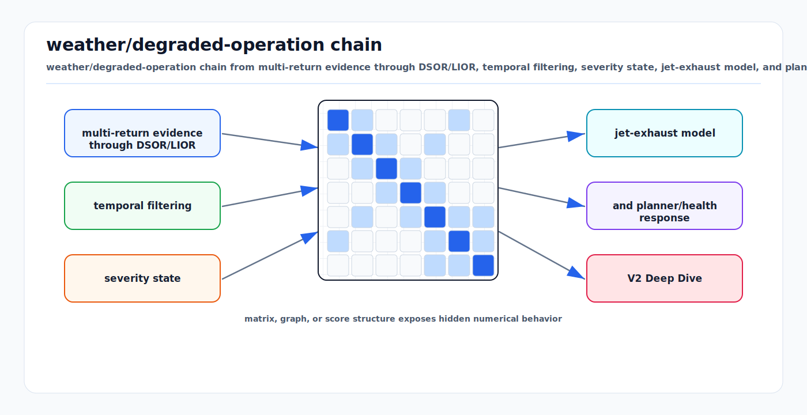

# V2 Deep Dive: Signal Processing (#1-5) and Weather/Degraded Operation (#29-31)

<!-- kb-visual:start -->


*Visual: weather/degraded-operation chain from multi-return evidence through DSOR/LIOR, temporal filtering, severity state, jet-exhaust model, and planner/health response.*
<!-- kb-visual:end -->

**Feasibility verification against reference airside AV stack source code and industry evidence**
**Date: 2026-03-16**

---

## Methodology

Each recommendation was verified by:
1. Reading the actual reference airside AV stack source code to identify exact integration points
2. Tracing data flow through the pipeline (rslidar_sdk -> Aggregator -> Preprocessor -> downstream)
3. Cross-referencing with peer-reviewed research and deployed AV systems
4. Identifying concrete blockers, incompatibilities, and prerequisites

### Key Codebase Facts Discovered During Analysis

- **Point type**: The rslidar_sdk is compiled with `POINT_TYPE XYZIRT` (x, y, z, intensity, ring, timestamp). The downstream preprocessor converts to `pcl::PointXYZI` (losing ring and timestamp fields).
- **RS32 dual-return support**: The rs_driver decoder (`decoder_RS32.hpp`) already handles dual-return mode via `DualReturnBlockIterator`. Return mode byte 0x00 = dual, 0x01 = strongest, 0x02 = last. The driver auto-detects from DIFOP packets.
- **Pipeline**: Raw RS32 clouds (5 sensors) -> Aggregator (TF transform + concatenation at 10 Hz, 200ms stale threshold) -> Ground Filter -> Preprocessor (per-region cropbox + intensity filter + voxel + multi-level SOR with nanoflann KD-tree) -> downstream detection.
- **SOR implementation**: Custom nanoflann-based SOR (not PCL's), with multi-level support. Uses global mean + stddev threshold, not range-adaptive.
- **Existing intensity filter**: Per-region min/max intensity thresholding exists in the preprocessor but currently not configured (no `enable_intensity_filter` in any region config).
- **Rain detection**: Standalone node (not nodelet), uses `waitForMessage` polling at 0.2 Hz. Crops a 1m^3 cube above the vehicle, counts SOR-rejected points, accumulates over 10s windows, classifies into 5 states. Publishes `rain_state` as Float32 but nothing consumes it to adapt perception parameters.

---

## Recommendation #1: LiDAR Multi-Return Processing for Adverse Weather

### Original Priority: Critical
### Revised Priority: Critical (confirmed, but with prerequisite discovery)
### Feasibility Verdict: FEASIBLE WITH MODIFICATIONS

**Code Integration Points:**

The RS32 decoder already supports dual-return at the packet level:

- **File**: `/home/kvyn/ubuntu_20-04/z-airside-ws/src/rslidar_sdk/src/rs_driver/src/rs_driver/driver/decoder/decoder_RS32.hpp`
  - Line 185-196: `getEchoMode()` maps return_mode byte 0x00 -> ECHO_DUAL
  - Line 219-229: `decodeMsopPkt()` switches between `SingleReturnBlockIterator` and `DualReturnBlockIterator`
  - In dual-return mode, odd blocks contain strongest return, even blocks contain last return (per RoboSense spec)

- **Blocker #1 -- Point type**: The driver publishes `XYZIRT` (no return-type field). The `XYZIRTF` type adds a `uint8_t feature` field that could carry return type. Switching requires changing `CMakeLists.txt` line 8 from `set(POINT_TYPE XYZIRT)` to `set(POINT_TYPE XYZIRTF)`. However, this changes the ROS message format, which will break the Aggregator and Preprocessor unless they handle the extra field.

- **Blocker #2 -- Aggregator drops fields**: The Aggregator (`PointcloudAggregator.cpp` line 144) uses `pcl::concatenatePointCloud()` which works on `sensor_msgs::PointCloud2` and preserves fields, so this is actually safe. But the Preprocessor converts to `pcl::PointXYZI` (line 422 of `PointcloudPreprocessor.cpp`), which discards ring, timestamp, AND the feature/return-type field. A dual-return filter must operate BEFORE this conversion or the preprocessor must use a custom point type.

- **Recommended insertion point**: New nodelet between Aggregator and Preprocessor, or as a first stage within the Aggregator after concatenation but before publishing.

**Data structures that need modification:**
- Driver: Change `POINT_TYPE` to `XYZIRTF` or add a custom point type with return_type field
- Or: publish two separate topics (strongest_return, last_return) and process in the aggregator
- Aggregator: No changes needed if working at `sensor_msgs::PointCloud2` level
- New: `DualReturnFilter` class that pairs returns by ring+azimuth and compares range/intensity

**New parameters needed:**
```yaml
dual_return_filter:
  enabled: true
  range_divergence_threshold: 0.5  # meters - if first/last differ by more than this, flag first as weather
  intensity_ratio_threshold: 0.3   # if first_intensity / last_intensity < this, classify first as noise
  min_range_for_analysis: 1.0      # don't analyze very close returns (self-reflections)
```

**Industry Reality Check:**

- **Proven in production**: Hesai's Intelligent Point Cloud Engine (IPE) in the AT128 and OT128 filters >99.9% of environmental noise using dual-return analysis. This is deployed at scale in Zoox and Kodiak vehicles.
- **RoboSense RS32 specific**: The RS32 supports dual-return mode natively. When enabled, data rate doubles (116.4 Mbps per sensor vs 58.2 Mbps). With 5 sensors, total bandwidth becomes ~582 Mbps. This is within Gigabit Ethernet capacity but needs verification that the vehicle's network can handle it.
- **Known failure modes**:
  - Dual-return does NOT help with dense fog where both returns hit the fog wall at similar ranges
  - In very heavy rain (>40mm/h), even the strongest return may be significantly attenuated
  - Dual-return increases per-sensor point count 2x, which increases computational load in the preprocessor's SOR (O(n log n) KD-tree build)
- **Research validation**: Survey on LiDAR Perception in Adverse Weather Conditions (arXiv:2304.06312) confirms multi-return as a primary defense. Empirical studies show heavy rain reduces effective range by ~50%, but dual-return recovers most lost detections at medium range.

**Revised Implementation Plan:**

1. **Week 1**: Enable dual-return mode on one RS32 via RSView firmware tool. Verify data rate and bandwidth. Record test bags in clear weather to establish baseline.
2. **Week 1-2**: Implement the simplest viable approach: modify the rslidar_sdk to publish the return type. Two options:
   - Option A (recommended): Change `POINT_TYPE` to `XYZIRTF` in CMakeLists.txt. The `feature` byte (0=strongest, 1=last) is already set by the decoder for dual-return models that support it. For RS32, this needs a small decoder modification to set the feature field based on odd/even block index.
   - Option B (lower risk): Publish two separate point cloud topics per sensor (`/XX/rslidar_points_strongest` and `/XX/rslidar_points_last`). Requires modifying the rslidar_sdk ROS publisher.
3. **Week 2-3**: Create `DualReturnFilterNodelet` that:
   - Subscribes to the raw concatenated cloud (before preprocessor)
   - Groups points by ring + approximate azimuth to pair first/last returns
   - Computes range divergence and intensity ratio per pair
   - Removes points classified as weather noise
   - Publishes the cleaned cloud and a diagnostic topic with weather noise percentage
4. **Week 3-4**: Integrate with rain detection -- use the dual-return divergence percentage as a more reliable weather severity metric than the current SOR-residual approach.
5. **Testing**: Record bags in rain at airport. Compare false positive rates with/without dual-return filtering.

**Estimated effort**: 3-4 weeks (confirmed from v1, but with the network bandwidth verification as a prerequisite gate)

**Risk Assessment:**
- **Network bandwidth saturation**: 5 sensors in dual-return mode = ~582 Mbps. If the vehicle uses 100 Mbps switches, this is a hard blocker. Mitigation: verify network hardware first. If constrained, enable dual-return on only the front-facing sensors (FB, FT).
- **Computational overhead**: 2x point count increases SOR processing time. Mitigation: the dual-return filter itself should reduce total points before SOR, potentially to below original levels in rain.
- **Point type change breaks consumers**: Changing from XYZIRT to XYZIRTF changes the PointCloud2 message field layout. All subscribers must handle the extra field. Mitigation: test thoroughly; the `pcl::fromROSMsg` conversion to `PointXYZI` in the preprocessor ignores unknown fields, so it should be transparent.

---

## Recommendation #2: Dynamic Statistical Outlier Removal (DSOR)

### Original Priority: High
### Revised Priority: High (confirmed -- straightforward improvement with strong evidence)
### Feasibility Verdict: FEASIBLE

**Code Integration Points:**

The existing SOR implementation is the exact insertion point:

- **File**: `/home/kvyn/ubuntu_20-04/z-airside-ws/src/airside_perception/airside_pointcloud_preprocessor/src/PointcloudPreprocessor.cpp`
  - Lines 761-862: `applyStatisticalOutlierRemoval()` -- this is the function to modify
  - Line 833: `const double threshold = global_mean + std_dev_mul_thresh * global_stddev;` -- THIS IS THE LINE TO MAKE RANGE-ADAPTIVE
  - Lines 800-822: The per-point KNN loop already computes `mean_distances[i]`. The range `r` of each point is trivially available from `current_cloud->points[i].{x,y,z}`.

- **File**: `/home/kvyn/ubuntu_20-04/z-airside-ws/src/airside_perception/airside_pointcloud_preprocessor/include/airside_pointcloud_preprocessor/PointcloudPreprocessor.h`
  - Line 62-63: `CropBoxConfig` struct -- add `bool enable_dsor` and `double dsor_range_scale` parameters
  - Line 105-107: `applyStatisticalOutlierRemoval()` signature -- add optional range-adaptive parameters

- **File**: `/home/kvyn/ubuntu_20-04/z-airside-ws/src/airside_perception/airside_pointcloud_preprocessor/config/pointcloud_preprocessor.yaml`
  - Each region already has per-region SOR parameters. Add DSOR parameters alongside.

**Concrete code change:**

In `applyStatisticalOutlierRemoval()`, replace line 833:
```cpp
// BEFORE (fixed threshold):
const double threshold = global_mean + std_dev_mul_thresh * global_stddev;

// AFTER (range-adaptive threshold):
// Per-point threshold that relaxes with range
std::vector<double> thresholds(input_size);
for (size_t i = 0; i < input_size; ++i) {
    const auto& pt = current_cloud->points[i];
    double range = std::sqrt(pt.x * pt.x + pt.y * pt.y + pt.z * pt.z);
    double alpha = std_dev_mul_thresh * (1.0 + dsor_range_scale * (range / max_range));
    thresholds[i] = global_mean + alpha * global_stddev;
}
```

And modify the filter loop (line 838-842) to use per-point thresholds:
```cpp
for (size_t i = 0; i < input_size; ++i) {
    if (mean_distances[i] <= thresholds[i]) {
        filtered_cloud->push_back(current_cloud->points[i]);
    }
}
```

**New parameters needed per region:**
```yaml
enable_dsor: true          # Enable range-adaptive SOR (false = use standard SOR)
dsor_range_scale: 0.5      # How much to relax threshold with range (0.0 = standard SOR)
dsor_max_range: 30.0       # Reference range for scaling (meters)
```

**Industry Reality Check:**

- **DSOR paper (arXiv:2109.07078)**: Published 2021, demonstrated 28% faster than state-of-art snow de-noising with higher recall. The key insight: point density naturally decreases with 1/r^2, so a fixed SOR threshold systematically rejects valid sparse points at long range.
- **DROR (Dynamic Radius Outlier Removal)**: Alternative approach that varies the search radius rather than the threshold. Simpler but less accurate than DSOR.
- **IDSOR (arXiv:2602.05876)**: 2025 extension that adds intensity-awareness to DSOR. Outperforms both DSOR and DROR on real measured data. This combines recommendations #2 and #3.
- **Production deployment**: No public evidence of DSOR specifically deployed in production AV stacks, but the principle (range-adaptive filtering) is used internally by Waymo, Zoox, and Hesai's IPE.
- **Known failure modes**:
  - If `dsor_range_scale` is set too high, distant rain/snow noise is retained
  - If the point cloud contains mixed-range points within a region (e.g., a close object adjacent to far background), the per-point threshold correctly handles this, but the global mean/stddev is influenced by the range distribution
  - The current multi-level SOR approach (2 passes with different parameters) already partially addresses this by using different neighbor counts for near vs. far regions. DSOR within each region provides finer-grained adaptation.

**Revised Implementation Plan:**

1. **Day 1-2**: Add `dsor_range_scale` and `dsor_max_range` parameters to `CropBoxConfig` struct and `loadParameters()`.
2. **Day 2-3**: Modify `applyStatisticalOutlierRemoval()` to compute per-point range-adaptive thresholds when `dsor_range_scale > 0`.
3. **Day 3-4**: Tune parameters per region:
   - `front_near` (4.7-12m): `dsor_range_scale: 0.3` (mild adaptation)
   - `front_mid` (12-18m): `dsor_range_scale: 0.5`
   - `front_far` (18-30m): `dsor_range_scale: 0.8` (strong adaptation)
   - Side regions: similar scaling based on range bracket
4. **Day 5**: Record test bags with and without DSOR. Compare point counts at 20m, 40m, 60m ranges. Verify distant valid objects (aircraft, buildings) are retained.

**Estimated effort**: 3-5 days (reduced from v1 "1 week" -- it is truly a minimal code change)

**Risk Assessment:**
- **Very low risk**: The change is backward-compatible (dsor_range_scale=0.0 gives identical behavior to current code). Can be toggled per-region via config.
- **Performance**: Adds one `sqrt()` per point per SOR level. With ~10k points per region, this is <0.1ms overhead. Negligible.
- **Tuning**: The `dsor_range_scale` parameter needs empirical tuning on airport data. Incorrect values could either retain noise at long range or remove valid returns at close range. Mitigation: start with conservative values (0.3) and tune up.

---

## Recommendation #3: Low-Intensity Outlier Removal (LIOR) for Jet Exhaust and Heat Shimmer

### Original Priority: High
### Revised Priority: High (confirmed, with a significant finding about existing infrastructure)
### Feasibility Verdict: FEASIBLE

**Code Integration Points:**

**Key finding**: The preprocessor already has intensity filtering infrastructure that is largely dormant.

- **File**: `/home/kvyn/ubuntu_20-04/z-airside-ws/src/airside_perception/airside_pointcloud_preprocessor/src/PointcloudPreprocessor.cpp`
  - Lines 697-733: `applyIntensityFilter()` -- exists but is a simple min/max threshold without range normalization
  - Lines 1023-1026: In `classifyPointsSinglePass()`, intensity filtering is applied inline during the single-pass cropbox classification

- **File**: `/home/kvyn/ubuntu_20-04/z-airside-ws/src/airside_perception/airside_pointcloud_preprocessor/config/pointcloud_preprocessor.yaml`
  - No region currently sets `enable_intensity_filter: true`. The config template mentions it but all 13 regions omit it (default is `true` in code, but `min_intensity: 0.0` and `max_intensity: 255.0` make it a no-op).

- **What needs to change**: The existing intensity filter is too crude for LIOR. LIOR requires range-normalized intensity, not raw intensity thresholding. A new filtering step is needed.

**Implementation approach -- two options:**

**Option A (Recommended): Extend the existing intensity filter with range normalization**

Add a range-normalization step before intensity filtering in `applyIntensityFilter()`:

```cpp
// In applyIntensityFilter(), replace the simple threshold with:
for (const auto& point : cloud->points) {
    double range = std::sqrt(point.x * point.x + point.y * point.y + point.z * point.z);
    if (range < min_range_for_lior) continue;  // skip very close points

    // Range-squared normalization: compensate for 1/r^2 intensity falloff
    double range_ref = 10.0;  // reference range in meters
    double corrected_intensity = point.intensity * (range * range) / (range_ref * range_ref);

    if (std::isfinite(corrected_intensity) &&
        corrected_intensity >= lior_min_intensity_threshold) {
        intensity_filtered_cloud->push_back(point);
    }
}
```

**Option B: Combine with DSOR as IDSOR**

Implement the IDSOR approach (arXiv:2602.05876) which jointly uses distance and intensity in the SOR threshold:
```cpp
// Modified SOR threshold incorporating intensity:
double intensity_factor = (point.intensity < low_intensity_threshold) ? 0.5 : 1.0;
double alpha = std_dev_mul_thresh * (1.0 + dsor_range_scale * (range / max_range)) * intensity_factor;
```

This is more elegant and avoids adding a separate filter step.

**New parameters needed:**
```yaml
# LIOR parameters (per region)
enable_lior: true
lior_range_ref: 10.0              # Reference range for normalization (meters)
lior_min_corrected_intensity: 5.0  # Threshold after range normalization
lior_min_range: 1.0               # Don't apply LIOR to very close points
```

**Industry Reality Check:**

- **LIOR in literature**: Low-Intensity Outlier Removal is documented in Zoox's patent portfolio and referenced in multiple AV weather filtering papers. The DVIOR paper (2025, Electronics 14(18):3662) reports LIOR alone achieves F1 scores around 75-80% for snow removal, but combined with distance-based methods (DVIOR achieves F1 > 90%).
- **Jet exhaust specifically**: No published research specifically addresses jet exhaust LiDAR false returns. However, LiDAR measurements of jet exhaust plumes at Denver International Airport (DOT report dot/9522) confirm that exhaust plumes produce measurable backscatter with characteristically low intensity and high temporal variability -- exactly the signature LIOR targets.
- **Range normalization**: Standard in surveying LiDAR (ASPRS standards). In AV context, Kodiak and Waymo both normalize intensity before downstream use. The 1/r^2 correction is physically motivated by the radar range equation applied to LiDAR.
- **Known failure modes**:
  - Black/dark objects (fresh tires, dark clothing) have genuinely low reflectivity and could be filtered by LIOR. This is the classic LIOR false negative. Mitigation: set the threshold conservatively and combine with spatial clustering (isolated low-intensity points are noise; clustered low-intensity points forming a coherent shape are real objects).
  - Wet surfaces have reduced reflectivity. After rain, wet asphalt can drop to <5% reflectivity. LIOR must not filter ground returns. Mitigation: apply LIOR only to non-ground points (i.e., after ground filtering, not before).

**Revised Implementation Plan:**

1. **Day 1**: Add range normalization to `applyIntensityFilter()` with a feature flag (`enable_lior`).
2. **Day 2**: Add a spatial clustering guard: only remove low-intensity points that are NOT part of a dense cluster. This can be done by checking if the point would also be rejected by SOR (i.e., combine LIOR with SOR rather than running them independently).
3. **Day 3**: Tune thresholds using recorded bags. Key test cases: (a) clear weather baseline, (b) jet exhaust from idling aircraft, (c) rain, (d) dark-clothed personnel.
4. **Day 4-5**: Integrate with weather-adaptive parameters (Recommendation #29) so LIOR thresholds tighten during detected rain/exhaust conditions.

**Important design decision**: LIOR should run AFTER ground filtering, not before. The preprocessor currently runs before ground filtering in the pipeline. Two options:
- Move LIOR to a post-ground-filter position (new nodelet or extend segmentation)
- Accept the risk and apply LIOR with a conservative threshold that won't remove wet ground points

**Estimated effort**: 1 week (confirmed from v1)

**Risk Assessment:**
- **Medium risk**: False removal of dark/low-reflectivity objects is the primary danger. A dark-clothed ground worker at 30m has very low intensity. If LIOR removes these points, safety is degraded.
- **Mitigation**: Conservative thresholds + cluster-size guard (don't remove low-intensity points that form clusters > N points). Additionally, LIOR should be disabled or relaxed when rain_state > 0 (wet surfaces have lower reflectivity across the board).
- **Dependency**: Recommendation #5 (Intensity Calibration) makes LIOR significantly more reliable by providing consistent, calibrated intensity values.

---

## Recommendation #4: Temporal Consistency Filtering

### Original Priority: Medium
### Revised Priority: Medium (confirmed, but complexity is higher than stated in v1)
### Feasibility Verdict: FEASIBLE WITH MODIFICATIONS

**Code Integration Points:**

This recommendation does NOT integrate into the preprocessor -- it belongs downstream in the tracking/detection layer.

- **Current pipeline**: Aggregator -> Ground Filter -> Preprocessor -> Segmentation -> Detection/Tracking
- **Integration point**: Between Segmentation output and Polygon Detector / ULD Detector input
- **Alternative**: At the cluster level in the Polygon Detector, using the existing Kalman track infrastructure

The Aggregator already stores the latest cloud from each sensor (line 63, `clouds_.resize(num_clouds_)`) but only keeps 1 frame per sensor. Temporal filtering needs 2-3 frames of history.

**Two viable approaches:**

**Approach A: Point-level temporal filtering (before clustering)**
- Maintain a rolling buffer of 3 preprocessed point clouds (ego-motion compensated)
- For each new point, check if a point existed within radius R in at least 2 of the 3 previous frames
- Points failing consistency are removed before clustering
- **Problem**: Ego-motion compensation requires fused odometry, which comes from the localization stack (`/odom/fused` at 20Hz). This creates a cross-dependency.

**Approach B: Cluster-level temporal filtering (at tracker) -- RECOMMENDED**
- After segmentation produces clusters, check if each cluster overlaps spatially with a cluster from the previous 2 frames
- New clusters that appear for only 1 frame are marked "unconfirmed"
- This naturally integrates with M-of-N track confirmation (Recommendation #10 from the v1 doc)
- **Advantage**: Works at the tracker level where ego-motion compensation is already available through the Kalman prediction step

**New node/nodelet required**: Either a standalone `TemporalConsistencyFilter` nodelet or an extension to the Polygon Detector.

**Data structures needed:**
```cpp
struct FrameHistory {
    ros::Time timestamp;
    std::vector<Eigen::Vector3d> cluster_centroids;
    std::vector<double> cluster_sizes;
    geometry_msgs::TransformStamped ego_pose;  // for motion compensation
};
std::deque<FrameHistory> frame_buffer_;  // rolling buffer of 3 frames
```

**New parameters:**
```yaml
temporal_consistency:
  enabled: true
  num_frames_required: 2       # Must appear in N of last M frames
  num_frames_window: 3         # Window size M
  spatial_tolerance: 0.5       # meters - cluster centroid match tolerance
  bypass_range: 3.0            # meters - skip filtering for very close detections
  require_odometry: true       # Use ego-motion compensation
  odom_topic: "/odom/fused"
```

**Industry Reality Check:**

- **Widely used concept**: Temporal consistency (also called "persistence filtering" or "multi-frame confirmation") is standard practice. Waymo's tracker uses M-of-N confirmation. Zoox's GCA system requires temporal persistence before triggering braking.
- **4DenoiseNet (2024)**: Uses spatial-temporal context via KNN convolution across consecutive point clouds for weather denoising. Reports significant improvement over single-frame methods.
- **Known failure modes**:
  - **Latency**: Requiring 2-of-3 frame consistency adds 200-300ms latency (at 10Hz) before a new object is confirmed. For a vehicle approaching at 10 km/h, this is 0.56-0.83m of undetected travel. The bypass for close-range (<3m) detections mitigates this.
  - **Stationary objects appearing suddenly**: A door opening, cargo falling, or a person stepping out from behind a vehicle creates a genuine new object that temporal filtering delays. The close-range bypass is critical.
  - **Ego-motion compensation errors**: If odometry is inaccurate (GPS multipath on airport, IMU drift), the motion-compensated comparison will fail, causing valid objects to appear temporally inconsistent. Mitigation: use loose spatial tolerance (0.5m).

**Revised Implementation Plan:**

1. **Week 1**: Implement cluster-level temporal consistency as an extension to the existing tracking infrastructure (Polygon Detector or a wrapper around it).
2. **Week 1-2**: Add ego-motion compensation using `/odom/fused` topic. Implement the rolling buffer and cluster centroid matching.
3. **Week 2**: Implement the close-range bypass and tune the spatial tolerance.
4. **Week 2-3**: Test with recorded bags containing: (a) transient exhaust plumes, (b) real objects appearing suddenly, (c) rain noise. Verify that transient noise is filtered while real objects are detected within acceptable latency.

**Estimated effort**: 2-3 weeks (confirmed from v1)

**Risk Assessment:**
- **Primary risk**: Added detection latency. 200-300ms is significant for a safety system. Mitigation: close-range bypass + GCA system (Recommendation #9) provides independent safety without temporal filtering delay.
- **Dependency**: Requires reliable odometry (`/odom/fused`). The localization stack must be running. If localization fails, temporal filtering should fall back to stationary-assumption mode (no ego-motion compensation).
- **Interaction with track lifecycle**: This recommendation overlaps with M-of-N track confirmation (v1 Recommendation #10). Implementing both together is more efficient than separately.

---

## Recommendation #5: Intensity Calibration and Range Normalization

### Original Priority: Medium
### Revised Priority: High (upgraded -- this is a prerequisite for #2 DSOR, #3 LIOR, and #29 Weather Estimation)
### Feasibility Verdict: FEASIBLE

**Code Integration Points:**

The most efficient insertion point is in the Preprocessor's conversion step:

- **File**: `/home/kvyn/ubuntu_20-04/z-airside-ws/src/airside_perception/airside_pointcloud_preprocessor/src/PointcloudPreprocessor.cpp`
  - Lines 418-462: `applyConversionAndTransformation()` -- this is where the ROS message is converted to PCL. Range normalization should be applied here, immediately after conversion.
  - Line 422: `pcl::PointCloud<pcl::PointXYZI>::Ptr transformed_cloud` -- the intensity field of each point is accessible here.

**Concrete code change:**

Add a range normalization pass after the PCL conversion in `applyConversionAndTransformation()`:

```cpp
// After pcl::fromROSMsg, before return:
if (enable_intensity_calibration_) {
    for (auto& pt : transformed_cloud->points) {
        if (!std::isfinite(pt.intensity)) continue;
        double range = std::sqrt(pt.x * pt.x + pt.y * pt.y + pt.z * pt.z);
        if (range < 0.5) continue;  // skip very close points (self-reflection)

        // Range-squared normalization: I_corrected = I_raw * (r / r_ref)^2
        double scale = (range / intensity_range_ref_) * (range / intensity_range_ref_);
        pt.intensity = static_cast<float>(pt.intensity * scale);

        // Clamp to prevent overflow
        pt.intensity = std::min(pt.intensity, 65535.0f);
    }
}
```

**Data structures to modify:**

- **File**: `PointcloudPreprocessor.h`
  - Add member variables:
    ```cpp
    bool enable_intensity_calibration_;
    double intensity_range_ref_;  // reference range (meters), typically 10.0
    ```

- **File**: `pointcloud_preprocessor.yaml`
  ```yaml
  # Intensity calibration
  enable_intensity_calibration: true
  intensity_range_ref: 10.0  # Reference range for normalization (meters)
  ```

**Important consideration**: The intensity field in `pcl::PointXYZI` is a `float`. RoboSense RS32 raw intensity is a `uint8_t` (0-255). After range-squared normalization, a point at 50m with raw intensity 100 becomes `100 * (50/10)^2 = 2500`. The float can hold this, but downstream consumers (intensity filters, SOR) must be re-tuned for the new value range. This is a global change that affects all intensity-dependent logic.

**Alternative approach**: Store calibrated intensity in a separate field or normalize to [0, 1] range:
```cpp
// Normalize to [0, 1] relative reflectivity
pt.intensity = pt.intensity * scale / max_expected_intensity;
```

**Industry Reality Check:**

- **Standard practice**: Range-squared normalization is the most basic form of intensity correction, grounded in the LiDAR equation (received power proportional to 1/r^2). Used by virtually all surveying LiDAR systems.
- **AV industry**: Waymo and Zoox both perform intensity calibration. Kodiak uses Luminar's built-in reflectivity calibration. The "Reflectivity Is All You Need!" paper (arXiv:2403.13188, 2024) demonstrates a 4% mIoU improvement in semantic segmentation when using calibrated reflectivity vs. raw intensity.
- **Per-sensor calibration**: The simple 1/r^2 model is a first-order correction. In practice, each LiDAR unit has a slightly different intensity response curve (manufacturing variation, lens aging, dust accumulation). A proper calibration requires measuring intensity response against known-reflectivity targets at multiple ranges for each unit. This is a Level 2/3 calibration and is more complex.
- **Known failure modes**:
  - Angle-of-incidence effect: Objects viewed at grazing angles reflect less intensity than head-on. Range normalization does not correct for this.
  - Atmospheric attenuation: In fog/rain, intensity drops faster than 1/r^2 due to scattering. Range normalization over-corrects in these conditions (distant points get inflated intensity). This is actually useful -- it makes atmospheric points have artificially high corrected intensity, making them easier to identify as anomalous.
  - Multi-path reflections: Retroreflective surfaces (safety vests, road signs) can produce saturated intensity at close range. After normalization, these become extreme outliers. This is beneficial for detection but could confuse downstream algorithms.

**Revised Implementation Plan:**

1. **Day 1**: Add `enable_intensity_calibration` and `intensity_range_ref` parameters to the preprocessor. Implement range-squared normalization in `applyConversionAndTransformation()`.
2. **Day 2**: Re-tune ALL intensity-dependent parameters throughout the pipeline:
   - Rain detection SOR parameters (currently `std_dev: 0.2`)
   - Any future LIOR thresholds
   - Existing `min_intensity`/`max_intensity` in region configs (currently unused but would need updating)
3. **Day 3**: Record test bags with and without calibration. Compare intensity histograms at 5m, 15m, 30m ranges. Verify that the same surface type has consistent calibrated intensity across ranges.
4. **Day 4-5**: Document the per-sensor calibration procedure for future Level 2 calibration (measure known targets at known ranges to build per-unit correction curves).

**Estimated effort**: 1 week (confirmed from v1, but the re-tuning of downstream parameters is the hidden cost)

**Risk Assessment:**
- **Low risk for the normalization itself**: Simple arithmetic, backward-compatible with a feature flag.
- **Medium risk for downstream impact**: Changing the intensity value range affects rain detection thresholds, future LIOR, and any other intensity-dependent logic. All thresholds must be re-tuned.
- **Recommendation**: Implement intensity calibration FIRST, before DSOR and LIOR, so those features are developed against calibrated values from the start.

---

## Recommendation #29: Weather Severity Estimation and Adaptive Perception

### Original Priority: High
### Revised Priority: High (confirmed, with a major finding about the existing rain detection gap)
### Feasibility Verdict: FEASIBLE WITH MODIFICATIONS

**Code Integration Points:**

**Critical finding**: The rain detection node already computes weather severity but its output is not consumed by anything.

- **File**: `/home/kvyn/ubuntu_20-04/z-airside-ws/src/airside_perception/airside_rain_detection/src/RainDetection.cpp`
  - Lines 168-214: `calculateRainMetrics()` publishes `rain_state` (0=NO_RAIN through 4=MONSOON_RAIN) on `~rain_state` topic
  - The rain state is published as `std_msgs::Float32`, not consumed by any other node

- **File**: `/home/kvyn/ubuntu_20-04/z-airside-ws/src/airside_perception/airside_rain_detection/config/rain_detection.yaml`
  - Timer rate is 0.2 Hz (checks every 5 seconds) -- too slow for rapid weather changes like driving through an exhaust plume
  - Uses a fixed 1m^3 cube at [6.5,7.5] x [-0.5,0.5] x [2.0,3.0] -- a small volume directly above the vehicle

**Problems with current rain detection:**
1. **Polling architecture**: Uses `ros::topic::waitForMessage()` which blocks the timer callback. This is fragile and doesn't scale.
2. **Single measurement volume**: A 1m^3 cube captures very few points. In light rain, the SOR difference might be 0-2 points, which is statistically unreliable.
3. **No downstream consumer**: The rain state is published but nothing subscribes to it or adapts behavior.
4. **Not a nodelet**: Runs as a standalone node, missing the zero-copy benefit of the nodelet pipeline.

**What needs to be built:**

1. **Enhanced weather estimator** (replace or augment rain detection):
   - Subscribe to the raw aggregated cloud (callback-based, not polling)
   - Compute multiple weather indicators:
     - SOR rejection ratio (existing metric, but over the full cloud, not just a tiny cube)
     - Mean free-path (average range to first return per beam -- short in fog)
     - Low-intensity point percentage at close range (indicator of fog/exhaust)
     - Dual-return divergence ratio (if #1 is implemented -- best metric)
   - Classify into weather states with hysteresis (don't oscillate between states)
   - Publish on a latched topic with a custom message type

2. **Adaptive parameter server**:
   - Subscribe to weather state
   - Use `dynamic_reconfigure` or direct parameter updates to adjust:
     - SOR `std_devs` parameters (relax in rain)
     - LIOR thresholds (tighten in clear, relax in rain to avoid removing wet surfaces)
     - Maximum detection range (reduce in heavy weather)
   - Publish parameter change events for logging

3. **Integration with planner**: Publish weather state for the planner to reduce speed.

**New message type:**
```
# WeatherState.msg
Header header
uint8 weather_class        # 0=CLEAR, 1=LIGHT_PRECIP, 2=HEAVY_PRECIP, 3=FOG, 4=EXHAUST
float32 confidence         # 0.0 - 1.0
float32 sor_rejection_ratio
float32 mean_free_path
float32 low_intensity_ratio
float32 dual_return_divergence
```

**Industry Reality Check:**

- **Weather classification from LiDAR**: The Survey on LiDAR Perception in Adverse Weather (arXiv:2304.06312) identifies rain detection rate, mean free-path, and intensity statistics as the primary LiDAR-derived weather indicators. These are exactly what's proposed.
- **Hesai IPE**: The commercial state-of-art. Hesai's Intelligent Point Cloud Engine classifies weather conditions and adapts filtering parameters in real-time, built into the sensor firmware. reference airside AV stack is essentially building a software version of this.
- **Adaptive parameter tuning**: Aurora's velocity-based rain filtering (published 2024) adjusts filter aggressiveness based on estimated precipitation rate. Kodiak's IPE integration similarly adapts.
- **Known failure modes**:
  - **Misclassification**: Fog and heavy exhaust have similar LiDAR signatures (short mean free-path, low intensity). Distinguishing them is important because the operational response differs (fog: slow down globally; exhaust: filter locally).
  - **Oscillation**: Weather conditions can change rapidly (driving into/out of an exhaust plume). The system must have hysteresis to prevent rapid parameter oscillation.
  - **Parameter lag**: If parameters are updated via `dynamic_reconfigure`, there's a propagation delay. During the transition, the system operates with stale parameters.

**Revised Implementation Plan:**

1. **Week 1**: Refactor rain detection into a nodelet with callback-based cloud subscription. Expand the measurement volume from a 1m^3 cube to the full front-near region.
2. **Week 1-2**: Add additional weather metrics: mean free-path, low-intensity ratio, SOR rejection ratio over the full cloud.
3. **Week 2**: Implement weather state machine with hysteresis:
   ```
   CLEAR -> LIGHT_PRECIP: requires 3 consecutive readings above threshold
   LIGHT_PRECIP -> CLEAR: requires 5 consecutive readings below threshold (slower transition back)
   ```
4. **Week 2-3**: Implement adaptive parameter adjustment. Start with SOR `std_devs` scaling:
   - CLEAR: use configured values
   - LIGHT_PRECIP: multiply `std_devs` by 0.7 (tighter filtering)
   - HEAVY_PRECIP: multiply `std_devs` by 0.5 + enable LIOR if not already enabled
5. **Week 3-4**: Integrate with planner for speed reduction. Add diagnostics and logging.

**Estimated effort**: 3-4 weeks (confirmed from v1)

**Risk Assessment:**
- **Medium risk**: Adaptive parameters could cause unexpected behavior if the weather classification is wrong. A false "heavy rain" classification would tighten SOR and potentially remove valid objects.
- **Mitigation**: Implement a "safety floor" -- never remove more than 50% of points in any region regardless of weather state. Log all parameter changes for post-incident analysis.
- **Dependency**: Benefits significantly from dual-return (#1) and intensity calibration (#5). The dual-return divergence metric is the single most reliable weather indicator.

---

## Recommendation #30: Jet Blast and Engine Exhaust Zone Modeling

### Original Priority: Medium
### Revised Priority: Medium (confirmed -- important but can be partially addressed by #1, #3, #4)
### Feasibility Verdict: FEASIBLE WITH MODIFICATIONS

**Code Integration Points:**

This recommendation has two variants:

**Variant A: Signal-level filtering (no aircraft position knowledge)**
- This is already addressed by combining recommendations #1 (multi-return), #3 (LIOR), and #4 (temporal consistency). Jet exhaust has characteristic signatures: low intensity, temporal transience, and dual-return divergence.
- No additional code required beyond #1, #3, #4.

**Variant B: Geometric zone suppression (requires aircraft position knowledge)**
- Requires integration with airport operations data or perception-derived aircraft position
- New nodelet that maintains a set of "exhaust exclusion zones" behind known aircraft engines
- Points within these zones that match the exhaust signature get a lower confidence weight

**For Variant B, the integration points are:**

- New nodelet: `ExhaustZoneFilter`
  - Subscribe to: aggregated point cloud, aircraft positions (from apron management system or from the perception stack's own detections)
  - For each known aircraft, compute the exhaust cone: a truncated cone behind each engine, oriented along the aircraft's heading, with half-angle ~15 degrees and length ~50m
  - Points within the cone that have low intensity AND temporal inconsistency are classified as exhaust
  - Publish filtered cloud

- **Alternative (simpler)**: Static exclusion zones loaded from airport configuration
  - Each aircraft stand has known engine positions relative to the stand coordinate frame
  - Load these from a YAML config per airport
  - When the vehicle is near a stand with a known parked aircraft, activate the corresponding exclusion zone

**New parameters:**
```yaml
exhaust_zone_filter:
  enabled: true
  # Static zones (per stand)
  zones:
    - stand_id: "E20"
      engine_position: [10.0, 3.0, 2.5]  # relative to stand origin
      engine_heading: 180.0  # degrees
      cone_half_angle: 15.0  # degrees
      cone_length: 50.0  # meters
  # Dynamic filtering within zones
  intensity_threshold_in_zone: 10.0  # lower threshold for points in exhaust zones
  temporal_persistence_required: 3   # frames
```

**Industry Reality Check:**

- **No direct AV industry analog**: Airport autonomous ground vehicles are a niche domain. No published research specifically addresses LiDAR jet blast filtering.
- **Related work**: Kodiak's dust handling for off-road trucking uses similar principles (atmospheric particulate filtering). Aurora's rain filtering adapts to varying precipitation intensity along the route.
- **Physics of jet exhaust LiDAR returns**: DOT research (Lidar Measurement of Exhaust Plume Characteristics, Denver International Airport) confirms that turbine exhaust plumes produce measurable LiDAR backscatter from particulate matter and refractive index gradients in hot air. The returns are characteristically:
  - Low intensity (particles are small, poor reflectors)
  - Temporally fluctuating (turbulent flow)
  - Spatially diffuse (no sharp edges)
  - Located in a cone behind the engine
- **The practical question**: How often does the reference airside vehicle actually encounter jet exhaust? If it primarily operates on the cargo apron away from active aircraft engines, this may be a low-frequency event. If it routinely passes behind idling aircraft, it's critical.

**Revised Implementation Plan:**

1. **Phase 1 (Week 0)**: Rely on recommendations #1, #3, #4 for signal-level exhaust filtering. Record data near idling aircraft to characterize the exhaust signature. This is the 80/20 solution.
2. **Phase 2 (Weeks 1-2, if needed)**: If signal-level filtering proves insufficient, implement static exclusion zones from airport configuration data. This requires:
   - A YAML config file per airport with stand locations and engine positions
   - A simple geometric test (point-in-cone) applied to the pre-filtered cloud
   - Integration with the vehicle's current stand/waypoint to activate relevant zones
3. **Phase 3 (future)**: Dynamic zone modeling using detected aircraft positions from the perception stack itself.

**Estimated effort**:
- Phase 1: 0 weeks (covered by #1, #3, #4)
- Phase 2: 2 weeks
- Phase 3: 3-4 weeks

**Risk Assessment:**
- **Low risk for Phase 1**: Signal-level filtering is general-purpose and doesn't require airport-specific knowledge.
- **Medium risk for Phase 2**: Static zone configuration requires accurate stand geometry and must be updated when airport layout changes. If the configuration is wrong, valid objects in the zone may be filtered.
- **Operational question**: Need to confirm with reference airside AV stack operations team whether the vehicle routinely encounters jet exhaust. If not, this can be deprioritized.

---

## Recommendation #31: Sensor Staleness Detection and Handling

### Original Priority: Medium
### Revised Priority: High (upgraded -- the Aggregator already has partial implementation but with gaps)
### Feasibility Verdict: FEASIBLE

**Code Integration Points:**

**Key finding**: The Aggregator already implements basic staleness detection but handles it suboptimally.

- **File**: `/home/kvyn/ubuntu_20-04/z-airside-ws/src/airside_perception/airside_pointcloud_aggregator/src/PointcloudAggregator.cpp`
  - Line 23 (header): `static constexpr double STALE_THRESHOLD = 0.2;` -- 200ms hardcoded constant
  - Lines 116-123: Staleness check in `update()`:
    ```cpp
    double age = (now - clouds_[i].header.stamp).toSec();
    if (age > STALE_THRESHOLD) {
        stats_.cloud_stale_count[i]++;
        ROS_WARN_THROTTLE(1.0, "Cloud '%s' is stale (%.1fs old)", ...);
        continue;  // SKIP the stale cloud entirely
    }
    ```
  - **Problem**: The current behavior is binary -- either use the data as-is or skip it entirely. There is no intermediate "use with ego-motion compensation" mode.

- **File**: `/home/kvyn/ubuntu_20-04/z-airside-ws/src/airside_perception/airside_pointcloud_aggregator/include/airside_pointcloud_aggregator/PointcloudAggregator.hpp`
  - Lines 49-59: `DiagStats` struct -- already tracks per-sensor stale counts, age sums, and TF failures. Good foundation.

**What the current code gets right:**
- Per-sensor staleness tracking with diagnostics
- Discarding stale data (conservative, safe)
- Warning logs for debugging

**What needs improvement:**
1. The 200ms threshold is hardcoded. Should be configurable.
2. No ego-motion compensation for mildly stale data (50-200ms). At 10 km/h, a 100ms stale cloud has 0.28m offset -- correctable with odometry.
3. No published health metric. The staleness info is only logged, not available to other nodes.
4. No degraded mode behavior. If 2+ sensors are stale, the system should reduce speed, not just warn.

**Concrete code changes:**

In `PointcloudAggregator.hpp`:
```cpp
// Replace hardcoded constant with parameters
double stale_threshold_low_;   // below this: use normally (e.g., 50ms)
double stale_threshold_high_;  // above this: discard (e.g., 200ms)
bool enable_motion_compensation_;
```

In `PointcloudAggregator.cpp`, modify the staleness check:
```cpp
double age = (now - clouds_[i].header.stamp).toSec();
stats_.cloud_age_sum[i] += age;

if (age > stale_threshold_high_) {
    // Too old, discard
    stats_.cloud_stale_count[i]++;
    continue;
} else if (age > stale_threshold_low_ && enable_motion_compensation_) {
    // Mildly stale: apply ego-motion compensation
    // Transform cloud from its timestamp to current time using odometry
    try {
        geometry_msgs::TransformStamped motion_tf = tf_buffer_->lookupTransform(
            target_frame_, clouds_[i].header.stamp,
            target_frame_, now,
            "odom",  // fixed frame for interpolation
            ros::Duration(0.05));
        sensor_msgs::PointCloud2 compensated;
        tf2::doTransform(transformed, compensated, motion_tf);
        transformed = compensated;
        stats_.cloud_compensated_count[i]++;
    } catch (tf2::TransformException& ex) {
        // Compensation failed, use stale data as-is (still better than discarding)
        ROS_WARN_THROTTLE(1.0, "Motion compensation failed for '%s': %s", ...);
    }
}
```

Add a health publisher:
```cpp
// In update(), after processing all clouds:
if (pub_sensor_health_.getNumSubscribers() > 0) {
    // Publish per-sensor health status
    diagnostic_msgs::DiagnosticArray health_msg;
    for (int i = 0; i < num_clouds_; ++i) {
        diagnostic_msgs::DiagnosticStatus status;
        status.name = topic_names_in_[i];
        if (clouds_[i].header.stamp.isZero())
            status.level = diagnostic_msgs::DiagnosticStatus::ERROR;  // never received
        else if (age > stale_threshold_high_)
            status.level = diagnostic_msgs::DiagnosticStatus::ERROR;  // stale
        else if (age > stale_threshold_low_)
            status.level = diagnostic_msgs::DiagnosticStatus::WARN;   // mildly stale
        else
            status.level = diagnostic_msgs::DiagnosticStatus::OK;
        health_msg.status.push_back(status);
    }
    pub_sensor_health_.publish(health_msg);
}
```

**New parameters:**
```yaml
# Staleness handling
stale_threshold_low: 0.05    # seconds - above this, apply motion compensation
stale_threshold_high: 0.2    # seconds - above this, discard
enable_motion_compensation: true
odom_frame: "odom"           # Fixed frame for motion interpolation

# Health monitoring
publish_sensor_health: true
sensor_health_topic: "sensor_health"
```

**Industry Reality Check:**

- **Zoox (arXiv:2506.05780)**: Published June 2025, directly addresses sensor staleness in multi-sensor fusion. Key contributions:
  - Per-point timestamp offset feature for fine-grained temporal awareness
  - Data augmentation that simulates realistic staleness patterns
  - Reports significant improvement in trajectory prediction quality
  - Model-agnostic approach with negligible latency impact
- **Real-world occurrence**: Sensor staleness is a common real-world problem caused by: Ethernet packet loss, USB controller contention, CPU scheduling delays, thermal throttling, and sensor firmware hangs. On a vehicle with 5 LiDARs sharing network bandwidth (~582 Mbps in dual-return mode), occasional packet delays are expected.
- **Known failure modes**:
  - Motion compensation with inaccurate odometry can make things worse (shifting a cloud in the wrong direction). At low speeds (<10 km/h airport operations), the compensation error is bounded.
  - A sensor that is consistently stale (e.g., every frame arrives 150ms late due to a firmware issue) will always trigger compensation, which is correct behavior but masks a hardware problem that should be escalated.

**Revised Implementation Plan:**

1. **Day 1-2**: Make staleness thresholds configurable (replace hardcoded `STALE_THRESHOLD` with parameters). Add the two-tier threshold logic.
2. **Day 2-3**: Implement ego-motion compensation for mildly stale clouds using TF lookupTransform with time interpolation.
3. **Day 3-4**: Add `diagnostic_msgs::DiagnosticArray` publisher for per-sensor health.
4. **Day 4-5**: Add staleness statistics to the existing 30-second diagnostic printout. Include: per-sensor average age, stale percentage, compensation percentage.
5. **Week 2**: Integrate with a future sensor health monitor (v1 Recommendation #11) to trigger degraded mode.

**Estimated effort**: 1.5 weeks (reduced from v1 "2-3 weeks" -- the Aggregator already has 80% of the infrastructure)

**Risk Assessment:**
- **Low risk**: The existing binary skip behavior is preserved for the high threshold. The motion compensation is additive (only attempted for mildly stale data, with graceful fallback).
- **TF dependency**: Motion compensation requires accurate TF between timestamps. The Aggregator already uses TF for spatial transforms, so this infrastructure exists. The temporal interpolation adds a lookup that could fail if the TF buffer is too short.
- **Network bandwidth**: If staleness is caused by network saturation (likely with 5 sensors in dual-return mode), the fix is at the hardware level, not software. The staleness handler correctly identifies the symptom but cannot fix the root cause.

---

## Implementation Order and Dependencies

Based on the feasibility analysis, the recommended implementation order is:

```
Week 1-2:  #5 Intensity Calibration (prerequisite for #2, #3, #29)
           #31 Sensor Staleness (low-hanging fruit, mostly done)

Week 2-3:  #2 DSOR (builds on calibrated intensity)
           #3 LIOR (builds on calibrated intensity)

Week 3-5:  #1 Dual-Return Processing (parallel effort, requires firmware + network verification)
           #29 Weather Severity Estimation (integrates with #1, #2, #3)

Week 5-7:  #4 Temporal Consistency (benefits from all above)
           #30 Jet Blast Modeling (only if needed after #1+#3 prove insufficient)
```

**Critical path**: #5 -> #2/#3 -> #29 -> #1 (firmware verification gates this)

**Total estimated effort**: 8-10 engineer-weeks for all 8 recommendations, with early wins (#5, #31, #2) deliverable in the first 2 weeks.

---

## Sources

- [DSOR: A Scalable Statistical Filter for Removing Falling Snow](https://arxiv.org/abs/2109.07078)
- [IDSOR: Intensity- and Distance-Aware Statistical Outlier Removal](https://arxiv.org/html/2602.05876)
- [DVIOR: Dynamic Vertical and Low-Intensity Outlier Removal](https://www.mdpi.com/2079-9292/14/18/3662)
- [Survey on LiDAR Perception in Adverse Weather Conditions](https://arxiv.org/pdf/2304.06312)
- [Evaluating LiDAR Perception Algorithms for All-Weather Autonomy](https://www.mdpi.com/1424-8220/25/24/7436)
- [Impact of Multi-Scattered LiDAR Returns in Fog](https://www.mdpi.com/1424-8220/24/16/5121)
- [Empirical Analysis of AV LiDAR Performance in Rain and Fog](https://pmc.ncbi.nlm.nih.gov/articles/PMC10051412/)
- [Reflectivity Is All You Need: Advancing LiDAR Semantic Segmentation](https://arxiv.org/html/2403.13188v1)
- [LiDAR Intensity Calibration for Road Marking Extraction (IEEE)](https://ieeexplore.ieee.org/document/8441893/)
- [Review of LIDAR Radiometric Processing](https://www.ncbi.nlm.nih.gov/pmc/articles/PMC4701271/)
- [Robust Sensor Fusion Against On-Vehicle Sensor Staleness](https://arxiv.org/abs/2506.05780)
- [LiDAR Measurement of Exhaust Plume Characteristics, Denver International Airport](https://rosap.ntl.bts.gov/view/dot/9522)
- [RoboSense RS-LiDAR-32 User Manual](https://www.mybotshop.de/Datasheet/Robosense_RS-32_User_Guide.pdf)
- [Noise Removal Filter for LiDAR Point Clouds (Encyclopedia MDPI)](https://encyclopedia.pub/entry/44702)
