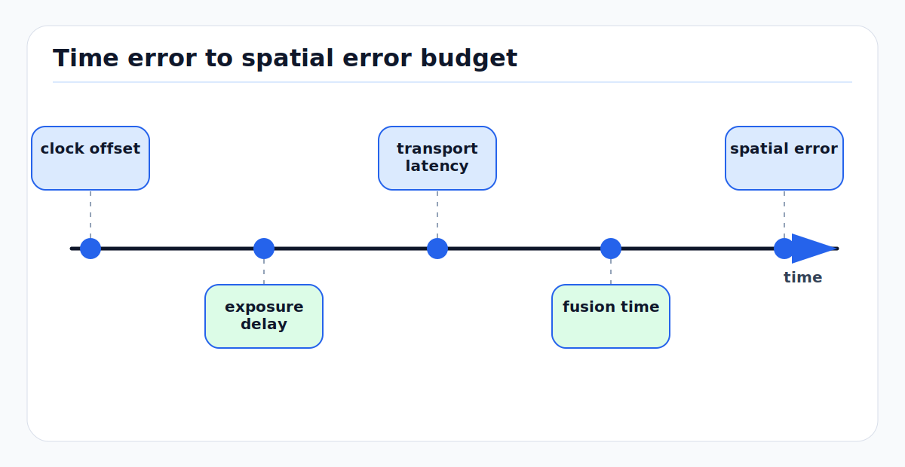

# Time Synchronization Error Budgets for Multi-Sensor Autonomy

Time synchronization is a measurement model, not a logging convenience. A
camera frame, LiDAR point, radar detection, IMU sample, wheel tick, and GNSS
fix are only comparable if the stack knows when the physical measurement was
acquired, which clock produced the timestamp, and how much uncertainty remains.

This page defines practical time-error budgets for perception, SLAM, mapping,
airside replay, and validation.

---

<!-- kb-figure:start -->


*Figure: how timing errors become spatial misalignment in moving multi-sensor autonomy systems.*
<!-- kb-figure:end -->

## 1. Why Time Error Becomes Spatial Error

The first-order spatial error from a timestamp error is:

```
e_position ~= v * dt
e_yaw      ~= yaw_rate * dt
e_lateral  ~= range * sin(e_yaw)
```

Examples:

| Motion case | Time error | Resulting error |
|---|---:|---:|
| Tug docking at 2 m/s | 20 ms | 4 cm longitudinal offset |
| Yard vehicle at 10 m/s | 50 ms | 50 cm longitudinal offset |
| Road AV at 25 m/s | 20 ms | 50 cm longitudinal offset |
| Vehicle turning at 20 deg/s | 50 ms | 1 deg yaw mismatch |
| Camera projecting object at 30 m with 1 deg yaw mismatch | 50 ms at 20 deg/s | about 52 cm lateral projection error |

For low-speed airside autonomy, centimeter-level map alignment can still be
lost by tens of milliseconds of timestamp error. For road-speed autonomy, the
same error can dominate the sensor's own measurement noise.

---

## 2. Timestamp Semantics

Every message should distinguish these times:

| Timestamp | Meaning | Use in fusion |
|---|---|---|
| Acquisition time | Time the photons, laser returns, RF echoes, inertial sample, or encoder edge were measured. | Primary timestamp for perception, SLAM, and estimation. |
| Exposure midpoint | Camera time at the middle of exposure. | Preferred for global-shutter image geometry when exposure is non-negligible. |
| Row time | Rolling-shutter time for each image row. | Needed for motion compensation and rolling-shutter calibration. |
| Scan or packet time | LiDAR/radar packet or firing time, often per block or per point. | Needed for deskew and target tracking. |
| Driver publish time | Time the software driver published the message. | Useful for latency metrics, not geometry. |
| Host receive time | Time the host received the packet or message. | Useful for network diagnostics and replay order. |
| Consumer time | Time a node consumed the message. | Useful for pipeline latency and deadline monitoring. |

Fusion should use acquisition time. Publish, receive, and consumer times are
diagnostic fields. If a driver stamps messages with `now()` at publish time,
the system has converted transport jitter into geometric error.

### 2.1 Clock Domains

Typical vehicle clock domains:

```
GNSS constellation time / UTC
  -> receiver time and PPS
  -> PTP or gPTP grandmaster
  -> Ethernet PHCs and sensor clocks
  -> host system clocks
  -> middleware clocks and replay clocks
```

Each conversion should be explicit. A log should record not only the timestamp
value, but also the clock source and synchronization state that made the value
credible.

---

## 3. Synchronization Mechanisms

| Mechanism | Typical use | Strength | Failure mode |
|---|---|---|---|
| Hardware trigger | Cameras, strobes, some LiDARs | Deterministic acquisition start. | Trigger edge is confused with exposure midpoint or readout completion. |
| PPS | GNSS receivers, IMUs, time servers | Simple one-pulse-per-second phase reference. | Time-of-week or UTC association is missing or wrong. |
| IEEE 1588 PTP | Ethernet sensors and compute | Sub-microsecond to microsecond class with hardware timestamping. | Switches or NICs fall back to software timestamping; grandmaster failover causes a step. |
| IEEE 802.1AS gPTP | TSN domains, automotive Ethernet | PTP profile for time-sensitive networks. | Not all endpoints support the same profile or domain. |
| GNSS disciplined clock | Global traceability and incident replay | Ties vehicle time to UTC/GNSS time. | GNSS outage, spoofing, jamming, or poor holdover oscillator. |
| Software timestamping | Prototypes and low-cost sensors | Easy to deploy. | Load-dependent jitter and network delay dominate. |
| Offline alignment | Dataset repair and calibration | Can estimate residual offset from motion. | Degenerate motion creates plausible but wrong offsets. |

PTP/gPTP only solves the network-clock problem when hardware timestamping is
enabled through the NIC, switch, and sensor. A PTP daemon that synchronizes a
host clock cannot recover the acquisition time of an unsynchronized camera
unless the camera exposes either hardware timestamps or a trigger relationship.

---

## 4. Error Budget Model

A practical timestamp error budget for sensor `i` can be written as:

```
t_true_i = t_msg_i
         + b_clock_i
         + d_clock_i * (t - t0)
         + b_trigger_i
         + b_driver_i
         + b_transport_i
         + n_jitter_i

sigma_t_i^2 =
    sigma_clock_i^2
  + sigma_trigger_i^2
  + sigma_driver_i^2
  + sigma_transport_i^2
  + sigma_model_i^2
```

where:

- `b_clock_i` is clock offset.
- `d_clock_i` is clock drift or frequency error.
- `b_trigger_i` is trigger-to-acquisition delay.
- `b_driver_i` is fixed driver latency if the timestamp is not hardware time.
- `b_transport_i` is network or bus delay.
- `n_jitter_i` is residual variable error.

For two sensors, relative timing uncertainty is:

```
sigma_dt_ij = sqrt(sigma_t_i^2 + sigma_t_j^2 - 2 * cov(t_i, t_j))
```

Shared clock sources create correlation. If two cameras share the same trigger
and clock, their relative timing can be better than their absolute UTC timing.
If two sensors are independently stamped by host receive time, their jitter is
often not independent under CPU or network load.

### 4.1 Example Budget Targets

| Fusion path | Preferred target | Reason |
|---|---:|---|
| IMU propagation | < 0.1 ms sample interval error | Bias and integration errors grow quickly at high rate. |
| LiDAR point deskew | < 1 ms point or packet timing | Turning motion bends scans when per-point timing is wrong. |
| LiDAR-camera projection | < 2-5 ms relative offset | Projection error is visible on moving ego vehicle and moving actors. |
| Radar-camera association | < 5-10 ms relative offset | Radar tracks and image boxes diverge under actor motion. |
| Wheel odometry to IMU | < 2-5 ms | Slip detection and yaw-rate residuals need aligned samples. |
| Airside low-speed replay | < 10 ms plus recorded latency metadata | Incident reconstruction needs traceability, not just approximate order. |

These are engineering targets, not universal standards. The right value depends
on vehicle speed, yaw rate, range, perception tolerance, and validation claims.

---

## 5. Sensor-Specific Timing Notes

### 5.1 Cameras

For global shutter cameras, timestamp exposure start, exposure midpoint, or
trigger edge consistently. If exposure time is `T_exp`, a trigger-at-exposure
start image should often be modeled at:

```
t_image ~= t_trigger + trigger_delay + T_exp / 2
```

For rolling shutter cameras:

```
t_row(v) = t_frame_start + row_index * row_readout_time
```

A single frame timestamp is insufficient for metric projection during vehicle
motion unless the rolling-shutter model is included.

### 5.2 LiDAR

Spinning and scanning LiDARs acquire points over tens to hundreds of
milliseconds. Deskew requires per-point, per-column, or per-packet timing:

```
p_base(t_ref) = T_base(t_ref)_base(t_point) * T_base_lidar * p_lidar(t_point)
```

Using one timestamp for a whole scan is only acceptable when ego motion is
small relative to map and perception tolerances.

### 5.3 Radar

Radar detections may be produced after chirp integration, FFT processing, and
tracking. The timestamp should refer to the measurement epoch, not the time the
object list left the sensor. Radar velocity residuals are especially sensitive
to ego-motion time alignment.

### 5.4 IMU and Wheel Encoders

IMUs should provide monotonic sample times with known scale and clock source.
Wheel encoders should timestamp tick edges or integration intervals. If encoder
counts are polled over CAN at variable intervals, the covariance must include
polling jitter and quantization.

### 5.5 GNSS/RTK

GNSS receivers expose position epochs, receiver clock status, PPS, timepulse,
fix type, correction age, and sometimes raw measurement time tags. Do not stamp
GNSS fixes with serial or TCP arrival time. For RTK, stale corrections can make
the position look precise while its epoch or integrity is no longer valid.

---

## 6. Logs and Replay

Replay changes the meaning of time unless the log preserves the original timing
contract.

Log at minimum:

- acquisition timestamp from the sensor or synchronized driver
- host receive timestamp
- publish timestamp if different from acquisition time
- PTP/gPTP offset, path delay, grandmaster identity, and lock state
- PPS lock and GNSS time status
- trigger counters, dropped frames, packet loss, and sequence numbers
- driver queue depth and middleware message age
- transform tree and calibration artifact IDs
- replay clock policy and rate

Replay systems should be able to answer:

1. What was the physical acquisition time of this measurement?
2. Was the sensor synchronized at that time?
3. Was the transform valid at that acquisition time?
4. Did the online system process the same measurement before its deadline?
5. Are replayed messages ordered by acquisition time or by recorded arrival?

For incident replay, arrival-order playback may reproduce software timing bugs,
while acquisition-time playback may reproduce the intended estimator behavior.
Both are useful, but they answer different questions.

---

## 7. Effects on Perception, SLAM, Mapping, and Validation

| Function | Timing effect |
|---|---|
| Perception | Misaligned camera/LiDAR/radar observations create ghost objects, poor association, false velocity, and degraded training labels. |
| SLAM | Scan matching residuals grow during turns; visual-inertial constraints become biased; loop closures may compensate for time error as pose error. |
| Mapping | Map edges smear, lane and stand markings shift, poles duplicate, and LiDAR intensity maps become inconsistent between passes. |
| Validation | Dataset labels become non-reproducible; incident timelines are disputable; latency and safety-margin claims cannot be defended. |

For airside vehicles, timing affects stand docking, personnel detection, aircraft
clearance, jet-blast zone mapping, and after-action reconstruction. A vehicle
moving slowly can still violate a 5 cm clearance budget if a synchronized
sensor path silently falls back to host receive timestamps.

---

## 8. Failure Modes and Health Checks

| Failure mode | Observable signal | Mitigation |
|---|---|---|
| Sensor stamps publish time | Message age looks small but fusion residuals grow with load. | Driver review, hardware timestamp tests, load-injection validation. |
| PTP grandmaster change | Clock offset step or frequency ramp. | Log grandmaster ID and holdover state; reject large time jumps. |
| PPS present without time-of-week | One-second phase is right but absolute epoch is wrong. | Verify UTC/GNSS time validity before accepting PPS-derived time. |
| Rolling shutter treated as global shutter | Projection residual varies by image row during motion. | Use global shutter or estimate row time. |
| Whole LiDAR scan treated as instantaneous | Curved walls and doubled edges during turns. | Use per-point timing and deskew. |
| Correction stream latency ignored | RTK fix remains flagged but position lags or jumps. | Monitor correction age and receiver quality flags. |
| Replay uses wall-clock receive time | Offline results differ from online behavior. | Preserve acquisition time and replay policy explicitly. |

Useful runtime monitors:

- PTP offset and path delay by interface
- sensor clock offset estimates
- message age by sensor and topic
- out-of-order timestamp counts
- dropped trigger or sequence counts
- LiDAR-camera reprojection residual vs vehicle speed and yaw rate
- radar velocity residual vs IMU/wheel ego-motion
- map residual vs scan time and deskew status

---

## 9. Source-Backed Design Rules

1. Treat acquisition time as the measurement timestamp.
2. Store publish and receive times as diagnostics, not substitutes.
3. Use hardware trigger, PPS, PTP, or gPTP for production fusion paths.
4. Include clock offset and drift in the error budget.
5. Turn temporal offset into an estimated calibration state when hardware
   synchronization cannot be guaranteed.
6. Validate under motion, CPU load, network load, GNSS outage, and replay.
7. Make logs traceable enough to reconstruct both physical time and software
   processing time.

---

## Sources

- IEEE 1588-2019, Precision Clock Synchronization Protocol: https://standards.ieee.org/content/ieee-standards/en/standard/1588-2019.html
- IEEE 802.1AS timing and synchronization: https://1.ieee802.org/maintenance/802-1as-2020-rev/
- linuxptp `ptp4l` documentation: https://www.linuxptp.org/documentation/ptp4l/
- linuxptp `phc2sys` documentation: https://www.linuxptp.org/documentation/phc2sys/
- ROS 2 clock and time design: https://design.ros2.org/articles/clock_and_time.html
- ROS REP-105 coordinate frames: https://www.ros.org/reps/rep-0105.html
- Furgale et al., "Unified Temporal and Spatial Calibration for Multi-Sensor Systems": https://furgalep.github.io/bib/furgale_iros13.pdf
- Li and Mourikis, "Online temporal calibration for camera-IMU systems": https://journals.sagepub.com/doi/pdf/10.1177/0278364913515286
- u-blox ZED-F9P integration manual: https://content.u-blox.com/sites/default/files/ZED-F9P_IntegrationManual_UBX-18010802.pdf
